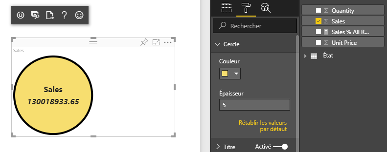
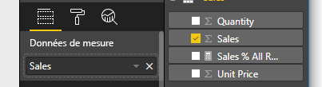

# <a name="tutorial-create-a-react-based-visual"></a>Tutoriel : Créer des visuels basés sur React

Ce didacticiel explique comment créer un visuel Power BI à l’aide de [React](https://reactjs.org/). Le visuel affiche une valeur dans un cercle. Le visuel a une taille et des paramètres adaptatifs pour le personnaliser. Grâce aux informations contenues dans cet article, vous pouvez maintenant créer vos propres visuels Power BI avec React.



Dans ce tutoriel, vous allez découvrir comment :

> [!div class="checklist"]
>
> * Configurer l''environnement de développement
> * Créer un visuel React
> * Configurer les fonctionnalités du visuel
> * Restituer des données provenant de Power BI
> * Redimensionner le visuel
> * Rendre le visuel personnalisable

## <a name="prerequisites"></a>Prérequis

* Un **compte Power BI Pro**. [Inscrivez-vous à un essai gratuit](https://powerbi.microsoft.com/pricing/) avant de commencer.
* [Visual Studio Code](https://www.visualstudio.com/).
* [Windows PowerShell](https://docs.microsoft.com/powershell/scripting/install/installing-windows-powershell?view=powershell-6) version 4 ou ultérieure pour les utilisateurs Windows, OU [Terminal](https://macpaw.com/how-to/use-terminal-on-mac) pour les utilisateurs OSX.
* Un environnement, comme décrit dans [Configuration de l’environnement de développement](custom-visual-develop-tutorial.md#setting-up-the-developer-environment).

## <a name="getting-started"></a>Prise en main

Pour commencer, créez un visuel Power BI minimal à l’aide de `pbiviz`. Pour plus d’informations sur les projets et la structure de projet, consultez [Structure de projet de visuel Power BI](visual-project-structure.md). Pour obtenir le code source complet de ce visuel, consultez [Visuel React de carte en cercle](https://github.com/Microsoft/powerbi-visuals-circlecard-react).

Vous pouvez cloner ou télécharger le code source complet du visuel à partir de [GitHub](https://github.com/Microsoft/powerbi-visuals-circlecard-react).

1. Ouvrez PowerShell et exécutez la commande suivante :

   ```powershell
   pbiviz new ReactCircleCard
   ```

   La commande crée un dossier appelé *ReactCircleCard*.

1. Accédez à ce dossier et ouvrez Visual Studio Code.

   ```powershell
   cd ./ReactCircleCard
   code .
   ```

1. Démarrez le serveur de développement pour votre visuel.

   ```powershell
   pbiviz start
   ```

   

Ce visuel de base représente le nombre de mises à jour. Nous allons le transformer en une carte en cercle à l’étape suivante.

## <a name="change-the-visual-to-a-circle-card"></a>Remplacer le visuel par une carte en cercle

Ce visuel de base représente un nombre de mises à jour. Ensuite, transformez-le en carte en cercle, qui représente une mesure et son titre.

1. Exécutez la commande suivante pour installer les dépendances requises :

   ```powershell
   npm i react react-dom
   ```

1. Exécutez la commande suivante pour installer React 16 et les versions correspondantes de `react-dom` :

   ```powershell
   npm i @types/react @types/react-dom
   ```

1. Créez une classe de composant React. Dans Visual Studio Code, sélectionnez **Fichier** > **Nouveau fichier**. Copiez le code suivant dans le fichier.

    ```typescript
    import * as React from "react";

    export class ReactCircleCard extends React.Component<{}>{
        render(){
            return (
                <div className="circleCard">
                    Hello, React!
                </div>
            )
        }
    }

    export default ReactCircleCard;
    ```

1. Sélectionnez **Enregistrer sous**. Accédez au répertoire *src*. Entrez le nom *component*. Pour **Enregistrer en tant que**, sélectionnez **TypeScript React**.

1. Ouvrez *src/visual.ts*. Remplacez le code actuel par le code suivant :

    ```typescript
    "use strict";
    import powerbi from "powerbi-visuals-api";

    import DataView = powerbi.DataView;
    import VisualConstructorOptions = powerbi.extensibility.visual.VisualConstructorOptions;
    import VisualUpdateOptions = powerbi.extensibility.visual.VisualUpdateOptions;
    import IVisual = powerbi.extensibility.visual.IVisual;

    import "./../style/visual.less";

    export class Visual implements IVisual {

        constructor(options: VisualConstructorOptions) {

        }

        public update(options: VisualUpdateOptions) {

        }
    }
    ```

1. Importez les dépendances React et le composant que vous venez d’ajouter.

    ```typescript
    import * as React from "react";
    import * as ReactDOM from "react-dom";
    ...
    import ReactCircleCard from "./component";
    ```

   Les paramètres de TypeScript par défaut de Power BI ne prennent pas les fichiers React *tsx*. Visual Studio Code met en évidence `component` en tant qu’erreur.

1. Ouvrez le fichier *tsconfig.json* et ajoutez deux lignes au début de l’élément `compilerOptions`.

    ```json
    {
      "compilerOptions": {
        "jsx": "react",
        "types": ["react", "react-dom"],
        //...
      }
    }
    ```

   L’erreur sur `component` devrait être supprimée.

   Pour restituer le composant, ajoutez l’élément HTML cible. Cet élément est `HTMLElement` dans `VisualConstructorOptions`, qui est passé au constructeur.

1. Modifiez la classe `Visual`, comme dans le code suivant :

    ```typescript
      private target: HTMLElement;
      private reactRoot: React.ComponentElement<any, any>;

      constructor(options: VisualConstructorOptions) {
          this.reactRoot = React.createElement(ReactCircleCard, {});
          this.target = options.element;

          ReactDOM.render(this.reactRoot, this.target);
      }
    ```

1. Enregistrez les modifications et exécutez le code existant à l’aide de la commande suivante :

    ```bash
    pbiviz start
    ```

   > [!NOTE]
   > Si vous avez déjà exécuté `pbiviz`, vous devez le redémarrer pour appliquer les modifications dans *tsconfig.json*.

  

## <a name="configure-capabilities"></a>Configurer les fonctionnalités

Vous pouvez configurer les fonctionnalités du visuel.

1. Ouvrez `capabilities.json`. Supprimez l’objet `Category Data` de `dataRoles`. La `ReactCircleCard` affiche une seule valeur. nous avons donc uniquement besoin de `Measure Data`. La clé `dataRoles` se présente maintenant comme suit :

    ```json
    "dataRoles": [
        {
            "displayName": "Measure Data",
            "name": "measure",
            "kind": "Measure"
        }
    ],
    ```

1. Supprimez tout le contenu de la clé `objects`. Vous la remplirez ultérieurement.

    ```json
        "objects": {},
    ```

1. Copiez le code suivant de la propriété `dataViewMappings`. La valeur `max: 1` signifie qu’il n’est possible d’envoyer qu’une seule colonne de mesure.

    ```json
        "dataViewMappings": [
            {
                "conditions": [
                    {
                        "measure": {
                            "max": 1
                        }
                    }
                ],
                "single": {
                    "role": "measure"
                }
            }
        ]
    ```

Vous pouvez maintenant importer les données du volet `Fields` dans les paramètres du visuel.



## <a name="receive-properties-from-power-bi"></a>Recevoir les propriétés de Power BI

Vous pouvez restituer des données à l’aide de React. Le composant peut afficher des données à partir de son propre état.

1. Modifiez *src/component.tsx*.

    ```javascript
    export interface State {
        textLabel: string,
        textValue: string
    }

    export const initialState: State = {
        textLabel: "",
        textValue: ""
    }

    export class ReactCircleCard extends React.Component<{}, State>{
        constructor(props: any){
            super(props);
            this.state = initialState;
        }

        render(){
            const { textLabel, textValue } = this.state;

            return (
                <div className="circleCard">
                    <p>
                        {textLabel}
                        <br/>
                        <em>{textValue}</em>
                    </p>
                </div>
            )
        }
    }
    ```

1. Ajoutez des styles pour le nouveau balisage en modifiant *styles/visual.less*.

    ```css
    .circleCard {
        position: relative;
        box-sizing: border-box;
        border: 1px solid #000;
        border-radius: 50%;
        width: 200px;
        height: 200px;
    }

    p {
        text-align: center;
        line-height: 30px;
        font-size: 20px;
        font-weight: bold;

        position: relative;
        top: -30px;
        margin: 50% 0 0 0;
    }
    ```

1. Les visuels reçoivent les données actuelles sous la forme d’un argument de la méthode `update`. Ouvrez *src/visual.ts* et ajoutez du code à `ReactCircleCard.update`.

    ```typescript
    //...
    import { ReactCircleCard, initialState } from "./component";
    //...

    export class Visual implements IVisual {
        //...
        public update(options: VisualUpdateOptions) {

            if(options.dataViews && options.dataViews[0]){
                const dataView: DataView = options.dataViews[0];

                ReactCircleCard.update({
                    textLabel: dataView.metadata.columns[0].displayName,
                    textValue: dataView.single.value.toString()
                });
            }
            } else {
                this.clear();
            }
        }

        private clear() {
            ReactCircleCard.update(initialState);
        }
    }
    ```

    Le code sélectionne `textLabel` et `textValue` à partir de `DataView` et, si les données existent, met à jour l’état du composant.

1. Pour envoyer des mises à jour à l’instance du composant, insérez le code suivant dans la classe `ReactCircleCard` :

    ```typescript
        private static updateCallback: (data: object) => void = null;

        public static update(newState: State) {
            if(typeof ReactCircleCard.updateCallback === 'function'){
                ReactCircleCard.updateCallback(newState);
            }
        }

        public state: State = initialState;

        public componentWillMount() {
            ReactCircleCard.updateCallback = (newState: State): void => { this.setState(newState); };
        }

        public componentWillUnmount() {
            ReactCircleCard.updateCallback = null;
        }
    ```

1. Testez le visuel. Assurez-vous que `pbiviz start` a été exécuté et enregistrez tous les fichiers. Actualisez le visuel.

   

## <a name="make-component-resizable"></a>Rendre un composant redimensionnable

Dans cette section, vous rendez le composant redimensionnable. Actuellement, la largeur et la hauteur du composant sont fixes.

Obtenez la taille actuelle de la fenêtre d’affichage du visuel à partir de l’objet `options`.

1. Ouvrez *src/visual.ts*. Importez l’interface `IViewport` et ajoutez la propriété `viewport` à la classe `visual`.

    ```typescript
    import IViewport = powerbi.IViewport;

    //...

    export class Visual implements IVisual {
        private viewport: IViewport;
        //...
    }
    ```

1. Ajoutez le code suivant à la méthode `update` de `visual`.

    ```typescript
      if (options.dataViews && options.dataViews[0]) {
          const dataView: DataView = options.dataViews[0];

          this.viewport = options.viewport;
          const { width, height } = this.viewport;
          const size = Math.min(width, height);

          ReactCircleCard.update({
              size,
              //...
          });
      }
    ```

1. Ajoutez des propriétés à l’interface `State` dans *src/component.tsx*.

    ```typescript
    export interface State {
        //...
        size: number
    }

    const initialState: State = {
        //...
        size: 200
    }
    ```

1. Apportez les modifications suivantes à la méthode `render` dans *src/component.tsx*:

    ```typescript
        render() {
            const { textLabel, textValue, size } = this.state;

            const style: React.CSSProperties = { width: size, height: size };

            return (
                <div className="circleCard" style={style}>
                    {/* ... */}
                </div>
            )
        }
    ```

1. Remplacez les règles `width` et `height` dans *tyle/visual.less* par `min-width` et `min-height`.

    ```css
        min-width: 200px;
        min-height: 200px;
    ```

À présent, vous pouvez redimensionner la fenêtre d’affichage. Le diamètre du cercle correspond à une taille minimale sous forme de largeur ou de hauteur.

## <a name="make-your-power-bi-visual-customizable"></a>Rendre votre visuel Power BI personnalisable

Dans cette section, vous rendez le visuel personnalisable.

1. Ouvrez *capabilities.json*. Ajoutez les paramètres suivants à la propriété `objects`.

    ```json
    //...
        "objects": {
            "circle": {
                "displayName": "Circle",
                "properties": {
                    "circleColor": {
                        "displayName": "Color",
                        "description": "The fill color of the circle.",
                        "type": {
                            "fill": {
                                "solid": {
                                    "color": true
                                }
                            }
                        }
                    },
                    "circleThickness": {
                        "displayName": "Thickness",
                        "description": "The circle thickness.",
                        "type": {
                            "numeric": true
                        }
                    }
                }
            }
        },
    //...
    ```

1. Remplacez le code existant dans *src/settings.ts* par le code suivant :

    ```typescript
    "use strict";

    import { dataViewObjectsParser } from "powerbi-visuals-utils-dataviewutils";
    import DataViewObjectsParser = dataViewObjectsParser.DataViewObjectsParser;

    export class CircleSettings {
        public circleColor: string = "white";
        public circleThickness: number = 2;
    }

    export class VisualSettings extends DataViewObjectsParser {
        public circle: CircleSettings = new CircleSettings();
    }
    ```

1. Ajoutez ces instructions `import` au sommet de *src/visual.ts* :

    ```typescript
    import VisualObjectInstance = powerbi.VisualObjectInstance;
    import EnumerateVisualObjectInstancesOptions = powerbi.EnumerateVisualObjectInstancesOptions;
    import VisualObjectInstanceEnumerationObject = powerbi.VisualObjectInstanceEnumerationObject;

    import { VisualSettings } from "./settings";

    ```

1. Ajoutez la méthode `enumerateObjectInstances` à *src/visual.ts*. Cette méthode est utilisée pour appliquer des paramètres de visuel.

    ```typescript
    export class Visual implements IVisual {
        private settings: VisualSettings;

        //...

        public enumerateObjectInstances(
            options: EnumerateVisualObjectInstancesOptions
        ): VisualObjectInstance[] | VisualObjectInstanceEnumerationObject {

            return VisualSettings.enumerateObjectInstances(this.settings || VisualSettings.getDefault(), options);
        }
    }
    ```

1. Ajoutez du code afin que l’objet `dataView` puisse désormais recevoir des paramètres.

    ```typescript
        public update(options: VisualUpdateOptions) {

            if(options.dataViews && options.dataViews[0]){
                //...
                this.settings = VisualSettings.parse(dataView) as VisualSettings;
                const object = this.settings.circle;

                ReactCircleCard.update({
                    borderWidth: object && object.circleThickness ? object.circleThickness : undefined,
                    background: object && object.circleColor ? object.circleColor : undefined,
                    //...
                });
            }
        }
    }
    ```

1. Appliquez les modifications correspondantes à *src/component.tsx*, tout d’abord en ajoutant ces valeurs à `State`:

    ```typescript
    export interface State {
        //...
        background?: string,
        borderWidth?: number
    }
    ```

1. Puis ajoutez le code suivant à la méthode `render` :

    ```typescript
        const { /*...*/ background, borderWidth } = this.state;

        const style: React.CSSProperties = { /*...*/ background, borderWidth };
    ```

    

## <a name="next-steps"></a>Étapes suivantes

Pour plus d’informations sur le développement avec Power BI, consultez [Marche à suivre pour les visuels Power BI](guidelines-powerbi-visuals.md) et [Visuels dans Power BI](power-bi-visuals-concept.md).