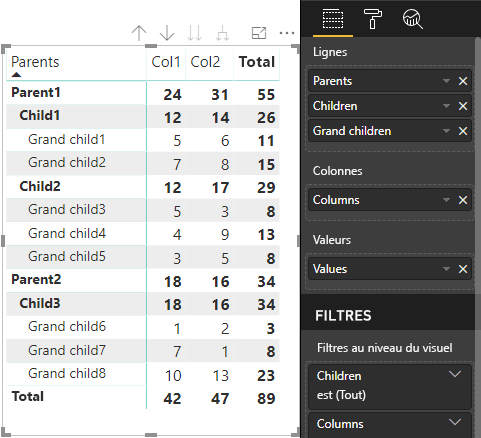

# <a name="understand-data-view-mapping-in-power-bi-visuals"></a>Présentation du mappage des vues de données dans les visuels Power BI

Cet article traite du mappage des vues de données et décrit comment les rôles de données sont liés les uns aux autres et vous permettent de spécifier des conditions pour eux. L’article décrit également chaque type `dataMappings`.

Chaque mappage valide produit une vue de données, mais nous prenons actuellement en charge l’exécution d’une seule requête par visuel. En général, vous n’avez qu’une seule vue de données. Toutefois, vous pouvez fournir plusieurs mappages de données dans certaines conditions, ce qui autorise :

```json
"dataViewMappings": [
    {
        "conditions": [ ... ],
        "categorical": { ... },
        "single": { ... },
        "table": { ... },
        "matrix": { ... }
    }
]
```

Power BI crée un mappage à une vue de données si et seulement si le mappage valide est renseigné dans `dataViewMappings`.

En d’autres termes `categorical`, peut être défini dans `dataViewMappings`, mais d’autres mappages, tels que `table` ou `single`, peuvent ne pas l’être. Par exemple :

```json
"dataViewMappings": [
    {
        "categorical": { ... }
    }
]
```

Power BI produit une vue de données avec un mappage `categorical` unique, et `table` et d’autres mappages sont non définis :

```javascript
{
    "categorical": {
        "categories": [ ... ],
        "values": [ ... ]
    },
    "metadata": { ... }
}
```

## <a name="conditions"></a>Conditions

Cette section décrit les conditions d’un mappage de données particulier. Vous pouvez fournir plusieurs ensembles de conditions et, si les données correspondent à l’un des ensembles de conditions décrits, le visuel accepte les données comme étant valides.

Actuellement, pour chaque champ, vous pouvez spécifier une valeur minimale et une valeur maximale. La valeur représente le nombre de champs qui peuvent être liés à ce rôle de données. 

> [!NOTE]
> Si un rôle de données est omis dans la condition, il peut contenir n’importe quel nombre de champs.

### <a name="example-1"></a>Exemple 1

Vous pouvez faire glisser plusieurs champs dans chaque rôle de données. Dans cet exemple, vous limitez la catégorie à un champ de données et la mesure à deux champs de données.

```json
"conditions": [
    { "category": { "max": 1 }, "y": { "max": 2 } },
]
```

### <a name="example-2"></a>Exemple 2

Dans cet exemple, l’une des deux conditions suivantes est requise :
* Exactement un champ de données de catégorie et exactement deux mesures
* Exactement deux catégories et exactement une mesure

```json
"conditions": [
    { "category": { "min": 1, "max": 1 }, "measure": { "min": 2, "max": 2 } },
    { "category": { "min": 2, "max": 2 }, "measure": { "min": 1, "max": 1 } }
]
```

## <a name="single-data-mapping"></a>Mappage de données unique

Le mappage de données unique est la forme la plus simple du mappage de données. Il accepte un champ de mesure unique et vous donne le total. Si le champ est numérique, vous obtenez la somme. Dans le cas contraire, vous obtenez un nombre de valeurs uniques.

Pour utiliser un mappage de données unique, vous devez définir le nom du rôle de données que vous souhaitez mapper. Ce mappage ne fonctionne qu’avec un seul champ de mesure. Si un deuxième champ est affecté, aucune vue de données n’est générée. Il est donc recommandé d’inclure une condition qui limite les données à un seul champ.

> [!NOTE]
> Ce mappage de données ne peut pas être utilisé conjointement avec d’autres mappages de données. Il est destiné à réduire les données en une seule valeur numérique.

### <a name="example-3"></a>Exemple 3

```json
"dataViewMappings": {
    "conditions": [
        { "Y": { "max": 1 } }
    ],
    "single": {
        "role": "Y"
    }
}  
```

La vue de données résultante contient toujours les autres types (table, catégorie, et ainsi de suite), mais chaque mappage ne contient que la valeur unique. La bonne pratique consiste à accéder uniquement à la valeur unique.

```JSON
{
    "dataView": [
        {
            "metadata": null,
            "categorical": null,
            "matrix": null,
            "table": null,
            "tree": null,
            "single": {
                "value": 94163140.3560001
            }
        }
    ]
}
```

## <a name="categorical-data-mapping"></a>Mappage de données par catégorie

Un mappage de données par catégorie permet de récupérer un ou deux regroupements indépendants de données.

### <a name="example-4"></a>Exemple 4

Voici la définition de notre exemple précédent pour les rôles de données :

```json
"dataRole":[
    {
        "displayName": "Category",
        "name": "category",
        "kind": "Grouping"
    },
    {
        "displayName": "Y Axis",
        "name": "measure",
        "kind": "Measure"
    }
]
```

Voici le mappage :

```json
"dataViewMappings": {
    "categorical": {
        "categories": {
            "for": { "in": "category" }
        },
        "values": {
            "select": [
                { "bind": { "to": "measure" } }
            ]
        }
    }
}
```

C’est un exemple simple. Il signifie : « Mapper mon rôle de données `category` de façon à ce que pour chaque champ que je fais glisser dans `category`, ses données soient mappées à `categorical.categories`. Mapper également mon rôle de données `measure` à `categorical.values`. »

* **for...in** : inclut tous les éléments de ce rôle de données dans la requête de données.
* **bind...to** : produit le même résultat que *for...in*, mais s’attend à ce que le rôle de données ait une condition le limitant à un champ unique.

### <a name="example-5"></a>Exemple 5

Cet exemple utilise les deux premiers rôles de données de l’exemple précédent, et définit en plus `grouping` et `measure2`.

```json
"dataRole":[
    {
        "displayName": "Category",
        "name": "category",
        "kind": "Grouping"
    },
    {
        "displayName": "Y Axis",
        "name": "measure",
        "kind": "Measure"
    },
    {
        "displayName": "Grouping with",
        "name": "grouping",
        "kind": "Grouping"
    },
    {
        "displayName": "X Axis",
        "name": "measure2",
        "kind": "Grouping"
    }
]
```

Voici le mappage :

```json
"dataViewMappings":{
    "categorical": {
        "categories": {
            "for": { "in": "category" }
        },
        "values": {
            "group": {
                "by": "grouping",
                "select":[
                    { "bind": { "to": "measure" } },
                    { "bind": { "to": "measure2" } }
                ]
            }
        }
    }
}
```

Ici, la différence tient à la façon dont nous mappons les valeurs par catégorie. Nous indiquons : « Mapper mes rôles de données `measure` et `measure2` afin qu’ils soient regroupés d’après le rôle de données `grouping` ».

### <a name="example-6"></a>Exemple 6

Voici les rôles de données :

```json
"dataRoles": [
    {
        "displayName": "Categories",
        "name": "category",
        "kind": "Grouping"
    },
    {
        "displayName": "Measures",
        "name": "measure",
        "kind": "Measure"
    },
    {
        "displayName": "Series",
        "name": "series",
        "kind": "Measure"
    }
]
```

Voici le mappage des vues de données :

```json
"dataViewMappings": [
    {
        "categorical": {
            "categories": {
                "for": {
                    "in": "category"
                }
            },
            "values": {
                "group": {
                    "by": "series",
                    "select": [{
                            "for": {
                                "in": "measure"
                            }
                        }
                    ]
                }
            }
        }
    }
]
```

La vue de données par catégorie peut être visualisée ainsi :

| Catégorie |  |  | | | |
|-----|-----|------|------|------|------|
| | Année | 2013 | 2014 | 2015 | 2016 |
| Pays | | |
| USA | | x | x | 125 | 100 |
| Canada | | x | 50 | 200 | x |
| Mexico | | 300 | x | x | x |
| Royaume-Uni | | x | x | 75 | x |

Power BI la produit comme vue de données par catégorie. Il s’agit de l’ensemble des catégories.

```JSON
{
    "categorical": {
        "categories": [
            {
                "source": {...},
                "values": [
                    "Canada",
                    "Mexico",
                    "UK",
                    "USA"
                ],
                "identity": [...],
                "identityFields": [...],
            }
        ]
    }
}
```

Chaque catégorie est également mappée à un ensemble de valeurs. Chacune de ces valeurs est regroupée par série, qui est exprimée sous forme d’années.

Par exemple, les ventes du Canada en 2013 sont nulles, et elles se montent à 50 en 2014.

```JSON
{
    "values": [
        {
            "source": {...},
            "values": [
                null,
                300,
                null,
                null
            ],
            "identity": [...],
        },
        {
            "source": {...},
            "values": [
                50,
                null,
                150,
                null
            ],
            "identity": [...],
        },
        {
            "source": {...},
            "values": [
                200,
                null,
                null,
                125
            ],
            "identity": [...],
        },
        {
            "source": {...},
            "values": [
                null,
                null,
                null,
                100
            ],
            "identity": [...],
        }
    ]
}
```

## <a name="table-data-mapping"></a>Mappage de données de table

La vue de données de table est un mappage de données simple. En gros, il s’agit d’une liste de points de données, où les points de données numériques peuvent être agrégés.

### <a name="example-7"></a>Exemple 7

Avec les fonctionnalités données :

```json
"dataRoles": [
    {
        "displayName": "Values",
        "name": "values",
        "kind": "Measure"
    }
]
```

```json
"dataViewMappings": [
    {
        "table": {
            "rows": {
                "for": {
                    "in": "values"
                }
            }
        }
    }
]
```

Vous pouvez visualiser la vue des données de table comme suit :  

| Pays| Année | Ventes |
|-----|-----|------|
| USA | 2016 | 100 |
| USA | 2015 | 50 |
| Canada | 2015 | 200 |
| Canada | 2015 | 50 |
| Mexico | 2013 | 300 |
| Royaume-Uni | 2014 | 150 |
| USA | 2015 | 75 |

Power BI affiche vos données en tant que vue de données de table. Vous ne devez pas assumer que les données sont triées.

```JSON
{
    "table" : {
        "columns": [...],
        "rows": [
            [
                "Canada",
                2014,
                50
            ],
            [
                "Canada",
                2015,
                200
            ],
            [
                "Mexico",
                2013,
                300
            ],
            [
                "UK",
                2014,
                150
            ],
            [
                "USA",
                2015,
                100
            ],
            [
                "USA",
                2015,
                75
            ],
            [
                "USA",
                2016,
                100
            ]
        ]
    }
}
```

Vous pouvez agréger les données en sélectionnant le champ souhaité, puis en sélectionnant Sum.  


## <a name="matrix-data-mapping"></a>Mappage de données de matrice

Le mappage de données de matrice est semblable au mappage de données de table, mais les lignes sont présentées de façon hiérarchique. Toutes les valeurs de rôle de données peuvent être utilisées comme valeur d’en-tête de colonne.

```json
{
    "dataRoles": [
        {
            "name": "Category",
            "displayName": "Category",
            "displayNameKey": "Visual_Category",
            "kind": "Grouping"
        },
        {
            "name": "Column",
            "displayName": "Column",
            "displayNameKey": "Visual_Column",
            "kind": "Grouping"
        },
        {
            "name": "Measure",
            "displayName": "Measure",
            "displayNameKey": "Visual_Values",
            "kind": "Measure"
        }
    ],
    "dataViewMappings": [
        {
            "matrix": {
                "rows": {
                    "for": {
                        "in": "Category"
                    }
                },
                "columns": {
                    "for": {
                        "in": "Column"
                    }
                },
                "values": {
                    "select": [
                        {
                            "for": {
                                "in": "Measure"
                            }
                        }
                    ]
                }
            }
        }
    ]
}
```

Power BI crée une structure de données hiérarchique. La racine de la hiérarchie d’arborescence contient les données de la colonne **Parents** du rôle de données `Category`, avec des enfants de la colonne **Children** de la table de rôles de données.

Jeu de données :

| Parents | Enfants | Petits-enfants | Colonnes | Valeurs |
|-----|-----|------|-------|-------|
| Parent 1 | Enfant 1 | Petit-enfant 1 | Col 1 | 5 |
| Parent 1 | Enfant 1 | Petit-enfant 1 | Col 2 | 6 |
| Parent 1 | Enfant 1 | Petit-enfant 2 | Col 1 | 7 |
| Parent 1 | Enfant 1 | Petit-enfant 2 | Col 2 | 8 |
| Parent 1 | Enfant 2 | Petit-enfant 3 | Col 1 | 5 |
| Parent 1 | Enfant 2 | Petit-enfant 3 | Col 2 | 3 |
| Parent 1 | Enfant 2 | Petit-enfant 4 | Col 1 | 4 |
| Parent 1 | Enfant 2 | Petit-enfant 4 | Col 2 | 9 |
| Parent 1 | Enfant 2 | Petit-enfant 5 | Col 1 | 3 |
| Parent 1 | Enfant 2 | Petit-enfant 5 | Col 2 | 5 |
| Parent 2 | Enfant 3 | Petit-enfant 6 | Col 1 | 1 |
| Parent 2 | Enfant 3 | Petit-enfant 6 | Col 2 | 2 |
| Parent 2 | Enfant 3 | Petit-enfant 7 | Col 1 | 7 |
| Parent 2 | Enfant 3 | Petit-enfant 7 | Col 2 | 1 |
| Parent 2 | Enfant 3 | Petit-enfant 8 | Col 1 | 10 |
| Parent 2 | Enfant 3 | Petit-enfant 8 | Col 2 | 13 |

Le visuel de matrice principale de Power BI affiche les données sous forme de table.



Le visuel obtient sa structure de données comme décrit dans le code suivant (seules les deux premières lignes de la table sont présentées ici) :

```json
{
    "metadata": {...},
    "matrix": {
        "rows": {
            "levels": [...],
            "root": {
                "childIdentityFields": [...],
                "children": [
                    {
                        "level": 0,
                        "levelValues": [...],
                        "value": "Parent1",
                        "identity": {...},
                        "childIdentityFields": [...],
                        "children": [
                            {
                                "level": 1,
                                "levelValues": [...],
                                "value": "Child1",
                                "identity": {...},
                                "childIdentityFields": [...],
                                "children": [
                                    {
                                        "level": 2,
                                        "levelValues": [...],
                                        "value": "Grand child1",
                                        "identity": {...},
                                        "values": {
                                            "0": {
                                                "value": 5 // value for Col1
                                            },
                                            "1": {
                                                "value": 6 // value for Col2
                                            }
                                        }
                                    },
                                    ...
                                ]
                            },
                            ...
                        ]
                    },
                    ...
                ]
            }
        },
        "columns": {
            "levels": [...],
            "root": {
                "childIdentityFields": [...],
                "children": [
                    {
                        "level": 0,
                        "levelValues": [...],
                        "value": "Col1",
                        "identity": {...}
                    },
                    {
                        "level": 0,
                        "levelValues": [...],
                        "value": "Col2",
                        "identity": {...}
                    },
                    ...
                ]
            }
        },
        "valueSources": [...]
    }
}
```

## <a name="data-reduction-algorithm"></a>Algorithme de réduction des données

Pour contrôler la quantité de données à recevoir dans la vue de données, vous pouvez appliquer un algorithme de réduction des données.

Par défaut, tous les visuels Power BI ont l’algorithme de réduction des données appliqué avec la valeur *count* définie sur 1000 points de données. Cela revient à définir les propriétés suivantes dans le fichier *capabilities.json* :

```json
"dataReductionAlgorithm": {
    "top": {
        "count": 1000
    }
}
```

Vous pouvez affecter à *count* n’importe quelle valeur entière allant jusqu’à 30 000. Les visuels Power BI basés sur R peuvent prendre en charge jusqu’à 150000 lignes.

## <a name="data-reduction-algorithm-types"></a>Types d’algorithmes de réduction des données

Il existe quatre types de paramètres d’algorithme de réduction des données :

* `top` : si vous souhaitez limiter les données aux valeurs issues du haut du jeu de données. Les premières valeurs *count* sont extraites du jeu de données.
* `bottom` : si vous souhaitez limiter les données aux valeurs issues du bas du jeu de données. Les dernières valeurs « count » sont extraites du jeu de données.
* `sample` : réduit le jeu de données à l’aide d’un algorithme d’échantillonnage simple limité à un nombre *count* d’éléments. Cela signifie que les premier et dernier éléments sont inclus, avec un nombre *count* d’éléments dont les intervalles sont égaux.
Par exemple, si vous avez un jeu de données [0, 1, 2 ... 100] et une valeur *count* de 9, vous obtiendrez les valeurs [0, 10, 20 ... 100].
* `window` : charge une *fenêtre* de points de données à la fois contenant *count* éléments. Actuellement, `top` et `window` sont équivalents. Nous travaillons à la prise en charge complète d’un paramètre de fenêtrage.

## <a name="data-reduction-algorithm-usage"></a>Utilisation d’un algorithme de réduction des données

Vous pouvez utiliser l’algorithme de réduction des données dans le mappage de vue de données de table, de matrice ou par catégorie.

Vous pouvez définir l’algorithme dans des `categories` et/ou une section de groupe de `values` pour le mappage de données par catégorie.

### <a name="example-8"></a>Exemple 8

```json
"dataViewMappings": {
    "categorical": {
        "categories": {
            "for": { "in": "category" },
            "dataReductionAlgorithm": {
                "window": {
                    "count": 300
                }
            }  
        },
        "values": {
            "group": {
                "by": "series",
                "select": [{
                        "for": {
                            "in": "measure"
                        }
                    }
                ],
                "dataReductionAlgorithm": {
                    "top": {
                        "count": 100
                    }
                }  
            }
        }
    }
}
```

Vous pouvez appliquer l’algorithme de réduction des données à la section `rows` de la table de mappage des vues de données.

### <a name="example-9"></a>Exemple 9

```json
"dataViewMappings": [
    {
        "table": {
            "rows": {
                "for": {
                    "in": "values"
                },
                "dataReductionAlgorithm": {
                    "top": {
                        "count": 2000
                    }
                } 
            }
        }
    }
]
```

Vous pouvez appliquer l’algorithme de réduction des données aux sections `rows` et `columns` de la matrice de mappage des vues de données.
