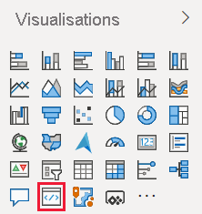
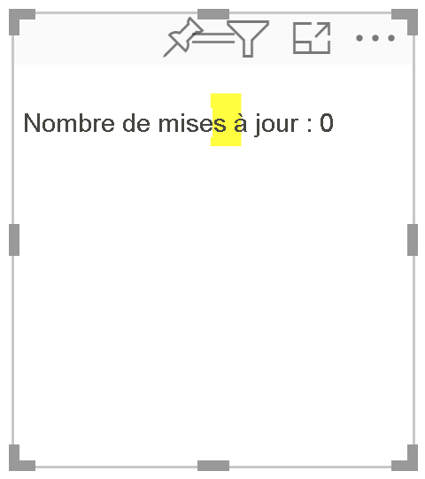
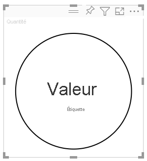
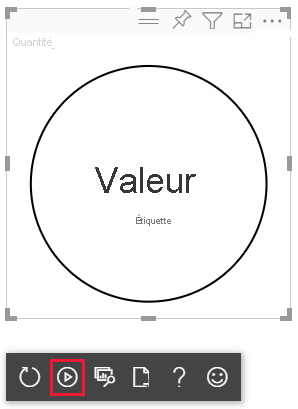

# <a name="tutorial-develop-a-power-bi-circle-card-visual"></a>Tutoriel : Développement d’un visuel de carte ronde Power BI

En tant que développeur, vous pouvez créer vos propres visuels Power BI. Ces visuels peuvent être utilisés par vous, votre organisation ou des tiers.

Dans ce didacticiel, vous allez développer un visuel Power BI nommé carte ronde qui affiche une valeur de mesure mise en forme à l’intérieur d’un cercle. La carte visuelle prend en charge la personnalisation de la couleur de remplissage et de l’épaisseur du contour.

Dans ce tutoriel, vous allez apprendre à :
> [!div class="checklist"]
> * Créez un projet de développement pour votre visuel.
> * Développez votre visuel avec des éléments visuels D3.
> * Configurez votre visuel pour traiter les données.

## <a name="prerequisites"></a>Prérequis

Avant de commencer à développer votre visuel Power BI, vérifiez que vous disposez de tout ce qui est indiqué dans cette section.

* Vous avez besoin d’un compte **Power BI Pro**. Si vous n’en avez pas, [inscrivez-vous pour un essai gratuit](https://powerbi.microsoft.com/pricing/).

* [Visual Studio Code (VS Code)](https://www.visualstudio.com/). VS Code est un environnement de développement intégré (IDE) idéal pour le développement d’applications JavaScript et TypeScript.

* [Windows PowerShell](https://docs.microsoft.com/powershell/scripting/install/installing-windows-powershell) version 4 ou ultérieure (pour Windows). Ou [Terminal](https://macpaw.com/how-to/use-terminal-on-mac) (pour OS X).

* Un environnement prêt pour le développement d’un visuel Power BI. [Configurez votre environnement pour développer un visuel Power BI](environment-setup.md).

* Ce didacticiel utilise le rapport **US Sales Analysis**. Vous pouvez [télécharger](https://microsoft.github.io/PowerBI-visuals/docs/step-by-step-lab/images/US_Sales_Analysis.pbix) ce rapport et le charger sur le service Power BI ou utiliser votre propre rapport. Si vous avez besoin de plus d’informations sur le service Power BI et le téléchargement de fichiers, reportez-vous au didacticiel [Bien démarrer avec la création dans le service Power BI](../../fundamentals/service-get-started.md).

## <a name="create-a-development-project"></a>Créer un projet de développement

Dans cette section, vous allez créer un projet pour le visuel de carte ronde.

1. Ouvrez PowerShell et accédez au dossier dans lequel vous souhaitez créer votre projet.

2. Entrez la commande suivante :

    ```PowerShell
    pbiviz new CircleCard
    ```

3. Accédez au dossier du projet.

    ```powershell
    cd CircleCard
    ```

4. Démarrez le visuel de carte ronde. Votre visuel est maintenant exécuté tout en étant hébergé sur votre ordinateur.

    ```powershell
    pbiviz start
    ```
    >[!IMPORTANT]
    >Ne fermez pas la fenêtre PowerSell jusqu’à la fin du didacticiel. Pour arrêter l’exécution du visuel, entrez Ctrl + C et, si vous êtes invité à arrêter le traitement par lots, entrez Y, puis appuyez sur *Entrée*.

## <a name="view-the-circle-card-in-power-bi-service"></a>Afficher la carte ronde dans le service Power BI

Pour tester le visuel de carte ronde dans le service Power BI, nous allons utiliser le rapport **US Sales Analysis**. Vous pouvez [télécharger](https://microsoft.github.io/PowerBI-visuals/docs/step-by-step-lab/images/US_Sales_Analysis.pbix) ce rapport et le charger sur le service Power BI.

Vous pouvez également utiliser votre propre rapport pour tester les visuels de carte ronde.

>[!NOTE]
>Avant de continuer, vérifiez que vous avez [activé les paramètres de développeur de visuels](environment-setup.md#set-up-power-bi-service-for-developing-a-visual).

1. Connectez-vous à [PowerBI.com](https://powerbi.microsoft.com/) et ouvrez le rapport **US Sales Analysis**.

2. Sélectionnez **Plus d’options** > **Modifier**.

    >[!div class="mx-imgBorder"]
    >

3. Créez une nouvelle page à des fins de test en cliquant sur le bouton **Nouvelle page** en bas de l’interface du service Power BI.

    >[!div class="mx-imgBorder"]
    >

4. Dans le volet **Visualisations**, sélectionnez **Visuel de développeur**.

    >[!div class="mx-imgBorder"]
    >

    Ce visuel représente le visuel personnalisé que vous exécutez sur votre ordinateur. Il n’est disponible que lorsque le paramètre [débogage de visuel personnalisé](environment-setup.md#set-up-power-bi-service-for-developing-a-visual) est activé.

5. Vérifiez qu’un visuel a été ajouté au canevas de rapport.

    >[!div class="mx-imgBorder"]
    >

    Il s’agit d’un visuel simple qui affiche le nombre de fois où sa méthode de mise à jour a été appelée. À ce stade, le visuel ne récupère aucune donnée.

    >[!NOTE]
    >Si le visuel affiche un message d’erreur de connexion, ouvrez un nouvel onglet dans votre navigateur, accédez à [https://localhost:8080/assets/status](https://localhost:8080/assets/status) et autorisez votre navigateur à utiliser cette adresse.
    >
    >

6. Lorsque le nouveau visuel est sélectionné, accédez au volet **Champs**, développez **Sales**, puis sélectionnez **Quantity**.

    >[!div class="mx-imgBorder"]
    >

7. Pour tester la réponse du visuel, redimensionnez-le et remarquez que le *Nombre de mises à jour* est incrémenté chaque fois que vous redimensionnez le visuel.

    >[!div class="mx-imgBorder"]
    >

## <a name="add-visual-elements-and-text"></a>Ajouter des éléments visuels et du texte

Dans cette section, vous allez apprendre à transformer votre visuel en cercle et à lui faire afficher du texte.

>[!NOTE]
>Dans ce didacticiel, [Visual Studio Code](https://code.visualstudio.com/) (VS Code) est utilisé pour développer le visuel Power BI.

### <a name="modify-the-visuals-file"></a>Modifier le fichier de visuels

Configurez le fichier **visual.ts** en supprimant et en ajoutant quelques lignes de code.

1. Ouvrez votre projet dans VS Code (**Fichier** > **Ouvrir le dossier**).

2. Dans le **volet Explorer**, développez le dossier **src**, puis sélectionnez le fichier **visual.ts**.

    >[!div class="mx-imgBorder"]
    >

    > [!IMPORTANT]
    > Notez les commentaires en haut du fichier **visual.ts**. L’utilisation gratuite des packages de visuels Power BI est autorisée conformément aux termes du contrat de licence MIT (Massachusetts Institute of Technology). Dans le cadre du contrat, vous devez laisser les commentaires en haut du fichier.

3. Supprimez les lignes de code suivantes du fichier *visual.ts*.

    * L’importation de *VisualSettings* :
        ```typescript
        import { VisualSettings } from "./settings";
        ```

    * Les quatre déclarations de variables privées au niveau de la classe.

    * Toutes les lignes de code à l’intérieur du *constructeur*.

    * Toutes les lignes de code à l’intérieur de la méthode *update*.

    * Toutes les lignes de code restantes sous la méthode *update*, y compris les méthodes *parseSettings* et *enumerateObjectInstances*.

4. À la fin de la section import, ajoutez les lignes de code suivantes :

    * *IVisualHost* : une collection de propriétés et de services utilisés pour interagir avec l’hôte visuel (Power BI).

         ```typescript
        import IVisualHost = powerbi.extensibility.IVisualHost;
        ```

    * *Bibliothèque D3*

        ```typescript
        import * as d3 from "d3";
        type Selection<T extends d3.BaseType> = d3.Selection<T, any,any, any>;
        ```
    
        >[!NOTE]
        >Si vous n’avez pas installé cette bibliothèque dans le cadre de votre installation, [installez la bibliothèque JavaScript D3](environment-setup.md#d3-javascript-library).

5. Sous la déclaration de classe *Visual*, insérez les propriétés de classe suivantes. Il vous suffit d’ajouter les lignes de code commençant par `private`.

    ```typescript
    export class Visual implements IVisual {
        // ...
        private host: IVisualHost;
        private svg: Selection<SVGElement>;
        private container: Selection<SVGElement>;
        private circle: Selection<SVGElement>;
        private textValue: Selection<SVGElement>;
        private textLabel: Selection<SVGElement>;
        // ...
    }
    ```

6. Enregistrez le fichier **visual.ts**.

### <a name="add-a-circle-and-text-elements"></a>Ajouter un cercle et des éléments de texte

Ajoutez D3 SVG (Scalable Vector Graphics). Cela permet de créer trois formes : un cercle et deux éléments de texte.

1. Ouvrez **visual.ts** dans VS Code.

2. Ajoutez le code suivant au *constructeur*.

    ```typescript
    this.svg = d3.select(options.element)
        .append('svg')
        .classed('circleCard', true);
    this.container = this.svg.append("g")
        .classed('container', true);
    this.circle = this.container.append("circle")
        .classed('circle', true);
    this.textValue = this.container.append("text")
        .classed("textValue", true);
    this.textLabel = this.container.append("text")
        .classed("textLabel", true);
    ```

    >[!TIP]
    >Pour améliorer la lisibilité, il est recommandé de mettre en forme le document chaque fois que vous copiez des extraits de code dans votre projet. Cliquez avec le bouton droit n’importe où dans VS Code, puis sélectionnez *Mettre en forme le document* (Alt + Maj + F).

3. Enregistrez le fichier **visual.ts**.

### <a name="set-the-width-and-height"></a>Définir la largeur et la hauteur

Définissez la largeur et la hauteur du visuel, puis initialisez les attributs et les styles des éléments du visuel.

1. Ouvrez **visual.ts** dans VS Code.

2. Ajoutez le code suivant à la méthode de *mise à jour*.

    ```typescript
    let width: number = options.viewport.width;
    let height: number = options.viewport.height;
    this.svg.attr("width", width);
    this.svg.attr("height", height);
    let radius: number = Math.min(width, height) / 2.2;
    this.circle
        .style("fill", "white")
        .style("fill-opacity", 0.5)
        .style("stroke", "black")
        .style("stroke-width", 2)
        .attr("r", radius)
        .attr("cx", width / 2)
        .attr("cy", height / 2);
    let fontSizeValue: number = Math.min(width, height) / 5;
    this.textValue
        .text("Value")
        .attr("x", "50%")
        .attr("y", "50%")
        .attr("dy", "0.35em")
        .attr("text-anchor", "middle")
        .style("font-size", fontSizeValue + "px");
    let fontSizeLabel: number = fontSizeValue / 4;
    this.textLabel
        .text("Label")
        .attr("x", "50%")
        .attr("y", height / 2)
        .attr("dy", fontSizeValue / 1.2)
        .attr("text-anchor", "middle")
        .style("font-size", fontSizeLabel + "px");
    ```

3. Enregistrez le fichier **visual.ts**.

### <a name="optional-review-the-code-in-the-visuals-file"></a>(Facultatif) Examiner le code dans le fichier de visuels

Vérifiez que le code du fichier *visuals.ts* est semblable à ceci :

```typescript
/*
*  Power BI Visual CLI
*
*  Copyright (c) Microsoft Corporation
*  All rights reserved.
*  MIT License
*
*  Permission is hereby granted, free of charge, to any person obtaining a copy
*  of this software and associated documentation files (the ""Software""), to deal
*  in the Software without restriction, including without limitation the rights
*  to use, copy, modify, merge, publish, distribute, sublicense, and/or sell
*  copies of the Software, and to permit persons to whom the Software is
*  furnished to do so, subject to the following conditions:
*
*  The above copyright notice and this permission notice shall be included in
*  all copies or substantial portions of the Software.
*
*  THE SOFTWARE IS PROVIDED *AS IS*, WITHOUT WARRANTY OF ANY KIND, EXPRESS OR
*  IMPLIED, INCLUDING BUT NOT LIMITED TO THE WARRANTIES OF MERCHANTABILITY,
*  FITNESS FOR A PARTICULAR PURPOSE AND NONINFRINGEMENT. IN NO EVENT SHALL THE
*  AUTHORS OR COPYRIGHT HOLDERS BE LIABLE FOR ANY CLAIM, DAMAGES OR OTHER
*  LIABILITY, WHETHER IN AN ACTION OF CONTRACT, TORT OR OTHERWISE, ARISING FROM,
*  OUT OF OR IN CONNECTION WITH THE SOFTWARE OR THE USE OR OTHER DEALINGS IN
*  THE SOFTWARE.
*/
"use strict";

import "core-js/stable";
import "./../style/visual.less";
import powerbi from "powerbi-visuals-api";
import VisualConstructorOptions = powerbi.extensibility.visual.VisualConstructorOptions;
import VisualUpdateOptions = powerbi.extensibility.visual.VisualUpdateOptions;
import IVisual = powerbi.extensibility.visual.IVisual;
import EnumerateVisualObjectInstancesOptions = powerbi.EnumerateVisualObjectInstancesOptions;
import VisualObjectInstance = powerbi.VisualObjectInstance;
import DataView = powerbi.DataView;
import VisualObjectInstanceEnumerationObject = powerbi.VisualObjectInstanceEnumerationObject;
import IVisualHost = powerbi.extensibility.IVisualHost;
import * as d3 from "d3";
type Selection<T extends d3.BaseType> = d3.Selection<T, any, any, any>;

export class Visual implements IVisual {
    private host: IVisualHost;
    private svg: Selection<SVGElement>;
    private container: Selection<SVGElement>;
    private circle: Selection<SVGElement>;
    private textValue: Selection<SVGElement>;
    private textLabel: Selection<SVGElement>;

    constructor(options: VisualConstructorOptions) {
        this.svg = d3.select(options.element)
            .append('svg')
            .classed('circleCard', true);
        this.container = this.svg.append("g")
            .classed('container', true);
        this.circle = this.container.append("circle")
            .classed('circle', true);
        this.textValue = this.container.append("text")
            .classed("textValue", true);
        this.textLabel = this.container.append("text")
            .classed("textLabel", true);
    }

    public update(options: VisualUpdateOptions) {
        let width: number = options.viewport.width;
        let height: number = options.viewport.height;
        this.svg.attr("width", width);
        this.svg.attr("height", height);
        let radius: number = Math.min(width, height) / 2.2;
        this.circle
            .style("fill", "white")
            .style("fill-opacity", 0.5)
            .style("stroke", "black")
            .style("stroke-width", 2)
            .attr("r", radius)
            .attr("cx", width / 2)
            .attr("cy", height / 2);
        let fontSizeValue: number = Math.min(width, height) / 5;
        this.textValue
            .text("Value")
            .attr("x", "50%")
            .attr("y", "50%")
            .attr("dy", "0.35em")
            .attr("text-anchor", "middle")
            .style("font-size", fontSizeValue + "px");
        let fontSizeLabel: number = fontSizeValue / 4;
        this.textLabel
            .text("Label")
            .attr("x", "50%")
            .attr("y", height / 2)
            .attr("dy", fontSizeValue / 1.2)
            .attr("text-anchor", "middle")
            .style("font-size", fontSizeLabel + "px");
    }
}
```

### <a name="modify-the-capabilities-file"></a>Modifier le fichier de fonctionnalités

Supprimez les lignes de code inutiles du fichier de fonctionnalités.

1. Ouvrez votre projet dans VS Code (**Fichier** > **Ouvrir le dossier**).

2. Sélectionnez le fichier **capabilities.json**.

    >[!div class="mx-imgBorder"]
    >

3. Supprimez tous les éléments objects (lignes 14-60).

4. Enregistrez le fichier **capabilities.json**.

### <a name="restart-the-circle-card-visual"></a>Redémarrer le visuel de carte ronde

Arrêtez l’exécution du visuel et redémarrez-le.

1. Dans la fenêtre PowerShell qui exécute le visuel, entrez Ctrl + C et, si vous êtes invité à arrêter le traitement par lots, entrez Y, puis appuyez sur *Entrée*.

2. Dans PowerShell, démarrez le visuel.

    ```powershell
    pbiviz start
    ```

### <a name="test-the-visual-with-the-added-elements"></a>Tester le visuel avec les éléments ajoutés

Vérifiez que le visuel affiche les éléments qui viennent d’être ajoutés.

1. Dans le service Power BI, ouvrez le rapport *Power BI US Sales Analysis*. Si vous utilisez un autre rapport pour développer le visuel de carte ronde, accédez à ce rapport.

2. Assurez-vous que le visuel est mis en forme en tant que cercle.

    >[!div class="mx-imgBorder"]
    >

    >[!NOTE]
    >Si le visuel n’affiche rien, à partir du **volet Champs**, faites glisser le champ **Quantité** dans le visuel de développeur.

3. Redimensionnez le visuel.

    Notez que le cercle et le texte s’adaptent aux dimensions du visuel. La méthode update est appelée lorsque vous redimensionnez le visuel et, par conséquent, les visuels sont redimensionnés.

### <a name="enable-auto-reload"></a>Activer le rechargement automatique

Utilisez ce paramètre pour garantir que le visuel est rechargé automatiquement chaque fois que vous enregistrez des modifications apportées au projet.

1. Accédez au rapport *Power BI US Sales Analysis* (ou au projet qui contient votre visuel de carte ronde).

2. Sélectionnez le visuel de carte ronde.

3. Dans la barre d’outils flottante, sélectionnez **Activer/désactiver le rechargement automatique**.

    >[!div class="mx-imgBorder"]
    >

## <a name="get-the-visual-to-process-data"></a>Obtenir le visuel pour traiter les données

Dans cette section, vous allez définir des rôles de données et des mappages de vues de données. Vous allez également modifier le visuel pour afficher le nom de la valeur qu’il affiche.

### <a name="configure-the-capabilities-file"></a>Configurer le fichier de fonctionnalités

Modifiez le fichier **capabilities.json** pour définir le rôle des données et les mappages des vues de données.

* **Définition du rôle de données**

    Définissez le tableau *dataRoles* avec un seul rôle de données de type *mesure*. Ce rôle de données est appelé *mesure* et s’affiche sous la forme *Measure*. Il permet de transmettre soit un champ de mesure, soit un champ résumé.

    1. Ouvrez le fichier **capabilities.json** dans VS Code.

    2. Supprimez tout le contenu à l’intérieur du tableau **dataRoles** (lignes 3-12).

    3. À l’intérieur du tableau **dataRoles**, insérez le code suivant.

        ```json
        {
            "displayName": "Measure",
            "name": "measure",
            "kind": "Measure"
        }
        ```

    4. Enregistrez le fichier **capabilities.json**.

* **Définition du mappage de la vue de données**

    Définissez un champ nommé *measure* dans le tableau *dataViewMappings*. Ce champ peut être passé au rôle de données.

    1. Ouvrez le fichier **capabilities.json** dans VS Code.

    2. Supprimez tout le contenu à l’intérieur du tableau **dataViewMappings** (lignes 10-30).

    3. Insérez le code suivant dans le tableau **dataViewMappings**.

        ```json
        {
            "conditions": [
                { "measure": { "max": 1 } }
            ],
            "single": {
                "role": "measure"
            }
        }
        ```

    4. Enregistrez le fichier **capabilities.json**.

### <a name="optional-review-the-capabilities-file-code-changes"></a>(Facultatif) Passer en revue les modifications du code du fichier de fonctionnalités

Vérifiez que le visuel de carte ronde affiche le champ *measure* et passez en revue les modifications que vous avez apportées à l’aide de l’option *Afficher le DataView*. 

1. Dans le service Power BI, ouvrez le rapport *Power BI US Sales Analysis*. Si vous utilisez un autre rapport pour développer le visuel de carte ronde, accédez à ce rapport.

2. Notez que le visuel de carte ronde peut maintenant être configuré avec un champ intitulé *measure*. Vous pouvez déposer des éléments à partir du volet **Champs** dans le champ *Measure*.

    >[!div class="mx-imgBorder"]
    >

    > [!Note]
    > Le projet de visuel n’inclut pas encore la logique de liaison de données.

3. Dans la barre d’outils flottante, sélectionnez **Afficher le Dataview**. 

    >[!div class="mx-imgBorder"]
    >

4. Sélectionnez les trois points pour développer l’affichage et sélectionnez  **unique** pour afficher la valeur.

    >[!div class="mx-imgBorder"]
    >

5. Développez **metadata**, puis le tableau **columns** et passez en revue les valeurs **format** et **displayName**.

    >[!div class="mx-imgBorder"]
    >

6. Pour revenir au visuel, dans la barre d’outils flottante au-dessus du visuel, sélectionnez **Afficher le Dataview**.

### <a name="configure-the-visual-to-consume-data"></a>Configurer le visuel pour consommer des données

Apportez des modifications au fichier **visual.ts**, afin que le visuel de carte ronde puisse consommer des données.

1. Ouvrez le fichier **visual.ts** dans VS Code.

2. Ajoutez la ligne suivante pour importer l’interface `DataView` à partir du module `powerbi`.

    ```typescript
    import DataView = powerbi.DataView;
    ```

3. Dans la méthode *update*, procédez comme suit :

    * Ajoutez l’instruction suivante en tant que première instruction. L’instruction assigne *dataView* à une variable pour un accès facile et déclare la variable pour référencer l’objet *dataView*.

        ```typescript
        let dataView: DataView = options.dataViews[0];
        ```

    * Remplacez **.text("Value")** par la ligne de code suivante :

        ```typescript
        .text(<string>dataView.single.value)
        ```

    * Remplacez **.text("Label")** par la ligne de code suivante :

        ```typescript
        .text(dataView.metadata.columns[0].displayName)
        ```

4. Enregistrez le fichier **visual.ts**.

5. Passez en revue le visuel dans le service Power BI. Le visuel affiche maintenant la valeur et le nom d’affichage.

## <a name="next-steps"></a>Étapes suivantes

> [!div class="nextstepaction"]
> [Ajouter des options de mise en forme au visuel de carte ronde](custom-visual-develop-tutorial-format-options.md)

> [!div class="nextstepaction"]
> [Créer un visuel de graphique à barres Power BI](create-bar-chart.md)

> [!div class="nextstepaction"]
> [Découvrez comment déboguer un visuel Power BI que vous avez créé](visuals-how-to-debug.md)

> [!div class="nextstepaction"]
> [Structure de projet des visuels Power BI](visual-project-structure.md)