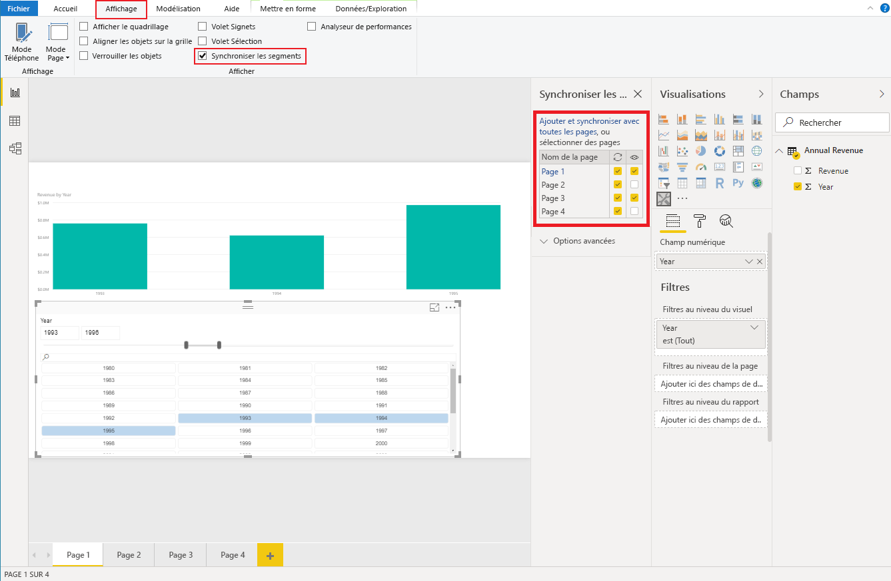

# <a name="sync-slicers-in-power-bi-visuals"></a>Synchroniser les segments dans les visuels Power BI

Pour que la fonctionnalité [Synchroniser les segments](https://docs.microsoft.com/power-bi/desktop-slicers) soit prise en charge, il faut que votre visuel de segment personnalisé utilise la version 1.13.0 ou une version ultérieure de l’API.

De plus, vous devez activer l’option dans le fichier *capabilities.json*, comme illustré dans le code suivant :

```json
{
    ...
    "supportsHighlight": true,
    "suppressDefaultTitle": true,
    "supportsSynchronizingFilterState": true,
    "sorting": {
        "default": {}
    }
}
```

Une fois que vous avez mis à jour le fichier *capabilities.json*, vous voyez le volet d’options **Synchroniser les segments** quand vous sélectionnez votre visuel de segment personnalisé.

> [!NOTE]
> La fonctionnalité Synchroniser les segments peut s’utiliser pour un seul champ. Si votre segment comporte plusieurs champs (**Catégorie** ou **Mesure**), la fonctionnalité est désactivée.



Dans le panneau **Synchroniser les segments**, vous pouvez voir que les options de visibilité et de filtrage de votre segment sont applicables à plusieurs pages de rapport.
