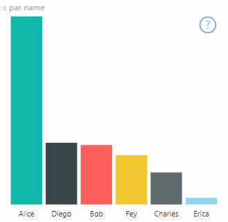

# <a name="high-contrast-mode-support"></a>Prise en charge du mode Contraste élevé

Le paramètre *Contraste élevé* de Windows permet d’augmenter la lisibilité du texte et des applications en utilisant des couleurs plus marquées.
En savoir plus sur [la prise en charge du contraste élevé dans Power BI](https://powerbi.microsoft.com/blog/power-bi-desktop-june-2018-feature-summary/#highContrast).

L’ajout de la prise en charge du contraste élevé dans votre visuel requiert les actions suivantes :

1. À l’initialisation : détectez si Power BI est en mode Contraste élevé et, le cas échéant, obtenez les couleurs à contraste élevé actuelles.
2. À chaque mise à jour : modifiez le mode d’affichage du visuel pour en augmenter la visibilité.

Le visuel PowerBI-visuals-sampleBarChart présente une implémentation de la prise en charge du contraste élevé.

Pour plus d’informations, consultez l’article [PowerBI-visuals-sampleBarChart visual repository](https://github.com/Microsoft/PowerBI-visuals-sampleBarChart/commit/61011c82b66ca0d3321868f1d089c65101ca42e6) (Référentiel visuel PowerBI-visuals-sampleBarChart).

## <a name="on-init"></a>À l’initialisation

Le membre colorPalette de `options.host` possède plusieurs propriétés pour le mode Contraste élevé. Utilisez ces propriétés pour déterminer si le mode Contraste élevé est actif et, le cas échéant, les couleurs à utiliser.

### <a name="detect-that-power-bi-is-in-high-contrast-mode"></a>Détecter que Power BI est en mode Contraste élevé

Si `host.colorPalette.isHighContrast` est défini sur `true`, le mode Contraste élevé est actif, et le visuel doit se dessiner lui-même en conséquence.

### <a name="get-high-contrast-colors"></a>Obtenir des couleurs à contraste élevé

En mode Contraste élevé, votre visuel doit se limiter aux couleurs suivantes :

* La couleur de **premier plan** est utilisée pour dessiner des lignes, des icônes, du texte, du contour ou du remplissage de formes.
* La couleur **d’arrière-plan** est utilisée pour l’arrière-plan et comme couleur de remplissage des formes avec contour.
* La couleur **sélectionnée de premier plan** est utilisée pour indiquer un élément sélectionné ou actif.
* La couleur de **lien hypertexte** est utilisée uniquement pour le texte du lien hypertexte.

> [!NOTE]
> Si une couleur secondaire est nécessaire, la couleur de premier plan peut être utilisée avec une certaine opacité (les visuels natifs Power BI utilisent une opacité de 40 %). Utilisez cette fonctionnalité avec modération pour faciliter la visualisation des détails visuels.

Vous pouvez stocker ces valeurs pendant l’initialisation :

```typescript
private isHighContrast: boolean;

private foregroundColor: string;
private backgroundColor: string;
private foregroundSelectedColor: string;
private hyperlinkColor: string;
//...

constructor(options: VisualConstructorOptions) {
    this.host = options.host;
    let colorPalette: ISandboxExtendedColorPalette = host.colorPalette;
    //...
    this.isHighContrast = colorPalette.isHighContrast;
    if (this.isHighContrast) {
        this.foregroundColor = colorPalette.foreground.value;
        this.backgroundColor = colorPalette.background.value;
        this.foregroundSelectedColor = colorPalette.foregroundSelected.value;
        this.hyperlinkColor = colorPalette.hyperlink.value;
    }
```

Vous pouvez également stocker l’objet `host` pendant l’initialisation et accéder aux propriétés `colorPalette` pertinentes pendant la mise à jour.

## <a name="on-update"></a>À la mise à jour

Les implémentations spécifiques de la prise en charge du contraste élevé varient d’un visuel à l’autre et dépendent des détails de la conception graphique. En règle générale, le mode Contraste élevé requiert une conception légèrement différente de la conception par défaut afin de faciliter la distinction des détails importants avec les couleurs limitées.

Voici quelques directives suivies par les visuels natifs Power BI :

* Tous les points de données utilisent la même couleur (premier plan).
* Tout le texte et tous les axes, flèches, lignes, etc. utilisent la couleur de premier plan.
* Les formes épaisses sont dessinées comme des contours avec des traits épais (au moins deux pixels) et un remplissage de couleur d’arrière-plan.
* Le cas échéant, les points de données se distinguent par différentes formes de marqueur, et les lignes de données se distinguent par des tirets différents.
* Lorsqu’un élément de données est mis en surbrillance, tous les autres éléments définissent leur opacité sur 40 %.
* Pour les segments, les éléments de filtre actifs utilisent la couleur sélectionnée de premier plan.

Dans l’exemple de graphique à barres, par exemple, toutes les barres sont dessinées avec un remplissage d’arrière-plan et un contour de premier plan épais de deux pixels. Comparez son apparence avec les couleurs par défaut et quelques thèmes à contraste élevé :




Voici un emplacement dans la fonction `visualTransform` qui a été modifié pour prendre en charge le contraste élevé. Il est appelé dans le cadre du rendu pendant `update` :

### <a name="before"></a>Avant

```typescript
for (let i = 0, len = Math.max(category.values.length, dataValue.values.length); i < len; i++) {
    let defaultColor: Fill = {
        solid: {
            color: colorPalette.getColor(category.values[i] + '').value
        }
    };

    barChartDataPoints.push({
        category: category.values[i] + '',
        value: dataValue.values[i],
        color: getCategoricalObjectValue<Fill>(category, i, 'colorSelector', 'fill', defaultColor).solid.color,
        selectionId: host.createSelectionIdBuilder()
            .withCategory(category, i)
            .createSelectionId()
    });
}
```

### <a name="after"></a>Après

```typescript
for (let i = 0, len = Math.max(category.values.length, dataValue.values.length); i < len; i++) {
    const color: string = getColumnColorByIndex(category, i, colorPalette);

    const selectionId: ISelectionId = host.createSelectionIdBuilder()
        .withCategory(category, i)
        .createSelectionId();

    barChartDataPoints.push({
        color,
        strokeColor,
        strokeWidth,
        selectionId,
        value: dataValue.values[i],
        category: `${category.values[i]}`,
    });
}

//...

function getColumnColorByIndex(
    category: DataViewCategoryColumn,
    index: number,
    colorPalette: ISandboxExtendedColorPalette,
): string {
    if (colorPalette.isHighContrast) {
        return colorPalette.background.value;
    }

    const defaultColor: Fill = {
        solid: {
            color: colorPalette.getColor(`${category.values[index]}`).value,
        }
    };

    return getCategoricalObjectValue<Fill>(category, index, 'colorSelector', 'fill', defaultColor).solid.color;
}
```
