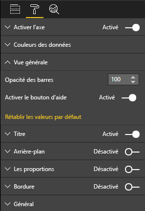

# <a name="create-a-launch-url"></a>Créer une URL de lancement

La création d’une URL de lancement vous permet d’ouvrir un nouvel onglet (ou une fenêtre) de navigateur en déléguant le travail réel à Power BI.

## <a name="sample"></a>Exemple

```typescript
   this.host.launchUrl('https://powerbi.microsoft.com');
```

## <a name="usage"></a>Utilisation

Utilisez l’appel d’API `host.launchUrl()`, en passant l’URL de destination en tant qu’argument de chaîne :

```typescript
this.host.launchUrl('http://some.link.net');
```

## <a name="restrictions"></a>Restrictions

* Utilisez uniquement des chemins absolus, pas des chemins relatifs. Par exemple, utilisez un chemin absolu tel que `http://some.link.net/subfolder/page.html`. Le chemin relatif `/page.html` ne s’ouvre pas.

* Actuellement, seuls les protocoles *HTTP* et *HTTPS* sont pris en charge. N’utilisez pas les protocoles comme *FTP*, *MAILTO*, etc.

## <a name="best-practices"></a>Meilleures pratiques

* En règle générale, il est préférable d’ouvrir un lien uniquement en réponse à une action explicite de l’utilisateur. Permettez à l’utilisateur de comprendre facilement que le fait de cliquer sur le lien ou le bouton entraîne l’ouverture d’un nouvel onglet. Le déclenchement d’un appel `launchUrl()` sans action d’un utilisateur ou comme effet secondaire d’une autre action peut être confus ou frustrant pour l’utilisateur.

* Si le lien n’est pas indispensable au bon fonctionnement du visuel, nous recommandons d’offrir à l’auteur du rapport un moyen de désactiver et masquer le lien. Cette recommandation s’avère surtout utile dans des cas d’usage particuliers de Power BI, comme l’incorporation d’un rapport dans une application tierce ou sa publication sur le web.

* Évitez de déclencher un appel `launchUrl()` à partir d’une boucle, la fonction `update` du visuel ou tout autre code récurrent fréquent.

## <a name="a-step-by-step-example"></a>Exemple pas à pas

### <a name="add-a-link-launching-element"></a>Ajouter un élément de lancement de lien

Les lignes suivantes ont été ajoutées à la fonction `constructor` du visuel :

```typescript
    this.helpLinkElement = this.createHelpLinkElement();
    options.element.appendChild(this.helpLinkElement);
```

Une fonction privée qui crée et attache l’élément d’ancrage a été ajoutée :

```typescript
private createHelpLinkElement(): Element {
    let linkElement = document.createElement("a");
    linkElement.textContent = "?";
    linkElement.setAttribute("title", "Open documentation");
    linkElement.setAttribute("class", "helpLink");
    linkElement.addEventListener("click", () => {
        this.host.launchUrl("https://docs.microsoft.com/power-bi/developer/custom-visual-develop-tutorial");
    });
    return linkElement;
};
```

Enfin, une entrée dans le fichier *visual.less* définit le style de l’élément de lien :

```less
.helpLink {
    position: absolute;
    top: 0px;
    right: 12px;
    display: block;
    width: 20px;
    height: 20px;
    border: 2px solid #80B0E0;
    border-radius: 20px;
    color: #80B0E0;
    text-align: center;
    font-size: 16px;
    line-height: 20px;
    background-color: #FFFFFF;
    transition: all 900ms ease;

    &:hover {
        background-color: #DDEEFF;
        color: #5080B0;
        border-color: #5080B0;
        transition: all 250ms ease;
    }

    &.hidden {
        display: none;
    }
}
```

### <a name="add-a-toggling-mechanism"></a>Ajouter un mécanisme de basculement

Pour ajouter un mécanisme de basculement, vous devez ajouter un objet statique qui permette à l’auteur du rapport d’afficher ou de masquer l’élément de lien. (Par défaut, l’élément est *masqué*.) Pour plus d’informations, consultez le [tutoriel sur les objets statiques](https://microsoft.github.io/PowerBI-visuals/docs/concepts/objects-and-properties).

Un objet statique booléen `showHelpLink` a été ajouté sous l’entrée objects dans le fichier *capabilities.json*, comme dans le code suivant :

```typescript
"objects": {
    "generalView": {
            "displayName": "General View",
            "properties":
                "showHelpLink": {
                    "displayName": "Show Help Button",
                    "type": {
                        "bool": true
                    }
                }
            }
        }
    }
```



Les lignes suivantes ont été ajoutées à la fonction `update` du visuel :

```typescript
if (settings.generalView.showHelpLink) {
    this.helpLinkElement.classList.remove("hidden");
} else {
    this.helpLinkElement.classList.add("hidden");
}
```

La classe *hidden* est définie dans le fichier *visual.less* pour contrôler l’affichage de l’élément.
