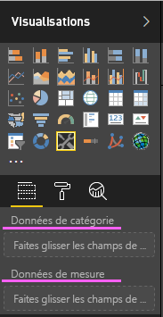
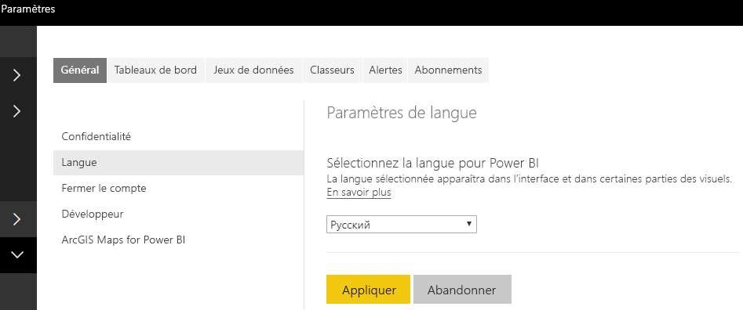

# <a name="add-the-locale-in-power-bi-for-power-bi-visuals"></a>Ajouter les paramètres régionaux dans Power BI pour les visuels Power BI

Les visuels peuvent récupérer les paramètres régionaux Power BI pour localiser leur contenu dans la langue appropriée.

Découvrez plus en détail les [langues et pays/régions pris en charge pour Power BI](./../../supported-languages-countries-regions.md)

Par exemple, obtention de paramètres régionaux dans l’exemple de visuel de graphique à barres.


Chacun de ces graphiques à barres a été créé avec des paramètres régionaux différents (anglais, basque et hindi) et il est affiché dans l’info-bulle.

> [!NOTE]
> Le gestionnaire de localisation dans le code du visuel est pris en charge par l’API 1.10.0 et versions ultérieures.

## <a name="get-the-locale"></a>Obtenir les paramètres régionaux

Les `locale` sont passés sous forme de chaîne pendant l’initialisation du visuel. Si des paramètres régionaux sont modifiés dans Power BI, le visuel est de nouveau généré avec les nouveaux paramètres régionaux. L’exemple de code complet est disponible dans SampleBarChart avec paramètres régionaux

Le constructeur BarChart possède maintenant un membre de paramètres régionaux, qui est instancié dans le constructeur avec l’instance de paramètres régionaux de l’hôte.

```typescript
private locale: string;
...
this.locale = options.host.locale;
```

Paramètres régionaux pris en charge :

Chaîne de paramètres régionaux | Language
--------------|----------------------
ar-SA | العربية (arabe)
bg-BG | български (bulgare)
ca-ES | català (catalan)
cs-CZ | čeština (tchèque)
da-DK | dansk (danois)
de-DE | Deutsche (allemand)
el-GR | ελληνικά (grec)
en-US | Anglais (anglais)
es-ES | español (espagnol)
et-EE | eesti (estonien)
eU-ES | Euskal (basque)
fi-FI | suomi (finnois)
fr-FR | français (France)
gl-ES | galego (galicien)
he-IL | עברית (hébreu)
hi-IN | हिन्दी (hindi)
hr-HR | hrvatski (croate)
hu-HU | magyar (hongrois)
id-ID | Bahasa Indonesia (indonésien)
it-IT | Italiano (italien)
ja-JP | 日本の (japonais)
kk-KZ | Қазақ (kazakh)
ko-KR | 한국의 (coréen)
lt-LT | Lietuvos (lituanien)
lv-LV | Latvijas (letton)
ms-MY | Bahasa Melayu (malais)
nb-NO | norsk (norvégien)
nl-NL | Nederlands (néerlandais)
pl-PL | polski (polonais)
pt-BR | português (Brésil)
pt-PT | português (Brésil)
ro-RO | românesc (roumain)
ru-RU | русский (russe)
sk-SK | slovenský (slovaque)
sl-SI | slovenski (slovène)
sr-Cyrl-RS | српски (serbe)
sr-Latn-RS | srpski (serbe)
sv-SE | svenska (suédois)
th-TH | ไทย (thaï)
tr-TR | Türk (turc)
uk-UA | український (ukrainien)
vi-VN | tiếng Việt (vietnamien)
zh-CN | 中国 (chinois simplifié)
zh-TW | 中國 (chinois traditionnel)

> [!NOTE]
> Dans Power BI Desktop, la propriété de paramètres régionaux contient la langue de l’application Power BI Desktop installée.

## <a name="localizing-the-property-pane-for-power-bi-visuals"></a>Localisation du volet de propriétés pour les visuels Power BI

Les champs du volet de propriétés peuvent être localisés pour offrir une expérience plus intégrée et cohérente. Cela permet à votre visuel personnalisé de se comporter comme n’importe quel autre visuel principal Power BI.

Par exemple, un visuel personnalisé non localisé créé à l’aide de la commande `pbiviz new` affiche les champs suivants dans le volet de propriétés :



Les données de catégorie et les données de mesure sont définies dans le fichier capabilities.json comme `displayName`.

## <a name="how-to-localize-capabilities"></a>Comment localiser les fonctionnalités

Tout d’abord, ajoutez une clé de nom complet à chaque nom complet que vous souhaitez localiser dans vos fonctionnalités. Dans cet exemple :

```json
{
    "dataRoles": [
        {
            "displayName": "Category Data",
            "displayNameKey": "VisualCategoryDataNameKey1",
            "name": "category",
            "kind": "Grouping"
        },
        {
            "displayName": "Measure Data",
            "displayNameKey": "VisualMeasureDataNameKey2",
            "name": "measure",
            "kind": "Measure"
        }
    ]
}
```

Ajoutez ensuite un répertoire appelé stringResources. Le répertoire contiendra tous vos différents fichiers de ressources de chaînes en fonction des paramètres régionaux que vous souhaitez que votre visuel prenne en charge. Sous ce répertoire, vous devez ajouter un fichier JSON pour chaque paramètre régional que vous souhaitez prendre en charge. Ces fichiers contiennent les informations de paramètres régionaux et les valeurs de chaînes localisées pour chaque displayNameKey à remplacer.

Dans notre exemple, supposons que nous voulons prendre en charge l’arabe et l’hébreu. Nous allons devoir ajouter deux fichiers JSON de la façon suivante :


Chaque fichier JSON définit un seul paramètre régional (ce fichier doit être l’un des paramètres régionaux de la liste prise en charge ci-dessus), avec les valeurs de chaînes pour les clés de nom complet souhaitées. Dans notre exemple, le fichier de ressources de chaînes en hébreu se présente comme suit :

```json
{
    "locale": "he-IL",
    "values": {
        "VisualCategoryDataNameKey1": "קטגוריה",
        "VisualMeasureDataNameKey2": "יחידות מידה"
    }
}
```

Toutes les étapes nécessaires pour utiliser le gestionnaire de localisation sont décrites ci-dessous.

> [!NOTE]
> Actuellement, la localisation n’est pas prise en charge pour le débogage du visuel de développement

## <a name="setup-environment"></a>Environnement d’installation

### <a name="desktop"></a>Bureau

Pour une utilisation au bureau, téléchargez la version localisée de Power BI Desktop à partir de https://powerbi.microsoft.com.

### <a name="web-service"></a>Service web

Si vous utilisez le client web (navigateur) dans le service, modifiez votre langue dans Paramètres :



## <a name="resource-file"></a>Fichier de ressources

Ajoutez un fichier resources.resjson à un dossier nommé comme paramètres régionaux que vous allez utiliser dans le dossier stringResources. Il s’agit d’en-US et de ru-RU dans notre exemple.


Après cela, ajoutez toutes les chaînes de localisation que vous allez utiliser dans le fichier resources.resjson ajouté à l’étape précédente.

```json
{
    ...
    "Role_Legend": "Обозначения",
    "Role_task": "Задача",
    "Role_StartDate": "Дата начала",
    "Role_Duration": "Длительность"
    ...
}
```

Cet exemple est la version en-US du fichier resources.resjson :

```json
{
    ...
    "Role_Legend": "Legend",
    "Role_task": "Task",
    "Role_StartDate": "Start date",
    "Role_Duration": "Duration"
    ...
}
```

Nouvelle instance du gestionnaire de localisation. Créez une instance du gestionnaire de localisation dans le code de votre visuel comme suit

```typescript
private localizationManager: ILocalizationManager;

constructor(options: VisualConstructorOptions) {
    this.localizationManager = options.host.createLocalizationManager();
}
```

## <a name="localizationmanager-usage-sample"></a>Exemple d’utilisation du gestionnaire de localisation

Vous pouvez maintenant appeler la fonction getDisplayName du gestionnaire de localisation avec l’argument de clé de chaîne que vous avez défini dans resources.resjson pour obtenir la chaîne requise n’importe où dans votre code :

```typescript
let legend: string = this.localization.getDisplayName("Role_Legend");
```

Elle retourne « Legend » pour en-US et « Обозначения » pour ru-RU

## <a name="next-steps"></a>Étapes suivantes

* [Découvrez comment utiliser les utilitaires de mise en forme pour fournir des formats localisés](utils-formatting.md)
