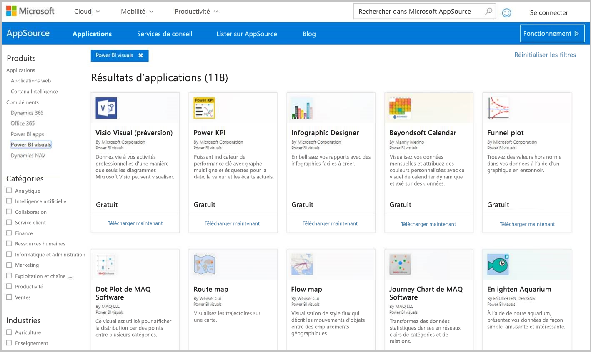
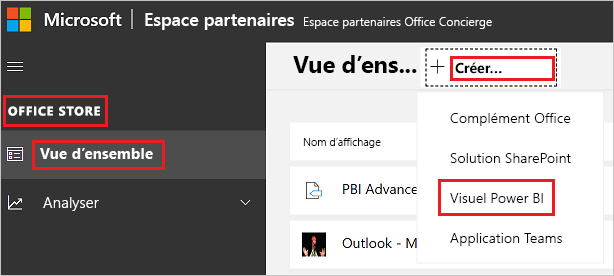

# Publier des visuels Power BI sur l’Espace partenaires

Une fois que vous avez créé votre visuel Power BI, vous pouvez le publier sur AppSource pour que les utilisateurs puissent le trouver et l’utiliser. Pour plus d'informations sur la création d'un visuel Power BI, voir [Développement d'un visuel Power BI](custom-visual-develop-tutorial.md).

## Présentation d’AppSource

[AppSource](https://appsource.microsoft.com/marketplace/apps?product=power-bi-visuals) est l’endroit où vous pouvez rechercher des applications SaaS et des compléments pour vos produits et services Microsoft.

## Préparation de la soumission de votre visuel Power BI

Avant de soumettre un visuel Power BI à AppSource, assurez-vous d'avoir lu les [instructions relatives aux visuels Power BI](guidelines-powerbi-visuals.md) et [testé votre visuel personnalisé](./submission-testing.md).

Lorsque vous êtes prêt à soumettre votre visuel Power BI, vérifiez qu'il répond à toutes les exigences énumérées ci-dessous.

| Article | Requis | Description |
| --- | --- | --- |
| Package Pbiviz |Oui |Empaquetez votre visuel Power BI dans un package Pbiviz contenant toutes les métadonnées requises. Nom du visuel Nom d’affichage GUID Version Description Nom et e-mail de l’auteur |
| Exemple de fichier de rapport .pbix |Oui |Pour présenter votre visuel, vous devez aider les utilisateurs à se familiariser avec ce visuel. Insistez sur la valeur que le visuel apporte à l’utilisateur et donnez des exemples d’utilisation et d’options de mise en forme. Vous pouvez également ajouter une page de *conseils* à la fin. Dans cette page, donnez quelques conseils et astuces, et expliquez ce qu’il faut éviter de faire. L’exemple de fichier de rapport .pbix doit pouvoir être utilisé hors connexion, sans connexion externe. |
| Icône |Oui |Vous devez inclure le logo du visuel personnalisé qui s’affiche sur la page principale de l’Office Store. Les formats .png, .jpg, .jpeg et .gif sont disponibles. Le format doit faire exactement 300 px (largeur) x 300 px (hauteur). **Important :** Lisez attentivement le [guide des images du magasin AppSource](/office/dev/store/craft-effective-appsource-store-images) avant de soumettre l’icône. |
| Captures d’écran |Oui |Fournissez au moins une capture d’écran. Les formats .png, .jpg, .jpeg et .gif sont disponibles. Les dimensions doivent être exactement 1 366 px (largeur) par 768 px (hauteur). La taille du fichier ne doit pas dépasser 1024 ko. Pour une utilisation optimale, ajoutez des bulles de texte pour expliquer la proposition de valeur des principales fonctionnalités affichées dans chaque capture d’écran. |
| Lien vers le support |Oui |Fournissez une URL de support à vos clients. Ce lien est entré dans le cadre de votre annonce dans l’Espace partenaires. Les utilisateurs le voient lorsqu’ils accèdent à l’annonce de votre visuel sur AppSource. Le format de votre URL doit inclure https:// ou https://. |
| Lien vers le document sur la confidentialité |Oui |Fournissez un lien vers la déclaration de confidentialité du visuel. Ce lien est entré dans le cadre de votre annonce dans l’Espace partenaires. Les utilisateurs le voient lorsqu’ils accèdent à l’annonce de votre visuel sur AppSource. Le format de votre lien doit inclure https:// ou https://. |
| Contrat de Licence Utilisateur Final (CLUF) |Oui |Vous devez fournir un fichier CLUF pour votre élément visuel Power BI. Vous pouvez utiliser le [contrat standard](https://go.microsoft.com/fwlink/?linkid=2041178), le [contrat des visuels Power BI](https://visuals.azureedge.net/app-store/Power%20BI%20-%20Default%20Custom%20Visual%20EULA.pdf) ou votre propre CLUF. |
| Lien vers la vidéo |Non |Pour augmenter l’intérêt porté par les utilisateurs à votre visuel personnalisé, fournissez un lien vers une vidéo de présentation de votre visuel. Le format de votre URL doit inclure https:// ou https://. |
| Dépôt GitHub |Non |Partagez un lien public vers un dépôt [GitHub](https://www.github.com) avec les sources de votre visuel Power BI et des échantillons de données. Cela permet à d'autres développeurs de vous transmettre leurs commentaires et des suggestions pour améliorer votre code. |

## Obtenir le code XML d’un package d’application

Pour soumettre un visuel Power BI, vous avez besoin d’un code XML de package d’application fourni par l'équipe Power BI. Pour obtenir le code XML du package d'application, envoyez un e-mail à l'équipe de soumission des visuels Power BI ([pbivizsubmit@microsoft.com](mailto:pbivizsubmit@microsoft.com)).

Avant de créer le package **pbiviz**, vous devez renseigner les champs suivants dans le fichier **pbiviz.json** :
* description
* supportUrl
* auteur
* name
* e-mail

Joignez le **fichier pbiviz** et **l’exemple de fichier de rapport pbix** à votre e-mail. Dans sa réponse, l’équipe Power BI vous donne des instructions et un fichier XML de package d’application à charger. Ce package d’application XML est requis pour soumettre votre visuel par le biais du Centre pour développeurs Office.

> [!NOTE]
> Pour améliorer la qualité et faire en sorte que les rapports existants ne soient pas endommagés, 2 semaines supplémentaires sont nécessaires pour que les mises à jour apportées aux visuels existants atteignent l’environnement de production après l’approbation dans le Store.

## Soumission à AppSource

Pour soumettre votre visuel Power BI à AppSource, vous devez obtenir un package d'application de la part de l'équipe Power BI, puis le soumettre à l’Espace partenaires.

### Obtenir le package d'application

Vous devez envoyer un e-mail avec les fichiers **pbiviz** et **pbix** à l’équipe Power BI avant la soumission à AppSource. L’équipe Power BI peut ainsi charger les fichiers sur le serveur de partage public. Sinon, le Store ne peut pas récupérer les fichiers. 

L'équipe Power BI doit vérifier les fichiers de chaque soumission d’un nouveau visuel Power BI, les mises à jour de visuels Power BI existants, et les correctifs apportés aux soumissions rejetées.

### Soumission à l’Espace partenaires

Pour soumettre votre visuel Power BI à l’Espace partenaires, vous devez y être inscrit. Si vous n'êtes pas encore inscrit, [ouvrez un compte développeur dans l’Espace partenaires](/office/dev/store/open-a-developer-account).

>[!NOTE]
>Les **éditeurs** peuvent utiliser l’une des méthodes suivantes pour soumettre un visuel Power BI :
>* Si vous avez un ancien compte Mon tableau de bord vendeur, vous pouvez continuer à utiliser les informations d’identification de ce compte pour vous connecter à l’Espace partenaires.
>* Si vous ne disposez pas d’un tel compte et si vous n’êtes pas inscrit à l’Espace partenaires, vous devez [ouvrir un compte de développeur dans l’Espace partenaires](/office/dev/store/open-a-developer-account) à l’aide de votre adresse e-mail professionnelle.

Suivez les étapes ci-dessous pour soumettre votre visuel Power BI à l’Espace partenaires. Pour plus d'informations sur le processus de soumission, voir [Soumettre votre solution Office à AppSource via l’Espace partenaires](/office/dev/store/use-partner-center-to-submit-to-appsource).

1. Connectez-vous à l’**Espace partenaires**.

2. Dans le volet gauche, sélectionnez **OFFICE STORE**.

3. Sélectionnez **Vue d’ensemble**.

4. Sélectionnez **Créer un nouveau**, puis dans le menu déroulant, sélectionnez **Visuel Power BI**.

    

5. Dans la fenêtre **Créer un nouveau visuel Power BI**, nommez votre visuel Power BI et sélectionnez **Créer**.

6. Sélectionnez **Packages** puis chargez le package d'application XML de votre visuel Power BI.

7. Sélectionnez **Propriétés** et fournissez les informations requises.

8. Si votre produit nécessite un achat supplémentaire, sélectionnez **Programme d’installation du produit**, puis cochez la case **Achat de service associé**.

9. (Facultatif) Si vous voulez [certifier](power-bi-custom-visuals-certified.md) votre visuel, sélectionnez **Programme d’installation du produit** et cochez la case **Certification Power BI**.
    >[!TIP]
    >Le processus de certification Power BI peut prendre du temps. Si vous créez un nouveau visuel Power BI, nous vous recommandons de publier votre visuel Power BI via l’Espace partenaires avant de demander une certification Power BI. Cela évite ainsi tout retard dans la publication de votre visuel.

10. Sélectionnez **Programme d’installation du produit** et cliquez sur **Vérifier et publier**.

## Suivi de l’utilisation et de l’état de la soumission

Vous pouvez passer en revue les [stratégies de validation](/legal/marketplace/certification-policies#1180-power-bi-visuals).

* Après l’envoi de la soumission, vous pouvez afficher son état dans le [tableau de bord de l’application](https://sellerdashboard.microsoft.com/Application/Summary/).

* Pour savoir quand votre visuel sera disponible au téléchargement à partir d’AppSource, consultez la [chronologie de publication](power-bi-custom-visuals-certified.md#publication-timeline) des visuels Power BI.

## Certifier votre visuel

Une fois votre visuel créé, vous pouvez le faire [certifier](power-bi-custom-visuals-certified.md).

## Étapes suivantes

* [Développement d’un visuel personnalisé Power BI](custom-visual-develop-tutorial.md)

* [Visualisations dans Power BI](../../visuals/power-bi-report-visualizations.md)  

* [Visuels dans Power BI](power-bi-custom-visuals.md)  

* [Faire certifier un visuel Power BI](power-bi-custom-visuals-certified.md)

* D’autres questions ? [Essayez d’interroger la communauté Power BI](https://community.powerbi.com/)