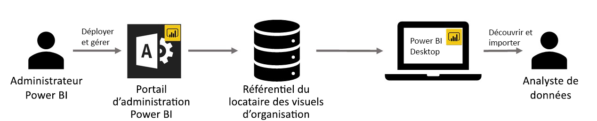

# Visuels organisationnels dans Power BI

Vous pouvez utiliser des visuels Power BI dans Power BI pour créer un type unique de visuel spécialement adapté à vos besoins. Les visuels Power BI sont créés par des développeurs, en général quand la multitude de visuels inclus dans Power BI ne répond pas tout à fait à leurs besoins.

Dans certaines organisations, les visuels Power BI sont encore plus importants : ils peuvent être nécessaires pour transmettre des données spécifiques ou des informations précises propres à l’organisation, avoir des spécifications spéciales pour les données, ou mettre en évidence des méthodes privées de l’entreprise. Ces organisations doivent développer des visuels Power BI, les partager dans toute l’entreprise, et garantir que ces visuels sont gérés correctement. Les visuels Power BI permettent à ces organisations d’atteindre ces objectifs.

L’image suivante montre le processus par lequel des visuels Power BI d’organisation dans Power BI passent de l’administrateur à l’analyste des données via le développement et la maintenance.

Les visuels organisationnels sont déployés et gérés par l’administrateur Power BI sur le portail d’administration. Une fois ces visuels déployés dans le référentiel de l’organisation, les utilisateurs peuvent facilement les découvrir et les importer dans leurs rapports, directement depuis Power BI Desktop.

Pour savoir comment utiliser des visuels Power BI d’organisation dans les rapports que vous avez créés, consultez l’article suivant : [En savoir plus sur l’importation de visuels organisationnels dans des rapports](power-bi-custom-visuals.md).

## Administrer des visuels Power BI d’organisation

Pour découvrir comment administrer, déployer et gérer des visuels Power BI d’organisation dans votre entreprise, consultez l’article suivant : [En savoir plus sur le déploiement et la gestion de visuels Power BI d’organisation](https://go.microsoft.com/fwlink/?linkid=866790).

> [!WARNING]
> Un visuel Power BI installé à partir d’un fichier peut contenir du code présentant des risques en matière de sécurité ou de confidentialité. Assurez-vous que vous faites confiance à l’auteur et à la source d’un fichier visuel Power BI avant de le déployer dans le référentiel de l’organisation.

## Considérations et limitations

Il existe plusieurs considérations et limitations que vous devez connaître.

Admin :

* Les visuels Power BI hérités (par exemple ceux qui ne s’appuient pas sur les nouvelles API avec gestion de versions) ne sont pas pris en charge.

* Si un visuel Power BI d’une ApSource ou d’un fichier est supprimé du référentiel, tous les rapports existants qui utilisent le visuel supprimé ne seront plus rendus. La suppression du référentiel n’est pas réversible. Pour désactiver temporairement un visuel Power BI à partir de ApSource ou d’un fichier, utilisez la caractéristique « Désactiver ».

* Les visuels Power BI d’organisation ne sont pas pris en charge dans le serveur de rapports Power BI.

Utilisateur final :

* Les visuels Power BI d’organisation sont des visuels privés importés à partir du référentiel de l’organisation. Comme tous les visuels privés, ils ne peuvent pas être [exportés vers PowerPoint](https://docs.microsoft.com/power-bi/consumer/end-user-powerpoint) ou affichées dans des e-mails reçus quand un utilisateur [s’abonne aux pages de rapport](https://docs.microsoft.com/power-bi/consumer/end-user-subscribe). Seuls les [visuels Power BI certifiés](power-bi-custom-visuals-certified.md) importés directement depuis la Place de marché prennent en charge ces fonctionnalités.

* Les visuels Visio, PowerApps, Mapbox et GlobeMap provenant de la place de marché AppSource ne s’affichent pas s’ils sont déployés par le biais du référentiel de l’organisation.

## Résoudre des problèmes

Pour plus d’informations sur la résolution des problèmes, consultez [Résolution des problèmes de vos visuels Power BI](power-bi-custom-visuals-troubleshoot.md).

## FORUM AUX QUESTIONS

Pour plus d’informations et des réponses à vos questions, consultez [Forum aux questions sur les visuels Power BI](power-bi-custom-visuals-faq.md#organizational-power-bi-visuals).

D’autres questions ? [Posez vos questions à la Communauté Power BI](https://community.powerbi.com/).
