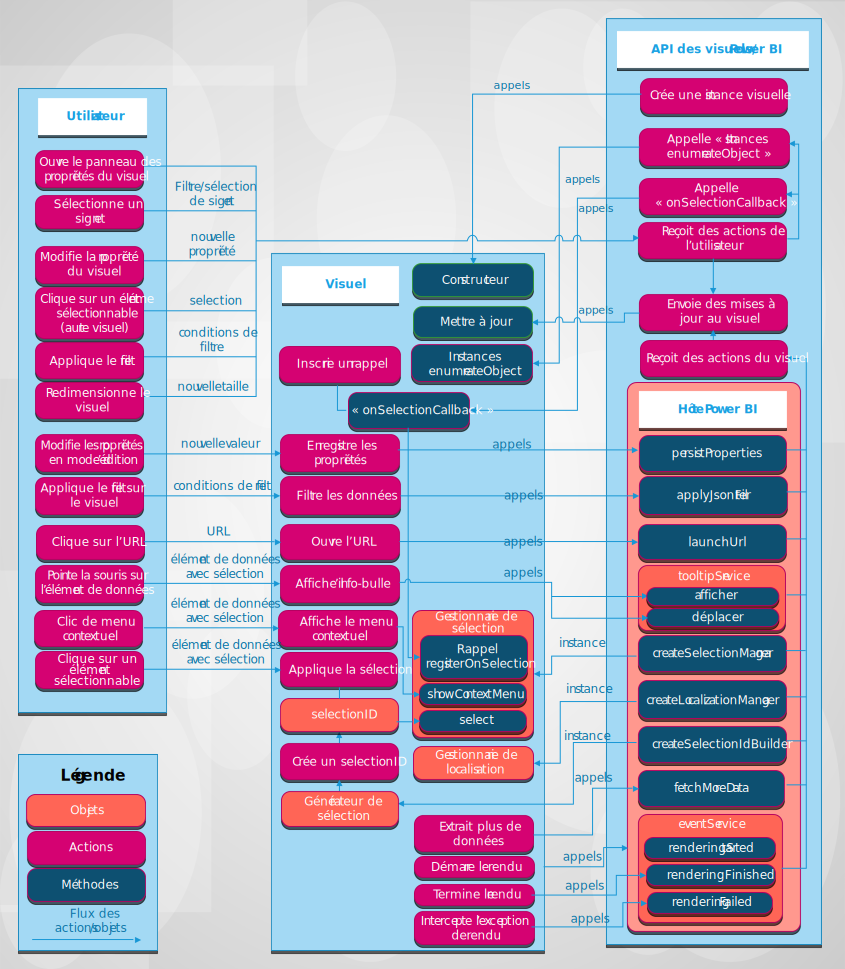

# Visuels dans Power BI

Cet article explique comment les visuels s’intègrent à Power BI et comment un utilisateur peut interagir avec un visuel dans Power BI. 

La figure suivante montre comment sont traitées dans Power BI les actions basées sur des visuels courantes effectuées par un utilisateur, notamment la sélection d’un signet.

## Les visuels obtiennent des mises à jour à partir de Power BI

Un visuel appelle une méthode `update` pour obtenir des mises à jour à partir de Power BI. La méthode `update` contient généralement la logique principale du visuel et est responsable du rendu d’un graphique ou la visualisation des données.

Les mises à jour sont déclenchées lorsque le visuel appelle la méthode `update`.

## Modèles d’action et de mise à jour

Les actions et les mises à jour suivantes dans les visuels Power BI surviennent dans l’un de ces trois modèles :

* L’utilisateur interagit avec un visuel via Power BI.
* L’utilisateur interagit directement avec le visuel.
* Le visuel interagit avec Power BI.

### L’utilisateur interagit avec un visuel via Power BI

* Un utilisateur ouvre le panneau des propriétés du visuel.

    Quand un utilisateur ouvre le panneau des propriétés du visuel, Power BI extrait les propriétés et les objets pris en charge à partir du fichier *capabilities.json* du visuel. Pour recevoir les valeurs réelles des propriétés, Power BI appelle la méthode `enumerateObjectInstances` du visuel. Le visuel retourne les valeurs réelles des propriétés.

    Pour plus d’informations, consultez [Fonctionnalités et propriétés des visuels Power BI](capabilities.md).

* Un utilisateur [change une propriété du visuel](../../visuals/power-bi-visualization-customize-title-background-and-legend.md) dans le panneau de format.

    Quand un utilisateur change la valeur d’une propriété dans le panneau de format, Power BI appelle la méthode `update` du visuel. Power BI passe le nouvel objet `options` à la méthode `update`. Les objets contiennent les nouvelles valeurs.

    Pour plus d’informations, consultez [Objets et propriétés des visuels Power BI](objects-properties.md).

* Un utilisateur redimensionne le visuel.

    Quand un utilisateur change la taille d’un visuel, Power BI appelle la méthode `update` avec le nouvel objet `options`. Les objets `options` comportent des objets `viewport` imbriqués qui contiennent les nouvelles valeurs de largeur et de hauteur du visuel.

* Un utilisateur applique un filtre au niveau du rapport, de la page ou du visuel.

    Power BI filtre les données en fonction de conditions de filtre. Power BI appelle la méthode `update` du visuel pour le mettre à jour avec les nouvelles données.

    Le visuel obtient une nouvelle mise à jour des `options` objets lorsque de nouvelles données sont ajoutées à l’un des objets imbriqués. La méthode de mise à jour dépend de la configuration du mappage des vues de données du visuel.

    Pour plus d’informations, consultez [Présentation du mappage des vues de données dans les visuels Power BI](dataview-mappings.md).

* Un utilisateur sélectionne un point de données dans un autre visuel du rapport.

    Lorsqu’un utilisateur sélectionne un point de données dans un autre visuel du rapport, Power BI filtre ou met en surbrillance les points de données sélectionnés puis appelle la méthode `update` du visuel. Le visuel obtient de nouvelles données filtrées ou les mêmes données avec un tableau de mises en surbrillance.

    Pour plus d’informations, consultez [Mettre en surbrillance des points de données dans les visuels Power BI](highlight.md).

* Un utilisateur sélectionne un signet dans le panneau des signets du rapport.

    Lorsqu’un utilisateur sélectionne un signet dans le panneau des signets d’un rapport, l’une des deux actions suivantes peut se produire :

    * Power BI appelle une fonction passée et enregistrée par la méthode `registerOnSelectionCallback`. La fonction de rappel obtient des tableaux de sélections pour le signet correspondant.

    * Power BI appelle la méthode `update` avec un objet `filter` correspondant au sein de l’objet `options`.

    Dans les deux cas, le visuel doit modifier son état en fonction des sélections reçues ou de l’objet `filter`.

    Pour plus d’informations sur les signets et les filtres, consultez [API Filtres de visuels dans les visuels Power BI](filter-api.md).

### L’utilisateur interagit directement avec le visuel

* Un utilisateur pointe la souris sur un élément de données.

    Un visuel peut afficher des informations supplémentaires sur un point de données via l’API des info-bulles Power BI. Quand un utilisateur pointe la souris sur un élément visuel, le visuel peut gérer l’événement et afficher des données sur l’élément info-bulle associé. Le visuel peut afficher une info-bulle standard ou une info-bulle de page de rapport.

    Pour plus d’informations, consultez [Info-bulles dans les visuels Power BI](add-tooltips.md).

* Un utilisateur modifie les propriétés du visuel. (Par exemple, un utilisateur développe une arborescence et le visuel enregistre l’état dans ses propriétés.)

    Un visuel peut enregistrer des valeurs de propriétés via l’API Power BI. Par exemple, lorsqu’un utilisateur interagit avec le visuel et que ce dernier doit enregistrer ou mettre à jour des valeurs de propriétés, le visuel peut appeler la méthode `presistProperties`.

* Un utilisateur sélectionne une URL.

    Par défaut, un visuel ne peut pas ouvrir directement une URL. Pour ouvrir une URL dans un nouvel onglet, le visuel peut appeler la méthode `launchUrl` et passer l’URL en tant que paramètre.

    Pour plus d’informations, consultez [Créer une URL de lancement](launch-url.md).

* Un utilisateur applique un filtre sur le visuel.

    Un visuel peut appeler la méthode `applyJsonFilter` et passer des conditions pour filtrer les données d’autres visuels. Plusieurs types de filtres sont disponibles, notamment les filtres De base, Avancés et Tuple.

    Pour plus d’informations, consultez [API Filtres de visuels dans les visuels Power BI](filter-api.md).

* Un utilisateur sélectionne des éléments dans le visuel.

    Pour plus d’informations sur les sélections dans un visuel Power BI, consultez [Ajouter de l’interactivité grâce à des sélections de visuels Power BI](selection-api.md).

### Le visuel interagit avec Power BI

* Un visuel demande plus de données à Power BI.

    Un visuel traite les données en plusieurs parties. La méthode de l’API `fetchMoreData` demande le fragment de données suivant du jeu de données.

    Pour plus d’informations, consultez [Extraire davantage de données de Power BI](fetch-more-data.md).

* Le service d’événements se déclenche.

    Power BI permet d’exporter un rapport au format PDF ou d’envoyer un rapport par e-mail (s’applique uniquement aux visuels certifiés). Pour notifier Power BI que le rendu est terminé et que le visuel est prêt à être capturé au format PDF ou envoyé par e-mail, le visuel doit appeler l’API d’événements de rendu.

    Pour plus d’informations, consultez [Exporter des rapports Power BI au format PDF](../../consumer/end-user-pdf.md).

    Pour en savoir plus sur le service d’événements, consultez [Afficher des événements dans des visuels Power BI](event-service.md).

## Étapes suivantes

Vous souhaitez créer vos propres visualisations et les ajouter à Microsoft AppSource ?  Reportez-vous aux articles suivants :

* [Développer un visuel Power BI](./custom-visual-develop-tutorial.md)
* [Publier des visuels Power BI sur l’Espace partenaires](office-store.md)
