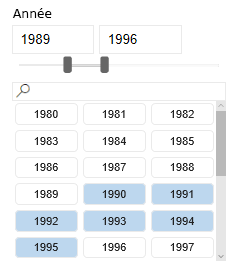
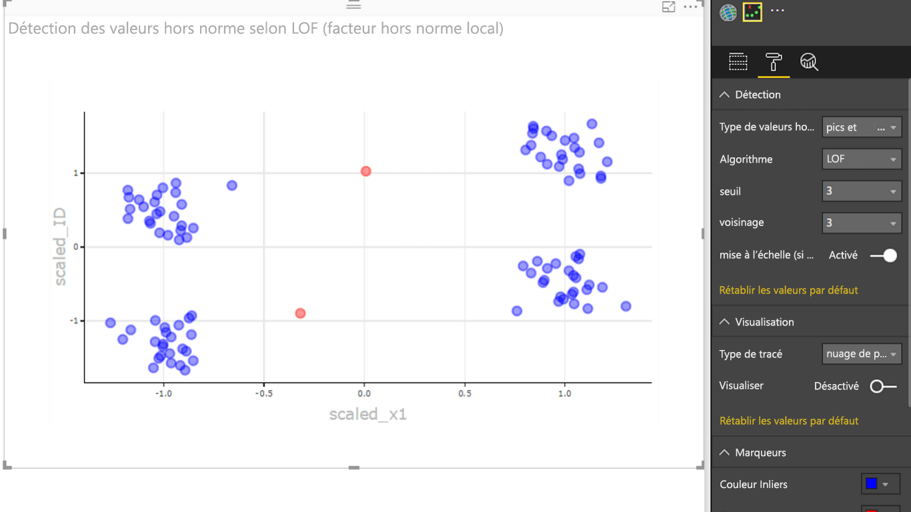

# Exemples de visuels Power BI

Vous pouvez télécharger, utiliser et modifier ces visuels Power BI à partir de GitHub. Ces exemples montrent comment gérer les situations courantes lors du développement avec Power BI.

## Segments

Un segment réduit la partie des données affichées dans d’autres visualisations d’un rapport. Les segments sont une des différentes façons de filtrer les données dans Power BI.

|   |  | |
| ------------- | ------------- | -------------|
| [Segment Chiclet](https://github.com/Microsoft/powerbi-visuals-chicletslicer/)   Afficher des boutons représentant une image ou du texte qui font office de filtres dans la zone de dessin sur d'autres visuels | [Timeline slicer](https://github.com/Microsoft/powerbi-visuals-timeline/)  Sélecteur de plage de dates graphique qui filtre par date | [Exemple de sélecteur](https://github.com/Microsoft/powerbi-visuals-sampleslicer/)  Illustre l’utilisation de l’API de filtrage avancé

## Graphiques

Inspirez-vous de notre galerie, qui comprend des graphiques à barres, des graphiques à secteurs, des nuages de mots et autres.

|   |  | |
| ------------- | ------------- | -------------|
| [Traçage Aster](https://github.com/Microsoft/powerbi-visuals-asterplot/)   Variante du graphique en anneau standard, avec une deuxième valeur qui définit l'angle de balayage | [Graphique à cible](https://github.com/Microsoft/powerbi-visuals-bulletchart/)  Graphique à barres avec des éléments visuels supplémentaires pour fournir davantage de contexte, utile pour le suivi d'objectifs | [Chord](https://github.com/Microsoft/powerbi-visuals-chord/)  Méthode graphique qui affiche les relations entre les données dans une matrice
|  | |  
| [Graphique à points](https://github.com/Microsoft/powerbi-visuals-dotplot/)  Montrer la distribution des fréquences avec style | [Dual KPI](https://github.com/Microsoft/powerbi-visuals-dualkpi/)  Visualiser efficacement deux mesures dans le temps, en indiquant leur tendance sur une chronologie mixte | [Enhanced Scatter](https://github.com/Microsoft/powerbi-visuals-enhancedscatter/)  Améliorations apportées au graphique à nuages de points existant
| | | 
| [Graphique de force](https://github.com/Microsoft/powerbi-visuals-forcegraph/)  Diagramme de disposition des forces avec des trajectoires courbes, utile pour montrer les connexions entre des entités | [Diagramme de Gantt](https://github.com/Microsoft/powerbi-visuals-gantt/)  Un graphique à barres qui illustre la chronologie ou la planification d'un projet avec des ressources | [Carte thermique Table](https://github.com/Microsoft/powerbi-visuals-heatmap/)  Comparer de manière simple et intuitive les données d'une table en utilisant des couleurs
|  |  |  
| [Histogramme](https://github.com/Microsoft/powerbi-visuals-histogram/)  Visualizes the distribution of data over a continuous interval or certain time period | [LineDot Chart](https://github.com/Microsoft/powerbi-visuals-linedotchart/)  Graphique en courbes avec des points animés qui retournent un public avec des données | [Graphique Mekko](https://github.com/Microsoft/powerbi-visuals-mekkochart/)  Combinaison d'un histogramme empilé et d'un graphique à barres empilées dans une seule et même vue
|  |  |  
| [Multi KPI](https://github.com/microsoft/PowerBI-visuals-MultiKPI/)   Visualisation de plusieurs indicateurs de performance clés avec plusieurs sparklines de données de soutien | [Power KPI](https://github.com/microsoft/PowerBI-visuals-PowerKPI/)  Puissant indicateur de performance clé avec graphique multiligne et étiquettes pour la date, la valeur et les écarts actuels | [Matrice des indicateurs de performance clé Power](https://github.com/microsoft/PowerBI-visuals-PowerKPIMatrix/)  Surveiller des cartes de performances équilibrées et un nombre illimité de métriques et d’indicateurs de performance clés dans une liste compacte et facile à lire
| |  |  
| [Graphique de pulsations](https://github.com/Microsoft/powerbi-visuals-pulsechart/)  Ce graphique en courbes annoté avec des événements clés est parfait pour indiquer les récits avec des données| [Graphique en radar](https://github.com/Microsoft/powerbi-visuals-radarchart/)  Présente le traçage de plusieurs mesures sur un axe de catégorie, ce qui est utile pour comparer des attributs | [Graphique de Sankey](https://github.com/Microsoft/powerbi-visuals-sankey/)  Diagramme de flux où la largeur de la série est proportionnelle à la quantité du flux
|  | | 
| [Graphique de flux](https://github.com/Microsoft/powerbi-visuals-streamgraph/)  Graphique en aires empilées avec interpolation fluide souvent utilisé pour afficher des valeurs dans le temps | [Graphique en rayons de soleil](https://github.com/Microsoft/powerbi-visuals-sunburst/)  Graphique en anneau à plusieurs niveaux permettant de visualiser les données hiérarchiques| [Graphique en tornade](https://github.com/Microsoft/powerbi-visuals-tornado/)  Comparaison de l'importance relative des variables entre deux groupes
 | 
 | [Nuage de mots](https://github.com/Microsoft/powerbi-visuals-wordcloud/)  Créer un visuel amusant à partir de texte fréquent dans vos données

## WebGL

WebGL permet au contenu web d’utiliser une API basée sur OpenGL ES 2.0 pour effectuer un rendu 2D et 3D dans un canevas HTML.

| |
| ------------- |
| [Carte du monde](https://github.com/Microsoft/powerbi-visuals-globemap/)  Tracer des emplacements sur une carte 3D interactive

## Visuels R

Ces exemples montrent comment tirer parti de la puissance d’analyse et visuelle des visuels R et des scripts R.

| | | |
|------------- |------------- |------------- |------------- |
| [Règles d’association](https://github.com/Microsoft/powerbi-visuals-assorules/)  Découvrir des relations entre des données apparemment non liées à l’aide d’instructions if-then | [Clustering](https://github.com/Microsoft/powerbi-visuals-clustering-kmeans/)  Rechercher des groupes de similarités dans vos données à l’aide d’un algorithme k-moyennes | [Clustering avec valeurs hors norme](https://github.com/microsoft/PowerBI-visuals-dbscan/)  Rechercher des groupes de similarités et des valeurs hors norme dans vos données
|  |  |  
| [Traçage de corrélation](https://github.com/Microsoft/powerbi-visuals-corrplot/)  Mettre en surbrillance les variables les plus corrélées dans une table de données | [Graphique d’arbre de décision](https://github.com/Microsoft/powerbi-visuals-decision-tree/)  Diagramme schématique en forme d’arborescence permettant de déterminer la probabilité statistique à l’aide d’un partitionnement récursif | [Forecasting TBATS](https://github.com/Microsoft/powerbi-visuals-forcasting-tbats/)  Prévisions de série chronologique pour les séries qui ont plusieurs saisonnalités à l’aide du modèle TBATS
|  |  |  
| [Forecasting with ARIMA](https://github.com/Microsoft/powerbi-visuals-forcastingarima/)  Prédire des valeurs futures sur la base des données historiques à l’aide de la moyenne mobile intégrée autorégressive (ARIMA) | [Graphique en entonnoir](https://github.com/Microsoft/powerbi-visuals-funnel/)  Trouvez des valeurs hors norme dans vos données à l'aide d'un graphique en entonnoir | [Détection des valeurs hors norme](https://github.com/Microsoft/powerbi-visuals-outliers-det/)  Rechercher les valeurs hors norme dans vos données à l’aide de la méthode et du tracé les plus appropriés
|  |  | 
| [Graphique en courbes](https://github.com/Microsoft/powerbi-visuals-spline/)  Visualiser et comprendre les données bruyantes | [Graphique de décomposition de série temporelle](https://github.com/Microsoft/powerbi-visuals-timeseriesdecomposition/)  Comprendre les composants de série chronologique à l’aide de « Seasonal and Trend decomposition using Loess » | [Graphique de prévisions de série chronologique](https://github.com/Microsoft/powerbi-visuals-forcasting-exp/)  Using exponential smoothing model to predict future values based on previously observed values

## Étapes suivantes

Pour essayer la création de visuels Power BI, consultez le [Didacticiel : Développement d’un visuel Power BI](custom-visual-develop-tutorial.md)
