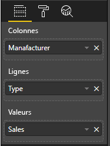

# <a name="add-interactivity-into-visual-by-power-bi-visuals-selections"></a>Ajoutez de l'interactivité à vos visuels grâce à des sélections de visuels Power BI

Power BI offre deux modes d'interaction entre les visuels : la sélection et le filtrage. L'exemple ci-dessous montre comment sélectionner n'importe quel élément d'un visuel et communiquer le nouvel état de sélection aux autres visuels du rapport.

L’objet `Selection` correspond à l’interface :

```typescript
export interface ISelectionId {
    equals(other: ISelectionId): boolean;
    includes(other: ISelectionId, ignoreHighlight?: boolean): boolean;
    getKey(): string;
    getSelector(): Selector;
    getSelectorsByColumn(): SelectorsByColumn;
    hasIdentity(): boolean;
}
```

## <a name="how-to-use-selectionmanager-to-select-data-points"></a>Utilisation de SelectionManager pour sélectionner des points de données

L’objet hôte visuel fournit la méthode pour créer une instance du gestionnaire de sélection. Le gestionnaire de sélection est responsable de la sélection, de l’effacement de la sélection, de l’affichage du menu contextuel, de la mémorisation des sélections en cours et de la vérification de l’état de la sélection. De plus, le gestionnaire de sélection propose des méthodes correspondantes pour ces actions.

### <a name="create-an-instance-of-the-selection-manager"></a>Créer une instance de gestionnaire de sélection

Pour utiliser le gestionnaire de sélection, vous devez en créer une instance. Les visuels créent généralement une instance du gestionnaire de sélection dans l’élément `constructor` de l’objet visuel.

```typescript
export class Visual implements IVisual {
    private target: HTMLElement;
    private host: IVisualHost;
    private selectionManager: ISelectionManager;
    // ...
    constructor(options: VisualConstructorOptions) {
        this.host = options.host;
        // ...
        this.selectionManager = this.host.createSelectionManager();
    }
    // ...
}
```

### <a name="create-an-instance-of-the-selection-builder"></a>Créer une instance de générateur de sélection

Lorsque l'instance du gestionnaire de sélection est créée, vous devez créer `selections` pour chaque point de données du visuel. L'objet hôte visuel fournit la méthode `createSelectionIdBuilder` afin de générer une sélection pour chaque point de données. Cette méthode retourne l’instance de l’objet avec l’interface `powerbi.visuals.ISelectionIdBuilder` :

```typescript
export interface ISelectionIdBuilder {
    withCategory(categoryColumn: DataViewCategoryColumn, index: number): this;
    withSeries(seriesColumn: DataViewValueColumns, valueColumn: DataViewValueColumn | DataViewValueColumnGroup): this;
    withMeasure(measureId: string): this;
    withMatrixNode(matrixNode: DataViewMatrixNode, levels: DataViewHierarchyLevel[]): this;
    withTable(table: DataViewTable, rowIndex: number): this;
    createSelectionId(): ISelectionId;
}
```

Cet objet propose des méthodes correspondantes afin de créer `selections` pour différents types de mappages de vues de données.

> [!NOTE]
> Les méthodes `withTable` et `withMatrixNode` ont été introduites dans l’API 2.5.0 des visuels Power BI.
> Si vous avez besoin d’utiliser des sélections pour des mappages de vues de données de tables ou de matrices, vous devez mettre à jour l’API avec la version 2.5.0 ou supérieure.

### <a name="create-selections-for-categorical-data-view-mapping"></a>Créer des sélections pour le mappage de vues de données catégoriques

Examinons comment les sélections sont représentées sur le mappage de vues de données catégoriques pour un exemple de jeu de données :

| Fabricant | Type | Value |
| - | - | - |
| Chrysler | Voiture nationale | 28883 |
| Chrysler | Camion national | 117131 |
| Chrysler | Véhicule d’importation | 0 |
| Chrysler | Camion d’importation | 6362 |
| Ford | Voiture nationale | 50032 |
| Ford | Camion national | 122446 |
| Ford | Véhicule d’importation | 0 |
| Ford | Camion d’importation | 0 |
| GM | Voiture nationale | 65426 |
| GM | Camion national | 138122 |
| GM | Véhicule d’importation | 197 |
| GM | Camion d’importation | 0 |
| Honda | Voiture nationale | 51450 |
| Honda | Camion national | 46115 |
| Honda | Véhicule d’importation | 2932 |
| Honda | Camion d’importation | 0 |
| Nissan | Voiture nationale | 51476 |
| Nissan | Camion national | 47343 |
| Nissan | Véhicule d’importation | 5485 |
| Nissan | Camion d’importation | 1430 |
| Toyota | Voiture nationale | 55643 |
| Toyota | Camion national | 61227 |
| Toyota | Véhicule d’importation | 20799 |
| Toyota | Camion d’importation | 23614 |

Et le visuel utilise le mappage de vues de données suivant :

```json
{
    "dataRoles": [
        {
            "displayName": "Columns",
            "name": "columns",
            "kind": "Grouping"
        },
        {
            "displayName": "Rows",
            "name": "rows",
            "kind": "Grouping"
        },
        {
            "displayName": "Values",
            "name": "values",
            "kind": "Measure"
        }
    ],
    "dataViewMappings": [
        {
            "categorical": {
                "categories": {
                    "for": {
                        "in": "columns"
                    }
                },
                "values": {
                    "group": {
                        "by": "rows",
                        "select": [
                            {
                                "for": {
                                    "in": "values"
                                }
                            }
                        ]
                    }
                }
            }
        }
    ]
}
```

Dans l'exemple, `Manufacturer` est `columns` et `Type` est `rows`. Certaines séries sont créées par des groupes de valeurs par `rows` (`Type`).

Et le visuel devrait être également capable de découper les données par `Manufacturer` et `Type`.

Par exemple, lorsque l'utilisateur sélectionne `Chrysler` par `Manufacturer`, les autres visuels doivent afficher les données suivantes :

| Fabricant | Type | Value |
| - | - | - |
| **Chrysler** | Voiture nationale | 28883 |
| **Chrysler** | Camion national | 117131 |
| **Chrysler** | Véhicule d’importation | 0 |
| **Chrysler** | Camion d’importation | 6362 |

Lorsque l'utilisateur sélectionne `Import Car` par `Type` (sélectionne les données par série), les autres visuels doivent afficher les données suivantes :

| Fabricant | Type | Value |
| - | - | - |
| Chrysler | **Véhicule d’importation** | 0 |
| Ford | **Véhicule d’importation** | 0 |
| GM | **Véhicule d’importation** | 197 |
| Honda | **Véhicule d’importation** | 2932 |
| Nissan | **Véhicule d’importation** | 5485 |
| Toyota | **Véhicule d’importation** | 20799 |


Besoin de remplir les paniers de données visuelles.



Il existe `Manufacturer` comme catégorie (colonnes), `Type` comme séries (lignes) et `Value` comme `Values` pour les séries.

> [!NOTE]
> Les `Values` sont nécessaires pour les séries car, en fonction du mappage de vues de données, le visuel s’attend à un groupement des `Values` par données `Rows`.

#### <a name="create-selections-for-categories"></a>Créer des sélections pour des catégories

```typescript
// categories
const categories = dataView.categorical.categories;

// create label for 'Manufacturer' column
const p = document.createElement("p") as HTMLParagraphElement;
p.innerText = categories[0].source.displayName.toString();
this.target.appendChild(p);

// get count of category elements
const categoriesCount = categories[0].values.length;

// iterate all categories to generate selection and create button elements to use selections
for (let categoryIndex = 0; categoryIndex < categoriesCount; categoryIndex++) {
    const categoryValue: powerbi.PrimitiveValue = categories[0].values[categoryIndex];

    const categorySelectionId = this.host.createSelectionIdBuilder()
        .withCategory(categories[0], categoryIndex) // we have only one category (only one `Manufacturer` column)
        .createSelectionId();
    this.dataPoints.push({
        value: categoryValue,
        selection: categorySelectionId
    });
    console.log(categorySelectionId);

    // create button element to apply selection on click
    const button = document.createElement("button") as HTMLButtonElement;
    button.value = categoryValue.toString();
    button.innerText = categoryValue.toString();
    button.addEventListener("click", () => {
        // handle click event to apply correspond selection
        this.selectionManager.select(categorySelectionId);
    });
    this.target.appendChild(button);
}
```

Dans l’exemple de code, vous pouvez constater que nous itérons toutes les catégories. De plus, dans chaque itération, nous appelons `createSelectionIdBuilder` afin de créer la sélection suivante pour chaque catégorie en appelant la méthode `withCategory` du générateur de sélection. La méthode `createSelectionId` est utilisée comme méthode finale pour retourner l’objet `selection` généré.

Dans la méthode `withCategory`, nous passons la colonne de `category`, `Manufacturer` dans cet exemple, et l’index d’un élément de catégorie.

#### <a name="create-selections-for-series"></a>Créer des sélections pour les séries

```typescript
// get groupped values for series
const series: powerbi.DataViewValueColumnGroup[] = dataView.categorical.values.grouped();

// create label for 'Type' column
const p2 = document.createElement("p") as HTMLParagraphElement;
p2.innerText = dataView.categorical.values.source.displayName;
this.target.appendChild(p2);

// iterate all series to generate selection and create button elements to use selections
series.forEach( (ser: powerbi.DataViewValueColumnGroup) => {
    // create selection id for series
    const seriesSelectionId = this.host.createSelectionIdBuilder()
        .withSeries(dataView.categorical.values, ser)
        .createSelectionId();

    this.dataPoints.push({
        value: ser.name,
        selection: seriesSelectionId
    });

    // create button element to apply selection on click
    const button = document.createElement("button") as HTMLButtonElement;
    button.value =ser.name.toString();
    button.innerText = ser.name.toString();
    button.addEventListener("click", () => {
        // handle click event to apply correspond selection
        this.selectionManager.select(seriesSelectionId);
    });
    this.target.appendChild(button);
});
```

### <a name="create-selections-for-table-data-view-mapping"></a>Créer des sélections pour le mappage de vues de données de tables

Exemple de mappage de vues de données de tables

```json
{
    "dataRoles": [
        {
            "displayName": "Values",
            "name": "values",
            "kind": "GroupingOrMeasure"
        }
    ],
    "dataViewMappings": [
        {
            "table": {
                "rows": {
                    "for": {
                        "in": "values"
                    }
                }
            }
        }
    ]
}
```

Afin de créer une sélection pour chaque ligne d’un mappage de vues de données de tables, vous devez appeler la méthode `withTable` du générateur de sélection.

```typescript
public update(options: VisualUpdateOptions) {
    const dataView = options.dataViews[0];
    dataView.table.rows.forEach((row: DataViewTableRow, rowIndex: number) => {
        this.target.appendChild(rowDiv);
        const selection: ISelectionId = this.host.createSelectionIdBuilder()
            .withTable(dataView.table, rowIndex)
            .createSelectionId();
    }
}
```

Le code visuel itère les lignes de la table, et chaque ligne appelle la méthode de table `withTable`. Les paramètres de la méthode `withTable` représentent l’objet et l’index `table` de la ligne de la table.

### <a name="create-selections-for-matrix-data-view-mapping"></a>Créer des sélections pour le mappage de vues de données de matrices

```typescript
public update(options: VisualUpdateOptions) {
    const host = this.host;
    const rowLevels: powerbi.DataViewHierarchyLevel[] = dataView.matrix.rows.levels;
    const columnLevels: powerbi.DataViewHierarchyLevel[] = dataView.matrix.rows.levels;

    // iterate rows hierarchy
    nodeWalker(dataView.matrix.rows.root, rowLevels);
    // iterate columns hierarchy
    nodeWalker(dataView.matrix.columns.root, columnLevels);

    function nodeWalker(node: powerbi.DataViewMatrixNode, levels: powerbi.DataViewHierarchyLevel[]) {
        const nodeSelection = host.createSelectionIdBuilder().withMatrixNode(node, levels);

        if (node.children && node.children.length) {
            node.children.forEach(child => {
                nodeWalker(child, levels);
            });
        }
    }
}
```

Dans l’exemple, `nodeWalker` appelle de manière récursive chaque nœud et les nœuds enfants.

`nodeWalker` crée un objet `nodeSelection` à chaque appel. Et chaque `nodeSelection` représente une `selection` de nœuds correspondants.

## <a name="select-datapoints-to-slice-other-visuals"></a>Sélectionner des points de données pour découper d'autres visuels

Dans les exemples de codes de sélections pour un mappage de vues de données catégoriques, vous avez noté que nous avons créé un gestionnaire de clics pour les éléments de boutons. Le gestionnaire appelle la méthode `select` du gestionnaire de sélection et passe l’objet de sélection.

```typescript
button.addEventListener("click", () => {
    // handle click event to apply correspond selection
    this.selectionManager.select(categorySelectionId);
});
```

L'interface de la méthode `select` est

```typescript
interface ISelectionManager {
    // ...
    select(selectionId: ISelectionId | ISelectionId[], multiSelect?: boolean): IPromise<ISelectionId[]>;
    // ...
}
```

Vous constatez que `select` peut accepter un tableau de sélections. Cela signifie que votre visuel peut sélectionner plusieurs points de données. Le second paramètre `multiSelect` est chargé de la sélection multiple. Si la valeur est true, Power BI n’efface pas l’état de sélection précédent et applique la sélection actuelle. Sinon, la sélection précédente sera réinitialisée.

Scénario classique d’utilisation de `multiSelect` gérant l’état du bouton Ctrl sur un événement Click.

```typescript
button.addEventListener("click", (mouseEvent) => {
    const multiSelect = (mouseEvent as MouseEvent).ctrlKey;
    this.selectionManager.select(seriesSelectionId, multiSelect);
});
```

## <a name="next-steps"></a>Étapes suivantes

* [Découvrez comment utiliser des sélections pour lier les propriétés visuelles à des points de données](objects-properties.md#objects-selector)

* [Découvrez comment gérer les sélections lors du changement de signets](bookmarks-support.md#visuals-with-selection)

* [Découvrez comment ajouter un menu contextuel pour les points de données de visuels](context-menu.md)

* [Découvrez comment utiliser InteractivityUtils pour ajouter des sélections à des visuels Power BI](utils-interactivity-selections.md)
