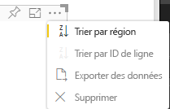

# <a name="sorting-options"></a>Options de tri

`Sorting` spécifie le comportement de tri par défaut du visuel.
La fonctionnalité requiert l’un des paramètres décrits ci-dessous :

## <a name="default-sorting"></a>Tri par défaut

L’option `default` est la forme la plus simple. Elle permet de trier les données présentées dans la section « DataMappings ».
Cette option permet à l’utilisateur de trier la section « DataMappings », et de spécifier le sens du tri.

```json
    "sorting": {
        "default": {   }
    }
```



## <a name="implicit-sorting"></a>Tri implicite

`implicit` est un tri avec un paramètre de tableau, `clauses`, qui décrit le tri pour chaque rôle de données.
`implicit` signifie que l’utilisateur du visuel ne peut pas modifier l’ordre de tri.
Power BI n’affiche pas les options de tri dans le menu du visuel. Toutefois, Power BI trie les données en fonction des paramètres spécifiés.

Les paramètres `clauses` peuvent contenir plusieurs objets avec deux paramètres :

- `role` : détermine un `DataMapping` pour le tri.

- `direction` : détermine le sens du tri (1 = croissant, 2 = décroissant).

```json
    "sorting": {
        "implicit": {
            "clauses": [
                {
                    "role": "category",
                    "direction": 1
                },
                {
                    "role": "measure",
                    "direction": 2
                }
            ]
        }
    }
```

## <a name="custom-sorting"></a>Tri personnalisé

`custom` signifie que le tri est géré par le développeur dans le code du visuel.
