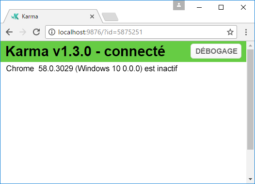
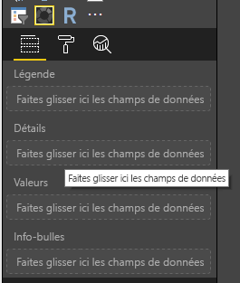
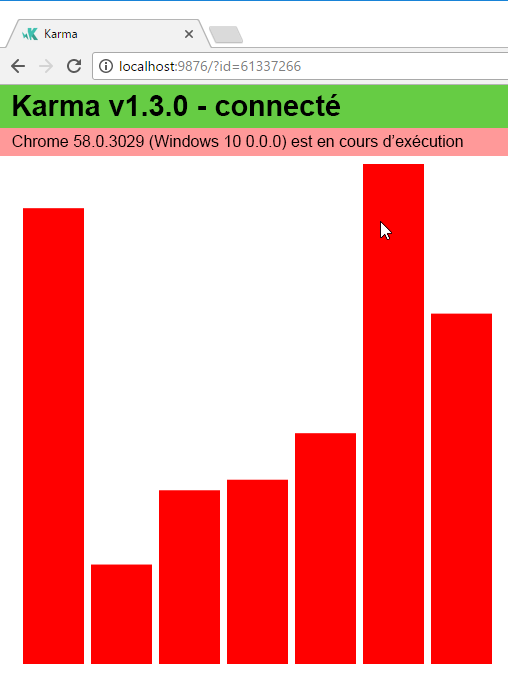
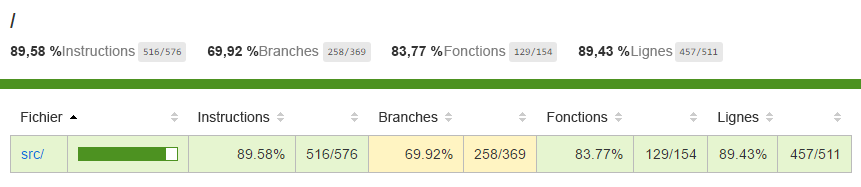
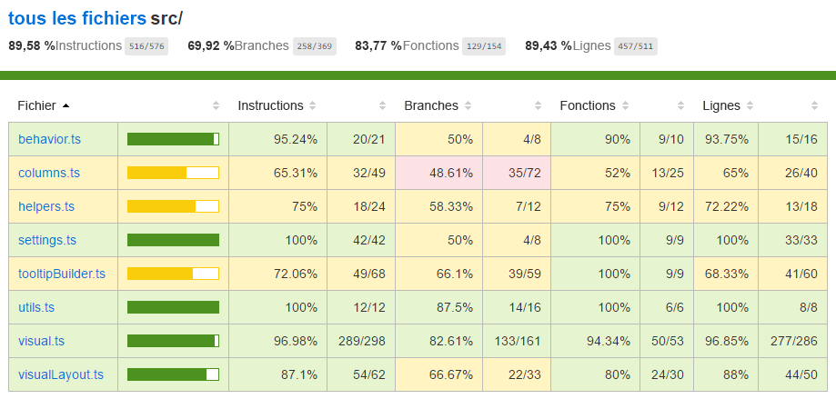

# <a name="tutorial-add-unit-tests-for-power-bi-visual-projects"></a>Tutoriel : Ajouter des tests unitaires pour des projets de visuels Power BI

Cet article décrit les principes fondamentaux de l’écriture de tests unitaires pour vos visuels Power BI, notamment comment :

* Configurer le framework d’exécuteur de test Karma JavaScript, Jasmine.
* Utiliser le package powerbi-visuals-utils-testutils.
* Utiliser des simulacres et des substituts pour aider à simplifier les tests unitaires des visuels Power BI.

## <a name="prerequisites"></a>Conditions préalables

* Un projet de visuels Power BI installé
* Un environnement Node.js configuré

## <a name="install-and-configure-the-karma-javascript-test-runner-and-jasmine"></a>Installer et configurer l’exécuteur de test Karma JavaScript et Jasmine

Ajoutez les bibliothèques requises au fichier *package.json* dans la section `devDependencies` :

```json
"@babel/polyfill": "^7.2.5",
"@types/d3": "5.5.0",
"@types/jasmine": "2.5.37",
"@types/jasmine-jquery": "1.5.28",
"@types/jquery": "2.0.41",
"@types/karma": "3.0.0",
"@types/lodash-es": "4.17.1",
"coveralls": "3.0.2",
"istanbul-instrumenter-loader": "^3.0.1",
"jasmine": "2.5.2",
"jasmine-core": "2.5.2",
"jasmine-jquery": "2.1.1",
"jquery": "3.1.1",
"karma": "3.1.1",
"karma-chrome-launcher": "2.2.0",
"karma-coverage": "1.1.2",
"karma-coverage-istanbul-reporter": "^2.0.4",
"karma-jasmine": "2.0.1",
"karma-junit-reporter": "^1.2.0",
"karma-sourcemap-loader": "^0.3.7",
"karma-typescript": "^3.0.13",
"karma-typescript-preprocessor": "0.4.0",
"karma-webpack": "3.0.5",
"puppeteer": "1.17.0",
"style-loader": "0.23.1",
"ts-loader": "5.3.0",
"ts-node": "7.0.1",
"tslint": "^5.12.0",
"webpack": "4.26.0"
```

Pour en savoir plus sur le package, consultez la description à l’adresse.

Enregistrez le fichier *package.json* et, à l’emplacement `package.json`, exécutez la commande suivante :

```cmd
npm install
```

Le gestionnaire de package installe tous les nouveaux packages qui sont ajoutés à *package.json*.

Pour exécuter des tests unitaires, configurez l’exécuteur de test et `webpack` config.

Le code suivant est un exemple de fichier *test.webpack.config.js* :

```typescript
const path = require('path');
const webpack = require("webpack");

module.exports = {
    devtool: 'source-map',
    mode: 'development',
    optimization : {
        concatenateModules: false,
        minimize: false
    },
    module: {
        rules: [
            {
                test: /\.tsx?$/,
                use: 'ts-loader',
                exclude: /node_modules/
            },
            {
                test: /\.json$/,
                loader: 'json-loader'
            },
            {
                test: /\.tsx?$/i,
                enforce: 'post',
                include: /(src)/,
                exclude: /(node_modules|resources\/js\/vendor)/,
                loader: 'istanbul-instrumenter-loader',
                options: { esModules: true }
            },
            {
                test: /\.less$/,
                use: [
                    {
                        loader: 'style-loader'
                    },
                    {
                        loader: 'css-loader'
                    },
                    {
                        loader: 'less-loader',
                        options: {
                            paths: [path.resolve(__dirname, 'node_modules')]
                        }
                    }
                ]
            }
        ]
    },
    externals: {
        "powerbi-visuals-api": '{}'
    },
    resolve: {
        extensions: ['.tsx', '.ts', '.js', '.css']
    },
    output: {
        path: path.resolve(__dirname, ".tmp/test")
    },
    plugins: [
        new webpack.ProvidePlugin({
            'powerbi-visuals-api': null
        })
    ]
};
```

Le code suivant est un exemple de fichier *karma.conf.ts* :

```typescript
"use strict";

const webpackConfig = require("./test.webpack.config.js");
const tsconfig = require("./test.tsconfig.json");
const path = require("path");

const testRecursivePath = "test/visualTest.ts";
const srcOriginalRecursivePath = "src/**/*.ts";
const coverageFolder = "coverage";

process.env.CHROME_BIN = require("puppeteer").executablePath();

import { Config, ConfigOptions } from "karma";

module.exports = (config: Config) => {
    config.set(<ConfigOptions>{
        mode: "development",
        browserNoActivityTimeout: 100000,
        browsers: ["ChromeHeadless"], // or Chrome to use locally installed Chrome browser
        colors: true,
        frameworks: ["jasmine"],
        reporters: [
            "progress",
            "junit",
            "coverage-istanbul"
        ],
        junitReporter: {
            outputDir: path.join(__dirname, coverageFolder),
            outputFile: "TESTS-report.xml",
            useBrowserName: false
        },
        singleRun: true,
        plugins: [
            "karma-coverage",
            "karma-typescript",
            "karma-webpack",
            "karma-jasmine",
            "karma-sourcemap-loader",
            "karma-chrome-launcher",
            "karma-junit-reporter",
            "karma-coverage-istanbul-reporter"
        ],
        files: [
            "node_modules/jquery/dist/jquery.min.js",
            "node_modules/jasmine-jquery/lib/jasmine-jquery.js",
            {
                pattern: './capabilities.json',
                watched: false,
                served: true,
                included: false
            },
            testRecursivePath,
            {
                pattern: srcOriginalRecursivePath,
                included: false,
                served: true
            }
        ],
        preprocessors: {
            [testRecursivePath]: ["webpack", "coverage"]
        },
        typescriptPreprocessor: {
            options: tsconfig.compilerOptions
        },
        coverageIstanbulReporter: {
            reports: ["html", "lcovonly", "text-summary", "cobertura"],
            dir: path.join(__dirname, coverageFolder),
            'report-config': {
                html: {
                    subdir: 'html-report'
                }
            },
            combineBrowserReports: true,
            fixWebpackSourcePaths: true,
            verbose: false
        },
        coverageReporter: {
            dir: path.join(__dirname, coverageFolder),
            reporters: [
                // reporters not supporting the `file` property
                { type: 'html', subdir: 'html-report' },
                { type: 'lcov', subdir: 'lcov' },
                // reporters supporting the `file` property, use `subdir` to directly
                // output them in the `dir` directory
                { type: 'cobertura', subdir: '.', file: 'cobertura-coverage.xml' },
                { type: 'lcovonly', subdir: '.', file: 'report-lcovonly.txt' },
                { type: 'text-summary', subdir: '.', file: 'text-summary.txt' },
            ]
        },
        mime: {
            "text/x-typescript": ["ts", "tsx"]
        },
        webpack: webpackConfig,
        webpackMiddleware: {
            stats: "errors-only"
        }
    });
};
```

Si nécessaire, vous pouvez modifier cette configuration.

Le code dans *karma.conf.js* contient la variable suivante :

* `recursivePathToTests` : localise le code de test

* `srcRecursivePath` : localise le code JavaScript de sortie après la compilation

* `srcCssRecursivePath` : localise le CSS de sortie après la compilation d’un fichier avec des styles

* `srcOriginalRecursivePath` : localise le code source de votre visuel

* `coverageFolder` : détermine l’emplacement de création du rapport de couverture

Le fichier de configuration comprend les propriétés suivantes :

* `singleRun: true` : les tests sont exécutés sur un système d’intégration continue (CI), ou peuvent être exécutés une seule fois. Vous pouvez remplacer la valeur du paramètre par *false* pour déboguer vos tests. Karma maintient le navigateur en cours d’exécution afin que vous puissiez utiliser la console pour le débogage.

* `files: [...]` : dans ce tableau, vous pouvez spécifier les fichiers à charger dans le navigateur. En règle générale, il existe des fichiers sources, des cas de test, des bibliothèques (Jasmine, utilitaires de test). Vous pouvez ajouter des fichiers supplémentaires à la liste, si nécessaire.

* `preprocessors` : dans cette section, vous configurez les actions qui s’exécutent avant l’exécution des tests unitaires. Elles précompilent le code TypeScript vers JavaScript, préparent les fichiers de mappage sources et génèrent le rapport de couverture du code. Vous pouvez désactiver `coverage` quand vous déboguez vos tests. La couverture génère du code supplémentaire pour vérifier le code pour la couverture de test, ce qui complique le débogage des tests.

Pour obtenir une description de toutes les configurations Karma, accédez à la page sur le [fichier de configuration Karma](https://karma-runner.github.io/1.0/config/configuration-file.html).

Par souci pratique, vous pouvez ajouter une commande de test dans `scripts` :

```json
{
    "scripts": {
        "pbiviz": "pbiviz",
        "start": "pbiviz start",
        "typings":"node node_modules/typings/dist/bin.js i",
        "lint": "tslint -r \"node_modules/tslint-microsoft-contrib\"  \"+(src|test)/**/*.ts\"",
        "pretest": "pbiviz package --resources --no-minify --no-pbiviz --no-plugin",
        "test": "karma start"
    }
    ...
}
```

Vous êtes maintenant prêt à commencer l’écriture de vos tests unitaires.

## <a name="check-the-dom-element-of-the-visual"></a>Vérifier l’élément DOM du visuel

Pour tester le visuel, commencez par créer une instance de visuel.

### <a name="create-a-visual-instance-builder"></a>Créer un générateur d’instances de visuels

Ajoutez un fichier *visualBuilder.ts* au dossier *test* à l’aide du code suivant :

```typescript
import {
    VisualBuilderBase
} from "powerbi-visuals-utils-testutils";

import {
    BarChart as VisualClass
} from "../src/visual";

import  powerbi from "powerbi-visuals-api";
import VisualConstructorOptions = powerbi.extensibility.visual.VisualConstructorOptions;

export class BarChartBuilder extends VisualBuilderBase<VisualClass> {
    constructor(width: number, height: number) {
        super(width, height);
    }

    protected build(options: VisualConstructorOptions) {
        return new VisualClass(options);
    }

    public get mainElement() {
        return this.element.children("svg.barChart");
    }
}
```

Il existe une méthode `build` pour créer une instance de votre visuel. `mainElement` est une méthode GET, qui retourne une instance de l’élément DOM (Document Object Model) « racine » dans votre visuel. L’accesseur Get est facultatif, mais facilite l’écriture des tests unitaires.

Vous disposez maintenant d’une build d’une instance de votre visuel. Écrivons le cas de test. Le cas de test vérifie les éléments SVG qui sont créés lors de l’affichage de votre visuel.

### <a name="create-a-typescript-file-to-write-test-cases"></a>Créer un fichier TypeScript pour écrire des cas de test

Ajoutez un fichier *visualTest.ts* pour les cas de test à l’aide du code suivant :

```typescript
import powerbi from "powerbi-visuals-api";

import { BarChartBuilder } from "./VisualBuilder";

import {
    BarChart as VisualClass
} from "../src/visual";

import VisualBuilder = powerbi.extensibility.visual.test.BarChartBuilder;

describe("BarChart", () => {
    let visualBuilder: VisualBuilder;
    let dataView: DataView;

    beforeEach(() => {
        visualBuilder = new VisualBuilder(500, 500);
    });

    it("root DOM element is created", () => {
        expect(visualBuilder.mainElement).toBeInDOM();
    });
});
```

Plusieurs méthodes sont appelées :

* [`describe`](https://jasmine.github.io/api/2.6/global.html#describe) : décrit un cas de test. Dans le contexte du framework Jasmine, cela décrit souvent une suite ou un groupe de spécifications.

* `beforeEach` : est appelée avant chaque appel de la méthode `it`, qui est définie dans la méthode [`describe`](https://jasmine.github.io/api/2.6/global.html#beforeEach).

* [`it`](https://jasmine.github.io/api/2.6/global.html#it) : définit une spécification unique. La méthode `it` doit contenir un ou plusieurs `expectations`.

* [`expect`](https://jasmine.github.io/api/2.6/global.html#expect) : crée une attente pour une spécification. Une spécification réussit si toutes les attentes réussissent sans aucun échec.

* `toBeInDOM` : l’une des méthodes *matchers*. Pour plus d’informations sur les matchers, consultez [Jasmine Namespace: matchers](https://jasmine.github.io/api/2.6/matchers.html).

Pour plus d’informations sur Jasmine, consultez la page de [documentation du framework Jasmine](https://jasmine.github.io/).

### <a name="launch-unit-tests"></a>Lancer des tests unitaires

Ce test vérifie que l’élément SVG racine des visuels est créé. Pour exécuter le test unitaire, entrez la commande suivante dans l’outil en ligne de commande :

```cmd
npm run test
```

`karma.js` exécute le cas de test dans le navigateur Chrome.



> [!NOTE]
> Vous devez installer Google Chrome localement.

Dans la fenêtre de ligne de commande, vous obtenez la sortie suivante :

```cmd
> karma start

23 05 2017 12:24:26.842:WARN [watcher]: Pattern "E:/WORKSPACE/PowerBI/PowerBI-visuals-sampleBarChart/data/*.csv" does not match any file.
23 05 2017 12:24:30.836:WARN [karma]: No captured browser, open http://localhost:9876/
23 05 2017 12:24:30.849:INFO [karma]: Karma v1.3.0 server started at http://localhost:9876/
23 05 2017 12:24:30.850:INFO [launcher]: Launching browser Chrome with unlimited concurrency
23 05 2017 12:24:31.059:INFO [launcher]: Starting browser Chrome
23 05 2017 12:24:33.160:INFO [Chrome 58.0.3029 (Windows 10 0.0.0)]: Connected on socket /#2meR6hjXFmsE_fjiAAAA with id 5875251
Chrome 58.0.3029 (Windows 10 0.0.0): Executed 1 of 1 SUCCESS (0.194 secs / 0.011 secs)

=============================== Coverage summary ===============================
Statements   : 27.43% ( 65/237 )
Branches     : 19.84% ( 25/126 )
Functions    : 43.86% ( 25/57 )
Lines        : 20.85% ( 44/211 )
================================================================================
```

### <a name="how-to-add-static-data-for-unit-tests"></a>Comment ajouter des données statiques pour les tests unitaires

Créez le fichier *visualData.ts* dans le dossier *test* à l’aide du code suivant :

```typescript
import powerbi from "powerbi-visuals-api";
import DataView = powerbi.DataView;

import {
    testDataViewBuilder,
    getRandomNumbers
} from "powerbi-visuals-utils-testutils";

export class SampleBarChartDataBuilder extends TestDataViewBuilder {
    public static CategoryColumn: string = "category";
    public static MeasureColumn: string = "measure";

    public constructor() {
        super();
        ...
    }

    public getDataView(columnNames?: string[]): DataView {
        let dateView: any = this.createCategoricalDataViewBuilder([
            ...
        ],
        [
            ...
        ], columnNames).build();

        // there's client side computed maxValue
        let maxLocal = 0;
        this.valuesMeasure.forEach((item) => {
                if (item > maxLocal) {
                    maxLocal = item;
                }
        });
        (<any>dataView).categorical.values[0].maxLocal = maxLocal;
    }
}
```

La classe `SampleBarChartDataBuilder` étend `TestDataViewBuilder` et implémente la méthode abstraite `getDataView`.

Quand vous placez des données dans des compartiments de champs de données, Power BI produit un objet `dataview` catégorique basé sur vos données.



Dans les tests unitaires, vous n’avez pas de fonctions principales Power BI pour reproduire les données. Toutefois, vous devez mapper vos données statiques au `dataview` catégorique. La classe `TestDataViewBuilder` peut vous aider à les mapper.

Pour plus d’informations sur le mappage des vues de données, consultez [DataViewMappings](https://github.com/Microsoft/PowerBI-visuals/blob/master/Capabilities/DataViewMappings.md).

Dans la méthode `getDataView`, vous appelez la méthode `createCategoricalDataViewBuilder` avec vos données.

Dans le fichier [capabilities.json](https://github.com/Microsoft/PowerBI-visuals-sampleBarChart/blob/master/capabilities.json#L2) du visuel `sampleBarChart`, nous avons des objets dataRoles et dataViewMapping :

```json
"dataRoles": [
    {
        "displayName": "Category Data",
        "name": "category",
        "kind": "Grouping"
    },
    {
        "displayName": "Measure Data",
        "name": "measure",
        "kind": "Measure"
    }
],
"dataViewMappings": [
    {
        "conditions": [
            {
                "category": {
                    "max": 1
                },
                "measure": {
                    "max": 1
                }
            }
        ],
        "categorical": {
            "categories": {
                "for": {
                    "in": "category"
                }
            },
            "values": {
                "select": [
                    {
                        "bind": {
                            "to": "measure"
                        }
                    }
                ]
            }
        }
    }
],
```

Pour générer le même mappage, vous devez définir les paramètres suivants sur la méthode `createCategoricalDataViewBuilder` :

```typescript
([
    {
        source: {
            displayName: "Category",
            queryName: SampleBarChartData.ColumnCategory,
            type: ValueType.fromDescriptor({ text: true }),
            roles: {
                Category: true
            },
        },
        values: this.valuesCategory
    }
],
[
    {
        source: {
            displayName: "Measure",
            isMeasure: true,
            queryName: SampleBarChartData.MeasureColumn,
            type: ValueType.fromDescriptor({ numeric: true }),
            roles: {
                Measure: true
            },
        },
        values: this.valuesMeasure
    },
], columnNames)
```

Où `this.valuesCategory` est un tableau de catégories :

```ts
public valuesCategory: string[] = ["Monday", "Tuesday", "Wednesday", "Thursday", "Friday", "Saturday", "Sunday"];
```

Et `this.valuesMeasure` est un tableau de mesures pour chaque catégorie :

```ts
public valuesMeasure: number[] = [742731.43, 162066.43, 283085.78, 300263.49, 376074.57, 814724.34, 570921.34];
```

À présent, vous pouvez utiliser la classe `SampleBarChartDataBuilder` dans votre test unitaire.

La classe `ValueType` est définie dans le package powerbi-visuals-utils-testutils. Et la méthode `createCategoricalDataViewBuilder` nécessite la bibliothèque `lodash`.

Ajoutez ces packages aux dépendances.

Dans `package.json` à la section `devDependencies`

```json
"lodash-es": "4.17.1",
"powerbi-visuals-utils-testutils": "2.2.0"
```

Appeler

```cmd
npm install
```

pour installer la bibliothèque `lodash-es`.

À présent, vous pouvez réexécuter le test unitaire. Vous devez obtenir la sortie suivante :

```cmd
> karma start

23 05 2017 16:19:54.318:WARN [watcher]: Pattern "E:/WORKSPACE/PowerBI/PowerBI-visuals-sampleBarChart/data/*.csv" does not match any file.
23 05 2017 16:19:58.333:WARN [karma]: No captured browser, open http://localhost:9876/
23 05 2017 16:19:58.346:INFO [karma]: Karma v1.3.0 server started at http://localhost:9876/
23 05 2017 16:19:58.346:INFO [launcher]: Launching browser Chrome with unlimited concurrency
23 05 2017 16:19:58.394:INFO [launcher]: Starting browser Chrome
23 05 2017 16:19:59.873:INFO [Chrome 58.0.3029 (Windows 10 0.0.0)]: Connected on socket /#NcNTAGH9hWfGMCuEAAAA with id 3551106
Chrome 58.0.3029 (Windows 10 0.0.0): Executed 1 of 1 SUCCESS (1.266 secs / 1.052 secs)

=============================== Coverage summary ===============================
Statements   : 56.72% ( 135/238 )
Branches     : 32.54% ( 41/126 )
Functions    : 66.67% ( 38/57 )
Lines        : 52.83% ( 112/212 )
================================================================================
```

Votre visuel s’ouvre dans le navigateur Chrome, comme indiqué ci-dessous :



Le résumé indique que la couverture a augmenté. Pour en savoir plus sur la couverture du code actuelle, ouvrez `coverage\index.html`.



Ou examinez l’étendue du dossier `src` :



Dans l’étendue du fichier, vous pouvez voir le code source. Les utilitaires `Coverage` mettent en surbrillance la ligne en rouge si du code n’a pas été exécuté pendant les tests unitaires.


> [!IMPORTANT]
> La couverture du code ne signifie pas que vous avez une bonne couverture des fonctionnalités du visuel. Un simple test unitaire fourni plus de 96 pour cent de couverture dans `src\visual.ts`.

## <a name="next-steps"></a>Étapes suivantes

Quand votre visuel est prêt, vous pouvez le soumettre pour publication. Pour plus d’informations, consultez [Publier des visuels Power BI dans AppSource](../office-store.md).
