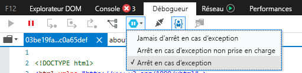
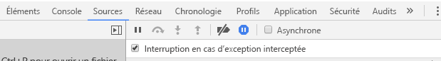

# <a name="how-to-debug-power-bi-visuals"></a>Comment déboguer des visuels Power BI

Cette page présente quelques conseils pour le débogage lors de la création de votre visuel. Ceci inclut des étapes de base et présente les différences entre le débogage des applications frontales standard et des visuels Power BI.
Après avoir lu l’article, vous pourrez déboguer des visuels Power BI à l’aide de points d’arrêt, enregistrer des exceptions et intercepter des exceptions dans Chrome et dans Edge.

## <a name="using-breakpoints"></a>Utilisation des points d'arrêt

Étant donné que le code JavaScript du visuel est entièrement rechargé chaque fois que le visuel est mis à jour, tous les points d’arrêt que vous ajoutez sont perdus lorsque le visuel de débogage est actualisé. Pour contourner ce problème, utilisez les instructions `debugger` dans votre code. Il est recommandé de désactiver la recharge automatique en utilisant `debugger` dans votre code.

```typescript
public update(options: VisualUpdateOptions) {
    console.log('Visual update', options);
    debugger;
    this.target.innerHTML = `<p>Update count: <em>${(this.updateCount</em></p>`;
}
```


## <a name="showing-exceptions"></a>Affichage d’exceptions

Lorsque vous travaillez sur un visuel, vous remarquerez que toutes les erreurs sont « consommées » par le service Power BI. Cette fonctionnalité intentionnelle de Power BI est destinée à empêcher les visuels ayant un mauvais comportement de rendre l’ensemble de l’application instable.

Pour contourner le problème, ajouter du code pour intercepter et enregistrer vos exceptions, ou définissez votre débogueur de telle manière qu’il arrête les exceptions interceptées.


## <a name="log-exceptions"></a>Enregistrer des exceptions

Pour enregistrer des exceptions dans votre visuel Power BI, ajoutez le code suivant à votre visuel pour définir un élément décoratif de journalisation des exceptions.

```typescript
export function logExceptions(): MethodDecorator {
    return function (target: Object, propertyKey: string, descriptor: TypedPropertyDescriptor<any>): TypedPropertyDescriptor<any> {
        return {
            value: function () {
                try {
                    return descriptor.value.apply(this, arguments);
                } catch (e) {
                    console.error(e);
                    throw e;
                }
            }
        }
    }
}
```
Vous pourrez alors utiliser cet élément décoratif sur n’importe quelle fonction pour consulter la journalisation des erreurs.

```typescript
@logExceptions()
public update(options: VisualUpdateOptions) {
```

## <a name="break-on-exceptions"></a>Arrêt en cas d’exceptions

Vous pouvez également configurer le navigateur pour qu’il s’arrête sur les exceptions interceptées. Ceci arrêtera l’exécution du code à chaque fois qu’une erreur surviendra et vous permettra de déboguer de là où vous vous trouverez.

### <a name="edge"></a>Edge

1. Ouvrez l’outil de développement (F12).
2. Affichez l’onglet **Débogueur**.
3. Cliquez sur l’icône **Arrêter en cas d’exception** (hexagone avec un symbole de pause).
4. Sélectionnez **Arrêter sur toutes les exceptions**.



## <a name="chrome"></a>Chrome

1. Ouvrez l’outil de développement (F12).
2. Accédez à l’onglet **Sources**.
3. Cliquez sur l’icône **interrompre en cas d’exception** (symbole Stop avec un symbole de pause).
4. Activez la case à cocher **Suspendre les exceptions interceptées**.



## <a name="next-steps"></a>Étapes suivantes
* [Résoudre les problèmes de visuels Power BI](power-bi-custom-visuals-troubleshoot.md)
* Pour plus d’informations et des réponses à vos questions, consultez [Forum aux questions sur les visuels Power BI](power-bi-custom-visuals-faq.md#organizational-power-bi-visuals)
