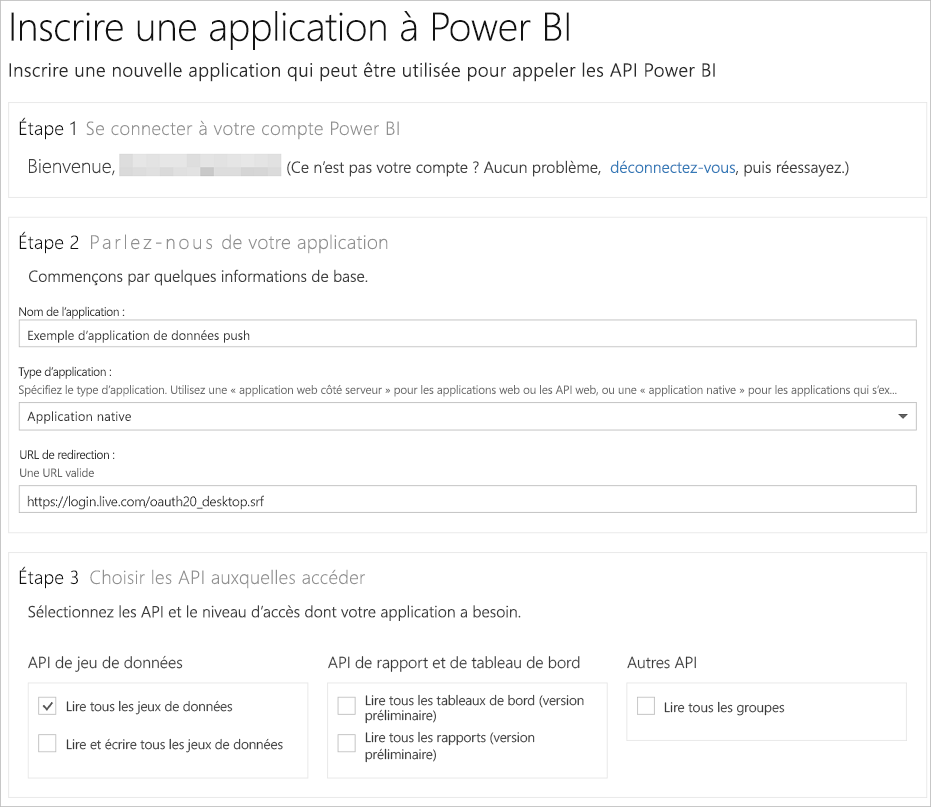

# Étape 1 : Inscrire une application auprès d’Azure AD
Cet article fait partie d’une procédure pas à pas pour [transmettre des données à un jeu de données](walkthrough-push-data.md).

La première étape pour transmettre des données à un jeu de données Power BI consiste à inscrire votre application dans Azure AD. Vous devez commencer par cette inscription pour obtenir un **ID client** qui identifie votre application dans Azure AD. Sans **ID client**, Azure AD ne peut pas authentifier votre application.

> **REMARQUE** : avant d’inscrire une application pour Power BI, vous devez vous [Inscrire à Power BI](create-an-azure-active-directory-tenant.md).
> 
> 

Voici la procédure à suivre pour inscrire une application dans Azure AD.

## Inscrire une application dans Azure AD
1. Accédez à dev.powerbi.com/apps.
2. Cliquez sur **Connectez-vous avec votre compte existant**, puis connectez-vous à votre compte Power BI.
3. Renseignez le **Nom de l’application**. Par exemple, entrez « Exemple d’application de transmission de données ».
4. Pour **Type d’application**, choisissez **Application native**.
5. Entrez une **URL de redirection**, telle que **https://login.live.com/oauth20_desktop.srf**. Pour une **application cliente native**, un URI de redirection fournit à **Azure AD** des détails supplémentaires sur l’application qu’il doit authentifier. L’URI standard pour une application cliente est https://login.live.com/oauth20_desktop.srf.
6. Pour **Choisissez les API auxquelles accéder**, choisissez **Lire et écrire tous les jeux de données**. Pour toutes les autorisations d’application Power BI, consultez [Autorisations Power BI](power-bi-permissions.md).
7. Cliquez sur **Inscrire l’application**, puis enregistrez l’ **ID client** qui a été généré. Un **ID client** identifie l’application dans Azure AD.

Voici ce à quoi votre page **Inscrire une application pour Power BI** doit ressembler :

L’étape suivante vous montre comment [obtenir un jeton d’accès d’authentification](walkthrough-push-data-get-token.md).

[Étape suivante >](walkthrough-push-data-get-token.md)

## Étapes suivantes
[S’inscrire à Power BI](create-an-azure-active-directory-tenant.md)  
[Obtenir un jeton d’accès d’authentification](walkthrough-push-data-get-token.md)  
[Procédure pas à pas : Transmettre des données à un jeu de données](walkthrough-push-data.md)  
[Inscrire une application](register-app.md)  
[Vue d’ensemble de l’API REST Power BI](overview-of-power-bi-rest-api.md)  

D’autres questions ? [Essayez d’interroger la communauté Power BI](http://community.powerbi.com/)

