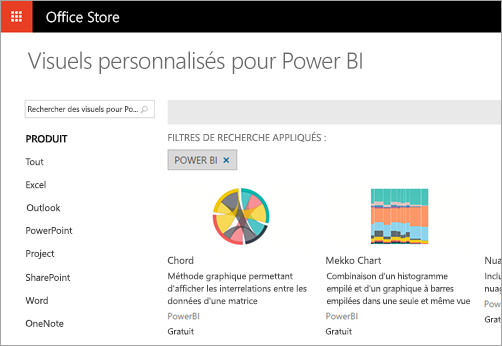

# Que peuvent faire les développeurs avec Power BI ?

Les développeurs ont différentes possibilités pour inclure du contenu Power BI dans des applications, notamment **l’incorporer avec Power BI**, utiliser des **visuels personnalisés** ou **envoyer (push) des données dans Power BI**.

## Incorporation
Le service Power BI (SaaS) et le service Power BI Embedded dans Azure (PaaS) comportent des API permettant d’incorporer des tableaux de bord et des rapports. Vous avez donc accès aux dernières fonctionnalités de Power BI (tableaux de bord, passerelles et espaces de travail d’application, par exemple) pour incorporer votre contenu.

Vous pouvez passer par [l’outil d’expérience d’intégration](https://aka.ms/embedsetup) pour démarrer et télécharger rapidement un exemple d’application.

Choisissez la solution qui vous convient :
* [L’incorporation pour vos clients](embedding.md#embedding-for-your-customers) permet d’incorporer des tableaux de bord et des rapports pour les utilisateurs qui n’ont pas de compte Power BI. Exécutez la solution [Incorporer pour vos clients](https://aka.ms/embedsetup/AppOwnsData).
* [L’incorporation pour votre organisation](embedding.md#embedding-for-your-organization) vous permet d’étendre le service Power BI. Exécutez la solution [Incorporer pour votre organisation](https://aka.ms/embedsetup/UserOwnsData).

## Développer des visuels personnalisés
Les visuels personnalisés vous permettent de créer vos propres visuels à utiliser dans les rapports Power BI. Les visuels personnalisés sont écrits en TypeScript, un surensemble de JavaScript. TypeScript prend en charge certaines fonctionnalités avancées ainsi qu’un accès anticipé aux fonctionnalités ES6/ES7. Les styles de visuels sont gérés à l’aide de feuilles de style en cascade (CSS). Dans un souci de commodité, nous utilisons le précompilateur LESS, qui prend en charge certaines fonctionnalités avancées, notamment l’imbrication, les variables, les conditions, les boucles, etc. Si vous ne souhaitez pas utiliser ces fonctionnalités, vous pouvez simplement écrire une feuille de style CSS brute dans le fichier LESS.

## Transmettre des données à Power BI
Vous pouvez utiliser l’API Power BI pour envoyer des données dans un jeu de données. Cela vous permet d’ajouter une ligne à une table à l’intérieur d’un jeu de données. Les nouvelles données peuvent ensuite être reflétées dans des vignettes sur un tableau de bord et dans des visuels à l’intérieur de votre rapport.

## Étapes suivantes
[Incorporation avec Power BI](embedding.md)  
[Publier des visuels personnalisés dans l’Office Store](office-store.md)  
[Transmettre des données à un tableau de bord](walkthrough-push-data.md)
