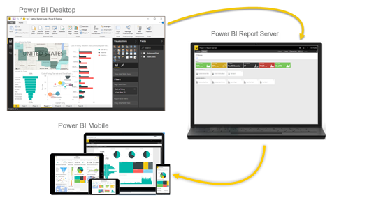

# Qu’est-ce que Power BI ?
**Power BI** est un ensemble de services logiciels, d’applications et de connecteurs qui œuvrent ensemble pour transformer des sources de données disparates en informations visuelles immersives et interactives. Vos données peuvent être sous forme de feuille de calcul Excel ou de collection d’entrepôts de données hybrides locaux ou sur le cloud. Power BI vous permet de vous connecter facilement à vos sources de données, de visualiser et de découvrir ce qui est important, et de partager ces informations avec qui vous voulez.

## Composants de Power BI
Power BI est constitué de plusieurs éléments qui fonctionnent ensemble, dont ces trois éléments de base : 
- Une application de bureau Windows appelée **Power BI Desktop**.
- Un service SaaS (*Software as a Service*) en ligne appelé **service Power BI**. 
- Des **applications mobiles** Power BI pour des appareils Windows, iOS et Android.

Ces trois éléments &mdash;Power BI Desktop, le service et les applications mobiles&mdash; sont conçus pour vous permettre de créer, partager et consommer de façon optimale des insights métier, en fonction de vos besoins ou de votre rôle.

Outre ces trois éléments, Power BI en comprend également deux autres :

- **Power BI Report Builder**, pour la création de rapports paginés à partager dans le service Power BI. Nous aborderons les [rapports paginés](#paginated-reports-in-the-power-bi-service) en détail plus loin dans cet article.
- **Power BI Report Server**, qui est un serveur de rapports local dans lequel vous pouvez publier vos rapports Power BI après les avoir créés dans Power BI Desktop. Nous aborderons [Power BI Report Server](#on-premises-reporting-with-power-bi-report-server) en détail plus loin dans cet article.

## À chacun son Power BI
La façon dont vous utilisez Power BI peut varier selon la fonction que vous occupez dans un projet ou une équipe. D’autres personnes ayant d’autres rôles peuvent aussi utiliser Power BI différemment.

Par exemple, vous pouvez utiliser principalement le **service Power BI** pour voir des rapports et des tableaux de bord. En revanche, votre collègue spécialiste des chiffres et de la création de rapports d’entreprise préférera utiliser **Power BI Desktop** ou **Power BI Report Builder** pour créer des rapports, avant de les publier sur le service Power BI, où vous pourrez ensuite les consulter. De son côté, votre collègue du service commercial peut, quant à lui, utiliser principalement son **application mobile Power BI** pour superviser l’évolution de ses ventes et examiner en détail les nouveaux prospects.

Si vous êtes un développeur, vous pouvez utiliser les API de Power BI pour transmettre des données à des jeux de données ou pour incorporer des tableaux de bord et des rapports dans vos propres applications personnalisées. Vous souhaitez créer un élément visuel ? Faites-le vous-même et partagez-le avec d’autres utilisateurs.  

Vous pouvez aussi être amené à utiliser chaque élément de Power BI à des moments différents, selon ce que vous voulez faire ou selon votre rôle dans un projet donné.

Votre utilisation de Power BI dépend de la fonctionnalité ou du service de Power BI qui correspond à l’outil le plus adapté à votre situation. Par exemple, vous pouvez utiliser Power BI Desktop pour créer des rapports statistiques pour les besoins de votre équipe sur l’engagement des clients, et vous pouvez visualiser l’évolution des stocks et de la production dans un tableau de bord en temps réel dans le service Power BI. Vous pouvez créer un rapport paginé des factures à partir d’un jeu de données Power BI. Chaque partie de Power BI est disponible, ce qui explique sa flexibilité et son attrait.

Pour explorer les documents relatifs à votre rôle :
- Power BI pour les [*utilisateurs professionnels*](../consumer/end-user-consumer.md)
- Power BI Desktop pour les [*créateurs de rapports*](desktop-what-is-desktop.md)
- Power BI Report Builder pour les [*créateurs de rapports d’entreprise*](../paginated-reports/paginated-reports-report-builder-power-bi.md)
- Power BI pour les [*administrateurs*](../admin/service-admin-administering-power-bi-in-your-organization.md)
- Power BI pour les *développeurs*
    * [Analytique incorporée avec Power BI](../developer/embedded/embedding.md)
    * [Qu’est-ce que Power BI Embedded dans Azure ?](../developer/embedded/azure-pbie-what-is-power-bi-embedded.md)
    * [Visuels dans Power BI](../developer/visuals/power-bi-custom-visuals.md)
    * [Comment les développeurs peuvent-ils se servir de l’API Power BI ?](../developer/automation/overview-of-power-bi-rest-api.md)

## Flux de travail dans Power BI
Parmi les workflows Power BI les plus courants, il y a celui qui commence par se connecter aux sources de données Power BI Desktop, puis qui crée un rapport. Vous publiez ensuite ce rapport à partir de Power BI Desktop sur le service Power BI, puis vous le partagez afin que les utilisateurs professionnels du service Power BI et ceux travaillant sur des appareils mobiles puissent consulter ce rapport et interagir avec lui.

Ce workflow est courant et montre la complémentarité entre les trois éléments principaux de Power BI.

Voici une [comparaison détaillée de Power BI Desktop et du service Power BI](../fundamentals/service-service-vs-desktop.md).

## Rapports paginés dans le service Power BI

Un autre workflow implique l’utilisation de rapports paginés dans le service Power BI. Les créateurs de rapports d’entreprise conçoivent des rapports paginés à imprimer ou à partager. Ils peuvent également partager ces rapports dans le service Power BI. Ils sont appelés *paginés*, car ils sont mis en forme pour tenir sur une page. Ils sont souvent utilisés pour les rapports opérationnels ou pour imprimer des formulaires tels que des factures ou des transcriptions. Ils affichent toutes les données dans une table, même si la table s’étend sur plusieurs pages. Power BI Report Builder est l’outil autonome pour la création de rapports paginés.

:::image type="content" source="media/power-bi-overview/paginated-report-invoice-power-bi-service.png" alt-text="Capture d’écran du rapport paginé dans le service Power BI":::

En savoir plus sur les [rapports paginés](../paginated-reports/paginated-reports-report-builder-power-bi.md) dans le service Power BI

## Création locale de rapports avec Power BI Report Server

Qu’en est-il si vous avez besoin de conserver vos rapports localement, par exemple derrière un pare-feu ?  Lisez la suite.

Vous pouvez créer, déployer et gérer des rapports Power BI dans Power BI Desktop et des rapports paginés dans le Générateur de rapports, à l’aide d’outils et de services prêts à l’emploi fournis par Power BI Report Server.

Power BI Report Server est une solution que vous déployez derrière votre pare-feu. Vous distribuez ensuite vos rapports aux utilisateurs appropriés de différentes façons afin de les afficher dans un navigateur web, sur un appareil mobile ou sous forme d’e-mail. Et comme Power BI Report Server est compatible avec Power BI dans le cloud, vous pouvez migrer vers le cloud quand vous êtes prêt. 

En savoir plus sur [Power BI Report Server](../report-server/get-started.md).

## Étapes suivantes
- [Démarrage rapide : Découvrir le fonctionnement du service Power BI](../consumer/end-user-experience.md)   
- [Tutoriel : Bien démarrer avec le service Power BI](service-get-started.md)
- [Démarrage rapide : Se connecter aux données dans Power BI Desktop](../connect-data/desktop-quickstart-connect-to-data.md)
