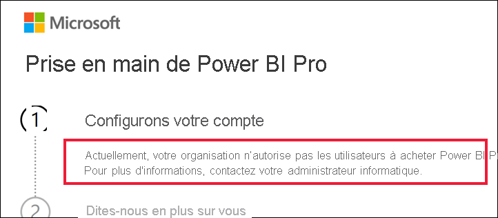

# Marche à suivre si l’achat de Power BI Pro est désactivé

Vous avez essayé d’acheter Power BI Pro et reçu un message indiquant que votre organisation n’autorise pas ses utilisateurs à effectuer cet achat. Pour diverses raisons, certaines organisations bloquent l’achat en libre-service de Power BI Pro pour leurs membres.  Par exemple, elles peuvent appliquer une stratégie selon laquelle toutes les licences et tous les abonnements sont gérés par un service informatique centralisé ou un support technique. 

## Solution
Pour finaliser votre achat, contactez votre service informatique ou support technique et demandez-lui de [suivre ces instructions pour vous fournir une licence](../admin/service-admin-manage-licenses.md).

## Étapes suivantes
[Fonctionnalités de Power BI par type de licence](service-features-license-type.md)