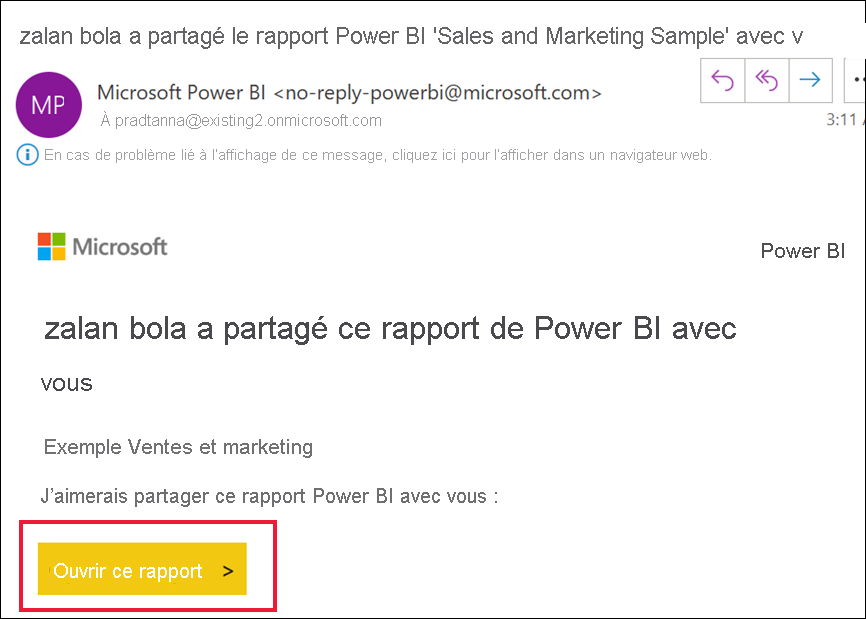
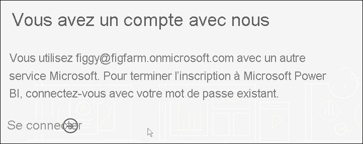
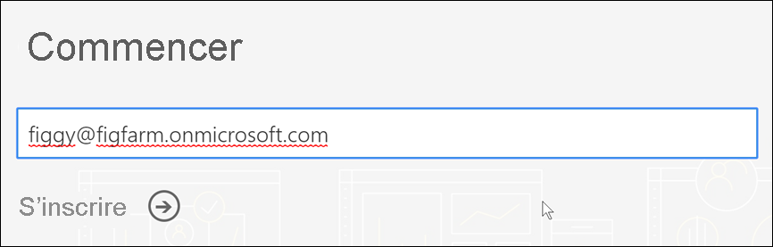
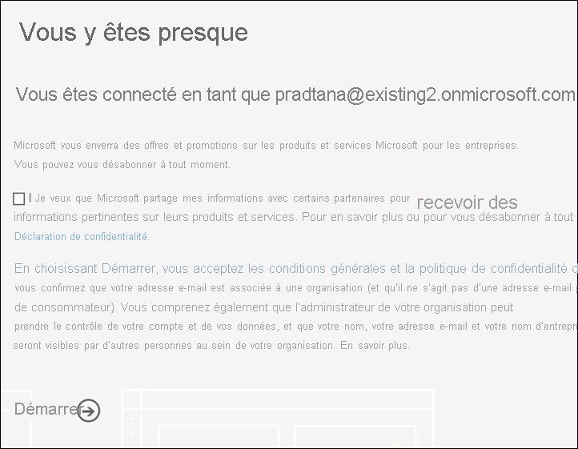
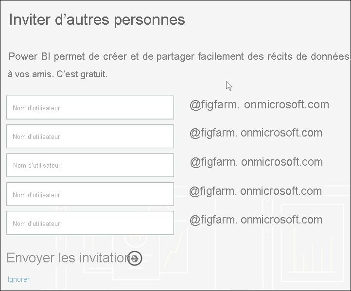

# S’inscrire au service Power BI en tant que personne individuelle

Power BI peut être votre outil d’analyse et de visualisation de données personnel et servir également de moteur d’analytique et de décision pour des projets de groupe, des départements ou des entreprises entières. Cet article explique comment s’inscrire à un essai Power BI en tant que personne individuelle. Si vous êtes administrateur général ou administrateur de facturation, consultez [Gestion des licences Power BI pour votre organisation](../admin/service-admin-licensing-organization.md).

## Qu’est-ce que Power BI ?
Power BI est une plateforme d’analyse décisionnelle d’entreprise unifiée en libre-service, qui associe une expérience utilisateur intuitive à des visualisations de données intelligentes pour fournir une meilleure compréhension des données. Les rapports peuvent être partagés dans des outils Microsoft comme Teams, SharePoint, PowerPoint ou dans d’autres produits de productivité. Il est proposé en tant qu’offre SaaS (Software as a Service) en ligne avec deux applications auxiliaires : une application pour poste de travail Microsoft Windows appelée Power BI Desktop pour créer des rapports et des applications décisionnelles mobiles natives pour la consommation de rapports sur des appareils iOS et Android. 

Ces trois éléments - Power BI Desktop, le service et les applications mobiles - ont été conçus pour permettre à leurs utilisateurs de créer, partager et consommer de façon optimale des insights métier adaptés à leurs besoins ou à leur rôle.

## Inscription au service Power BI
Cet article décrit les étapes à suivre pour s’inscrire au **service Power BI** en tant que personne individuelle. Si vous recherchez de l’aide sur le téléchargement de Power BI Desktop ou sur l’installation des applications mobiles, consultez plutôt les articles suivants :
- [Power BI Desktop (c’est aussi un téléchargement entièrement gratuit)](desktop-get-the-desktop.md)    
- [Applications mobiles Power BI (téléchargement également gratuit)](../consumer/mobile/mobile-apps-for-mobile-devices.md)

## Adresses e-mail prises en charge

Avant de commencer le processus d’inscription, il est important de comprendre les types d’adresses e-mail que vous pouvez utiliser afin de vous inscrire pour Power BI :

* L’inscription à Power BI nécessite l’utilisation d’une adresse e-mail professionnelle ou scolaire. Vous ne pouvez pas vous inscrire avec des adresses e-mail fournies par des services de messagerie grand public ou par des fournisseurs de télécommunication. Ceci inclut outlook.com, hotmail.com, gmail.com, etc. Si vous ne disposez pas d’un compte professionnel ou scolaire, [découvrez des informations sur les autres façons de s’inscrire.](../admin/service-admin-signing-up-for-power-bi-with-a-new-office-365-trial.md)

* Vous pouvez vous inscrire à Power BI avec des adresses .gov ou .mil, mais celles-ci nécessitent un processus différent. Pour plus d’informations, consultez [Inscrire votre organisation de l’Administration américaine dans le service Power BI](../admin/service-govus-signup.md).

## S’inscrire au service Power BI

Effectuez les étapes suivantes afin de vous inscrire pour un compte Power BI. Une fois que vous avez terminé ce processus, vous disposez d’une licence (gratuite) Power BI que vous pouvez utiliser pour essayer le service Power BI par vous-même avec Mon espace de travail, pour consommer du contenu à partir d’un espace de travail Power BI affecté à une capacité Power BI Premium ou pour démarrer une version d’évaluation individuelle de Power BI Pro. Pour plus d’informations, consultez [Fonctionnalités de Power BI par type de licence](service-features-license-type.md). 

Les étapes exactes de l’inscription peuvent varier en fonction de votre organisation et de ce sur quoi vous cliquez pour démarrer le processus. Pour cette raison, vous ne verrez peut-être pas tous les écrans montrés ci-dessous. Il existe de nombreuses façons de s’inscrire au service Power BI en tant que personne individuelle, et les étapes décrites dans cet article s’appliquent aux deux façons les plus courantes.
- Vous sélectionnez un bouton **Essai gratuit** ou **Démarrer gratuitement**1.     
- Vous recevez un e-mail contenant un lien vers un tableau de bord, un rapport ou une application Power BI. Vous ne vous êtes pas déjà connecté à votre compte Power BI.

    1Vous trouverez les types de boutons **Essai gratuit** sur powerbi.microsoft.com, dans les produits Microsoft associés, et dans la documentation et les articles marketing.

### Étape 1

- Sélectionnez **Démarrer gratuitement** ou **Essai gratuit** sur [powerbi.microsoft.com](https://powerbi.com). Il peut être nécessaire de sélectionner deux fois un bouton.

        

- Vous pouvez aussi sélectionner dans un e-mail un lien vers un tableau de bord, un rapport ou une application Power BI.

    

1. Microsoft 365 vous reconnaît et sait que vous avez déjà un service Microsoft installé. Sélectionnez **Connexion**.

    

1. Une de ces boîtes de dialogue peut s’afficher. 
    - Si vous y êtes invité, connectez-vous avec votre compte professionnel.

        

    - Si vous recevez un message comme celui-ci, veillez à utiliser une adresse e-mail professionnelle ou scolaire, et non pas une adresse de consommateur comme Hotmail, Gmail ou Outlook. Consultez [Adresses e-mail prises en charge](#supported-email-addresses) ci-dessus.

       

    - Si vous recevez un message comme celui-ci, vérifiez les conditions générales. Si vous acceptez, sélectionnez **Démarrer**. 

        

1. Vous pouvez inviter des collègues à se joindre à vous.

       

1. À ce stade, vous devrez peut-être attendre que Microsoft [configure un nouveau locataire](../admin/service-admin-signing-up-for-power-bi-with-a-new-office-365-trial.md). Si ce n’est pas le cas, le service Power BI s’ouvre dans votre navigateur.

        

## S’inscrire à une version d’évaluation individuelle de Power BI Pro
Félicitations, vous vous êtes connecté à votre compte Power BI pour la première fois ! Vous disposez maintenant d’une licence gratuite2. Quand vous commencez à explorer le service Power BI, vous voyez des fenêtres contextuelles vous demandant si vous voulez passer à une version d’évaluation individuelle de Power BI Pro. [Certaines fonctionnalités du service Power BI nécessitent une licence Pro](../consumer/end-user-license.md). Si vous souhaitez démarrer une évaluation gratuite de 60 jours de Power BI Pro, sélectionnez **Démarrer l’évaluation**.  

2 Dans certaines organisations, votre compte Power BI par défaut peut être une licence Power BI **Pro**. Par exemple, certaines versions de Microsoft 365 incluent une licence Power BI Pro. Pour savoir comment trouver votre licence utilisateur, consultez [De quelle licence est-ce que je dispose ?](../consumer/end-user-license.md)

## Expiration de l’essai

Quand votre évaluation gratuite de Power BI Pro expire, votre licence repasse à une licence (gratuite) Power BI. L’évaluation ne peut pas être étendue. Vous n’avez plus accès aux fonctionnalités nécessitant une licence Power BI Pro. Pour plus d’informations, consultez [Fonctionnalités par type de licence](service-features-license-type.md).

Si une licence (gratuite) Power BI est suffisante, vous n’avez rien d’autre à faire. Pour tirer parti des fonctionnalités de Power BI Pro, achetez une licence Pro en sélectionnant **Acheter maintenant** ou en visitant [Tarification de Power BI](https://powerbi.microsoft.com/pricing).

Si l’achat en libre-service n’est pas disponible, contactez votre administrateur pour l’achat d’une licence Power BI Pro.

## Résolution des problèmes liés au processus d’inscription

Dans la plupart des cas, vous pouvez vous inscrire pour Power BI en suivant le processus décrit. Certains des problèmes qui peuvent vous empêcher de vous inscrire sont décrits ci-dessous, avec les solutions de contournement possibles.

**Adresses e-mail personnelles** Vous essayez de vous inscrire avec une adresse e-mail personnelle (par exemple, nancy@gmail.com) et recevez un message de ce type : 

*Vous avez entré une adresse de messagerie personnelle : Veuillez entrer votre adresse e-mail professionnelle pour que nous puissions stocker les données de votre entreprise de manière sécurisée*.

ou

*Il semble que vous utilisez une adresse de messagerie personnelle. Entrez votre adresse professionnelle pour que nous puissions vous connecter aux autres utilisateurs de votre organisation. Ne vous inquiétez pas. Nous ne communiquerons pas votre adresse*.

**Solution** Power BI ne prend pas en charge les adresses e-mail fournies par des services de messagerie de consommateur ou par des fournisseurs de télécommunications. Pour terminer l’inscription, réessayez en utilisant une adresse e-mail qui vous a été attribuée par votre organisation ou votre établissement scolaire. 

Si vous ne pouvez toujours pas vous inscrire et que vous souhaitez effectuer un processus d’installation plus avancé, vous pouvez [vous inscrire à une version d’évaluation de Microsoft 365 et utiliser cette adresse e-mail pour vous inscrire](../admin/service-admin-signing-up-for-power-bi-with-a-new-office-365-trial.md). 

Un utilisateur existant peut également [vous inviter en tant qu’invité](../admin/service-admin-azure-ad-b2b.md). 

[!INCLUDE[self-service-signup](../includes/self-service-signup-help.md)]

**Votre adresse e-mail n’est pas un ID Microsoft 365** Vous essayez de vous inscrire et recevez un message de ce type :

*Nous ne vous avons pas trouvé sur contoso.com.  Utilisez-vous un ID différent au sein de votre organisation ou de votre établissement ?  Essayez de vous connecter avec celui-ci et si cela ne fonctionne pas, contactez votre service informatique.*

**Solution** Votre organisation utilise des ID (différents de votre adresse e-mail) pour la connexion à Microsoft 365 et à d’autres services Microsoft.  Par exemple, votre adresse de messagerie peut être zalan.bola@contoso.com, mais votre ID est zalanb@contoso.com.

Pour terminer votre inscription, utilisez l’ID que votre organisation vous a affecté pour la connexion à Microsoft 365 ou à d’autres services Microsoft.  Si vous ne le connaissez pas, contactez votre administrateur général.  

Si vous ne pouvez toujours pas vous inscrire et que vous souhaitez effectuer un processus d’installation plus avancé, vous pouvez [vous inscrire à une version d’évaluation de Microsoft 365 et utiliser cette adresse e-mail pour vous inscrire](../admin/service-admin-signing-up-for-power-bi-with-a-new-office-365-trial.md).

**La connexion Power BI ne reconnaît pas votre mot de passe**

**Solution** Il faut parfois quelques tentatives. Si vous réessayez votre mot de passe à plusieurs reprises et que vous ne pouvez toujours pas vous connecter, essayez d’exécuter votre navigateur en mode Incognito (Chrome) ou InPrivate (Edge).

## Étapes suivantes

[Fonctionnalités de Power BI par type de licence](../consumer/end-user-features.md)    
[Conseils pour trouver de l’aide](../fundamentals/service-tips-for-finding-help.md)    

D’autres questions ? [Essayez d’interroger la communauté Power BI](https://community.powerbi.com/)
