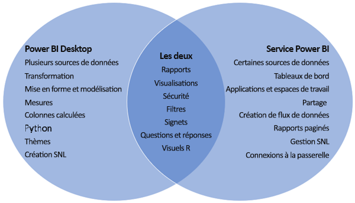

# Comparaison de Power BI Desktop et du service Power BI

Dans un diagramme de Venn qui compare Power BI Desktop et le service Power BI, la zone centrale montre la façon dont les deux produits se recoupent. Vous pouvez effectuer certaines tâches à la fois dans Power BI Desktop ou le service. Les deux côtés du diagramme de Venn montrent les fonctionnalités qui sont propres à l’application et au service.  

**Power BI Desktop** est un outil d’analyse des données et de création de rapports complet que vous installez gratuitement sur votre ordinateur local. Il inclut l’Éditeur de requête, dans lequel vous pouvez vous connecter à de nombreuses sources de données différentes et les combiner dans un modèle de données (opération souvent appelée modélisation). Vous concevez ensuite un rapport basé sur ce modèle de données. Le [guide de prise en main de Power BI Desktop](desktop-getting-started.md) vous présente pas à pas l’application.

Le **service Power BI** est un service cloud. Il prend en charge la modification simple de rapports et la collaboration pour des équipes et des organisations. Vous pouvez vous connecter également à des sources de données dans le service Power BI, mais la modélisation est limitée.

La plupart des concepteurs de rapports Power BI qui travaillent sur des projets décisionnels utilisent **Power BI Desktop** pour créer des rapports Power BI, puis utilisent le **service Power BI** pour collaborer et distribuer leurs rapports.

Le service Power BI héberge également des *rapports paginés* dans des espaces de travail sauvegardés par une capacité de Power BI Premium. Vous pouvez également créer des rapports paginés avec le Générateur de rapports Power BI. Consultez [Comparer des rapports Power BI et des rapports paginés](../paginated-reports/paginated-reports-report-builder-power-bi.md#compare-power-bi-reports-and-paginated-reports) dans l’article « Qu’est-ce que sont des rapports paginés dans Power BI Premium ? » pour plus d’informations.

## Modification de rapports Power BI

À la fois dans l’application et dans le service, vous générez et vous modifiez des *rapports* Power BI. Un rapport peut se composer d’une ou plusieurs pages, avec des visuels et des collections de visuels. Ajoutez des signets, des boutons, des filtres et une fonctionnalité d’extraction pour améliorer la navigation dans vos rapports.

Les éditeurs de rapports dans Power BI Desktop et dans le service sont similaires. Ils sont constitués de trois sections :  

1. Les volets de navigation supérieurs, qui sont différents dans Power BI Desktop et le service    
2. Canevas de rapport     
3. Les volets **Champs** , **Visualisations** et **Filtres**

Cette vidéo montre l’éditeur de rapports dans Power BI Desktop. 

<iframe width="560" height="315" src="https://www.youtube.com/embed/IkJda4O7oGs" frameborder="0" allowfullscreen></iframe>

## Utilisation du service Power BI

### Collaboration

Une fois que vous avez créé vos rapports, vous pouvez les enregistrer dans un *espace de travail* dans le **service Power BI** , là où vos collègues et vous-même pouvez collaborer. Vous générez des *tableaux de bord* qui s’appuient sur ces rapports. Vous partagez ensuite ces tableaux de bord et ces rapports avec des consommateurs de rapports internes et externes à votre organisation. Les consommateurs de vos rapports les consultent dans le service Power BI en *mode Lecture* , et non en mode Édition. Ils n’ont pas accès à toutes les fonctionnalités disponibles pour les auteurs de rapports.  Vous pouvez également partager vos jeux de données et permettre à d’autres utilisateurs de générer leurs propres rapports à partir de ceux-ci. Découvrez plus en détail comment [collaborer dans le service Power BI](../collaborate-share/service-new-workspaces.md).

### Préparation des données en libre-service avec des dataflows

Les dataflows aident les organisations à unifier des données provenant de sources disparates et à les préparer pour la modélisation. Les analystes peuvent facilement créer des flux de données à l’aide des outils familiers en libre-service. Les analystes utilisent des dataflows pour ingérer, transformer, intégrer et enrichir le Big Data en définissant des connexions à la source de données, une logique ETL, des planifications d’actualisation, et bien plus encore. Découvrez plus en détail la [Préparation des données en libre-service avec des dataflows](../transform-model/dataflows/dataflows-introduction-self-service.md).

## Étapes suivantes

[Qu’est-ce que Power BI Desktop ?](desktop-what-is-desktop.md)

[Créer un rapport](../create-reports/service-report-create-new.md) dans le service Power BI

[Fondamentaux pour les concepteurs de rapports](service-basic-concepts.md)

D’autres questions ? [Essayez la communauté Power BI](https://community.powerbi.com/)