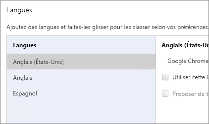
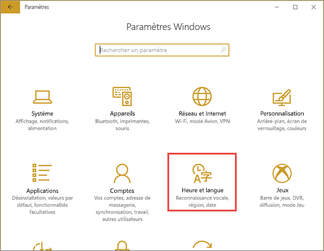
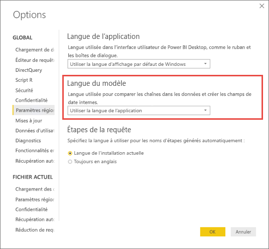

# Langues et pays/régions pris en charge pour Power BI

Cet article couvre les langues et pays/régions pris en charge pour la documentation du service Power BI, de Power BI Desktop et de Power BI.

## Pays et régions où Power BI est disponible
Pour obtenir la liste des pays et régions où Power BI est disponible, consultez cette [liste de disponibilité internationale](https://products.office.com/business/international-availability). 

## Langues disponibles pour le service Power BI
Le service Power BI (dans le navigateur) est disponible dans les 44 langues suivantes :

* Arabe
* Basque - Basque
* Bulgare - Български
* Catalan - català
* Chinois (simplifié) - 中文(简体)
* Chinois (traditionnel) - 中文(繁體)
* Croate - hrvatski
* Tchèque - čeština
* Danois - dansk
* Néerlandais - Nederlands
* Anglais - English
* Estonien - eesti
* Finnois - suomi
* Français - français
* Galicien - galego
* Allemand - Deutsch
* Grec - Ελληνικά
* Hébreu
* Hindi - हिंदी
* Hongrois - magyar
* Indonésien - Bahasa Indonesia
* Italien - italiano
* Japonais - 日本語
* Kazakh - Қазақ
* Coréen - 한국어
* Letton - latviešu
* Lituanien - lietuvių
* Malais - Bahasa Melayu
* Norvégien (Bokmål) - norsk (bokmål)
* Polonais - Polski
* Portugais (Brésil) - Português
* Portugais (Portugal) - português
* Roumain - română
* Russe - Русский
* Serbe (cyrillique) - српски
* Serbe (latin) - srpski
* Slovaque - slovenčina
* Slovène - slovenski
* Espagnol - español
* Suédois - svenska
* Thaï - ไทย
* Turc - Türkçe
* Ukrainien - українська
* Vietnamien - Tiếng Việt

### Éléments traduits
Power BI traduit les menus, les boutons, les messages et d’autres éléments de l’expérience dans votre langue. Par exemple, Power BI traduit le contenu du rapport tel que les titres, filtres et info-bulles générés automatiquement. Toutefois, vos données ne sont pas traduites automatiquement. Dans les rapports, la disposition des visuels ne change pas si vous utilisez une langue de droite à gauche, par exemple l’hébreu.

Quelques fonctionnalités sont actuellement disponibles en anglais uniquement :

* Tableaux de bord et rapports créés par Power BI quand vous vous connectez à certains services, tels que Microsoft Dynamics CRM, Google Analytics et Salesforce. Vous pouvez toutefois créer vos propres tableaux de bord et rapports dans votre langue.
* Exploration de vos données avec Q&R.

Tenez-vous informé, car nous ajouterons régulièrement des fonctionnalités à d’autres langues. 

### Choisir votre langue dans le service Power BI
1. Dans le service Power BI, sélectionnez l’icône **Paramètres**  > **Paramètres**.
2. Sous l’onglet **Général** > **Langue**.
3. Sélectionnez votre langue > **Appliquer**.

### Choisir votre langue dans le navigateur
Power BI détermine la langue utilisée en fonction des préférences linguistiques définies sur votre ordinateur. La méthode à suivre pour afficher et modifier ces préférences peut varier selon votre système d’exploitation et votre navigateur. Voici comment afficher ces préférences à partir d’Internet Explorer et de Google Chrome.

#### Internet Explorer (version 11)
1. Cliquez sur le bouton **Outils** en haut à droite de la fenêtre du navigateur :
   
   
2. Cliquez sur **Options Internet**.
3. Dans la boîte de dialogue Options Internet, sous l’onglet Général, sous Apparence, cliquez sur le bouton **Langues**.

#### Google Chrome (version 42)
1. Cliquez sur le bouton de menu en haut à droite de la fenêtre du navigateur :
   
   
2. Cliquez sur **Paramètres**.
3. Cliquez sur **Afficher les paramètres avancés**.
4. Sous Langues, cliquez sur le bouton **Paramètres de langue et de saisie**.
5. Cliquez sur **Ajouter**, sélectionnez une langue, puis cliquez sur **OK**.
   
   
   
   La nouvelle langue se trouve en fin de liste. 
6. Faites glisser la nouvelle langue en haut de la liste, puis cliquez sur **Afficher Google Chrome dans cette langue**.
   
   
   
   Vous devrez peut-être fermer et rouvrir votre navigateur pour appliquer la modification.

## Choisir la langue ou les paramètres régionaux de Power BI Desktop
Vous disposez de deux façons d’obtenir Power BI Desktop : Vous pouvez le télécharger comme programme d’installation autonome ou l’installer à partir du Windows Store.

* Quand vous installez Power BI Desktop à partir du Windows Store, il installe toutes les langues et affiche par défaut la langue qui correspond à la langue par défaut de Windows.
* Quand vous téléchargez Power BI Desktop en tant que programme d’installation autonome, vous choisissez la langue par défaut lors de l’exécution du programme d’installation. Vous pouvez la modifier à une date ultérieure.
* Vous pouvez également [choisir des paramètres régionaux à utiliser lors de l’importation de données](#choose-the-locale-for-importing-data-into-power-bi-desktop) pour un rapport spécifique.

> [!NOTE]
> Si vous installez la version de Power BI Desktop optimisée pour Power BI Report Server, vous choisissez la langue de l’application au moment du téléchargement. Pour plus d’informations, voir [Installer Power BI Desktop optimisé pour Power BI Report Server](../report-server/install-powerbi-desktop.md).

### Choisir une langue pour Power BI Desktop 
1. Installez Power BI Desktop [à partir du Windows Store](https://aka.ms/pbidesktopstore) ou en tant que [programme d’installation autonome](https://aka.ms/pbiSingleInstaller).
2. Pour modifier la langue, dans le menu Windows, sélectionnez **Paramètres**

3. Dans **Paramètres Windows**, sélectionnez **Heure et langue**.
   
     
4. Sélectionnez **Langue** et sélectionnez une langue. Sélectionnez **Ajouter une langue d’affichage Windows dans Microsoft Store** si nécessaire.
   
     
   
     Au prochain démarrage de Power BI Desktop, celui-ci utilise la langue définie en tant que valeur par défaut. 

Pour remplacer la valeur par défaut afin d’utiliser Power BI Desktop dans une langue autre que votre langue Windows, procédez comme suit.
1. Dans Power BI Desktop, sélectionnez **Fichier** > **Options et paramètres** > **Options**.
2. Sous **Paramètres globaux**, sélectionnez **Paramètres régionaux**.
3. Dans la zone **Langue de l’application**, sélectionnez d’autres paramètres régionaux. 

La prise en charge linguistique dans Power BI Desktop est limitée aux langues affichées dans la liste déroulante Langue de l’application.

### Vérifier la mise en forme des nombres et des dates par défaut dans Power BI Desktop

Power BI Desktop obtient sa mise en forme par défaut des nombres et des dates à partir des paramètres régionaux Windows. Vous pouvez vérifier ou modifier ces paramètres si nécessaire.

1. Dans le menu Windows, sélectionnez **Paramètres**

2. Dans **Paramètres Windows**, sélectionnez **Heure et langue**.
   
     

3. Sélectionnez **Région** > **Paramètres de date, d’heure et régionaux supplémentaires**.

    :::image type="content" source="media/supported-languages-countries-regions/power-bi-service-region-settings.png" alt-text="Paramètres de date, d’heure et régionaux supplémentaires":::

4. Dans **Horloge et région**, sélectionnez **Modifier les formats de date, d’heure ou de nombre**.

    :::image type="content" source="media/supported-languages-countries-regions/power-bi-service-check-region-settings.png" alt-text="Paramètres d’horloge et de région":::

5. Assurez-vous que **Faire correspondre à la langue d’affichage de Windows** est sélectionné ou modifiez si nécessaire.

    :::image type="content" source="media/supported-languages-countries-regions/power-bi-service-match-windows.png" alt-text="Faire correspondre à la langue d’affichage de Windows":::

### Choisir les paramètres régionaux à utiliser lors de l’importation de données dans Power BI Desktop
Si vous téléchargez Power BI Desktop ou l’installez à partir du Windows Store, vous pouvez choisir des paramètres régionaux pour un rapport spécifique autres que ceux de votre version de Power BI Desktop. Les paramètres régionaux modifient la façon dont Power BI interprète les données lorsqu’elles sont importées à partir de votre source de données. Par exemple, « 3/4/2017 » est-il interprété comme étant le 3 avril ou le 4 mars ?

1. Dans Power BI Desktop, sélectionnez **Fichier** > **Options et paramètres** > **Options**.
2. Sous **Fichier actuel**, sélectionnez **Paramètres régionaux**.
3. Dans la boîte **Paramètres régionaux à importer**, sélectionnez des paramètres régionaux différents. 
   
   
4. Sélectionnez **OK**.

### Choisir la langue du modèle dans Power BI Desktop

Outre la définition de la langue de l’application Power BI Desktop, vous pouvez également définir la langue du modèle. La langue du modèle affecte principalement deux éléments :

- la façon dont nous comparons et trions des chaînes. Par exemple, étant donné que le turc possède deux lettres i, selon le classement de votre base de données, les deux peuvent se retrouver dans des ordres différents lors du tri. 
- La langue que Power BI Desktop utilise lors de la création des tables avec dates masquées à partir de champs de date. Par exemple, les champs sont appelés Month/Monat/Mois et ainsi de suite.

> [!NOTE]
> Le modèle Power BI utilise actuellement des paramètres régionaux qui ne respectent pas la casse (ou le jeu de caractères Kana), de sorte que « ABC » et « abc » sont interprétés de la même façon. Si « ABC » est chargé en premier dans la base de données, les autres chaînes qui diffèrent uniquement d’une casse, par exemple « Abc », ne sont pas chargées en tant que valeur distincte.
> 
>

Voici comment définir la langue du modèle.

1. Dans Power BI Desktop, sélectionnez **Fichier** > **Options et paramètres** > **Options**.
2. Sous **Global**, sélectionnez **Paramètres régionaux**.
3. Dans la zone **Langue du modèle**, sélectionnez une autre langue. 

    

> [!NOTE]
> Une fois créée, la langue d’un modèle Power BI ne peut pas être modifiée.
> 
>

## Langues de la documentation d’aide
L’aide est localisée dans les 10 langues suivantes : 

* Chinois (simplifié) - 中文(简体)
* Chinois (traditionnel) - 中文(繁體)
* Français - français
* Allemand - Deutsch
* Italien - italiano
* Japonais - 日本語
* Coréen - 한국어
* Portugais (Brésil) - Português
* Russe - Русский
* Espagnol - español

## Étapes suivantes
* Vous utilisez l’une des applications mobiles Power BI ? Pour plus d’informations, voir [Langues prises en charge dans les applications mobiles Power BI](../consumer/mobile/mobile-apps-supported-languages.md).
* Vous avez des questions ? Essayez de d’interroger la [Communauté Power BI](https://community.powerbi.com/).
* Le problème persiste ? Visitez la [page de support Power BI](https://powerbi.microsoft.com/support/).
