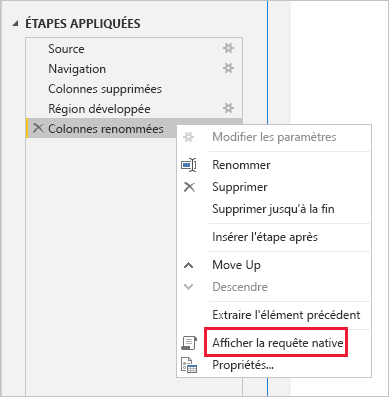
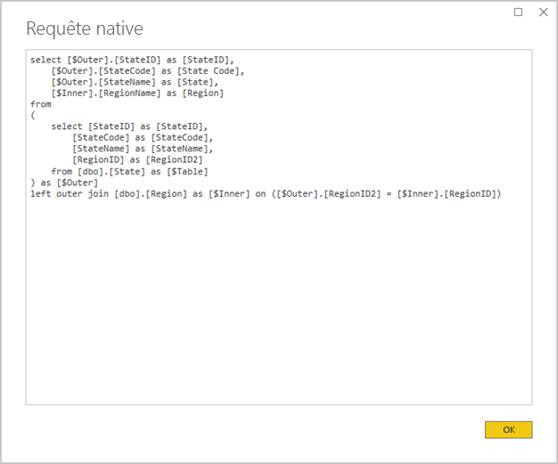
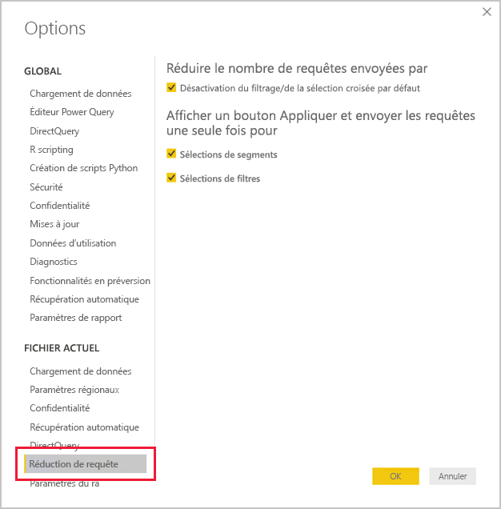
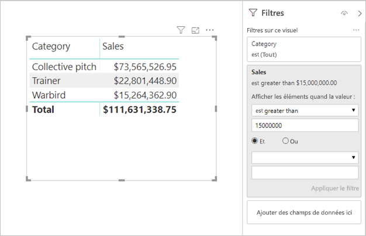

# <a name="directquery-model-guidance-in-power-bi-desktop"></a>Guide du modèle DirectQuery dans Power BI Desktop

Cet article cible les modélisateurs de données qui développent des modèles DirectQuery Power BI à l’aide de Power BI Desktop ou du service Power BI. Il décrit des cas d’utilisation de DirectQuery, ses limitations et les conseils le concernant. Plus précisément, le guide est conçu pour vous aider à déterminer si DirectQuery est le mode approprié pour votre modèle et pour améliorer les performances de vos rapports en fonction des modèles DirectQuery. Cet article s’applique aux modèles DirectQuery hébergés dans le service Power BI ou Power BI Report Server.

Cet article n’a pas pour but d’aborder par le menu la conception de modèles DirectQuery. Pour une présentation, reportez-vous à l’article [Modèles DirectQuery dans Power BI Desktop](../connect-data/desktop-directquery-about.md). Pour une discussion plus approfondie, reportez-vous directement au livre blanc [DirectQuery dans SQL Server 2016 Analysis Services](https://download.microsoft.com/download/F/6/F/F6FBC1FC-F956-49A1-80CD-2941C3B6E417/DirectQuery%20in%20Analysis%20Services%20-%20Whitepaper.pdf). N’oubliez pas que le livre blanc décrit l’utilisation de DirectQuery dans SQL Server Analysis Services. Une grande partie du contenu, toutefois, est toujours applicable aux modèles DirectQuery Power BI.

Cet article ne couvre pas directement les modèles composites. Un modèle composite se compose d’au moins une source DirectQuery, voire de plusieurs. L’aide décrite dans cet article est toujours pertinente, du moins en partie, pour la conception de modèles composites. Toutefois, les implications liées à la combinaison de tables d’importation avec des tables DirectQuery n’entrent pas dans le cadre de cet article. Pour plus d’informations, consultez [Utiliser des modèles composites dans Power BI Desktop](../transform-model/desktop-composite-models.md).

Il est important de comprendre que les modèles DirectQuery imposent une charge de travail différente sur l’environnement de Power BI (service Power BI ou Power BI Report Server) et également sur les sources de données sous-jacentes. Si vous déterminez que DirectQuery est l’approche de conception appropriée, nous vous recommandons d’impliquer les bonnes personnes dans le projet. Nous voyons souvent que la réussite d’un déploiement de modèles DirectQuery est le résultat de la collaboration étroite d’une équipe de professionnels de l’informatique. L’équipe se compose généralement de développeurs de modèles et d’administrateurs de base de données source. Elle peut également impliquer des architectes de données ainsi que des développeurs d’entrepôts de données et de processus ETL. Souvent, des optimisations doivent être appliquées directement à la source de données pour obtenir de bons résultats en matière de performances.

## <a name="design-in-power-bi-desktop"></a>Concevoir dans Power BI Desktop

Il est possible d’établir une connexion directe aux sources de données Azure SQL Data Warehouse et Azure HDInsight Spark, sans qu’il soit nécessaire d’utiliser Power BI Desktop. Pour ce faire, dans le service Power BI, vous devez obtenir des données et choisir la vignette Bases de données. Pour plus d’informations, consultez [Azure SQL Data Warehouse avec DirectQuery](../connect-data/service-azure-sql-data-warehouse-with-direct-connect.md).

Bien que la connexion directe soit pratique, nous vous déconseillons d’utiliser cette approche. La raison principale est qu’il est impossible d’actualiser la structure du modèle en cas de modification du schéma de la source de données sous-jacente.

Nous vous recommandons d’utiliser Power BI Desktop pour créer et gérer tous vos modèles DirectQuery. Cette approche vous offre un contrôle complet pour définir le modèle dont vous avez besoin, y compris l’utilisation de fonctionnalités prises en charge telles que les hiérarchies, les colonnes calculées et les mesures. Elle vous permet également de modifier la conception du modèle en cas de modification du schéma de la source de données sous-jacente.

## <a name="optimize-data-source-performance"></a>Optimiser les performances de la source de données

La source de base de données relationnelle peut être optimisée de plusieurs façons, comme décrit dans la liste à puces suivante.

> [!NOTE]
> Nous savons que tous les modélisateurs n’ont pas les autorisations ou les compétences nécessaires pour optimiser une base de données relationnelle. Bien qu’il s’agisse de la couche préférée pour préparer les données pour un modèle DirectQuery, certaines optimisations peuvent également être réalisées dans la conception du modèle, sans modifier la base de données source. Toutefois, les meilleurs résultats d’optimisation sont souvent le fruit de l’application d’optimisations à la base de données source.

- **Vérifier que l’intégrité des données est complète :** il est particulièrement important que les tables de type dimension contiennent une colonne de valeurs uniques (clé de dimension) mappée à la table, ou aux tables, de type fait. Il est également important que les colonnes de dimension de type fait contiennent des valeurs de clés de dimension valides. Elles permettent de configurer des relations de modèle plus efficaces qui attendent des valeurs correspondantes des deux côtés des relations. Quand les données sources manquent d’intégrité, il est recommandé d’ajouter un enregistrement de dimension « inconnu » pour les réparer efficacement. Par exemple, vous pouvez ajouter une ligne à la table **Product** pour représenter un produit inconnu, puis lui attribuer une clé hors limites, telle que -1. Si des lignes de la table **Sales** contiennent une valeur de clé de produit manquant, remplacez-les par -1. Ainsi, chaque valeur de clé de produit de la table **Sales** a une ligne correspondante dans la table **Product**.
- **Ajouter des index :** définissez des index appropriés (sur des tables ou des vues) afin de prendre en charge la récupération efficace des données pour le filtrage et le regroupement visuels de rapports attendus. Pour les sources SQL Server, Azure SQL Database ou Azure SQL Data Warehouse, consultez [Guide de conception et d’architecture d’index SQL Server](/sql/relational-databases/sql-server-index-design-guide) pour des informations utiles sur la conception d’index. Concernant les sources volatiles SQL Server ou Azure SQL Database, consultez [Bien commencer avec columnstore pour l’analytique opérationnelle en temps réel](/sql/relational-databases/indexes/get-started-with-columnstore-for-real-time-operational-analytics).
- **Concevoir des tables distribuées :** pour les sources Azure SQL Data Warehouse, qui tirent parti de l’architecture MPP (Massively Parallel Processing), envisagez de configurer les grandes tables de type fait en tant que tables de type dimension et distribuées par hachage à répliquer sur tous les nœuds de calcul. Pour plus d’informations, consultez [Guide de conception des tables distribuées dans Azure SQL Data Warehouse](/azure/sql-data-warehouse/sql-data-warehouse-tables-distribute#what-is-a-distributed-table).
- **Vérifier que les transformations de données requises sont matérialisées :** pour les sources de bases de données relationnelles SQL Server (et d’autres sources de bases de données relationnelles), des colonnes calculées peuvent être ajoutées aux tables. Ces colonnes sont basées sur une expression, comme **Quantity** multipliée par **UnitPrice**. Les colonnes calculées peuvent être rendues persistantes (matérialisées) et, comme les colonnes ordinaires, elles peuvent parfois être indexées. Pour plus d’informations, consultez [Index sur des colonnes calculées](/sql/relational-databases/indexes/indexes-on-computed-columns).

    Envisagez également des vues indexées pouvant pré-agréger les données de table de faits à un niveau plus général. Par exemple, si la table **Sales** stocke des données au niveau de la ligne de commande, vous pouvez créer une vue pour totaliser ces données. La vue peut être basée sur une instruction SELECT qui regroupe les données de la table **Sales** par date (au niveau du mois), client et produit, et totalise les valeurs de mesure comme les ventes, la quantité, etc. La vue peut ensuite être indexée. Pour les sources SQL Server ou Azure SQL Database, consultez [Créer des vues indexées](/sql/relational-databases/views/create-indexed-views).
- **Matérialiser une table de dates :** une spécification de modélisation courante implique l’ajout d’une table de dates pour prendre en charge le filtrage basé sur le temps. Pour prendre en charge les filtres basés sur le temps connus dans votre organisation, créez une table dans la base de données source et assurez-vous qu’elle est chargée avec une plage de dates englobant les dates de la table de faits. Assurez-vous également qu’elle comprend des colonnes pour les périodes utiles, telles que l’année, le trimestre, le mois ou la semaine.

## <a name="optimize-model-design"></a>Optimiser la conception du modèle

Un modèle DirectQuery peut être optimisé de nombreuses façons, comme décrit dans la liste à puces suivante.

- **Éviter les requêtes Power Query complexes :** pour obtenir une conception de modèle efficace, vous pouvez faire en sorte que les requêtes Power Query n’aient pas besoin d’appliquer de transformations. Dans cette approche, chaque requête est mappée à une seule vue ou table source de la base de données relationnelle. Vous pouvez afficher un aperçu d’une représentation de l’instruction de requête SQL réelle pour une étape Power Query appliquée en sélectionnant l’option **Afficher la requête native**.

    
    
    

- **Examiner l’utilisation de colonnes calculées et les modifications de type de données :** les modèles DirectQuery prennent en charge l’ajout de calculs et d’étapes Power Query pour convertir les types de données. Toutefois, vous pouvez souvent obtenir de meilleures performances en matérialisant les résultats de la transformation dans la source de base de données relationnelle, quand cela est possible.
- **Ne pas utiliser le filtrage de date relative Power Query :** il est possible de définir un filtrage de date relative dans une requête Power Query. Supposons que vous souhaitiez récupérer les commandes qui ont été créées au cours de l’année précédente (par rapport à la date du jour). Ce type de filtre aboutit à une requête native inefficace, comme suit :

    ```SQL
    …
    from [dbo].[Sales] as [_]
    where [_].[OrderDate] >= convert(datetime2, '2018-01-01 00:00:00') and [_].[OrderDate] < convert(datetime2, '2019-01-01 00:00:00'))  
    ```
    
    Une meilleure approche de conception consiste à inclure des colonnes de temps relatif dans la table de dates. Ces colonnes stockent des valeurs de décalage par rapport à la date actuelle. Par exemple, dans une colonne **RelativeYear**, la valeur zéro représente l’année en cours, tandis que -1 représente l’année précédente et ainsi de suite. De préférence, la colonne **RelativeYear** est matérialisée dans la table des dates. Bien que cela soit moins efficace, elle peut également être ajoutée en tant que colonne calculée de modèle, en fonction de l’expression utilisant les fonctions DAX [TODAY](/dax/today-function-dax) et [DATE](/dax/date-function-dax).

- **Veiller à utiliser des mesures simples :** au départ, il est recommandé de limiter les mesures à des agrégats simples. Les fonctions d’agrégation incluent SUM, COUNT, MIN, MAX et AVERAGE. Ensuite, si les mesures sont suffisamment réactives, vous pouvez faire des essais avec des mesures plus complexes, tout en faisant attention aux performances de chacune d’elles. Même si la fonction DAX [CALCULATE](/dax/calculate-function-dax) peut être utilisée pour produire des expressions de mesure sophistiquées qui manipulent le contexte de filtre, elle peut générer des requêtes natives onéreuses qui ne fonctionnent pas correctement.
- **Éviter les relations sur des colonnes calculées :** les relations de modèle ne peuvent associer qu’une seule colonne d’une table à une seule colonne dans une autre table. Toutefois, il est parfois nécessaire de lier des tables à l’aide de plusieurs colonnes. Par exemple, les tables **Sales** et **Geography** sont liées par deux colonnes : **Country** et **City**. Pour créer une relation entre les tables, une seule colonne est requise et, dans la table **Geography**, la colonne doit contenir des valeurs uniques. La concaténation du pays et de la ville avec un séparateur de trait d’union permet d’obtenir ce résultat.

    La colonne combinée peut être créée avec une colonne personnalisée Power Query ou dans le modèle en tant que colonne calculée. Toutefois, cette approche doit être évitée, car l’expression de calcul est incorporée dans les requêtes sources. Non seulement elle est inefficace, mais elle empêche généralement l’utilisation d’index. Au lieu de cela, ajoutez des colonnes matérialisées dans la source de base de données relationnelle et envisagez de les indexer. Vous pouvez également envisager d’ajouter des colonnes clés de substitution à des tables de type dimension, pratique courante dans les conceptions d’entrepôts de données relationnelles.
    
    Il existe une exception à cette recommandation, qui concerne l’utilisation de la fonction DAX [COMBINEVALUES](/dax/combinevalues-function-dax). L’objectif de cette fonction est de prendre en charge les relations de modèle multicolonnes. Au lieu de générer une expression utilisée par la relation, elle génère un prédicat de jointure SQL multicolonne.
- **Éviter les relations sur des colonnes d’identificateur unique :** Power BI ne prend pas en charge en mode natif le type de données d’identificateur unique (GUID). Lors de la définition d’une relation entre des colonnes de ce type, Power BI génère une requête source avec une jointure impliquant un cast. Cette conversion de données au moment de la requête engendre généralement des performances médiocres. Tant que ce cas n’est pas optimisé, la seule solution de contournement consiste à matérialiser des colonnes d’un autre type de données dans la base de données sous-jacente.
- **Masquer la colonne du côté « un » des relations :** la colonne du côté « un » d’une relation doit être masquée. (Il s’agit généralement de la colonne de clé primaire des tables de type dimension.) Quand elle est masquée, elle n’est pas disponible dans le volet **Champs** et ne peut donc pas être utilisée pour configurer un visuel. La colonne du côté « plusieurs » peut rester visible si elle est utile pour regrouper ou filtrer les rapports en fonction des valeurs de colonne. Par exemple, imaginez un modèle dans lequel il existe une relation entre les tables **Sales** et **Product**. Les colonnes de la relation contiennent des valeurs de références SKU de produits. Si la référence SKU de produit doit être ajoutée aux visuels, elle doit être visible uniquement dans la table **Sales**. Quand cette colonne est utilisée pour effectuer un filtrage ou un regroupement dans un visuel, Power BI génère une requête qui n’a pas besoin de joindre les tables **Sales** et **Product**.
- **Définir des relations pour appliquer l’intégrité :** La propriété **Intégrité référentielle supposée** des relations DirectQuery détermine si Power BI génère des requêtes sources à l’aide d’une jointure interne plutôt que d’une jointure externe. Cette approche améliore généralement les performances de requête, bien qu’elle dépende des spécificités de la source de données relationnelle. Pour plus d’informations, consultez [Paramètres Intégrité référentielle supposée dans Power BI Desktop](../connect-data/desktop-assume-referential-integrity.md).
- **Éviter d’utiliser le filtrage des relations bidirectionnel :** l’utilisation du filtrage des relations bidirectionnel peut aboutir à des instructions de requête qui ne fonctionnent pas correctement. Utilisez cette fonctionnalité de relation seulement si c’est nécessaire, ce qui est généralement le cas lors de l’implémentation d’une relation plusieurs-à-plusieurs par le biais d’une table de pontage. Pour plus d’informations, consultez [Relations avec une cardinalité plusieurs à plusieurs dans Power BI Desktop](../transform-model/desktop-many-to-many-relationships.md).
- **Limiter les requêtes parallèles :** vous pouvez définir le nombre maximal de connexions que DirectQuery ouvre pour chaque source de données sous-jacente. Vous pouvez ainsi contrôler le nombre de requêtes simultanément envoyées à la source de données.

    
    
    Le paramètre est uniquement activé quand il existe au moins une source DirectQuery dans le modèle. La valeur s’applique à toutes les sources DirectQuery et à toutes les nouvelles sources DirectQuery ajoutées au modèle.

    L’augmentation de la valeur **Nombre maximal de connexions par source de données** garantit l’envoi d’un nombre plus élevé de requêtes (allant jusqu’au nombre maximal spécifié) à la source de données sous-jacente, ce qui s’avère utile quand plusieurs visuels figurent sur une seule page ou quand de nombreux utilisateurs accèdent à un rapport en même temps. Une fois le nombre maximal de connexions atteint, les requêtes sont mises en file d’attente jusqu’à ce qu’une connexion soit disponible. L’augmentation de cette limite entraîne celle de la charge sur la source de données sous-jacente, si bien que le paramètre ne garantit pas une amélioration des performances globales.
    
    Quand le modèle est publié sur Power BI, le nombre maximal de requêtes simultanées envoyées à la source de données sous-jacente dépend également de l’environnement. Différents environnements (par exemple, Power BI, Power BI Premium ou Power BI Report Server) peuvent chacun imposer des contraintes de débit différentes. Pour plus d’informations sur les limitations de ressources de capacité Power BI Premium, consultez [Déploiement et gestion des capacités de Power BI Premium](./whitepaper-powerbi-premium-deployment.md).

## <a name="optimize-report-designs"></a>Optimiser les conceptions de rapport

Les rapports basés sur un jeu de données DirectQuery peuvent être optimisés de nombreuses façons, comme décrit dans la liste à puces suivante.

- **Activer les techniques de réduction des requêtes :** _Options et paramètres_ de Power BI Desktop incluent une page Réduction de requête. Cette page propose trois options utiles. Il est possible de désactiver la sélection croisée et le filtrage croisé par défaut, que vous pouvez toutefois retrouver en modifiant les interactions. Il est également possible d’afficher un bouton Appliquer sur les segments et les filtres. Les options de segment ou de filtre ne sont pas appliquées tant que l’utilisateur du rapport ne clique pas sur le bouton. Si vous activez ces options, nous vous recommandons de le faire lors de la création initiale du rapport.

    
    
- **Appliquer d’abord des filtres :** Lors de la conception initiale des rapports, nous vous recommandons d’appliquer les filtres applicables (au niveau du rapport, de la page ou du visuel) avant de mapper les champs aux champs de visuel. Par exemple, plutôt que de faire glisser les mesures **Country** et **Sales**, puis de filtrer par une année particulière, appliquez d’abord le filtre sur le champ **Year**. En effet, chaque étape de création d’un visuel entraîne l’envoi d’une requête, et même s’il est possible d’apporter une autre modification avant la première requête, cela fait toujours peser une charge inutile sur la source de données sous-jacente. L’application précoce de filtres rend généralement ces requêtes intermédiaires moins coûteuses et plus rapides. De plus, l’impossibilité d’appliquer des filtres tôt peut entraîner un dépassement de la limite de 1 million de lignes, comme décrit ci-dessus.
- **Limitez le nombre de visuels sur une page :** Lors de l’ouverture d’une page de rapport (et de l’application des filtres de page), tous les visuels d’une page sont actualisés. Toutefois, il existe une limite quant au nombre de requêtes qui peuvent être envoyées en parallèle, imposée par l’environnement Power BI et le paramètre de modèle **Nombre maximal de connexions par source de données**, comme décrit ci-dessus. Ainsi, plus le nombre de visuels de page augmente, plus il est probable qu’ils soient actualisés en série. Cela augmente le temps nécessaire pour actualiser la page entière, et augmente également le risque que des visuels affichent des résultats incohérents (pour les sources de données volatiles). Il est donc recommandé de limiter le nombre de visuels sur une page donnée, et d’avoir plutôt un nombre plus important de pages plus simples. Le remplacement de plusieurs visuels de carte par un seul visuel de carte multiligne peut aboutir à une mise en page similaire.
- **Désactiver l’interaction entre les visuels :** Les interactions liées à la sélection croisée et au filtrage croisé nécessitent l’envoi des requêtes à la source sous-jacente. Si ces interactions ne sont pas nécessaires, il est recommandé de les désactiver si le temps nécessaire pour répondre aux sélections des utilisateurs est trop long. Vous pouvez désactiver ces interactions dans l’intégralité du rapport (comme décrit dans la section Options de réduction des requêtes ci-dessus) ou au cas par cas. Pour plus d’informations, consultez [Comment les visuels s’entrefiltrent dans un rapport Power BI](../consumer/end-user-interactions.md).

En plus de la liste de techniques d’optimisation ci-dessus, chacune des fonctions de création de rapports suivantes peut contribuer à des problèmes de performances :

- **Filtres de mesures :** les visuels comprenant des mesures (ou des agrégats de colonnes) peuvent avoir des filtres appliqués à ces mesures. Par exemple, le visuel ci-dessous affiche **Sales** par **Category**, mais uniquement pour les catégories dont les ventes dépassent 15 millions de dollars.

    
    
    
    Il peut en résulter l’envoi de deux requêtes à la source sous-jacente :
    
    - La première requête récupère les catégories correspondant à la condition (ventes supérieures à 15 millions de dollars).
    - La deuxième requête récupère ensuite les données nécessaires pour le visuel, en ajoutant les catégories qui respectent la condition de la clause WHERE.
    
    Cela fonctionne généralement bien s’il existe des centaines, voire des milliers de catégories, comme dans cet exemple. Les performances peuvent toutefois se dégrader si le nombre de catégories est beaucoup plus élevé (en effet, la requête échoue s’il y a plus de 1 million de catégories remplissant la condition, en raison de la limite de 1 million de lignes évoquée plus haut).
- **Filtres TopN :** vous pouvez définir des filtres avancés pour filtrer uniquement les N premières (ou dernières) valeurs classées par une mesure. Vous pouvez, par exemple, afficher uniquement les cinq premières catégories dans le visuel ci-dessus. Comme les filtres de mesures, cela entraîne l’envoi de deux requêtes à la source de données sous-jacente. Toutefois, la première requête retourne toutes les catégories de la source sous-jacente, puis les N premières catégories sont déterminées sur la base des résultats retournés. Selon la cardinalité de la colonne impliquée, cela peut entraîner des problèmes de performances (ou des échecs de requête en raison de la limite de 1 million de lignes).
- **Médiane :** en règle générale, toute agrégation (Sum, Count Distinct, etc.) est envoyée à la source sous-jacente. Toutefois, ce n’est pas vrai pour la valeur Médiane, car cet agrégat n’est pas pris en charge par la source sous-jacente. Dans ce cas, des données détaillées sont extraites de la source sous-jacente, et Power BI évalue la valeur médiane à partir des résultats retournés. C’est convenable quand la valeur médiane doit être calculée sur la base d’un nombre relativement restreint de résultats, mais des problèmes de performances (ou des échecs de requêtes en raison de la limite de 1 million de lignes) se produisent si la cardinalité est importante. Par exemple, une valeur médiane de population d’un pays pourrait être raisonnable, tandis qu’une valeur médiane de prix de vente pourrait ne pas l’être.
- **Segments multi-sélections :** l’autorisation de plusieurs sélections dans les segments et les filtres peut entraîner des problèmes de performances. En effet, quand l’utilisateur sélectionne des éléments de segment supplémentaires (par exemple, en choisissant jusqu’aux 10 produits qui l’intéressent), chaque nouvelle sélection entraîne l’envoi d’une nouvelle requête à la source sous-jacente. Même si l’utilisateur peut sélectionner l’élément suivant avant la fin de requête, cela aboutit à une charge supplémentaire sur la source sous-jacente. Vous pouvez éviter cette situation en présentant le bouton Appliquer, comme décrit plus haut dans les techniques de réduction des requêtes.
- **Valeurs totales affichées :** par défaut, les tables et les matrices affichent les totaux et les sous-totaux. Dans de nombreux cas, il faut envoyer des requêtes supplémentaires à la source sous-jacente pour obtenir les valeurs des totaux. Il en est ainsi à chaque utilisation d’agrégats Count Distinct ou Median, et dans tous les cas lors de l’utilisation de DirectQuery sur SAP HANA ou SAP Business Warehouse. Ces totaux doivent être désactivés (à l’aide du volet Format) s’ils ne sont pas nécessaires.

## <a name="convert-to-a-composite-model"></a>Convertir en modèle composite

Vous pouvez combiner les avantages des modèles Import et DirectQuery dans un modèle unique en configurant le mode de stockage des tables de modèle. Le mode de stockage de table peut être Import ou DirectQuery, ou les deux (dans ce cas, il s’agit du mode Double). Quand un modèle contient des tables avec des modes de stockage différents, on parle de modèle composite. Pour plus d’informations, consultez [Utiliser des modèles composites dans Power BI Desktop](../transform-model/desktop-composite-models.md).

Vous pouvez obtenir de nombreuses améliorations fonctionnelles et de performances en convertissant un modèle DirectQuery en modèle composite. Un modèle composite peut intégrer plusieurs sources DirectQuery et peut également inclure des agrégations. Vous pouvez ajouter des tables d’agrégation aux tables DirectQuery pour importer une représentation synthétisée de la table. Elles peuvent améliorer considérablement les performances quand les visuels interrogent des agrégats de niveau supérieur. Pour plus d’informations, consultez [Agréations dans Power BI Desktop](../transform-model/desktop-aggregations.md).

## <a name="educate-users"></a>Former les utilisateurs

Il est important de former vos utilisateurs à l’utilisation efficace des rapports basés sur des jeux de données DirectQuery. Les auteurs des rapports doivent assimiler le contenu décrit dans la section [Optimiser les conceptions de rapport](#optimize-report-designs).

Nous vous recommandons de former les consommateurs aux rapports qui sont basés sur des jeux de données DirectQuery. Il peut être utile pour eux de comprendre l’architecture générale des données, y compris les limitations pertinentes décrites dans cet article. Informez-les que les réponses d’actualisation et le filtrage interactif peuvent parfois s’avérer lents. Quand les utilisateurs des rapports comprennent la raison pour laquelle une dégradation des performances se produit, ils sont moins susceptibles de se méfier des rapports et des données.

Quand vous distribuez des rapports sur des sources de données volatiles, veillez à former les utilisateurs des rapports à l’utilisation du bouton Actualiser. Informez-les qu’il peut être possible de voir des résultats incohérents et qu’une actualisation du rapport peut résoudre toutes les incohérences sur la page de rapport.

## <a name="next-steps"></a>Étapes suivantes

Pour plus d’informations sur DirectQuery, consultez les ressources suivantes :

- [Modèles DirectQuery dans Power BI Desktop](../connect-data/desktop-directquery-about.md)
- [Utiliser DirectQuery dans Power BI Desktop](../connect-data/desktop-use-directquery.md)
- [Résolution des problèmes du modèle DirectQuery dans Power BI Desktop](../connect-data/desktop-directquery-troubleshoot.md)
- Vous avez des questions ? [Essayez d’interroger la communauté Power BI](https://community.powerbi.com/)
