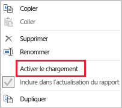

# Techniques de réduction des données pour la modélisation des importations

Cet article s’adresse aux modélisateurs de données Power BI Desktop développant des modèles d’importation. Il décrit différentes techniques permettant de réduire les données chargées dans les modèles d’importation.

Les modèles d’importation sont chargés avec des données qui sont compressées et optimisées, puis stockées sur disque par le moteur de stockage VertiPaq. Quand les données sources sont chargées en mémoire, il est possible de constater une compression de facteur 10 ; il est donc raisonnable de s’attendre à ce que 10 Go de données sources puissent être compressés à une taille d’environ 1 Go. En outre, quand les données sont conservées sur disque, une réduction supplémentaire de 20 % peut être obtenue.

Malgré l’efficacité du moteur de stockage VertiPaq, il est important que vous cherchiez à réduire les données à charger dans vos modèles. Cela est particulièrement vrai pour les grands modèles ou pour les modèles susceptibles de grandir au fil du temps. Voici quatre raisons intéressantes :

- Les tailles de modèle supérieures peuvent ne pas être prises en charge par votre capacité. La capacité partagée peut héberger des modèles d’une taille maximale de 1 Go, tandis que les capacités Premium peuvent héberger des modèles d’une taille maximale de 13 Go. Pour plus d’informations, consultez l’article [Prise en charge des grands jeux de données par Power BI Premium](../service-premium-large-datasets.md).
- Les tailles de modèle plus petites réduisent la contention des ressources de capacité, en particulier la mémoire. Cela permet de charger simultanément un plus grand nombre de modèles pendant des périodes plus longues, ce qui réduit les taux d’éviction. Pour plus d’informations, consultez la rubrique relative au [fonctionnement des capacités](../whitepaper-powerbi-premium-deployment.md#how-capacities-function) dans le livre blanc sur le [déploiement de Power BI Premium](../whitepaper-powerbi-premium-deployment.md).
- Les modèles plus petits accélèrent l’actualisation des données, ce qui réduit les signalements de latence, accroît le débit d’actualisation des jeux de données et réduit la pression sur le système source et les ressources de capacité.
- La réduction du nombre de lignes de table peut entraîner une accélération des évaluations de calcul, ce qui peut améliorer les performances globales des requêtes.

Cet article aborde huit techniques de réduction des données. Il s’agit des tables suivantes :

- [Supprimer les colonnes inutiles](#remove-unnecessary-columns)
- [Supprimer les lignes inutiles](#remove-unnecessary-rows)
- [Regrouper par et totaliser](#group-by-and-summarize)
- [Optimiser les types de données des colonnes](#optimize-column-data-types)
- [Privilégier les colonnes personnalisées](#preference-for-custom-columns)
- [Désactiver le chargement des requêtes Power Query](#disable-power-query-query-load)
- [Désactiver la date/heure automatique](#disable-auto-datetime)
- [Basculer vers le mode mixte](#switch-to-mixed-mode)

## Supprimer les colonnes inutiles

Les colonnes de table de modèle ont deux objectifs principaux :

- **Création de rapports**, pour obtenir des conceptions de rapport qui filtrent, regroupent et totalisent correctement les données de modèle
- **Structure du modèle**, en prenant en charge les relations de modèle, les calculs de modèle, les rôles de sécurité et même la mise en forme des couleurs de données

Les colonnes qui ne sont pas utilisées à ces fins peuvent probablement être supprimées. La suppression de colonnes est appelée _filtrage vertical_.

Nous vous recommandons de concevoir des modèles avec exactement le nombre approprié de colonnes en fonction des exigences de création de rapports connues. Bien entendu, ces exigences peuvent changer au fil du temps, mais gardez à l’esprit qu’il est ultérieurement plus facile d’ajouter des colonnes que d’en supprimer. La suppression de colonnes peut rompre les rapports ou la structure du modèle.

## Supprimer les lignes inutiles

Les tables de modèle doivent être chargées avec le moins de lignes possible. Pour ce faire, vous pouvez charger des ensembles de lignes filtrés dans des tables de modèle pour deux raisons différentes : pour effectuer un filtrage par entité ou en fonction du temps. La suppression de lignes est appelée _filtrage horizontal_.

Le **filtrage par entité** implique le chargement d’un sous-ensemble de données sources dans le modèle. Par exemple, au lieu de charger des faits de ventes pour toutes les régions de ventes, chargez uniquement les faits relatifs à une seule région. Cette approche de conception génère de nombreux modèles plus petits, et elle peut également éliminer la nécessité de définir une sécurité au niveau des lignes (mais nécessite d’accorder des autorisations spécifiques sur les jeux de données dans le service Power BI et de créer des rapports « dupliqués » qui se connectent à chaque jeu de données). Vous pouvez tirer parti de l’utilisation de paramètres Power Query et de fichiers de modèle Power BI pour simplifier la gestion et la publication. Pour plus d’informations, consultez l’entrée de blog [Présentation approfondie des paramètres de requête et des modèles Power BI](https://powerbi.microsoft.com/blog/deep-dive-into-query-parameters-and-power-bi-templates/).

Le **filtrage basé sur le temps** implique de limiter la quantité d’_historique des données_ chargée dans les tables de type fait (et de limiter les lignes de date chargées dans les tables de dates de modèle). Nous vous suggérons de ne pas charger automatiquement tout l’historique disponible, sauf s’il s’agit d’une exigence de création de rapports connue. Il est utile de comprendre que les filtres Power Query basés sur le temps peuvent être paramétrés et même configurés pour utiliser des périodes relatives (par rapport à la date d’actualisation, par exemple, les cinq dernières années). Gardez également à l’esprit que les modifications rétrospectives apportées aux filtres de temps n’interrompent pas les rapports ; l’historique des données est simplement moins (ou plus) disponible dans les rapports.

## Regrouper par et totaliser

La technique la plus efficace pour réduire la taille d’un modèle consiste peut-être à charger des données prétotalisées. Cette technique peut être utilisée pour élever la granularité des tables de type fait. Toutefois, cela se fait au prix d’une perte de détails.

Par exemple, une table de faits de ventes source stocke une ligne par ligne de commande. Vous pouvez réduire significativement les données en totalisant toutes les métriques de ventes, en regroupant par date, client et produit. Vous pouvez ensuite réduire encore plus les données en effectuant un regroupement par date _au niveau du mois_. Cela peut représenter une réduction de 99 % de la taille du modèle, mais bien sûr, la création de rapports au niveau du jour ou d’une commande spécifique n’est plus possible. La décision de totaliser des données de types de fait implique toujours un compromis. Ce compromis peut être atténué par une conception de modèle mixte, qui sera abordée plus loin dans la rubrique [Basculer vers le mode mixte](#switch-to-mixed-mode).

## Optimiser les types de données des colonnes

Le moteur de stockage VertiPaq utilise des structures de données distinctes pour chaque colonne. Par défaut, ces structures de données réalisent les optimisations les plus élevées pour les données de colonnes numériques, qui utilisent l’encodage de valeur. Toutefois, le texte et les autres données non numériques utilisent l’encodage de hachage. Cela nécessite que le moteur de stockage affecte un identificateur numérique à chaque valeur de texte unique contenue dans la colonne. Il s’agit de l’identificateur numérique, qui est ensuite stocké dans la structure de données, ce qui nécessite une recherche de hachage pendant le stockage et l’interrogation.

Dans certains cas spécifiques, vous pouvez convertir des données de texte source en valeurs numériques. Par exemple, un numéro de commande client peut être correctement préfixé par une valeur de texte (par exemple, « SO123456 »). Le préfixe peut être supprimé et la valeur du numéro de commande convertie en nombre entier. Pour les grandes tables, cela peut entraîner une réduction significative des données, en particulier quand la colonne contient des valeurs de cardinalité uniques ou élevées.

Dans cet exemple, nous vous recommandons de définir la propriété Total par défaut de la colonne sur « Ne pas totaliser ». Cela permet de limiter la totalisation non appropriée des valeurs de numéro de commande.

## Privilégier les colonnes personnalisées

Le moteur de stockage VertiPaq stocke les colonnes calculées de modèle (définies en DAX) comme des colonnes ordinaires fournies par Power Query. Toutefois, les structures de données sont stockées de façon légèrement différente et offrent généralement une compression moins efficace. En outre, elles sont générées une fois que toutes les tables Power Query sont chargées, ce qui peut entraîner des délais d’actualisation des données prolongés. Il est donc moins efficace d’ajouter des colonnes de table en tant que colonnes _calculées_ qu’en tant que colonnes _calculées_ Power Query (définies en M).

Dans la mesure du possible, privilégiez la création de colonnes personnalisées dans Power Query. Quand la source est une base de données, vous pouvez améliorer l’efficacité du chargement de deux manières. Le calcul peut être défini dans l’instruction SQL (à l’aide du langage de requête natif du fournisseur), ou il peut être matérialisé en tant que colonne dans la source de données.

Toutefois, dans certains cas, les colonnes calculées de modèle peuvent être le meilleur choix. Cela peut être le cas quand la formule implique l’évaluation de mesures ou qu’elle nécessite des fonctionnalités de modélisation spécifiques prises en charge uniquement dans les fonctions DAX. Pour plus d’informations sur un exemple de ce type, consultez l’article [Présentation des fonctions pour les hiérarchies parent-enfant dans DAX](/dax/understanding-functions-for-parent-child-hierarchies-in-dax).

## Désactiver le chargement des requêtes Power Query

Les requêtes Power Query conçues pour prendre en charge l’intégration de données à d’autres requêtes ne doivent pas être chargées dans le modèle. Pour éviter de charger la requête dans le modèle, veillez à désactiver le chargement des requêtes dans ces cas.

## Désactiver la date/heure automatique

Power BI Desktop comprend une option appelée _Date/heure automatique_. Quand elle est activée, elle crée une table de date/heure automatique masquée pour les colonnes de date afin de prendre en charge les auteurs de rapport lors de la configuration des filtres, du regroupement et de l’exploration des périodes de temps du calendrier. Les tables masquées sont en fait des tables calculées qui augmentent la taille du modèle. Pour obtenir des instructions sur l’utilisation de cette option, reportez-vous à l’article [Conseils sur la fonctionnalité de date/heure automatique dans Power BI Desktop](../desktop-auto-date-time.md).

## Basculer vers le mode mixte

Dans Power BI Desktop, une conception en mode mixte produit un modèle composite. Fondamentalement, il vous permet de déterminer le mode de stockage _pour chaque table_. Ainsi, la propriété Mode de stockage de chaque table peut être définie sur Importer ou DirectQuery (Double est une autre option).

Une technique efficace pour réduire la taille du modèle consiste à définir la propriété Mode de stockage sur DirectQuery pour les tables de type fait plus grandes. Vous pouvez combiner cette approche de conception avec la technique présentée plus haut dans la rubrique [Regrouper par et totaliser](#group-by-and-summarize). Par exemple, les données de ventes totalisées peuvent être utilisées pour obtenir des rapports « de synthèse » hautes performances. Une page d’extraction peut afficher des ventes granulaires pour un contexte de filtre spécifique (et étroit), affichant toutes les commandes client rattachées au contexte. Dans cet exemple, la page d’extraction inclut des visuels basés sur une table DirectQuery pour récupérer les données des commandes client.

Toutefois, il existe de nombreuses implications en matière de sécurité et de performances liées aux modèles composites. Pour plus d’informations, consultez l’article [Utiliser des modèles composites dans Power BI Desktop](../desktop-composite-models.md).

## Étapes suivantes

Pour plus d’informations sur la conception de modèles d’importation Power BI, consultez les articles suivants :

- [Utiliser des modèles composites dans Power BI Desktop](../desktop-composite-models.md)
- [Mode de stockage dans Power BI Desktop](../desktop-storage-mode.md)
