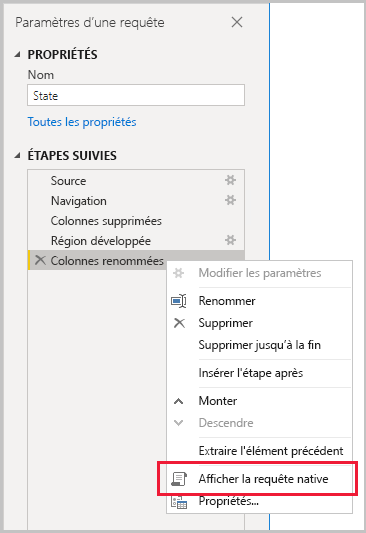
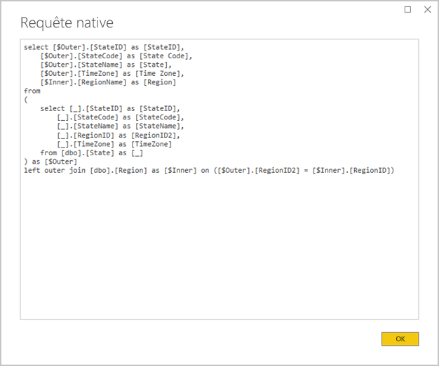
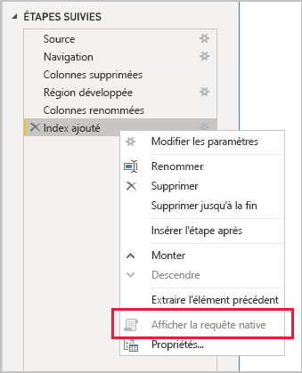

# <a name="the-importance-of-query-folding"></a>L’importance du Query Folding

Cet article s’adresse aux modélisateurs de données développant des modèles dans Power BI Desktop. Il décrit le Query Folding et explique son importance. Il décrit également les sources de données et les transformations qui peuvent obtenir le Query Folding et comment déterminer si vos requêtes Power Query peuvent être pliées, que ce soit entièrement ou partiellement. Enfin, il fournit des conseils sur les bonnes pratiques pour savoir quand et comment obtenir le Query Folding.

Le Query Folding est la possibilité pour une requête Power Query de générer une seule instruction de requête pour récupérer et transformer des données sources. Le moteur mashup Power Query s’efforce d’obtenir le Query Folding chaque fois que possible, car il permet d’établir le chemin le plus efficace pour connecter une table de modèle Power BI à sa source de données sous-jacente.

Le Query Folding est un concept important de la modélisation des données pour plusieurs raisons :

- **Tables de modèle en mode Import :** l’actualisation des données est efficace pour les tables de modèle en mode Import, en termes d’utilisation des ressources et de durée d’actualisation.
- **Tables en mode de stockage DirectQuery et Double :** chaque table en mode de stockage DirectQuery et Double doit être basée sur une requête Power Query qui peut être pliée.
- **Actualisation incrémentielle :** l’actualisation incrémentielle des données est efficace, en termes d’utilisation des ressources et de durée d’actualisation. De fait, la fenêtre de configuration Actualisation incrémentielle vous avertit si elle détermine que le Query Folding pour la table ne peut pas être obtenu. Dans ce cas, l’objectif de l’actualisation incrémentielle est invalidé. Le moteur mashup doit alors récupérer toutes les lignes sources, puis appliquer des filtres pour déterminer les modifications incrémentielles.

Le Query Folding peut se produire pour une requête Power Query entière ou pour un sous-ensemble de ses étapes. Quand le Query Folding ne peut pas être obtenu (partiellement ou complètement), le moteur mashup Power Query dans Power BI doit compenser en traitant lui-même les transformations de données. Cela peut impliquer la récupération des résultats de la requête source, opération lente et gourmande en ressources pour les jeux de données volumineux.

Nous recommandons que les modélisateurs de données visent l’efficacité dans leurs conceptions de modèle d’importation en veillant à ce que le Query Folding se produise chaque fois que possible.

## <a name="sources-that-support-query-folding"></a>Sources qui prennent en charge le Query Folding

La plupart des sources de données compatibles avec le concept de langage de requête prennent en charge le Query Folding. Ces sources de données peuvent inclure des bases de données relationnelles, des flux OData (notamment des listes SharePoint), Exchange et Active Directory. Toutefois, ce n’est généralement pas le cas des sources de données telles que les fichiers plats, les objets blob et le web.

## <a name="transformations-that-can-achieve-query-folding"></a>Transformations pouvant obtenir le Query Folding

Une transformation de source de données relationnelles pouvant être pliée par requête peut être écrite dans une seule instruction SELECT. Une instruction SELECT peut être construite avec les clauses WHERE, GROUP BY et JOIN appropriées. Elle peut également contenir des expressions de colonne (calculs) qui utilisent des fonctions intégrées communes prises en charge par les bases de données SQL.

En règle générale, la liste à puces suivante décrit les transformations qui peuvent être pliées par requête.

- Suppression de colonnes
- Renommage de colonnes (alias de colonnes dans une instruction SELECT)
- Filtrage de lignes, avec des valeurs statiques ou des paramètres Power Query (prédicats de clause WHERE)
- Regroupement et totalisation (clause GROUP BY)
- Développement de colonnes d’enregistrements (colonnes clés étrangères sources) pour obtenir une jointure de deux tables sources (clause JOIN)
- Fusion non approximative de requêtes pouvant être pliées en fonction de la même source (clause JOIN)
- Ajout de requêtes pouvant être pliées en fonction de la même source (opérateur UNION ALL)
- Ajout de colonnes personnalisées avec une _logique simple_ (expressions de colonne SELECT). Une logique simple implique des opérations peu compliquées, y compris éventuellement l’utilisation de fonctions M qui ont des fonctions équivalentes dans la source de données SQL, telles que les fonctions mathématiques ou de manipulation de texte. Par exemple, l’expression suivante retourne le composant année de la valeur de colonne **OrderDate** (pour retourner une valeur numérique).

    ```powerquery-m
    Date.Year([OrderDate])
    ```

- Ajout et suppression d’un tableau croisé dynamique (opérateurs PIVOT et UNPIVOT)

## <a name="transformations-that-prevent-query-folding"></a>Transformations qui empêchent le Query Folding

En règle générale, la liste à puces suivante décrit les transformations qui empêchent le Query Folding. Cette liste n’est pas exhaustive.

- Fusion de requêtes basées sur différentes sources
- Ajout de requêtes (union) basées sur différentes sources
- Ajout de colonnes personnalisées avec une _logique complexe_. Une logique complexe implique l’utilisation de fonctions M qui n’ont pas de fonctions équivalentes dans la source de données. Par exemple, l’expression suivante met en forme la valeur de colonne **OrderDate** (pour retourner une valeur de texte).

    ```powerquery-m
    Date.ToText([OrderDate], "yyyy")
    ```

- Ajout de colonnes d’index
- Changement du type de données d’une colonne

Quand une requête Power Query englobe plusieurs sources de données, l’incompatibilité des niveaux de confidentialité des sources de données peut empêcher le Query Folding. Pour plus d’informations, consultez l’article [Niveaux de confidentialité dans Power BI Desktop](../desktop-privacy-levels.md).

## <a name="determine-when-a-query-can-be-folded"></a>Déterminer quand une requête peut être pliée

Dans la fenêtre Éditeur Power Query, il est possible de déterminer quand une requête Power Query peut être pliée. Dans le volet **Paramètres de la requête**, quand vous cliquez avec le bouton droit sur la dernière étape appliquée, si l’option **Afficher la requête native** est activée (non grisée), la requête peut être pliée.



Pour afficher la requête pliée, sélectionnez l’option **Afficher la requête native**. Vous verrez alors la requête native que Power Query utilisera pour fournir des données.



Si l’option **Afficher la requête native** n’est pas activée (grisée), cela indique que toutes les étapes de la requête ne peuvent pas être pliées. Toutefois, il est possible qu’un sous-ensemble d’étapes puisse être plié. En remontant à partir de la dernière étape, vous pouvez vérifier chaque étape pour voir si l’option **Afficher la requête native** est activée. Quand cela se produit, vous saurez ainsi où, dans la séquence d’étapes, le Query Folding n’a plus pu être effectué.



## <a name="best-practice-guidance"></a>Conseils sur les bonnes pratiques

En résumé, pour une table de mode de stockage DirectQuery ou Double, la requête Power Query doit obtenir le Query Folding. Pour une table en mode Import basée sur une source relationnelle et dans l’hypothèse où une seule instruction SELECT peut être construite, vous pouvez obtenir les _meilleures performances d’actualisation des données_ en vous assurant que le Query Folding peut se produire. Si le moteur mashup est toujours requis pour traiter les transformations, vous devez vous efforcer de réduire le travail qu’il doit effectuer, en particulier pour les jeux de données volumineux.

La liste à puces suivante fournit des conseils sur les bonnes pratiques.

- **Déléguer la plus grande quantité possible de traitement à la source de données :** quand toutes les étapes d’une requête Power Query ne peuvent pas être pliées, découvrez l’étape qui empêche le Query Folding. Dans la mesure du possible, déplacez les étapes suivantes plus en amont dans la séquence afin qu’elles puissent être prises en compte dans le Query Folding. Le moteur mashup Power Query peut être suffisamment intelligent pour réorganiser les étapes de requête quand il génère la requête source.

Pour une source de données relationnelle, si l’étape qui empêche le Query Folding peut être obtenue dans une seule instruction SELECT ou dans la logique procédurale d’une procédure stockée, envisagez d’utiliser une instruction de requête native, comme décrit ci-après.

- **Utiliser une requête SQL native :** quand une requête Power Query récupère des données d’une source relationnelle, il est possible d’utiliser une requête SQL native. La requête peut en fait être toute instruction valide, y compris l’exécution d’une procédure stockée. Si l’instruction génère plusieurs jeux de résultats, seul le premier est retourné. Les paramètres peuvent être déclarés dans l’instruction ; nous vous recommandons d’utiliser la fonction M [Value.NativeQuery](/powerquery-m/value-nativequery) pour passer les valeurs des paramètres de manière sécurisée et pratique. Il est important de comprendre que le moteur mashup Power Query ne peut pas plier les étapes de requête suivantes ; il est donc important d’inclure toute la logique de transformation (dans la mesure du possible) dans l’instruction de requête native.

    Quand vous utilisez des requêtes SQL natives, gardez à l’esprit deux points importants :

    - Pour une table de modèle DirectQuery, la requête doit être une instruction SELECT et ne peut pas utiliser d’expressions de table communes (CTE) ou une procédure stockée.
    - L’actualisation incrémentielle ne peut pas tirer parti d’une requête SQL native. Elle oblige donc le moteur mashup Power Query à récupérer toutes les lignes sources, puis à appliquer des filtres pour déterminer les modifications incrémentielles.

    > [!IMPORTANT]
    > Une requête native peut faire plus que récupérer des données. Toute instruction valide peut être exécutée (éventuellement plusieurs fois), y compris pour modifier ou supprimer des données. Il est important d’appliquer le principe du moindre privilège afin de s’assurer que le compte utilisé pour accéder à la base de données dispose uniquement de l’autorisation de lecture sur les données requises.

- **Préparer et transformer les données dans la source :** si vous déterminez que certaines étapes de requête Power Query ne peuvent pas être pliées, il peut être possible d’appliquer les transformations dans la source de données. Pour ce faire, vous pouvez écrire une vue de base de données qui transforme logiquement les données sources ou préparer et matérialiser les données physiquement avant leur interrogation par Power BI. Généralement composé de sources pré-intégrées de données organisationnelles, un entrepôt de données relationnelles est un excellent exemple de données préparées.

## <a name="next-steps"></a>Étapes suivantes

Pour plus d’informations sur le Query Folding et les articles connexes, consultez les ressources suivantes :

- [Utiliser des modèles composites dans Power BI Desktop](../desktop-composite-models.md)
- [Actualisation incrémentielle dans Power BI Premium](../service-premium-incremental-refresh.md)
- [Utilisation de Table.View pour implémenter le Query Folding](/power-query/handlingqueryfolding)
- Vous avez des questions ? [Essayez d’interroger la communauté Power BI](https://community.powerbi.com/)
