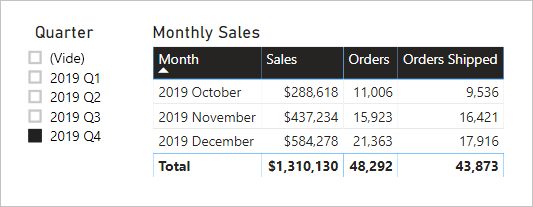

# <a name="active-vs-inactive-relationship-guidance"></a>Aide pour les relations actives et inactives

Cet article s’adresse principalement aux modélisateurs de données qui utilisent Power BI Desktop. Il vous fournit une aide pour créer des relations de modèle actives ou inactives au bon moment. Par défaut, les relations actives propagent les filtres vers d’autres tables. Toutefois, la relation inactive ne propage les filtres que lorsqu’une expression DAX active (utilise) la relation.

[!INCLUDE [relationships-prerequisite-reading](includes/relationships-prerequisite-reading.md)]

## <a name="active-relationships"></a>Relations actives

Généralement, nous vous recommandons de définir des relations actives chaque fois que cela est possible. Elles élargissent l’étendue et le potentiel de la manière dont votre modèle peut être utilisé par les auteurs de rapports et les utilisateurs qui travaillent avec les Q/R.

Prenons l’exemple d’un modèle d’importation conçu pour analyser les performances de ponctualité des liaisons aériennes (OTP). Le modèle a une table **Flight**, qui est une table de type fait stockant une ligne par vol. Chaque ligne enregistre la date du vol, le numéro de vol, les aéroports de départ et d’arrivée ainsi que le retard (en minutes). Il y a également une table **Aéroport**, qui est une table de type dimension stockant une ligne par aéroport. Chaque ligne décrit le code de l’aéroport, le nom de l’aéroport et le pays.

Voici un diagramme de modèle partiel des deux tables.


Il existe deux relations de modèle entre les tables **Flight** et **Airport**. Dans la table **Flight**, les colonnes **DepartureAirport** et **ArrivalAirport** sont liées à la colonne **Airport** de la table **Airport**. Dans la conception de schéma en étoile, la table **Aéroport** est décrite comme une [dimension de rôle actif](star-schema.md#role-playing-dimensions). Dans ce modèle, les deux rôles sont _aéroport de départ_ et _aéroport d’arrivée_.

Bien que cette conception fonctionne bien pour les conceptions de schémas en étoile relationnels, elle ne s’applique pas aux modèles Power BI. Cela est dû au fait que les relations de modèle sont des chemins de propagation des filtre et que ces chemins doivent être déterministes. Pour cette raison, un modèle ne peut pas avoir plusieurs relations actives entre deux tables. Par conséquent, comme décrit dans cet exemple, une relation est active tandis que l’autre (représentée par la ligne en pointillés) est inactive. Plus précisément, c’est la relation avec la colonne **ArrivalAirport** qui est active. Cela signifie que les filtres appliqués à la table **Airport** sont automatiquement propagés à la colonne **ArrivalAirport** de la table **Flight**.

Cette conception de modèle impose des restrictions sévères concernant la façon dont les données peuvent être signalées. Plus précisément, il n’est pas possible de filtrer la table **Airport** pour isoler automatiquement les détails de vol d’un aéroport de départ. Comme les exigences de création de rapports impliquent le filtrage (ou le regroupement) _simultané_ par aéroports de départ et d’arrivée, deux relations actives sont nécessaires. La traduction de cette exigence dans une conception de modèle Power BI signifie que le modèle doit avoir deux tables d’aéroports.

Voici la conception de modèle améliorée.


Le modèle a maintenant deux tables d’aéroports : **Aéroport de départ** et **Aéroport d’arrivée**. Les relations de modèle entre ces tables et la table **Vol** sont actives. Notez également que les noms des colonnes dans les tables **Aéroport de départ** et **Aéroport d’arrivée** sont précédés du mot _Départ_ ou _Arrivée_.

La conception de modèle améliorée prend en charge la conception de rapport suivante.


La page de rapport filtre par Melbourne comme aéroport de départ, et les groupes de visuels de table filtrent par aéroports d’arrivée.

> [!NOTE]
> Pour les modèles d’importation, la table supplémentaire a entraîné une augmentation de la taille du modèle et des temps d’actualisation plus longs. En soi, cela contredit les recommandations faites dans l’article [Techniques de réduction des données pour la modélisation des importations](import-modeling-data-reduction.md). Toutefois, dans l’exemple mentionné, la nécessité d’avoir uniquement des relations actives remplace ces recommandations.
>
> De plus, il est courant que les tables de type dimension contiennent des nombres de lignes faibles par rapport aux nombres de lignes de tables de type fait. Ainsi, l’augmentation de la taille du modèle et des temps d’actualisation n’est pas susceptible d’être excessivement importante.

### <a name="refactoring-methodology"></a>Méthodologie de refactorisation

Voici une méthodologie permettant de refactoriser un modèle à partir d’une table de type dimension à rôle actif unique en conception avec _une table par rôle_.

1. Supprimer des relations inactives.
2. Envisagez de renommer la table de type dimension à rôle actif pour mieux décrire son rôle. Dans l’exemple, la table **Aéroport** est associée à la colonne **ArrivalAirport** de la table **Flight**, qui est donc renommée **Aéroport d’arrivée**.
3. Créez une copie de la table de rôle actif en lui attribuant un nom qui reflète son rôle. S’il s’agit d’une table d’importation, nous vous recommandons de définir une table calculée. S’il s’agit d’une table DirectQuery, vous pouvez dupliquer la requête Power Query.

    Dans l’exemple, la table **Aéroport de départ** a été créé à l’aide de la définition de table calculée suivante.

    ```dax
    Departure Airport = 'Arrival Airport'
    ```

4. Créez une relation active pour associer la nouvelle table.
5. Envisagez de renommer les colonnes dans les tables afin qu’elles reflètent précisément leur rôle. Dans l’exemple, toutes les colonnes sont précédées du mot _Départ_ ou _Arrivée_. Ces noms garantissent que les visuels des rapports auront des étiquettes autodescriptives et non ambiguës. L’expérience Q/R est également améliorée, ce qui permet aux utilisateurs d’écrire facilement leurs questions.
6. Envisagez d’ajouter des descriptions aux tables de rôle actif. (Dans le volet **Champs**, une description s’affiche dans une info-bulle lorsqu’un auteur de rapport pointe sur la table.) De cette façon, vous pouvez communiquer les détails supplémentaires de la propagation de filtre à vos auteurs de rapports.

## <a name="inactive-relationships"></a>Relations inactives

Dans certains cas, les relations inactives peuvent répondre à des besoins spécifiques en matière de création de rapports.

Examinons à présent les différentes exigences en matière de modèles et de rapports :

- Un modèle de vente contient une table **Ventes** qui comporte deux colonnes de date : **OrderDate** et **ShipDate**
- Chaque ligne de la table **Ventes** enregistre une seule commande.
- Les filtres de date sont presque toujours appliqués à la colonne **OrderDate**, qui stocke toujours une date valide.
- Une seule mesure nécessite une propagation de filtre de date vers la colonne **ShipDate**, qui peut contenir des VIDES (jusqu’à ce que la commande soit expédiée)
- Il n’est pas obligatoire de filtrer (ou de regrouper) simultanément par périodes de dates de commande _et_ de date d’expédition

Voici un diagramme de modèle partiel des deux tables.


Il existe deux relations de modèle entre les tables **Ventes** et **Date**. Dans la table **Ventes**, les colonnes **OrderDate** et **ShipDate** sont liées à la colonne **Date** de la table **Date**. Dans ce modèle, les deux rôles de la table **Date** sont _Date de commande_ et _Date d’expédition_. C’est la relation avec la colonne **OrderDate** qui est active.

Les six mesures, à l’exception d’une, doivent filtrer par la colonne **OrderDate**. Toutefois, la mesure **Commandes expédiées** doit être filtrée par la colonne **ShipDate**.

Voici la définition de mesure **Commandes**. Elle compte simplement les lignes de la table **Ventes** dans le contexte de filtre. Tous les filtres appliqués à la table **Date** sont propagés à la colonne **OrderDate**.

```dax
Orders = COUNTROWS(Sales)
```

Voici la définition de mesure **Commandes expédiées**. Elle utilise la fonction [USERELATIONSHIP](/dax/userelationship-function-dax) DAX, qui active la propagation de filtre pour une relation spécifique uniquement pendant l’évaluation de l’expression. Dans cet exemple, la relation avec la colonne **ShipDate** est utilisée.

```dax
Orders Shipped =
CALCULATE(
    COUNTROWS(Sales)
    ,USERELATIONSHIP('Date'[Date], Sales[ShipDate])
)
```

Cette conception de modèle prend en charge la conception de rapport suivante.



Les filtres de page de rapport par trimestre 2019 Q4. Les visuels de table sont regroupés par mois et affichent différentes statistiques de ventes. Les mesures **Commandes** et **Commandes expédiées** donnent des résultats différents. Elles utilisent chacune la même logique de résumé (nombre de lignes de la table **Ventes**), mais une propagation différente du filtre de table **Date**.

Notez que le segment trimestre comprend un élément VIDE. Cet élément de segment s’affiche à la suite de l'[expansion de table](../desktop-relationships-understand.md#strong-relationships). Alors que chaque ligne de table **Ventes** a une date de commande, certaines lignes ont une date d’expédition VIDE. Ces commandes ne sont pas encore expédiées. L’expansion de table prend également en compte les relations inactives. Des VIDES peuvent donc apparaître en raison des VIDES du côté « plusieurs » de la relation, ou en raison de problèmes d’intégrité des données.

## <a name="recommendations"></a>Recommandations

Bref, nous vous recommandons de définir des relations actives chaque fois que cela est possible. Elles élargissent l’étendue et le potentiel de la manière dont votre modèle peut être utilisé par les auteurs de rapports et les utilisateurs qui travaillent avec les Q/R. Cela signifie que les tables de type dimension à rôle actif doivent être dupliquées dans votre modèle.

Dans certains cas, toutefois, vous pouvez définir une ou plusieurs relations inactives pour une table de type dimension à rôle actif. Vous pouvez envisager cette conception dans les cas suivants :

- Il n’est pas obligatoire que les visuels du rapport filtrent simultanément par rôles différents
- Vous utilisez la fonction DAX USERELATIONSHIP pour activer une relation spécifique pour les calculs de modèle pertinents

## <a name="next-steps"></a>Étapes suivantes

Pour plus d’informations en rapport avec cet article, consultez les ressources suivantes :

- [Relations de modèle dans Power BI Desktop](../desktop-relationships-understand.md)
- [Comprendre le schéma en étoile et son importance pour Power BI](star-schema.md)
- [Aide à la résolution des problèmes de relations](relationships-troubleshoot.md)
- Vous avez des questions ? [Essayez d’interroger la communauté Power BI](https://community.powerbi.com/)
- Vous avez des suggestions ? [Envoyez-nous vos idées pour améliorer Power BI](https://ideas.powerbi.com/)
