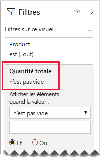

# <a name="bi-directional-relationship-guidance"></a>Aide pour la relation bidirectionnelle

Cet article s’adresse principalement aux modélisateurs de données qui utilisent Power BI Desktop. Il vous fournit une aide pour créer des relations de modèle bidirectionnelles au bon moment. Une relation bidirectionnelle est une relation qui filtre _dans les deux directions_.

[!INCLUDE [relationships-prerequisite-reading](includes/relationships-prerequisite-reading.md)]

En général, nous recommandons de réduire au minimum l’utilisation des relations bidirectionnelles. Elles peuvent avoir un impact négatif sur les performances des requêtes du modèle et, éventuellement, être à l’origine d’une confusion pour les utilisateurs de vos rapports.

Il existe trois scénarios dans lesquels le filtrage bidirectionnel peut répondre à des exigences spécifiques :

- [Relations de modèle spéciales](#special-model-relationships)
- [Éléments de segment « avec données »](#slicer-items-with-data)
- [Analyse de dimension à dimension](#dimension-to-dimension-analysis)

## <a name="special-model-relationships"></a>Relations de modèle spéciales

Les relations bidirectionnelles jouent un rôle important lors de la création des deux types de relations de modèle spéciales suivantes :

- **Un-à-un** : toutes les relations un-à-un doivent être bidirectionnelles : il n’est pas possible de les configurer autrement. En règle générale, nous vous déconseillons de créer ces types de relations. Pour une présentation complète et des conceptions alternatives, consultez [Aide pour les relations un-à-un](relationships-one-to-one.md).
- **Plusieurs-à-plusieurs** : Lors de la mise en relation de deux tables de type dimension, une table de pontage est requise. Un filtre bidirectionnel est requis pour garantir la propagation des filtres dans la table de pontage. Pour plus d’informations, consultez l’[aide sur les relations plusieurs-à-plusieurs (associer des dimensions plusieurs-à-plusieurs)](relationships-many-to-many.md#relate-many-to-many-dimensions).

## <a name="slicer-items-with-data"></a>Éléments de segment « avec données »

Les relations bidirectionnelles peuvent fournir des segments qui limitent les éléments là où il y a des données. (Si vous êtes familiarisé avec les tableaux croisés dynamiques et les segments Excel, c’est le comportement par défaut lorsque vous approvisionnez des données à partir d’un jeu de données Power BI ou d’un modèle Analysis Services.) Pour mieux expliquer ce que cela signifie, commencez par examiner le diagramme de modèle suivant.


La première table est nommée **Client** et contient trois colonnes : **Pays-Région**, **Client** et **CustomerCode**. La deuxième table est nommée **Produit** et contient trois colonnes : **Couleur**, **Produit** et **SKU**. La troisième table est nommée **Ventes** et contient quatre colonnes : **CustomerCode**, **OrderDate**, **Quantité** et **SKU**. Les tables **Client** et **Produit** sont des tables de type dimension, chacune ayant une relation un-à-plusieurs avec la table **Ventes**. Chaque relation filtre dans une seule direction.

Pour mieux décrire le fonctionnement du filtrage bidirectionnel, le diagramme de modèle a été modifié afin d’afficher les lignes de la table. Tous les exemples de cet article sont basés sur ces données.

> [!NOTE]
> Il n’est pas possible d’afficher les lignes de la table dans le diagramme de modèle Power BI Desktop. Cette opération est effectuée dans cet article pour étayer la discussion avec des exemples clairs.


Les détails des lignes pour les trois tables sont décrits dans la liste à puces suivante :

- La table **Customer** comporte deux lignes :
  - **CustomerCode** CUST-01, **Client** Client-1, **Pays-Région** États-Unis
  - **CustomerCode** CUST-02, **Client** Client-2, **Pays-Région** Australie
- La table **Produit** a trois lignes :
  - **SKU** CL-01, **Produit** T-shirt, **Couleur** Vert
  - **SKU** CL-02, **Produit** Jeans, **Couleur** Bleu
  - **SKU** AC-01, **Produit** Chapeau, **Couleur** Bleu
- La table **Ventes** a trois lignes :
  - **OrderDate** 1er janvier 2019, **CustomerCode** CUST-01, **SKU** CL-01, **Quantité** 10
  - **OrderDate** 2 février 2019, **CustomerCode** CUST-01, **SKU** CL-02, **Quantité** 20
  - **OrderDate** 3 mars 2019, **CustomerCode** CUST-02, **SKU** CL-01, **Quantité** 30

Puis, considérons la page de rapport suivante :


La page se compose de deux segments et d’un visuel de carte. Le premier segment correspond à **Pays-Région** et comporte deux éléments : Australie et États-Unis. Le segment actuel est Australie. Le deuxième segment est pour **Produit** et a trois éléments : chapeau, jeans et T-shirt. Aucun élément n’est sélectionné (ce qui signifie qu’_aucun produit_ n’est filtré). Le visuel de la carte affiche une quantité de 30.

Dans le segment Australie, les utilisateurs du rapport souhaitent peut-être limiter le segment **Produit** pour afficher les éléments où les données _se rapportent_ aux ventes australiennes. C’est ce que signifie l’affichage d’éléments de segment « avec des données ». Vous pouvez induire ce comportement en configurant la relation entre les tables **Produit** et **Ventes** pour filtrer dans les deux directions.


Le segment **Produit** affiche désormais un seul élément : T-shirt. Cet élément représente le seul produit vendu à des clients australiens.


Nous suggérons de vérifier avec soin si cette conception fonctionne pour les utilisateurs de votre rapport. Elle peut être à l’origine d’une confusion pour certains d’entre eux. Ils ne comprennent pas pourquoi des éléments de segments apparaissent ou disparaissent de façon dynamique lorsqu’ils interagissent avec d’autres segments.

Si vous décidez de montrer des éléments de segments « avec des données », nous vous déconseillons de configurer des relations bidirectionnelles. Les relations bidirectionnelles requièrent plus de traitements et peuvent donc avoir un impact négatif sur les performances des requêtes – en particulier à mesure que le nombre de relations bidirectionnelles dans votre modèle augmente.

Il y a une meilleure manière d’obtenir le même résultat : Au lieu d’utiliser des filtres bidirectionnels, vous pouvez appliquer un filtre au niveau du visuel au segment **Produit** proprement dit.

Supposons maintenant que la relation entre les tables **Produit** et **Ventes** ne filtre plus dans les deux directions. Et que la définition de mesure suivante a été ajoutée à la table **Ventes**.

```dax
Total Quantity = SUM(Sales[Quantity])
```

Pour afficher les éléments de segments **Produit** « avec des données », il suffit de filtrer avec la mesure **Quantité totale** à l’aide de la condition « n’est pas vide».



## <a name="dimension-to-dimension-analysis"></a>Analyse de dimension à dimension

Un autre scénario impliquant des relations bidirectionnelles traite une table de type fait, telle qu’une table de pontage. De cette façon, il prend en charge l’analyse des données de table de type dimension dans le contexte du filtre d’une table de type dimension différente.

À l’aide de l’exemple de modèle de cet article, réfléchissez à la façon dont les questions suivantes peuvent être traitées :

- Combien de couleurs ont été vendues aux clients australiens ?
- Combien de pays ont acheté des jeans ?

Il est possible de répondre à ces deux questions _sans_ faire un résumé des données dans la table de type de fait de pontage. Toutefois, il est indispensable que les filtres se propagent d’une table de type dimension à l’autre. Une fois que les filtres sont propagés par le biais de la table de type fait, le résumé des colonnes de la table de type dimension peut être obtenu à l’aide de la fonction [DISTINCTCOUNT](/dax/distinctcount-function-dax) DAX, et éventuellement des fonctions [MIN](/dax/min-function-dax) et [MAX](/dax/max-function-dax).

Comme la table de type fait se comporte comme une table de pontage, vous pouvez suivre les instructions d’aide pour les relation plusieurs-à-plusieurs pour associer deux tables de type dimension. Vous devrez configurer au moins une relation pour filtrer les deux directions. Pour plus d’informations, consultez l’[aide sur les relations plusieurs-à-plusieurs (associer des dimensions plusieurs-à-plusieurs)](relationships-many-to-many.md#relate-many-to-many-dimensions).

Toutefois, comme décrit dans cet article, cette conception aura probablement un impact négatif sur les performances et sur l’expérience utilisateur concernant les [éléments de segments « avec des données »](#slicer-items-with-data). Par conséquent, à la place, nous vous recommandons d’activer le filtrage bidirectionnel _dans une définition de mesure_ à l’aide de la fonction DAX [CROSSFILTER](/dax/crossfilter-function). La fonction CROSSFILTER peut être utilisée pour modifier des directions de filtrage, voire pour désactiver la relation pendant l’évaluation d’une expression.

Supposez que la définition de mesure suivante a été ajoutée à la table **Ventes**. Dans cet exemple, la relation de modèle entre les tables **Client** et **Ventes** a été configurée pour filtrer dans une _seule direction_.

```dax
Different Countries Sold =
CALCULATE(
    DISTINCTCOUNT(Customer[Country-Region]),
    CROSSFILTER(
        Customer[CustomerCode],
        Sales[CustomerCode],
        BOTH
    )
)
```

Lors de l’évaluation de l’expression de mesure **Différents pays de vente**, la relation entre les tables **Client** et **Ventes** est filtrée dans les deux directions.

Le visuel de tableau suivant présente les statistiques pour chaque produit vendu. La colonne **Quantité** est simplement la somme des valeurs de quantité. La colonne **Différents pays de vente** représente le nombre distinct de valeurs pays-région de tous les clients qui ont acheté le produit.


## <a name="next-steps"></a>Étapes suivantes

Pour plus d’informations en rapport avec cet article, consultez les ressources suivantes :

- [Relations de modèle dans Power BI Desktop](../transform-model/desktop-relationships-understand.md)
- [Comprendre le schéma en étoile et son importance pour Power BI](star-schema.md)
- [Aide pour la relation un-à-un](relationships-one-to-one.md)
- [Conseils sur les relations Plusieurs-à-plusieurs](relationships-many-to-many.md)
- [Aide à la résolution des problèmes de relations](relationships-troubleshoot.md)
- Vous avez des questions ? [Essayez d’interroger la communauté Power BI](https://community.powerbi.com/)
- Vous avez des suggestions ? [Envoyez-nous vos idées pour améliorer Power BI](https://ideas.powerbi.com/)