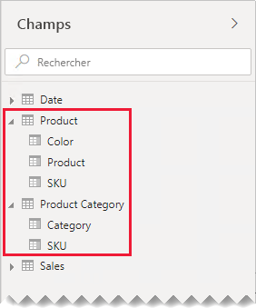
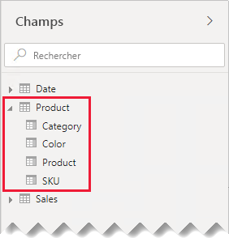
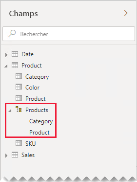
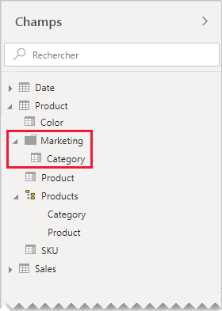

# Aide pour la relation un-à-un

Cet article s’adresse principalement aux modélisateurs de données qui utilisent Power BI Desktop. Il vous fournit une aide pour l’utilisation des relations de modèle un-à-un. Une relation un-à-un peut être créée lorsque les deux tables contiennent chacune une colonne de valeurs communes et uniques.

[!INCLUDE [relationships-prerequisite-reading](includes/relationships-prerequisite-reading.md)]

Deux scénarios qui impliquent des relations un-à-un :

- [Dégénérer les dimensions](#degenerate-dimensions) : Vous pouvez dériver une [dimension dégénérée](star-schema.md#degenerate-dimensions) d’une table de type de fait.
- [Les données de ligne s’étendent sur les tables](#row-data-spans-across-tables) : Une entité ou un objet métier unique est chargé comme deux tables de modèle (ou plus), peut-être parce que leurs données proviennent de magasins de données différents. Ce scénario peut concerner les tables de type dimension. Par exemple, les détails du produit maître sont stockés dans un système de vente opérationnel et les détails supplémentaires du produit dans une autre source.

    Toutefois, il est rare que vous mettiez en relation deux tables de type fait avec une relation un-à-un. Cela est dû au fait que les deux tables de type fait doivent avoir la même dimensionnalité et la même granularité. En outre, chaque table de type fait aurait besoin de colonnes uniques pour permettre de créer la relation de modèle.

## Dimensions de fait

Lorsque les colonnes d’une table de type fait sont utilisées pour le filtrage ou le regroupement, vous pouvez envisager de les rendre disponibles dans une table distincte. De cette façon, vous séparez les colonnes utilisées pour le filtrage ou le regroupement des colonnes utilisées pour résumer les lignes de faits. Grâce a cette séparation, vous pouvez effectuer les opérations suivantes :

- Réduire l'espace de stockage
- Simplifier les calculs de modèle
- Contribuer à améliorer les performances des requêtes
- Fournir une expérience plus intuitive du volet **Champs** à vos auteurs de rapports

Prenons l’exemple d’une table des ventes source qui stocke les détails des commandes clients dans deux colonnes.

La colonne **OrderNumber** stocke le numéro de commande, et la colonne **OrderLineNumber** stocke une séquence de lignes dans la commande.

Dans le diagramme de modèle suivant, notez que les colonnes Numéro de commande et Numéro de ligne de commande n’ont pas été chargées dans la table **Ventes**. Au lieu de cela, leurs valeurs ont été utilisées pour créer une colonne de [clés de substitution](star-schema.md#surrogate-keys) nommée **SalesOrderLineID**. (La valeur de clé est calculée en multipliant le numéro de commande par 1 000, puis en ajoutant le numéro de la ligne de commande.)

La table **Commande client** fournit une expérience riche pour les auteurs de rapports avec trois colonnes : **Commande client**, **Ligne de commande client** et **Numéro de ligne**. Elle comprend également une hiérarchie. Ces ressources de table prennent en charge les conceptions de rapports qui doivent filtrer, regrouper ou parcourir les commandes et les lignes de commande.

Comme la table **Commande client** est dérivée des données de ventes, il devrait y avoir exactement le même nombre de lignes dans chaque table. De plus, il devrait y avoir des valeurs correspondantes entre chaque colonne **SalesOrderLineID**.

## Les données de ligne s’étendent sur les tables

Prenons un exemple impliquant des tables de type dimension associées un-à-un : **Produit** et **Catégorie de produit**. Chaque table représente des données importées et a une colonne **SKU** (Stock-Keeping Unit) contenant des valeurs uniques.

Voici un diagramme de modèle partiel des deux tables.

La première table est nommée **Produit** et contient trois colonnes : **Couleur**, **Produit** et **SKU**. La deuxième table est nommée **Catégorie de produit** et contient deux colonnes : **Catégorie** et **SKU**. Une relation un-à-un lie les deux colonnes **SKU**. La relation filtre dans les deux directions, comme toujours pour les relations un-à-un.

Pour mieux décrire le fonctionnement de la propagation de filtres de relation, le diagramme de modèle a été modifié afin d’afficher les lignes de la table. Tous les exemples de cet article sont basés sur ces données.

> [!NOTE]
> Il n’est pas possible d’afficher les lignes de la table dans le diagramme de modèle Power BI Desktop. Cette opération est effectuée dans cet article pour étayer la discussion avec des exemples clairs.

Les détails des lignes pour les deux tables sont décrits dans la liste à puces suivante :

- La table **Produit** a trois lignes :
  - **SKU** CL-01, **Produit** T-shirt, **Couleur** Vert
  - **SKU** CL-02, **Produit** Jeans, **Couleur** Bleu
  - **SKU** AC-01, **Produit** Chapeau, **Couleur** Bleu
- La table **Catégorie de produit** a deux lignes :
  - **SKU** CL-01, **Catégorie** Vêtements
  - **SKU** AC-01, **Catégorie** Accessoires

Notez que la table **Catégorie de produit** n’inclut pas de ligne pour le produit SKU CL-02. Nous évoquerons les conséquences de cette ligne manquante plus loin dans cet article.

Dans le volet **Champs**, les auteurs des rapports trouveront des champs liés aux produits dans deux tables : **Produit** et **Catégorie de produit**.

Voyons ce qui se passe lorsque des champs des deux tables sont ajoutés à un visuel de table. Dans cet exemple, la colonne **SKU** provient de la table **Produit**.

Notez que la valeur **Catégorie** pour le produit SKU CL-02 est VIDE. La raison en est qu’il n’y a pas de ligne dans la table **Catégorie de produit** pour ce produit.

### Recommandations

Si cela est possible, nous vous recommandons d’éviter de créer des relations de modèle un-à-un lorsque des données de lignes s’étendent sur des tables de modèles. En effet, cette conception peut avoir les effets suivants :

- Contribuer à encombrer le volet **Champs** en répertoriant plus de tables que nécessaire.
- Rendre difficile pour les auteurs de rapports de trouver des champs liés, puisqu’ils sont répartis sur plusieurs tables.
- Limiter la capacité à créer des hiérarchies, étant donné que leurs niveaux doivent être basés sur des colonnes de la _même table_
- Donner des résultats inattendus lorsqu’il y a une correspondance complète de lignes entre les tables

Des recommandations spécifiques diffèrent selon que la relation un-à-un est _intra-îlots_ ou _inter-îlots_. Pour plus d’informations sur l’évaluation des relations, consultez [Relations de modèle dans Power BI Desktop (évaluation de la relation)](../transform-model/desktop-relationships-understand.md#relationship-evaluation).

### Relation un-à-un intra-îlot

Lorsqu’il y a une relation un-à-un _intra-îlot_ entre des tables, nous recommandons de consolider les donnés dans une table de modèle unique. Pour ce faire, il faut fusionner les requêtes Power Query.

Les étapes suivantes présentent une méthodologie pour consolider et modéliser les données relationnelles un-à-un :

1. **Fusionner des requêtes** : Lorsque les [deux requêtes sont combinées](../connect-data/desktop-shape-and-combine-data.md#combine-queries), veillez à ce que les données de chaque requête soient complètes. Si une requête contient un ensemble complet de lignes (comme une liste maître), fusionnez l’autre requête avec elle. Configurez la transformation de fusion pour utiliser une _jointure externe gauche_, qui est le type de jointure par défaut. Ce type de jointure garantit que vous conservez toutes les lignes de la première requête et les complétez avec toutes les lignes correspondantes de la deuxième requête. Développez toutes les colonnes requises de la deuxième requête dans la première requête.
2. **Désactiver le chargement des requêtes** : Veillez à [désactiver le chargement](import-modeling-data-reduction.md#disable-power-query-query-load) de la deuxième requête. Ainsi, elle ne chargera pas son résultat comme table de modèle. Cette configuration réduit la taille de stockage du modèle de données et aide à désencombrer le volet **Champs**.

    Dans notre exemple, les auteurs de rapports trouvent maintenant une seule table nommée **Produit** dans le volet **Champs**. Elle contient tous les champs liés aux produits.

    
3. **Remplacer des valeurs manquantes** : si la deuxième requête a des lignes sans correspondance, des valeurs NULL s’affichent dans les colonnes qu’elle introduit. Le cas échéant, envisagez de remplacer les valeurs NULL par une valeur de jeton. Le remplacement de valeurs manquantes est particulièrement important lorsque les auteurs de rapports filtrent ou regroupent par valeurs de colonnes, étant donné que les VIDES pourraient s’afficher dans les visuels du rapport.

    Dans le visuel du tableau suivant, notez que maintenant, la catégorie du produit SKU CL-02 est _[Undefined]_ . Dans la requête, les catégories null ont été remplacées par cette valeur de texte de jeton.

    

4. **Créer des hiérarchies** : s’il y a des relations _entre les colonnes_ de la table consolidée, envisagez de créer des hiérarchies. Ainsi, les auteurs de rapports peuvent rapidement identifier des opportunités d’approfondissement de visuels de rapports.

    Dans notre exemple, les auteurs de rapports peuvent maintenant utiliser une hiérarchie à deux niveaux : **Catégorie** et **Produit**.

    

Si vous souhaitez savoir comment séparer des tables vous aide à organiser vos champs, nous recommandons également la consolidation dans une seule table. Vous pouvez toujours organiser vos champs, mais en utilisant l’_affichage des dossiers_ à la place.

Dans notre exemple, les auteurs des rapports peuvent trouver le champ **Catégorie** dans le dossier d’affichage **Marketing**.

Si vous souhaitez toujours définir les relations un-à-un intra-îlots dans votre modèle, vérifiez si possible qu’il y a des lignes correspondantes dans les tables liées. Une relation intra-îlot un-à-un étant évaluée comme une [relation régulière](../transform-model/desktop-relationships-understand.md#regular-relationships), les problèmes d’intégrité des données peuvent se traduire par des VIDES dans vos visuels de rapports. (Vous pouvez voir un exemple de regroupement VIDE dans le premier visuel de table présenté dans cet article.)

### Relation un-à-un inter-îlot

Lorsqu’il existe une relation un-à-un _inter-îlot_ entre des tables, il n’existe pas d’alternative de conception de modèle, sauf si vous consolidez préalablement les données dans vos sources de données. Power BI évaluera la relation de modèle un-à-un comme une [relation limitée](../transform-model/desktop-relationships-understand.md#limited-relationships). Par conséquent, assurez-vous qu’il y a des lignes correspondantes dans les tables associées, car les lignes sans correspondance seront éliminées des résultats de la requête.

Voyons ce qui se passe lorsque des champs des deux tables sont ajoutés à un visuel de table et qu’il existe une relation limitée entre ces tables.

La table n’affiche que deux lignes. La référence SKU de produit CL-02 est manquante, car il n’y a aucune ligne correspondante dans la table **Catégorie de produit**.

## Étapes suivantes

Pour plus d’informations en rapport avec cet article, consultez les ressources suivantes :

- [Relations de modèle dans Power BI Desktop](../transform-model/desktop-relationships-understand.md)
- [Comprendre le schéma en étoile et son importance pour Power BI](star-schema.md)
- [Aide à la résolution des problèmes de relations](relationships-troubleshoot.md)
- Vous avez des questions ? [Essayez d’interroger la communauté Power BI](https://community.powerbi.com/)
- Vous avez des suggestions ? [Envoyez-nous vos idées pour améliorer Power BI](https://ideas.powerbi.com/)
