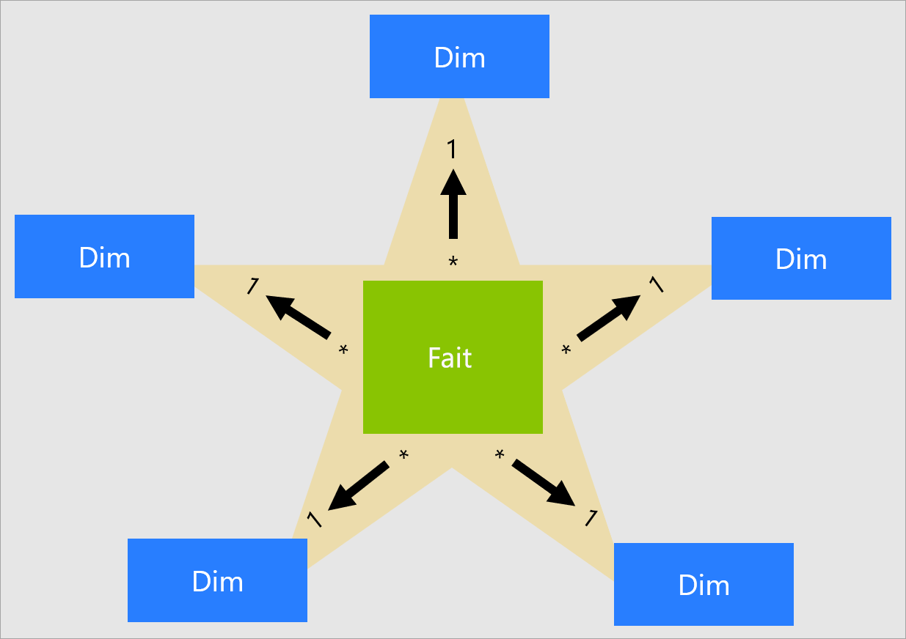
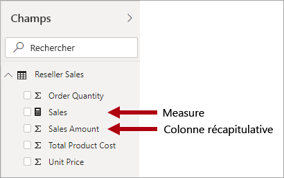
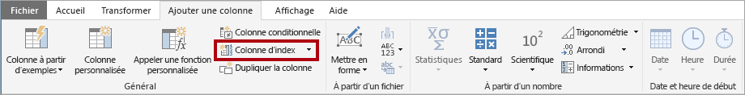
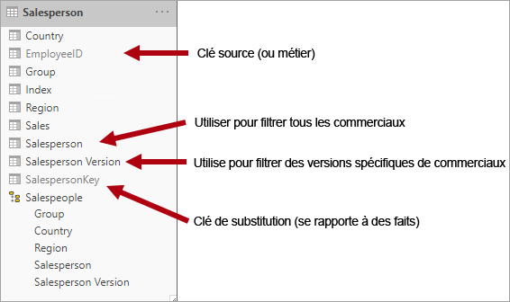
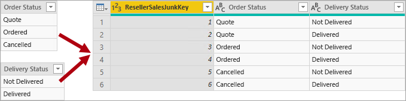
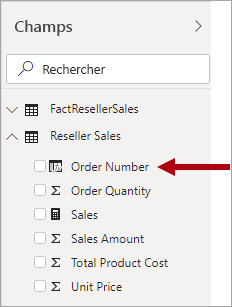

# Découvrez le schéma en étoile et son importance pour Power BI

Cet article s’adresse aux modélisateurs de données Power BI Desktop. Il décrit la conception d’un schéma en étoile et sa pertinence pour le développement de modèles de données Power BI qui sont optimisés du point de vue des performances et de la convivialité.

Cet article n’a pas pour but d’aborder par le menu la conception de schémas en étoile. Pour plus d’informations, reportez-vous directement à du contenu publié, tel que **The Data Warehouse Toolkit: The Complete Guide to Dimensional Modeling** (2e édition, 2002) par Ralph Kimball et al.

## Vue d’ensemble du schéma en étoile

Le **schéma en étoile** est une approche de modélisation mature largement adoptée par les entrepôts de données relationnels. Les modélisateurs doivent classer leurs tables de modèle en tant que _table de dimension_ ou _table de faits_.

**Les tables de dimension** décrivent les entités d’entreprise : les « choses » que vous modélisez. Les entités peuvent inclure des produits, des personnes, des lieux et des concepts, y compris le temps lui-même. La table la plus cohérente que vous trouverez dans un schéma en étoile est une table de dimension de date. Une table de dimension contient une ou plusieurs colonnes clés qui jouent le rôle d’identificateur unique et de colonnes descriptives.

Les **tables de faits** stockent des observations ou des événements. Il peut s’agir de commandes client, de soldes du stock, de taux de change, de températures, etc. Une table de faits contient des colonnes clés de dimension qui se rapportent aux tables de dimension et des colonnes de mesures numériques. Les colonnes clés de dimension déterminent la _dimensionnalité_ d’une table de faits, tandis que les valeurs clés de dimension déterminent sa _granularité_. Par exemple, imaginez une table de faits conçue pour stocker des cibles de ventes qui a deux colonnes clés de dimension : **Date** et **ProductKey**. Il est facile de comprendre que la table a deux dimensions. Toutefois, vous ne pouvez pas déterminer la granularité sans tenir compte des valeurs clés de dimension. Dans cet exemple, supposez que les valeurs stockées dans la colonne **Date** sont le premier jour de chaque mois. Dans ce cas, la granularité se situe au niveau produit/mois.

En règle générale, les tables de dimension contiennent un nombre relativement petit de lignes. En revanche, les tables de faits peuvent contenir un très grand nombre de lignes et croître au fil du temps.

## Pertinence du schéma en étoile pour les modèles Power BI

La conception de schémas en étoile et de nombreux concepts associés présentés dans cet article sont très importants pour le développement de modèles Power BI qui sont optimisés du point de vue des performances et de la convivialité.

Tenez compte du fait que chaque visuel de rapport Power BI génère une requête envoyée au modèle Power BI (que le service Power BI appelle jeu de données). Ces requêtes sont utilisées pour filtrer, regrouper et totaliser les données du modèle. Un modèle bien conçu fournit des tables pour le filtrage et le regroupement et des tables pour la totalisation. Cela répond parfaitement aux principes de conception des schémas en étoile :

- Les tables de dimension prennent en charge le _filtrage_ et le _regroupement_.
- Les tables de faits prennent en charge la _totalisation_.

Bien que les modélisateurs ne définissent aucune propriété de table pour configurer le type de table (dimension ou fait), ce dernier est déterminé par les relations de modèle. Une relation de modèle établit un chemin de propagation de filtre entre deux tables, et c’est la propriété de **cardinalité** de la relation qui détermine le type de table. Une cardinalité de relation courante est « un-à-plusieurs » ou son opposé « plusieurs-à-un ». Le côté « un » est toujours une table de type dimension, tandis que le côté « plusieurs » est toujours une table de type fait.

Une conception de modèle bien structurée doit inclure des tables de type dimension ou de type fait. Vous devez éviter de combiner les deux types pour une même table. Nous vous recommandons également de faire votre possible pour fournir le bon nombre de tables avec les bonnes relations en place. Il est également important que les tables de type fait chargent toujours les données avec une granularité cohérente.

Enfin, il est important de comprendre que la conception optimale du modèle relève pour partie de la science et pour partie de l’art. N’hésitez pas à vous écarter des recommandations habituelles si cela est judicieux.

De nombreux concepts supplémentaires liés à la conception de schémas en étoile peuvent être appliqués à un modèle Power BI. Il s’agit des tables suivantes :

- [Mesures](#measures)
- [Clés de substitution](#surrogate-keys)
- [Dimensions en flocon](#snowflake-dimensions)
- [Dimensions de rôle actif](#role-playing-dimensions)
- [Dimension à variation lente](#slowly-changing-dimensions)
- [Dimensions fourre-tout](#junk-dimensions)
- [Dimensions de fait](#degenerate-dimensions)
- [Tables de faits sans faits](#factless-fact-tables)

## Mesures

Dans la conception d’un schéma en étoile, une **mesure** est une colonne de table de faits qui stocke les valeurs à totaliser.

Dans un modèle Power BI, une **mesure** a une définition différente (mais similaire). Il s’agit d’une formule écrite en [Dax (Data Analysis Expressions)](https://docs.microsoft.com/dax/data-analysis-expressions-dax-reference) qui réalise une totalisation. Les expressions de mesure exploitent souvent les fonctions d’agrégation DAX comme SUM, MIN, MAX ou AVERAGE pour produire un résultat de valeur scalaire au moment de la requête (les valeurs ne sont jamais stockées dans le modèle). Une expression de mesure peut aller de simples agrégations de colonnes à des formules plus sophistiquées qui remplacent la propagation de relation et/ou de contexte de filtre. Pour plus d’informations, consultez l’article [Principes fondamentaux de DAX dans Power BI Desktop](https://docs.microsoft.com/power-bi/desktop-quickstart-learn-dax-basics).

Il est important de comprendre que les modèles Power BI prennent en charge une deuxième méthode pour effectuer une totalisation. Toute colonne (généralement les colonnes numériques) peut être totalisée par un visuel de rapport ou Questions et réponses. C’est une commodité pour le développeur de modèle, car, dans de nombreux cas, il n’a pas besoin de créer de mesures. Par exemple, la colonne **Sales Amount** de la table Reseller Sales d’Adventure Works peut être totalisée de nombreuses façons (somme, nombre, moyenne, valeur médiane, valeur minimale, valeur maximale, etc.), sans qu’il soit nécessaire de créer une mesure pour chaque type d’agrégation possible.

Toutefois, il existe deux raisons impérieuses de créer des mesures, même pour des totalisations simples au niveau des colonnes :

- Quand vous savez que les auteurs de rapports sont susceptibles d’interroger le modèle à l’aide de [MDX (expressions multidimensionnelles)](https://docs.microsoft.com/sql/analysis-services/multidimensional-models/mdx/mdx-query-the-basic-query?view=sql-server-2017), le modèle doit inclure des mesures. MDX ne peut pas obtenir de totalisation des valeurs de colonne. C’est particulièrement pertinent quand un jeu de données Power BI est interrogé à l’aide de MDX, comme c’est le cas lors de l’utilisation d’[Analyser dans Excel](https://docs.microsoft.com/power-bi/service-analyze-in-excel) (les tableaux croisés dynamiques émettent des requêtes MDX).
- Si vous devez vous assurer que les auteurs de rapports peuvent uniquement totaliser des colonnes de manière spécifique. Par exemple, la colonne **Unit Price** de la table Reseller Sales (qui représente un tarif par unité) peut être totalisée, mais uniquement à l’aide de fonctions d’agrégation spécifiques. Elle ne doit jamais être cumulée, mais il est approprié de la totaliser à l’aide d’autres fonctions d’agrégation (valeur minimale, valeur minimale, moyenne, etc.). Dans ce cas, le modélisateur peut masquer la colonne **Unit Price** et créer des mesures pour toutes les fonctions d’agrégation appropriées.

Notez que cette approche de conception fonctionne bien pour les rapports créés dans le service Power BI et pour Questions et réponses. Toutefois, les connexions actives Power BI Desktop permettent aux auteurs de rapports d’afficher les champs masqués dans le volet **Champs**, ce qui peut entraîner le contournement de cette approche de conception.

## Clés de substitution

Une **clé de substitution** est un identificateur unique que vous ajoutez à une table pour prendre en charge la modélisation de schémas en étoile. Par définition, elle n’est ni définie ni stockée dans les données sources. En règle générale, les clés de substitution sont ajoutées aux tables de dimension des entrepôts de données relationnels afin de fournir un identificateur unique pour chaque ligne de la table de dimension.

Les relations des modèles Power BI sont basées sur une seule colonne unique dans une table, qui propage les filtres à une colonne unique dans une autre table. Quand une table de type dimension dans votre modèle n’inclut pas de colonne unique, vous devez ajouter un identificateur unique en guise de côté « un » d’une relation. Dans Power BI Desktop, vous pouvez facilement y parvenir en créant une [colonne d’index Power Query](https://docs.microsoft.com/powerquery-m/table-addindexcolumn).

Vous devez fusionner cette requête avec la requête côté « plusieurs » afin de pouvoir y ajouter également la colonne d’index. Quand vous chargez ces requêtes dans le modèle, vous pouvez créer une relation un-à-plusieurs entre les tables du modèle.

## Dimensions en flocon

Une **dimension en flocon** est un ensemble de tables normalisées pour une entité métier unique. Par exemple, Adventure Works classe les produits par catégorie et sous-catégorie. Les catégories sont affectées à des sous-catégories, et les produits sont à leur tour affectés à des sous-catégories. Dans l’entrepôt de données relationnel Adventure Works, la dimension des produits est normalisée et stockée dans trois tables associées : **DimProductCategory**, **DimProductSubcategory** et **DimProduct**.

En faisant appel à votre imagination, vous pouvez vous figurer les tables normalisées positionnées à l’extérieur de la table de faits, formant une conception en flocon.

Dans Power BI Desktop, vous pouvez choisir de simuler une conception de dimension en flocon (peut-être parce que vos données sources le font) ou d’intégrer (dénormaliser) les tables sources en une table de modèle unique. En règle générale, une table de modèle unique présente plus d’avantages que plusieurs tables de modèle. La décision la plus optimale peut dépendre des volumes de données et des exigences de facilité d’utilisation du modèle.

Quand vous choisissez de simuler une conception de dimension en flocon :

- Power BI charge davantage de tables, ce qui est moins efficace du point de vue du stockage et des performances. Ces tables doivent inclure des colonnes pour prendre en charge les relations du modèle, ce qui peut accroître la taille de ce dernier.
- Des chaînes de propagation de filtres de relation plus longues doivent être parcourues, ce qui est probablement moins efficace que l’application de filtres à une table unique.
- Le volet **Champs** présente davantage de tables de modèle aux auteurs de rapports, ce qui peut se traduire par une expérience moins intuitive, en particulier quand les tables de dimension en flocon contiennent seulement une ou deux colonnes.
- Il n’est pas possible de créer une hiérarchie qui englobe les tables.

Quand vous choisissez d’effectuer une intégration à une table de modèle unique, vous pouvez également définir une hiérarchie qui englobe les niveaux de granularité les plus bas et élevé de la dimension. Éventuellement, le stockage de données dénormalisées redondantes peut entraîner une augmentation de la taille de stockage du modèle, en particulier pour les tables de dimension très grandes.

## Dimension à variation lente

Une **dimension à variation lente** (SCD) est une dimension qui gère correctement les modifications des membres de la dimension au fil du temps. Elle s’applique quand les valeurs des entités d’entreprise changent au fil du temps et de manière ad hoc. Un bon exemple de dimension à variation _lente_ est une dimension de clients, en particulier ses colonnes de détails de contact telles que l’adresse e-mail et le numéro de téléphone. En revanche, certaines dimensions sont considérées comme évoluant _rapidement_ quand un attribut de dimension change souvent, comme le prix du marché d’une action. L’approche de conception courante dans ces cas consiste à stocker les valeurs d’attribut à variation rapide dans une mesure de table de faits.

La théorie de la conception de schémas en étoile fait référence à deux types de SCD courants : type 1 et type 2. Une table de type dimension peut être de type 1 ou 2, ou prendre en charge les deux types simultanément pour des colonnes différentes.

### SCD de type 1

Une **SCD** de **type 1** reflète toujours les valeurs les plus récentes ; ainsi, quand des modifications sont détectées dans les données sources, les données de la table de dimension sont simplement remplacées. Cette approche de conception est courante pour les colonnes qui stockent des valeurs complémentaires, telles que l’adresse e-mail ou le numéro de téléphone d’un client. Quand l’adresse e-mail ou le numéro de téléphone d’un client change, la table de dimension met à jour la ligne du client avec les nouvelles valeurs. C’est comme si le client avait toujours eu ces informations de contact.

Une actualisation non incrémentielle d’une table de type dimension du modèle Power BI atteint le résultat d’une SCD de type 1. Elle actualise les données de la table afin que les valeurs les plus récentes soient chargées.

### SCD de type 2

Une **SCD** de **Type 2** prend en charge la gestion de version des membres de dimension. Si le système source ne stocke pas de versions, c’est généralement le processus de chargement de l’entrepôt de données qui détecte les modifications et gère de manière appropriée la modification dans une table de dimension. Dans ce cas, la table de dimension doit utiliser une clé de substitution pour fournir une référence unique à une _version_ du membre de dimension. Elle comprend également des colonnes qui définissent la validité de la plage de dates de la version (par exemple, **StartDate** et **EndDate**) et éventuellement une colonne d’indicateur (par exemple, **IsCurrent**) pour filtrer facilement en fonction des membres de dimension actuels.

Par exemple, Adventure Works affecte des vendeurs à une région de ventes. Quand un vendeur change de région, une version du vendeur doit être créée pour que les faits historiques restent associés à l’ancienne région. Pour prendre en charge une analyse historique précise des ventes par vendeur, la table de dimension doit stocker les versions des vendeurs et leur(s) région(s) associée(s). La table doit également inclure des valeurs de date de début et de fin pour définir la durée de validité. Les versions actuelles peuvent définir une date de fin vide (ou 12/31/9999), qui indique que la version de la ligne est la version actuelle. La table doit également définir une clé de substitution, car la clé d’entreprise (en l’occurrence, l’ID d’employé) n’est pas unique.

Il est important de comprendre que quand les données sources ne stockent pas de versions, vous devez utiliser un système intermédiaire (comme un entrepôt de données) pour détecter et stocker les modifications. Le processus de chargement de table doit conserver les données existantes et détecter les modifications. Quand une modification est détectée, le processus de chargement de table doit faire expirer la version actuelle. Pour ce faire, il met à jour la valeur **EndDate** et insère une nouvelle version dont la valeur **StartDate** commence par la valeur **EndDate** précédente. En outre, les faits connexes doivent utiliser une recherche basée sur le temps pour récupérer la valeur de clé de dimension correspondant à la date de fait. Un modèle Power BI utilisant Power Query ne peut pas y parvenir. Toutefois, il peut charger des données à partir d’une table de dimension SCD de type 2 préchargée.

Le modèle Power BI doit prendre en charge l’interrogation des données d’historique pour un membre, quelle que soit la modification, et pour une version du membre, qui représente un état particulier du membre dans le temps. Dans le contexte d’Adventure Works, cela vous permet d’interroger les données du vendeur, quelle que soit la région de vente affectée, ou pour une version particulière du vendeur.

Pour ce faire, la table de type dimension du modèle Power BI doit inclure une colonne pour filtrer le vendeur et une autre colonne pour filtrer une version spécifique du vendeur. Il est important que la colonne de la version fournisse une description non ambiguë, telle que « Michael Blythe (12/15/2008-06/26/2019) » ou « Michael Blythe (Current) ». Il est également important de former les consommateurs et les auteurs de rapports aux principes de base de la dimension SCD de type 2 et de leur montrer comment obtenir des conceptions de rapport appropriées en appliquant des filtres corrects.

Une bonne pratique de conception consiste également à inclure une hiérarchie qui permet aux visuels d’accéder au niveau de version.

## Dimensions de rôle actif

Une **dimension de rôle actif** est une dimension qui peut filtrer des faits liés différemment. Par exemple, dans Adventure Works, la table de dimension de date a trois relations avec les faits de ventes des revendeurs. La même table de dimension peut être utilisée pour filtrer les faits par date de commande, date d’expédition ou date de livraison.

Dans un entrepôt de données, l’approche de conception acceptée consiste à définir une table de dimension de date unique. Au moment de la requête, le « rôle » de la dimension de date est établi par la colonne de faits que vous utilisez pour joindre les tables. Par exemple, quand vous analysez les ventes par date de commande, la jointure de la table est associée à la colonne des dates de commandes client des revendeurs.

Dans un modèle Power BI, vous pouvez imiter cette conception en créant plusieurs relations entre deux tables. Dans l’exemple Adventure Works, les tables Date et Reseller Sales auraient trois relations. Bien que cela soit possible, il est important de comprendre qu’il ne peut y avoir qu’une seule relation active entre deux tables de modèle Power BI. Toutes les autres relations doivent être définies comme étant inactives. Le fait d’avoir une relation active unique signifie qu’il existe une propagation de filtre par défaut depuis les données de date vers les données des ventes des revendeurs. Dans ce cas, la relation active est définie sur le filtre le plus courant utilisé par les rapports, ce qui, dans Adventure Works, correspond à la relation de la date de commande.

La seule façon d’utiliser une relation inactive consiste à définir une expression Dax qui utilise la [fonction USERELATIONSHIP](https://docs.microsoft.com/dax/userelationship-function-dax). Dans notre exemple, le développeur de modèle doit créer des mesures pour permettre l’analyse des ventes des revendeurs par date d’expédition et date de livraison. Cette opération peut être fastidieuse, en particulier quand la table des revendeurs définit de nombreuses mesures. En outre, elle encombre le volet **Champs** d’une surabondance de mesures. Il existe également d’autres limitations :

- Quand les auteurs de rapports s’appuient sur des colonnes de totalisation, au lieu de définir des mesures, ils ne peuvent pas obtenir de totalisation pour les relations inactives sans écrire de mesure au niveau du rapport. Les mesures au niveau du rapport peuvent être définies uniquement lors de la création de rapports dans Power BI Desktop.
- Avec un seul chemin de relation actif entre les données des ventes des revendeurs et les données des dates, il n’est pas possible de filtrer simultanément les ventes des revendeurs par différents types de dates. Par exemple, vous ne pouvez pas produire un visuel qui trace les ventes par date de commande par ventes livrées.

Pour surmonter ces limitations, une technique de modélisation Power BI courante consiste à créer une table de type dimension pour chaque instance de rôle actif. En général, vous créez les tables de dimension supplémentaires en tant que [tables calculées](https://docs.microsoft.com/dax/calculatetable-function-dax), à l’aide de Dax. À l’aide de tables calculées, le modèle peut contenir une table **Date**, une table **Ship Date** et une table **Delivery Date**, chacune avec une relation unique et active avec les colonnes respectives de la table Reseller Sales.

Cette approche de conception ne nécessite pas que vous définissiez plusieurs mesures pour différents rôles de date et autorise un filtrage simultané par différents rôles de date. Toutefois, cette approche de conception présente un inconvénient mineur : la table de dimension de date subit une duplication, qui se traduit par une augmentation de la taille de stockage du modèle. Comme les tables de type dimension stockent généralement moins de lignes que les tables de type fait, cela est rarement un problème.

Observez les bonnes pratiques de conception suivantes quand vous créez des tables de type dimension de modèle pour chaque rôle :

- Assurez-vous que les noms de colonne sont explicites. Bien qu’il soit possible d’avoir une colonne **Year** dans toutes les tables de dates (les noms de colonnes sont uniques dans la table concernée), ce n’est pas explicite à l’échelle des titres de visuels par défaut. Envisagez de renommer les colonnes dans chaque table de rôle de dimension, afin que la table **Ship Date** ait une colonne d’années nommée **Ship Year**, et ainsi de suite.
- Le cas échéant, vérifiez que les descriptions de table fournissent des commentaires aux auteurs de rapports (par le biais des info-bulles du volet **Champs**) sur la façon dont la propagation de filtre est configurée. Cette clarté est importante quand le modèle contient une table nommée de façon générique, comme **Date**, qui est utilisée pour filtrer de nombreuses tables de type fait. Dans le cas où cette table a, par exemple, une relation active avec la colonne des dates de commandes client des revendeurs, envisagez de fournir une description de table telle que « Filtre les ventes des revendeurs par date de commande ».

## Dimensions fourre-tout

Une **dimension fourre-tout** est utile quand il existe de nombreuses dimensions, en particulier composées de quelques attributs (peut-être un seul) ayant peu de valeurs. Les colonnes d’état des commandes ou les colonnes de données démographiques sur les clients (sexe, tranche d’âge, etc.) sont de bons candidats.

L’objectif de conception d’une dimension fourre-tout consiste à consolider de nombreuses « petites » dimensions en une seule dimension afin de réduire la taille de stockage du modèle et l’encombrement du volet **Champs** en présentant moins de tables de modèle.

Une table de dimension fourre-tout est généralement le produit cartésien de tous les membres d’attribut de dimension, avec une colonne de clé de substitution. La clé de substitution fournit une référence unique à chaque ligne de la table. Vous pouvez générer la dimension dans un entrepôt de données, ou en utilisant Power Query pour créer une requête qui effectue des [jointures de requêtes externes entières](https://docs.microsoft.com/powerquery-m/table-join), puis ajoute une clé de substitution (colonne d’index).

Vous chargez cette requête dans le modèle en tant que table de type dimension. Vous devez également fusionner cette requête avec la requête de faits, afin que la colonne d’index soit chargée dans le modèle pour prendre en charge la création d’une relation de modèle « un-à-plusieurs ».

## Dimensions de fait

Une **dimension de fait** désigne un attribut de la table de faits requis pour le filtrage. Dans Adventure Works, le numéro de commande client des revendeurs est un bon exemple. Dans ce cas, cela n’a pas de sens pour la conception du modèle de créer une table indépendante composée uniquement de cette colonne, car il en résulterait une augmentation de la taille de stockage du modèle et un encombrement du volet **Champs**.

Dans le modèle Power BI, il peut être approprié d’ajouter la colonne des numéros de commande client à la table de type fait pour autoriser le filtrage ou le regroupement par numéro de commande client. Il s’agit d’une exception à la règle introduite précédemment, selon laquelle vous ne devez pas combiner des types de tables (en général, les tables de modèle doivent être de type dimension ou fait).

## Tables de faits sans faits

Une **table de faits sans faits** n’inclut aucune colonne de mesure. Elle contient uniquement des clés de dimension.

Une table de faits sans faits peut stocker les observations définies par les clés de dimension. Par exemple, à une date et une heure particulières, un client particulier s’est connecté à votre site web. Vous pouvez définir une mesure pour compter les lignes de la table de faits sans faits afin d’analyser à quel moment les clients se sont connectés et leur nombre.

Une utilisation plus attrayante d’une table de faits sans faits consiste à stocker les relations entre les dimensions, approche de conception de modèle Power BI que nous vous recommandons pour définir les relations plusieurs-à-plusieurs. Dans une conception de relation de dimension plusieurs-à-plusieurs, la table de faits sans faits est appelée _table de pontage_.

Par exemple, considérez que les vendeurs peuvent être attribués à une _ou plusieurs_ régions de vente. La table de pontage est conçue comme une table de faits sans faits composée de deux colonnes : clé de vendeur et clé de région. Les valeurs dupliquées peuvent être stockées dans les deux colonnes.

Cette approche de conception plusieurs-à-plusieurs est bien documentée et peut être obtenue sans table de pontage. Toutefois, l’approche de table de pontage est considérée comme la meilleure pratique lors de la liaison de deux dimensions. Pour plus d’informations, consultez [Relations avec une cardinalité plusieurs à plusieurs dans Power BI Desktop](https://docs.microsoft.com/power-bi/desktop-many-to-many-relationships).

## Étapes suivantes

Pour plus d’informations sur la conception du schéma en étoile ou sur la conception de modèles Power BI, consultez les articles suivants :

- [Article Wikipedia sur la modélisation dimensionnelle](https://go.microsoft.com/fwlink/p/?linkid=246459)
- [Créer et gérer des relations dans Power BI Desktop](../desktop-create-and-manage-relationships.md)
- [Relations avec une cardinalité plusieurs à plusieurs dans Power BI Desktop](../desktop-many-to-many-relationships.md)
- [Expérience d’apprentissage guidé - Modélisation](/learn/modules/model-data-power-bi/)