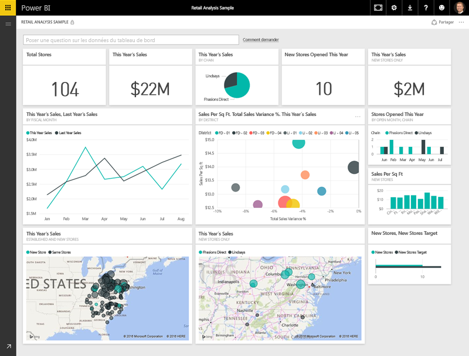
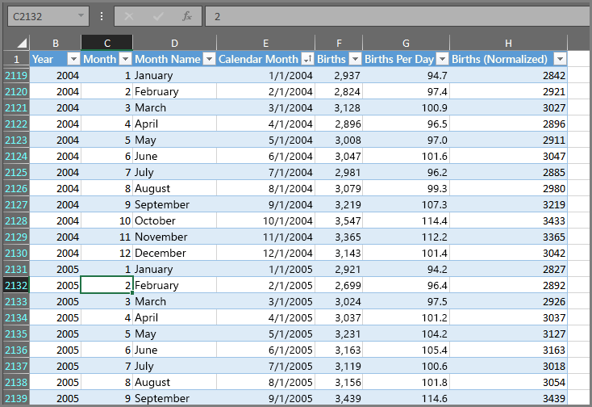
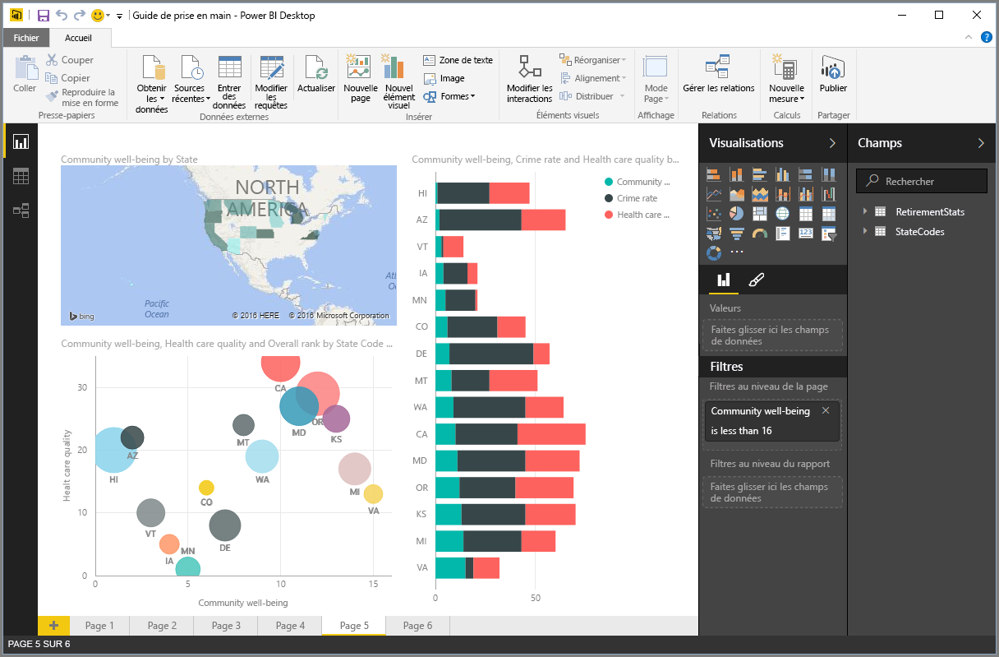
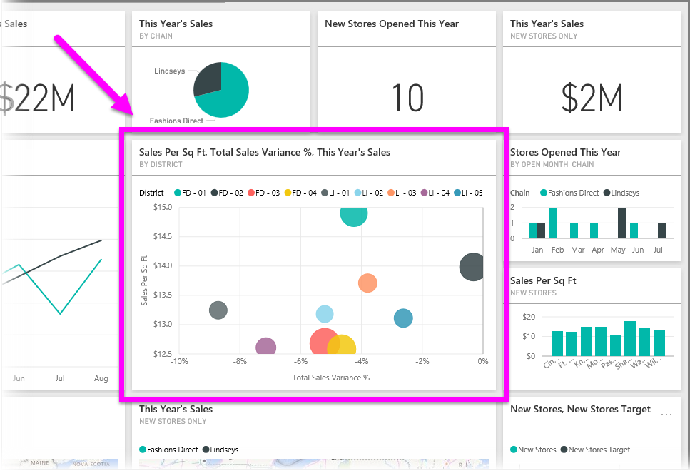

Tout ce que vous faites dans Power BI repose sur quelques **blocs de construction** de base. Une fois que vous avez compris le fonctionnement de ces blocs de construction, vous pouvez vous les approprier et commencer à créer des rapports complexes et élaborées. Après tout, même les choses d’apparence complexe reposent sur des blocs de construction de base : les bâtiments sont construits avec du bois, de l’acier, du ciment et du verre. Les voitures sont fabriquées avec du métal, du tissu et du caoutchouc. Bien sûr, les bâtiments et les voitures peuvent être plus ou moins élaborés : tout dépend de la façon dont ces blocs de construction de base sont agencés.

Nous allons nous intéresser à ces blocs de construction de base, voir les choses simples qu’ils permettent de construire, puis nous évoquerons brièvement les choses complexes qu’ils permettent aussi de créer.

Les blocs de construction de base de Power BI sont les suivants :

* Visualisations
* Jeux de données
* Rapports
* Tableaux de bord
* Vignettes

## Visualisations
Une **visualisation** (aussi parfois appelée **élément visuel**) est une représentation visuelle de données. Il peut s’agir d’un diagramme, d’un graphique, d’une carte à code de couleurs ou des autres choses intéressantes que vous pouvez créer pour représenter visuellement vos données. Power BI propose toutes sortes de visualisations, dont la liste est complétée en permanence. L’illustration suivante montre un ensemble de visualisations différentes qui ont été créés dans le service Power BI.

Les visualisations peuvent être simples (p. ex, nombre unique représentant un point important) ou visuellement complexes (p. ex., carte avec dégradés de couleur illustrant l’opinion des électeurs au sujet d’une question ou d’un problème d’ordre social). Le but d’un élément visuel est de présenter des données de façon à fournir des informations contextuelles et des indications, qu’il serait autrement difficile de discerner dans un tableau brut de nombres ou de texte.

## Jeux de données
Un **jeu de données** est un ensemble de données que Power BI utilise pour créer ses visualisations.

Il peut s’agir d’un jeu de données simple basé sur un tableau unique de classeur Excel, à l’image de ce que montre l’illustration suivante.

Les **jeux de données** peuvent aussi être un assemblage de nombreuses sources différentes, que vous pouvez filtrer et assembler de façon à créer un ensemble de données unique (jeu de données) à utiliser dans Power BI.

Par exemple, il serait possible de créer un jeu de données à partir de trois champs de base de données, d’une table de site web, d’un tableau Excel et des résultats en ligne d’une campagne marketing par e-mail. Cette combinaison unique est toujours considérée comme un **jeu de données** unique, même s’il résulte de nombreuses sources différentes.

Vous pouvez filtrer les données avant de les intégrer dans Power BI pour vous limiter aux données qui vous intéressent. Par exemple, vous pouvez filtrer votre base de données de contacts de façon à inclure uniquement dans le jeu de données les clients qui ont reçus les e-mails de la campagne marketing. Vous pouvez ensuite créer des éléments visuels à partir de ce sous-ensemble (c’est-à-dire, la collection filtrée) de clients qui ont été inclus dans la campagne. Le filtrage est un moyen de limiter vos données et vos efforts.

L’un des aspects importants et intéressants de Power BI est la multitude de **connecteurs** de données qu’il propose. Quelle que soit l’origine des données que vous convoitez (Excel, base de données SQL, Azure, Oracle ou autre service comme Facebook, Salesforce ou MailChimp), Power BI intègre des connecteurs de données qui vous permettent de vous connecter facilement à ces données, de les filtrer si nécessaire, puis de les intégrer dans votre jeu de données.

Une fois le jeu de données constitué, vous pouvez commencer à créer des visualisations qui présentent les différentes parties du jeu de données de différentes manières, ce dont vous pouvez tirer des enseignements. C’est ici que les rapports entrent en jeu.

## Rapports
Dans Power BI, un **rapport** regroupe des visualisations qui apparaissent ensemble sur une ou plusieurs pages. À l’instar d’un rapport qu’un commercial créerait pour présenter ses ventes ou qu’un étudiant rédigerait dans le cadre de ses études, dans Power BI, un **rapport** regroupe un ensemble d’éléments liés les uns aux autres. L’illustration suivante présente un **rapport** dans Power BI Desktop (ici, il s’agit de la cinquième page d’un rapport qui en compte six). Vous pouvez aussi créer des rapports dans le service Power BI.

Les rapports vous offrent la possibilité de créer diverses visualisations, si besoin sur des pages différentes, que vous pouvez disposer de façon à optimiser la présentation de vos données.

Par exemple, un rapport peut porter sur les ventes trimestrielles, sur la croissance de produits sur un segment donné ou sur les schémas de migration des ours polaires. Quel que soit l’objet de votre rapport, vous pouvez rassembler et organiser vos visualisations sur une ou plusieurs pages.

## Tableaux de bord
Dès lors que vous êtes prêt à partager une page d’un rapport ou à partager un ensemble de visualisations, vous devez créer un **tableau de bord**. À l’instar du tableau de bord d’une voiture, un **tableau de bord** Power BI est un ensemble d’éléments visuels contenus dans une page que vous pouvez partager avec d’autres utilisateurs. Souvent, il s’agit d’un groupe d’éléments visuels déterminé qui offrent un aperçu rapide des données ou des points que vous voulez mettre en avant.

Un tableau de bord doit tenir sur une seule page, souvent appelée canevas (le canevas est la toile de fond vierge située dans Power BI Desktop ou le service et sur laquelle vous placez les visualisations). Il peut être comparé à la toile d’un artiste ou d’un peintre, à un espace de travail où vous créez, combinez et remaniez les éléments visuels intéressants et probants.
Vous pouvez partager les tableaux de bord avec d’autres utilisateurs ou groupes, qui peuvent alors interagir dans le service Power BI ou sur leur appareil mobile.

## Vignettes
Dans Power BI, une **vignette** est une visualisation unique qui se trouve dans un rapport ou sur un tableau de bord. Il s’agit de la zone rectangulaire qui contient chaque élément visuel. Dans l’illustration suivante figure une vignette (mise en évidence par un cadre de couleur vive) qui est également entourée d’autres vignettes.

Quand vous *créez* un rapport ou un tableau de bord dans Power BI, vous pouvez déplacer ou disposer les vignettes comme vous l’entendez. Vous pouvez les agrandir, en modifier la hauteur ou la largeur et les rapprocher les unes contre les autres, selon vos préférences.

Quand vous *affichez* ou *consommez* un tableau de bord ou un rapport (ce qui signifie que vous n’en êtes ni le créateur ni le propriétaire, mais qu’il vous a été partagé), vous pouvez interagir avec cet élément sans pour autant pouvoir modifier la taille des vignettes ou leur disposition.

## Récapitulons
Nous avons examiné les principes de base de Power BI et ses blocs de construction. Revenons un instant sur ces points.

Power BI est un ensemble de services, d’applications de connecteurs qui vous permettent de vous connecter à vos données (où qu’elles se trouvent), de les filtrer si nécessaire, puis de les intégrer dans Power BI pour ensuite créer des visualisations séduisantes que vous pouvez partager avec d’autres utilisateurs.  

Maintenant que vous avez une meilleure compréhension des différents blocs de construction de Power BI, vous savez qu’il est possible de créer des jeux de données *pertinents*, ainsi que des rapports visuellement attractifs qui présentent bien vos données. Il n’est pas nécessaire de faire quelque chose de complexe ou de compliqué pour présenter des données avec Power BI.

Pour certaines personnes, utiliser un simple tableau Excel dans un jeu de données, puis partager un tableau de bord avec leur équipe sera une façon très utile d’utiliser Power BI.

Pour d’autres, l’intérêt d’utiliser Power BI résidera dans l’utilisation de tables Azure SQL Data Warehouse en temps réel en combinaison avec d’autres bases de données et une source en temps réel, qui seront ensuite filtrées en temps réel pour générer un jeu de données qui contrôlera minute par minute le processus de fabrication.

Dans les deux cas, le cheminement est le même : il s’agit de créer des jeux de données, de générer des éléments visuels intéressants et de les partager avec d’autres utilisateurs. Et de la même façon, la finalité est identique dans les deux cas : exploiter la disparité sans cesse croissante des données et les transformer en informations exploitables.

Que votre analyse de données nécessite des jeux de données simples ou complexes, Power BI vous permet de démarrer rapidement et peut évoluer en complexité selon vos besoins à mesure que vos données se diversifient. De plus, Power BI étant un produit Microsoft, vous pouvez être assuré qu’il est fiable, extensible, compatible avec Office et prêt pour l’entreprise.

À présent, voyons comment il fonctionne, et intéressons dans un premier temps au service Power BI.

