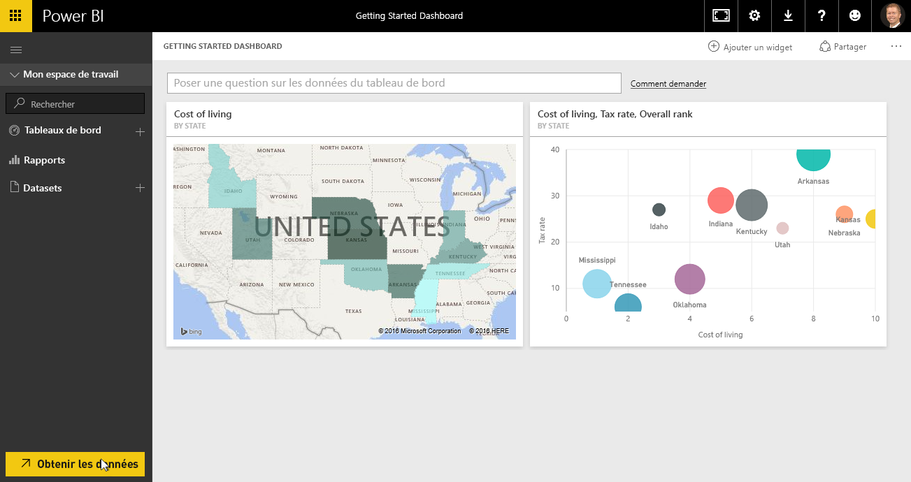
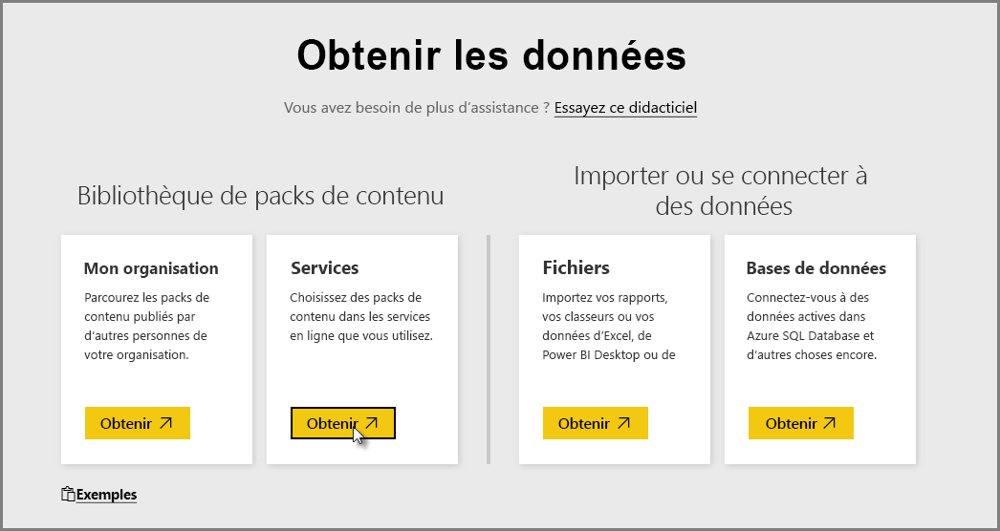
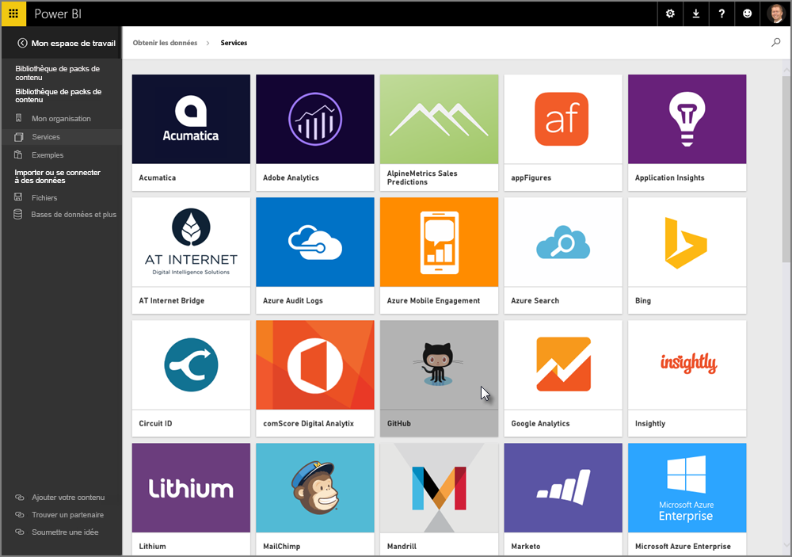
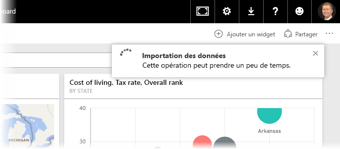
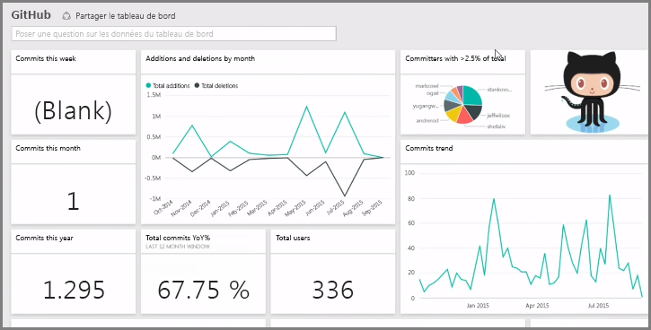
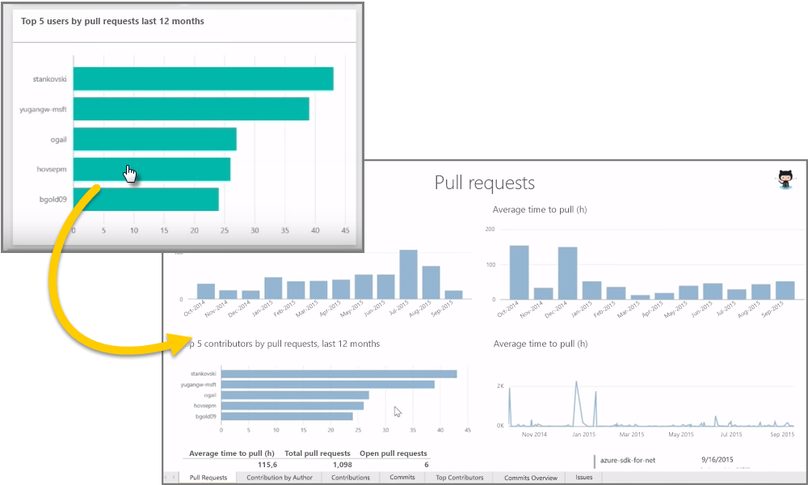
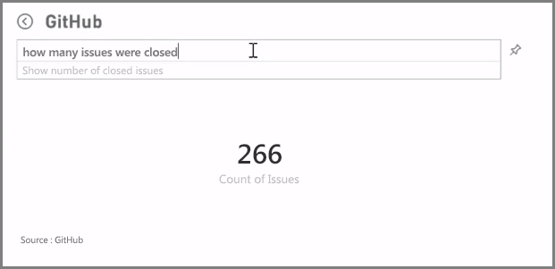
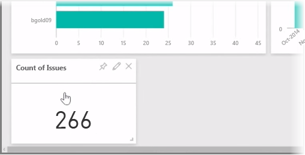
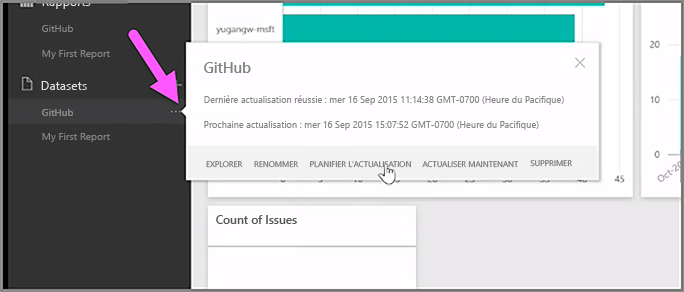

Comme nous l’avons vu, le flux de travail classique dans Power BI consiste à créer un rapport dans Power BI Desktop, à le publier dans le service Power BI, puis à le partager avec d’autres utilisateurs pour leur permettre de le consulter dans le service ou sur une application mobile.

Mais comme tout le monde ne connaît pas le service Power BI, faisons un bref tour d’horizon de ce service et expliquons une méthode simple et courante pour créer rapidement des éléments visuels dans Power BI : les *packs de contenu*.

Un **pack de contenu** est un ensemble d’éléments visuels et de rapports préconfigurés et prêts à l’emploi basés sur des données sources spécifiques, telles que Salesforce. Utiliser un pack de contenu, c’est comme réchauffer un plateau télé préemballé au micro-ondes ou commander un menu de restauration rapide : en quelques clics et commentaires, vous disposez en un clin d’œil d’un menu complet, le tout présenté dans un emballage soigné, prêt à l’emploi.

Faisons rapidement le tour des packs de contenu, du service et de la façon dont il fonctionne. Nous examinerons plus en détail les packs de contenu (et le service) dans les prochaines sections ; il s’agit là d’une simple mise en bouche destinée à aiguiser votre appétit.

## Créer des tableaux de bord prêts à l’emploi à partir des services cloud
Avec Power BI, il est facile de se connecter aux données. Dans le service Power BI, il suffit de cliquer sur le bouton **Obtenir des données** en bas à gauche de l’écran d’accueil.

Le *canevas* (zone située au centre du service Power BI) présente les sources de données disponibles dans le service Power BI. Outre les sources de données courantes, telles que les fichiers Excel, les bases de données ou les données Azure, Power BI permet de se connecter tout aussi facilement à des **services logiciels** (aussi appelés fournisseurs SaaS ou services cloud), tels que Salesforce, Facebook, Google Analytics et à tout un assortiment d’autres services SaaS.

Pour ces services logiciels, le **service Power BI** propose un ensemble d’éléments visuels prêts à l’emploi, prédisposés dans des tableaux de bord et des rapports appelés « **packs de contenu** ». Les packs de contenu vous permettent d’être rapidement opérationnel dans Power BI avec des données issues du service que vous choisissez. Par exemple, quand vous utilisez le pack de contenu Salesforce, Power BI se connecte à votre compte Salesforce (après que vous avez fourni vos informations d’identification) et remplit un ensemble prédéfini d’éléments visuels et de tableaux de bord dans Power BI.

Power BI propose des packs de contenu pour toutes sortes de services. L’illustration suivante présente le premier écran de services, classés par ordre alphabétique, qui s’affiche quand vous sélectionnez **Obtenir** dans la zone **Services** (présentée dans l’illustration précédente). Comme vous pouvez le constater dans l’illustration suivante, le choix est vaste.

Nous allons choisir ici **GitHub**. GitHub est une application de contrôle de code source en ligne. L’importation des données démarre aussitôt que les informations d’identification du pack de contenu GitHub sont entrées.

Une fois les données chargées, le tableau de bord prédéfini du pack de contenu GitHub s’affiche à l’écran.

En plus du **tableau de bord**, le **rapport** qui a été généré (à partir du pack de contenu GitHub) pour créer le tableau de bord est aussi disponible, tout comme le **jeu de données** (l’ensemble de données extrait de GitHub) qui a été créé pendant l’importation des données et qui a servi à créer le rapport GitHub.

Si vous cliquez dans le tableau de bord sur un élément visuel, vous accédez automatiquement à la page **Rapport** où cet élément visuel a été créé. Ainsi, quand l’élément visuel **Top 5 users by pull requests** (5 principaux utilisateurs par requêtes d’extraction) est activé, Power BI ouvre la page **Requêtes d’extraction** dans le rapport (page Rapport où l’élément visuel a été créé).

## Formulation de questions sur vos données
Vous pouvez aussi poser des questions sur vos données. À ce moment-là, le service Power BI crée des éléments visuels basés sur ces questions, en temps réel. Comme le montre l’illustration suivante, Power BI crée plusieurs éléments visuels qui indiquent le nombre de problèmes (« Count of Issues ») résolus, selon ce qui est tapé dans la barre **Requête en langage naturel**.

Si vous le souhaitez, vous pouvez cliquer sur l’icône **Épingler** à droite de la barre de Requête en langage naturel pour épingler un élément visuel au tableau de bord. Dans ce cas, l’élément visuel est épinglé au tableau de bord GitHub, puisque c’est le tableau de bord qui est sélectionné.

## Actualisation des données dans le service Power BI
Vous pouvez aussi choisir d’**actualiser** le jeu de données pour un pack de contenu ou d’autres données que vous utilisez dans Power BI. Pour définir les paramètres d’actualisation, sélectionnez les points de suspensions (trois points) en regard d’un jeu de données, ce qui fait apparaître un menu.

Sélectionnez l’option **Planifier l’actualisation** au bas de ce menu. La boîte de dialogue Paramètres s’affiche sur le canevas, ce qui vous permet de définir les paramètres d’actualisation en fonction de vos besoins.

C’est ainsi que s’achève notre tour d’horizon du service Power BI. Ce service offre bien plus de possibilités, que nous examinerons plus loin dans ce cours. Par ailleurs, n’oubliez pas que vous pouvez vous connecter à une multitude de types de données et qu’il existe toutes sortes de packs de contenu, dont la liste s’allonge constamment.

Passons maintenant à la rubrique suivante, dans laquelle nous récapitulerons cette section de **prise en main** et vous préparerons pour la suite.

