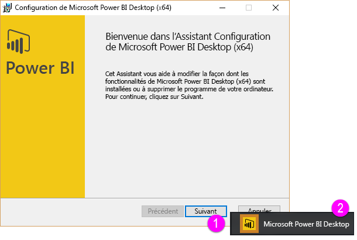

Bienvenue dans la deuxième section de ce cours **Formation guidée** sur Power BI, appelée **Obtenir des données**. Cette section présente les nombreuses fonctionnalités et outils centrés sur les données de Power BI, en mettant l’accent sur Power BI Desktop. Comme beaucoup de ces outils s’appliquent également au service Power BI, vous faites d’une pierre deux coups en suivant cette section.

Quand vous obtenez des données, elles ne sont parfois pas aussi correctement formées ou *propres* que vous le souhaiteriez. Dans cette section, vous découvrez comment obtenir des données et les nettoyer (opération parfois appelée *nettoyage* ou *transformation* de données), et apprenez quelques astuces avancées qui peuvent faciliter l’obtention des données.

Comme toujours dans ce cours, votre parcours de formation suit le même chemin que le flux de travail dans Power BI. Ainsi, nous allons nous pencher sur **Power BI Desktop**, où commence souvent votre parcours.

## Vue d’ensemble de Power BI Desktop
Power BI Desktop est un outil avec lequel vous pouvez vous connecter à vos données, ainsi que nettoyer et visualiser celles-ci. Avec Power BI Desktop, vous pouvez vous connecter à des données, puis les modéliser et les visualiser de différentes façons. La plupart des utilisateurs qui travaillent sur des projets décisionnels passent l’essentiel de leur temps à utiliser Power BI Desktop.

Vous pouvez télécharger Power BI Desktop [à partir du web](http://go.microsoft.com/fwlink/?LinkID=521662). Vous pouvez également installer **Power BI Desktop** sous forme d’application à partir du [**Windows Store**](http://aka.ms/pbidesktopstore) ou le télécharger à partir du service Power BI. Dans le service, pour obtenir **Power BI Desktop**, il vous suffit de sélectionner le bouton avec une flèche vers le bas dans le coin supérieur droit de Power BI, puis de sélectionner Power BI Desktop.

Power BI Desktop s’installe en tant qu’application sur votre ordinateur Windows.

Une fois que vous avez téléchargé Power BI Desktop, vous l’installez et exécutez comme toute autre application sur Windows. L’illustration suivante montre l’écran d’accueil de Power BI Desktop, qui s’affiche quand vous démarrez l’application.

Power BI Desktop se connecte à un large éventail de sources de données, allant des bases de données locales aux services cloud en passant par les feuilles de calcul Excel. Il vous permet de nettoyer et de mettre en forme vos données pour faciliter leur utilisation, notamment en fractionnant et renommant les colonnes, en modifiant les types de données et en utilisant des dates. Vous pouvez également créer des relations entre les colonnes pour simplifier la modélisation et l’analyse de vos données.

