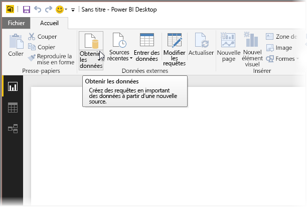
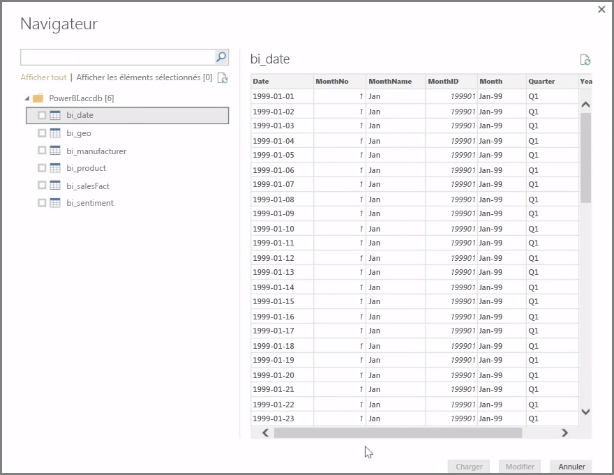
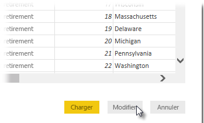

**Power BI Desktop** peut se connecter à toute une série de sources de données, notamment aux bases de données locales, aux classeurs Excel et aux services cloud. Actuellement, plus de 59 services cloud différents tels que GitHub et Marketo ont des connecteurs spécifiques, et vous pouvez vous connecter à des sources génériques par le biais de dispositifs XML, CSV, texte et ODBC. Power BI peut même capturer des données tabulaires directement à partir d’une URL de site web ! Mais commençons par ouvrir Power BI Desktop et nous connecter à des données.

Quand vous démarrez **Power BI Desktop** et que vous passez l’écran d’accueil, vous pouvez choisir Obtenir des données sous l’onglet **Accueil** du ruban.

À l’occasion de chaque mise à jour mensuelle de Power BI Desktop, la page **Nouveautés de Power BI Desktop** est mise à jour avec des informations sur les mises à jour, des liens vers le blog et un lien de téléchargement.

Dans Power BI Desktop, de nombreuses sortes de sources de données sont disponibles. Sélectionnez une source pour établir une connexion. Selon votre sélection, vous êtes invité à rechercher la source sur votre ordinateur ou réseau, ou à vous connecter à un service pour authentifier votre demande.

Une fois connecté, la première fenêtre qui apparaît est le **Navigateur**. Le navigateur affiche les tables ou entités de votre source de données, et vous pouvez cliquer sur l’une d’elles pour avoir un aperçu de son contenu. Vous pouvez ensuite importer vos tables ou entités sélectionnées dans la foulée ou sélectionner **Modifier** pour transformer et nettoyer vos données avant de les importer.

Une fois que vous avez sélectionné les tables que vous souhaitez importer dans Power BI Desktop, vous pouvez choisir de les charger dans Power BI Desktop en sélectionnant le bouton **Charger** dans le coin inférieur droit du **Navigateur**. Parfois, toutefois, vous pouvez souhaiter apporter des modifications à ces tables avant de les charger dans Power BI Desktop. Vous pouvez n’être intéressé que par un sous-ensemble des clients ou souhaiter filtrer ces données en fonction des ventes effectuées dans un pays spécifique. Dans ces cas, vous pouvez sélectionner le bouton Modifier et filtrer ou transformer les données avant de les importer dans Power BI Desktop.

Nous verrons cela, ainsi que la modification des données, dans la section suivante.

