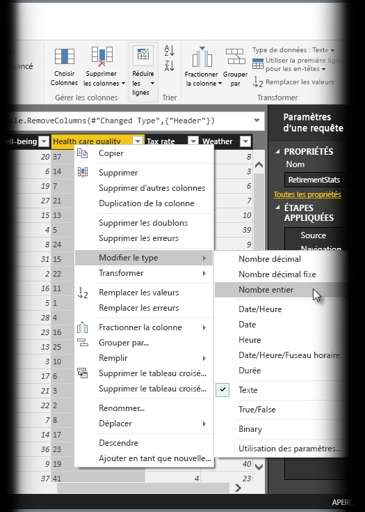
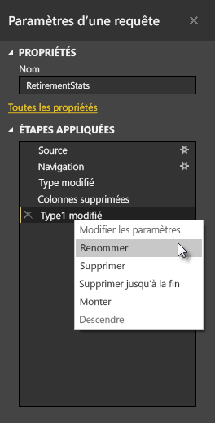
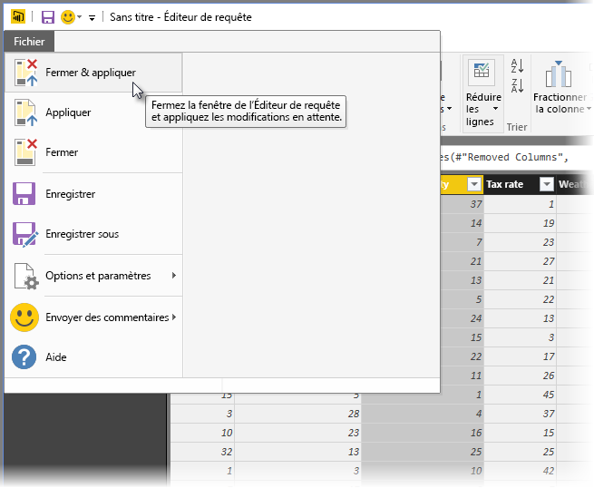
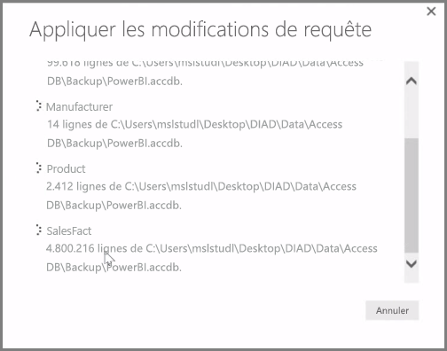

**Power BI Desktop** inclut l’**Éditeur de requête**, outil puissant grâce auquel vous pouvez mettre en forme et transformer des données en vue de les utiliser dans vos modèles et visualisations. Quand vous sélectionnez Modifier dans le navigateur, l’Éditeur de requête se lance et est rempli avec les tables ou autres entités que vous avez sélectionnées à partir de votre source de données.

Vous pouvez également lancer l’**Éditeur de requête** directement à partir de **Power BI Desktop** à l’aide du bouton **Modifier les requêtes** du ruban **Accueil**.

Une fois l’Éditeur de requête chargé avec des données prêtes à être mises en forme, une série de sections apparaissent :

1. Dans le ruban, de nombreux boutons sont actifs, qui permettent d’interagir avec les données de la requête.
2. Dans le volet gauche, les requêtes (une par table ou entité) sont répertoriées et disponibles pour la sélection, l’affichage et la mise en forme.
3. Dans le volet central, les données issues de la requête sélectionnée sont affichées et disponibles pour la mise en forme.
4. La fenêtre Paramètres d’une requête s’affiche. Elle répertorie les propriétés et les étapes appliquées.

Dans le volet central, vous pouvez cliquer avec le bouton droit sur une colonne pour afficher une série de transformations disponibles, telles que la suppression de la colonne de la table, la duplication de la colonne sous un nouveau nom et le remplacement de valeurs. Dans ce menu, vous pouvez également fractionner les colonnes de texte au niveau de délimiteurs communs.

Le ruban de l’**Éditeur de requête** contient des outils supplémentaires qui servent par exemple à modifier le type de données des colonnes, à ajouter une notation scientifique ou à extraire des éléments à partir de dates comme les jours de la semaine.

Quand vous appliquez des transformations, chaque étape s’affiche dans la liste **Étapes appliquées** dans le volet **Paramètres d’une requête** sur le côté droit de l’**Éditeur de requête**. Vous pouvez utiliser cette liste pour annuler ou passer en revue des modifications spécifiques, ou même pour modifier le nom d’une étape. Pour enregistrer vos transformations, sélectionnez **Fermer & appliquer** sous l’onglet **Accueil**.

Une fois que vous sélectionnez **Fermer & appliquer**, l’Éditeur de requête applique les modifications de requête que vous avez effectuées, puis les applique à Power BI Desktop.

Vous pouvez effectuer toutes sortes de choses en transformant des données dans l’**Éditeur de requête**, notamment des transformations avancées. Dans la section suivante, nous examinons quelques-unes de ces transformations avancées. Vous aurez ainsi une idée des possibilités insoupçonnées qu’offre l’**Éditeur de requête** en matière de transformation de données.

