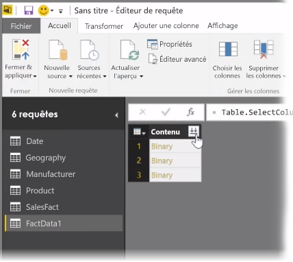
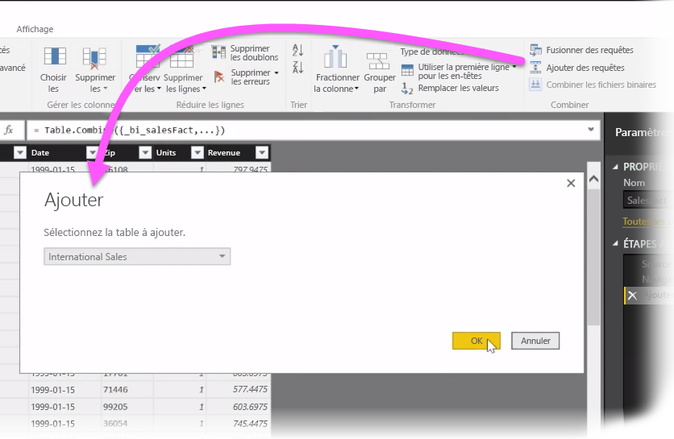
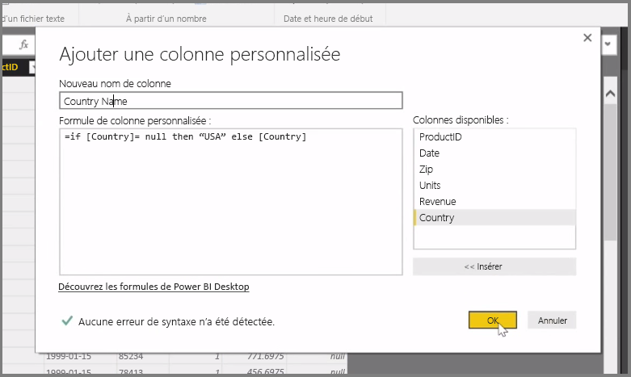

Dans cet article, nous examiner quelques techniques avancées d’importation et de nettoyage de données pour **Power BI Desktop**. Une fois que vous avez mis en forme vos données dans l’**Éditeur de requête** et que vous les avez importées dans **Power BI Desktop**, vous pouvez les examiner de différentes manières. Il existe trois vues dans Power BI Desktop : **Rapport**, **Données** et **Relations**. Vous activez chaque vue en sélectionnant l’icône correspondante dans le coin supérieur gauche du canevas. Dans l’image suivante, la vue **Rapport** est sélectionnée. La vue active porte une barre jaune à côté de son icône.

Pour changer de vue, sélectionnez simplement une des deux autres icônes. La vue active porte une barre jaune à côté de son icône.

Power BI Desktop peut combiner des données provenant de plusieurs sources en un seul rapport à tout moment pendant le processus de modélisation. Pour ajouter des sources à un rapport existant, sélectionnez **Modifier les requêtes** dans le ruban **Accueil**, puis sélectionnez **Nouvelle source** dans l’**Éditeur de requête**.

Vous pouvez utiliser de nombreuses sources de données dans **Power BI Desktop**, y compris des dossiers. En vous connectant à un dossier, vous pouvez importer des données à partir de plusieurs fichiers à la fois, comme une série de fichiers Excel ou CSV. Les fichiers contenus dans le dossier sélectionné apparaissent dans l’**Éditeur de requête** en tant que contenu binaire ; vous pouvez cliquer sur l’icône en forme de double flèche située en haut de la colonne **Contenu** pour charger leurs valeurs.

Les *Filtres* constituent un des outils les plus utiles de Power BI. Par exemple, si vous sélectionnez la flèche déroulante en regard d’une colonne, vous ouvrez une liste de vérification composée de filtres de texte que vous pouvez utiliser pour supprimer des valeurs de votre modèle.

Vous pouvez également fusionner et ajouter des requêtes, ainsi que transformer plusieurs tables (ou des données issues de divers fichiers dans les dossiers) en une seule table qui contient uniquement les données souhaitées. Vous pouvez utiliser l’outil **Ajouter des requêtes** pour ajouter les données à partir d’une nouvelle table à une requête existante. Power BI Desktop tente de mettre en correspondance les colonnes dans vos requêtes, que vous pouvez ensuite ajuster en fonction de vos besoins dans l’**Éditeur de requête**.

Enfin, l’outil **Ajouter une colonne personnalisée** permet aux utilisateurs expérimentés d’écrire des expressions de requête à partir de zéro à l’aide du puissant langage M. Vous pouvez ajouter une colonne personnalisée basée sur des instructions du langage de requête M et obtenir vos données exactement comme vous le souhaitez.

