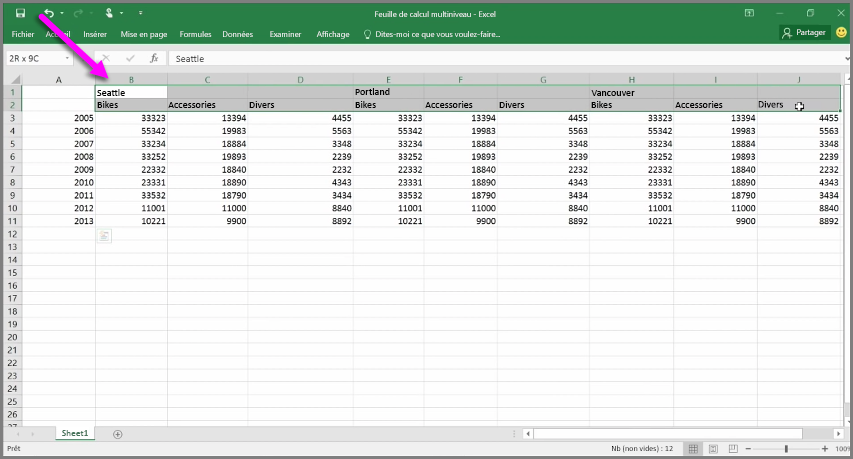
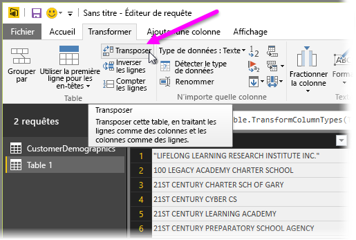
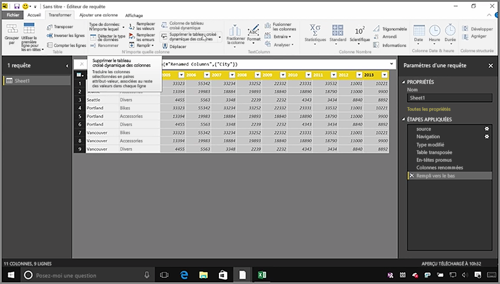
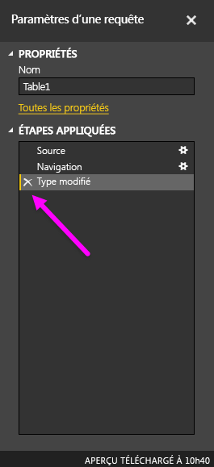
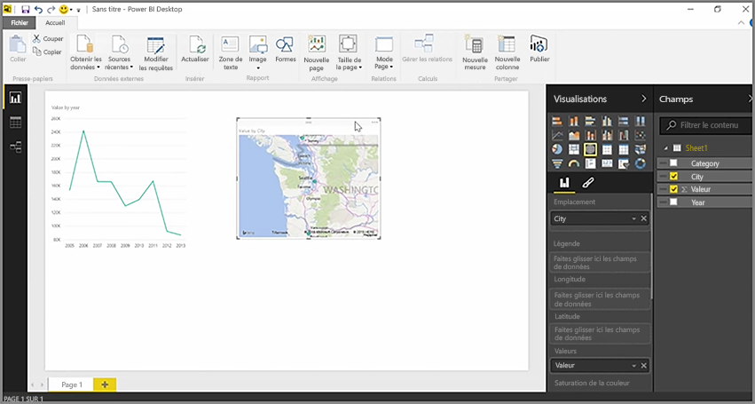

Bien que Power BI puisse importer vos données à partir de pratiquement toute source, ses outils de visualisation et de modélisation fonctionnent mieux avec des données en colonnes. Parfois, vos données ne sont pas mises en forme en colonnes simples, ce qui est souvent le cas avec les feuilles de calcul Excel, où une disposition en table convenable pour l’œil humain n’est pas forcément optimale pour les requêtes automatiques. Par exemple, la feuille de calcul suivante comporte des en-têtes qui s’étendent sur plusieurs colonnes.

Heureusement, Power BI dispose d’outils pour transformer rapidement les tables de plusieurs colonnes en jeux de données exploitables.

## Transposer des données
Par exemple, à l’aide de l’option **Transposer** de l’**Éditeur de requête**, vous pouvez modifier l’orientation des données (transformer les colonnes en lignes et les lignes en colonnes) afin de réorganiser les données en formats que vous pouvez manipuler.

Après avoir effectué cette opération plusieurs fois, comme décrit dans la vidéo, votre table prend une forme que Power BI peut exploiter plus facilement.

## Mettre en forme les données
Vous pouvez également être amené à mettre en forme des données, afin que Power BI puisse les classer et les identifier correctement une fois qu’elles sont importées.

En effectuant une poignée de transformations, telles que la *promotion de lignes en en-têtes* pour obtenir des en-têtes explicites, ou bien l’utilisation de l’option **Remplir** pour remplacer les valeurs *null* par les valeurs situées au-dessus ou au-dessous dans une colonne donnée et de l’option **Supprimer le tableau croisé dynamique des colonnes**, vous pouvez nettoyer les données pour obtenir un jeu de données exploitable dans Power BI.

Avec Power BI, vous tester ces transformations sur vos données et déterminer celles qui aboutissent à la mise en forme en colonnes dont Power BI peut tirer parti. En outre, toutes les actions que vous effectuez sont enregistrées dans la section Étapes appliquées de l’Éditeur de requête ; ainsi, si une transformation ne fonctionne pas comme vous le souhaitez, vous pouvez simplement cliquer sur le **x** en regard de l’étape pour l’annuler.

## Créer des éléments visuels
Une fois que vos données se présentent dans un format utilisable par Power BI après avoir été transformées et nettoyées, vous pouvez commencer à créer des éléments visuels.

## Étapes suivantes
**Félicitations !** Vous avez terminé cette section du cours **Formation guidée** pour Power BI. Vous savez maintenant comment **obtenir des données** dans Power BI Desktop et comment *former* ou *transformer* ces données afin de créer des éléments visuels agréables.

L’étape suivante de l’apprentissage du fonctionnement de Power BI, notamment pour qu’il réponde à *vos besoins*, consiste à comprendre le concept de **modélisation**. Comme vous l’avez vu, un **jeu de données** est une composante fondamentale de Power BI, mais certains jeux de données peuvent être complexes et reposer sur plusieurs sources de données différentes. Et, parfois, vous devez ajouter votre propre touche spéciale (ou *champ*) au jeu de données que vous créez.

Vous allez découvrir la **modélisation**, et bien d’autres choses, dans la section suivante. À bientôt !

