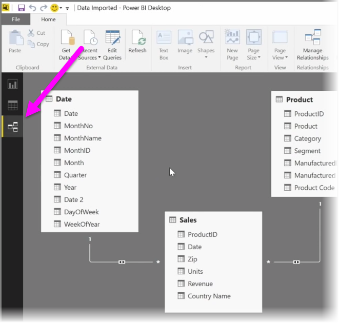
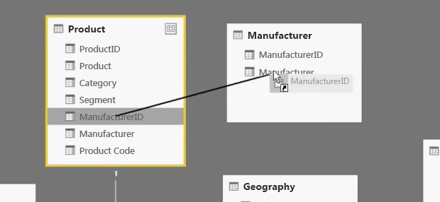
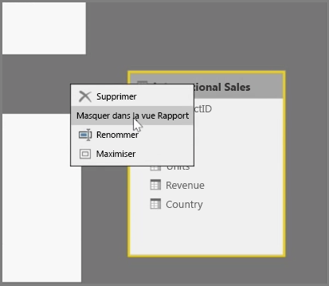
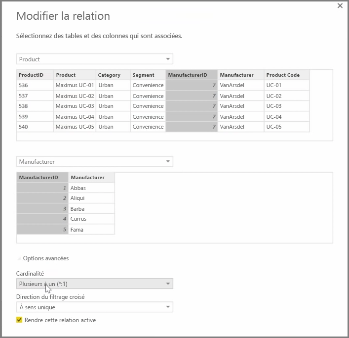

Power BI vous permet de définir visuellement la relation entre des tables ou des éléments. Pour afficher une vue schématique de vos données, utilisez la vue **Relations**, située sur le côté gauche de l’écran en regard du canevas de rapport.

Dans la vue **Relations**, chaque bloc représente une table et ses colonnes, tandis que les lignes entre les tables représentent les relations.

Ajouter et supprimer des relations sont des opérations simples. Pour supprimer une relation, cliquez dessus avec le bouton droit, puis sélectionnez **Supprimer**. Pour créer une relation, faites glisser un champ depuis une table jusqu’au champ de la table auquel vous voulez le lier.

Pour masquer une table ou une colonne dans votre rapport, cliquez dessus avec le bouton droit dans la vue Relation et sélectionnez **Masquer dans l’affichage Rapport**.

Pour obtenir une vue plus détaillée de vos relations de données, sélectionnez **Gérer les relations** sous l’onglet **Accueil**. Cette opération ouvre la boîte de dialogue **Gérer les relations** qui affiche vos relations sous forme de liste. Vous pouvez alors sélectionner **Détection automatique** pour rechercher des relations dans des données nouvelles ou mises à jour. Sélectionnez **Modifier** dans la boîte de dialogue **Gérer les relations** pour modifier manuellement vos relations. La boîte de dialogue qui apparaît met à votre disposition des options avancées pour définir la *Cardinalité* et la *Direction du filtrage croisé* de vos relations.

Les options pour la cardinalité sont *Plusieurs à un* et *Un à un*. *Plusieurs à un* est la relation de type faits/dimensions, par exemple une table de ventes comportant plusieurs lignes par produit reliée à une table dont chaque ligne décrit un produit spécifique. *Un à un* est souvent utilisé pour lier des entrées uniques dans les tables de référence.

Par défaut, les relations sont définies sur le filtrage croisé à double sens. Le filtrage croisé dans un seul sens limite certaines des fonctionnalités de modélisation dans une relation.

En définissant des relations précises entre vos données, vous pouvez créer des calculs complexes impliquant plusieurs éléments de données.

