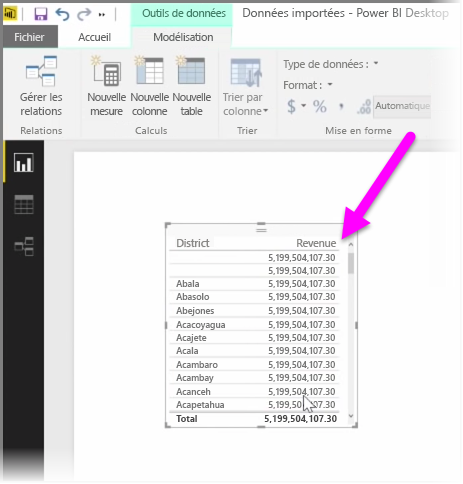
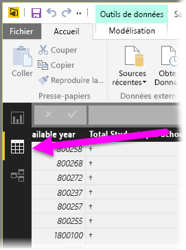
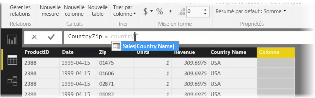
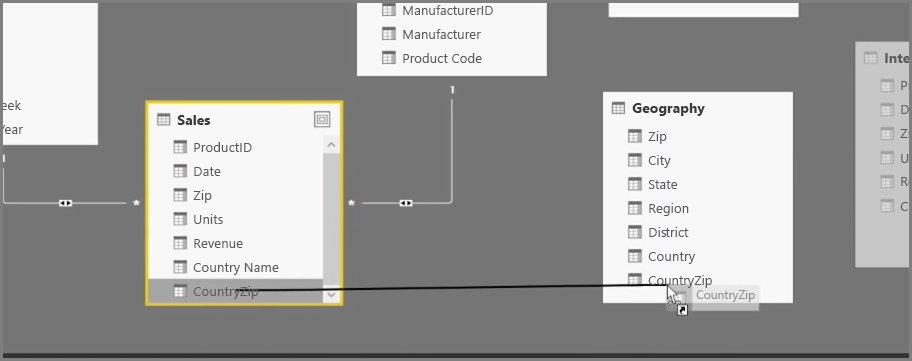
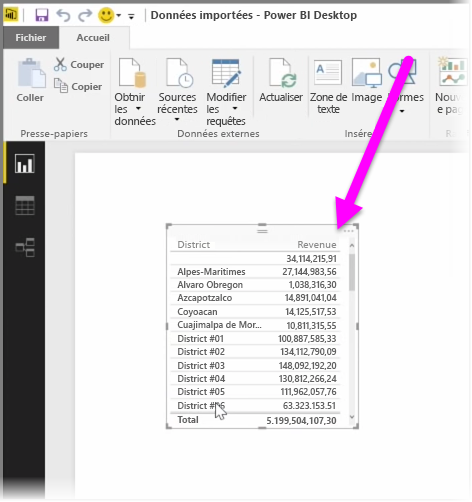

Créer des colonnes calculées est un moyen simple d’enrichir et d’améliorer vos données. Une **colonne calculée** est une colonne que vous créez en définissant un calcul qui transforme ou combine deux ou plusieurs éléments de données existantes. Par exemple, vous pouvez créer une colonne en combinant deux colonnes en une seule.

Cette approche est notamment appropriée pour établir une relation entre deux tables dépourvues de champs uniques qui auraient pu servir à cette fin. L’absence d’une relation devient évidente quand vous créez un élément visuel de table simple dans Power BI Desktop et que vous obtenez la même valeur pour toutes les entrées, alors que vous savez que les données sous-jacentes sont différentes.

Pour créer une relation avec des champs uniques dans les données, vous pouvez, par exemple, créer une colonne calculée « Numéro de téléphone complet » en combinant les valeurs des colonnes « Indicatif » et « Numéro local » si ces valeurs existent dans vos données. Les colonnes calculées constituent un outil utile pour créer rapidement des modèles et des visualisations.

Pour créer une colonne calculée, sélectionnez la vue **Données** dans Power BI Desktop sur le côté gauche du canevas du rapport.

Sous l’onglet Modélisation, sélectionnez **Nouvelle colonne**. Cette action active la barre de formule, dans laquelle vous pouvez entrer des calculs à l’aide du langage DAX (Data Analysis Expressions). DAX est un puissant langage de formule, également disponible dans Excel, grâce auquel vous pouvez créer des calculs robustes. Quand vous tapez une formule, Power BI Desktop affiche les formules ou éléments de données correspondants pour faciliter et accélérer la création de votre formule.

La barre de formule Power BI suggère des fonctions DAX spécifiques et des colonnes de données connexes à mesure que vous entrez l’expression.

Une fois les colonnes calculées créées dans chaque table, elles peuvent servir de clé unique pour établir une relation entre les tables. Accédez à la vue **Relation**, puis faites glisser le champ d’une table vers l’autre pour créer la relation.

Revenez à la vue **Rapport** ; vous pouvez maintenant voir une valeur différente pour chaque zone géographique.

Il existe aussi toutes sortes d’autres opérations que vous pouvez effectuer en créant des colonnes calculées.

