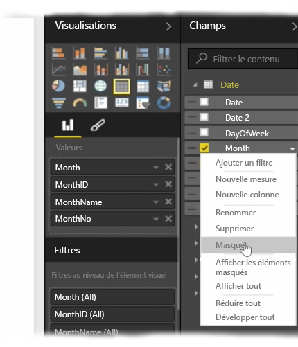
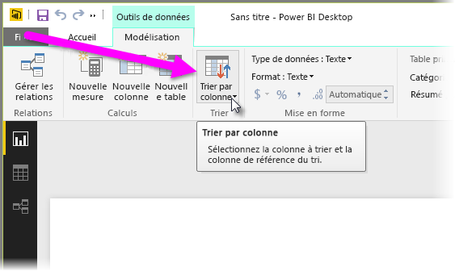
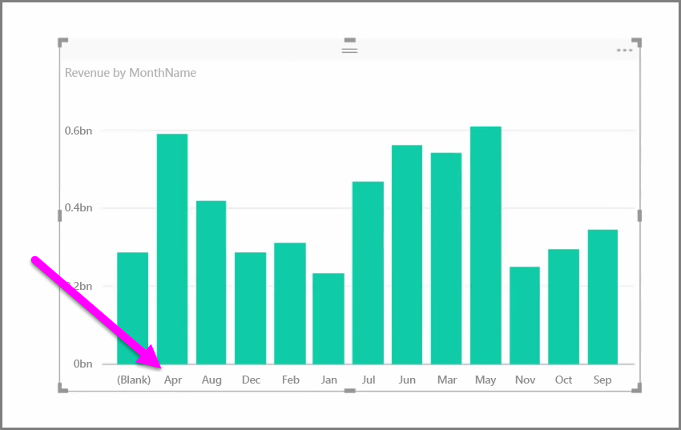
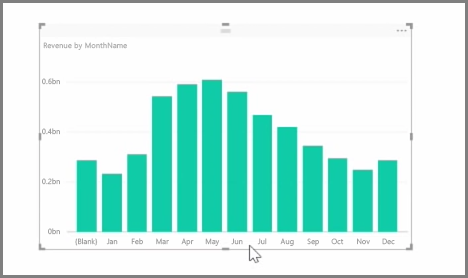

Les données importées contiennent souvent des champs dont vous n’avez pas réellement besoin pour vos tâches de création de rapports et de visualisation, car ils constituent des informations en trop ou ces données sont déjà disponibles dans une autre colonne. Power BI Desktop dispose des outils nécessaires pour optimiser vos données en vue de la création des rapports et des éléments visuels et de l’affichage de vos rapports partagés.

## Masquage de champs
Pour masquer une colonne dans le volet **Champs** de Power BI Desktop, cliquez dessus avec le bouton droit et sélectionnez **Masquer**. Notez que les colonnes masquées ne sont pas supprimées ; si vous avez utilisé ce champ dans des visualisations existantes, les données figurent toujours dans cet élément visuel et vous pouvez toujours les utiliser dans d’autres visualisations. Le champ masqué n’est tout simplement pas affiché dans le volet **Champs**.

Si vous affichez des tables dans la vue **Relations**, les champs masqués sont estompés. Là encore, leurs données sont toujours disponibles et font toujours partie du modèle ; elles sont simplement masquées. Vous pouvez toujours afficher un champ qui a été masqué en cliquant avec le bouton droit sur celui-ci et en sélectionnant **Afficher tout**.

## Tri des données de visualisation en fonction d’un autre champ
L’outil **Trier par colonne**, disponible sous l’onglet **Modélisation**, est très utile pour s’assurer que les données sont affichées dans l’ordre souhaité.

Prenons un exemple courant. Les données qui incluent le nom du mois sont triées par ordre alphabétique par défaut ; ainsi, « Août » apparaît avant « Février ».

Pour résoudre ce problème, vous pouvez sélectionner le champ dans la liste Champs, sélectionner **Trier par colonne** sous l’onglet **Modélisation**, puis choisir un champ de tri. Dans ce cas, l’option de tri de catégorie « NoMois » trie les mois comme prévu.

Pour optimiser vos informations afin qu’elles soient gérées correctement, vous pouvez également définir le type de données d’un champ. Pour modifier un type de données à partir du canevas de rapport, sélectionnez la colonne dans le volet **Champs**, puis utilisez le menu déroulant **Format** pour sélectionner une des options de mise en forme. Tous les éléments visuels que vous avez créés et qui affichent ce champ sont automatiquement mis à jour.

