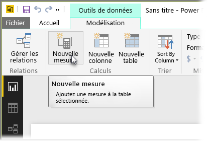
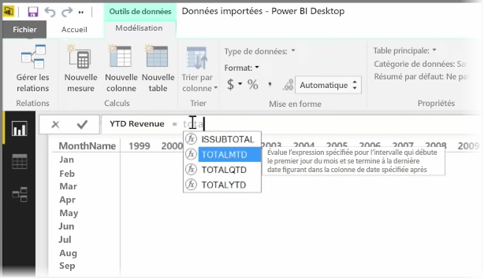
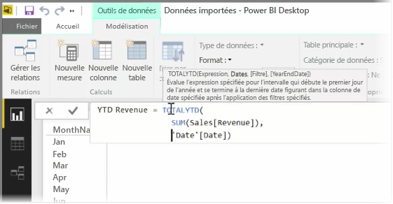
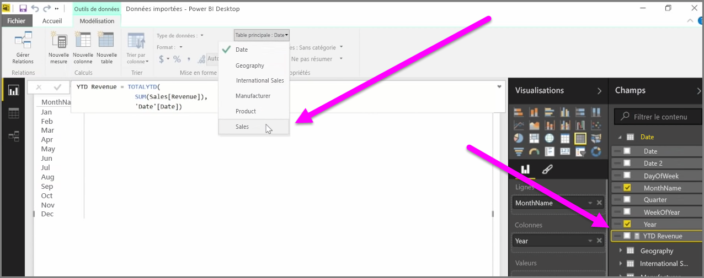

Une *mesure* est un calcul qui existe dans votre modèle de données Power BI. Pour créer une mesure, dans la vue **Rapport**, sous l’onglet **Modélisation**, sélectionnez **Nouvelle mesure**.

Un des grands avantages de DAX, langage d’expression d’analyse de données dans Power BI, est qu’il a un grand nombre de fonctions utiles, notamment concernant les calculs temporels comme *Cumul annuel jusqu’à ce jour* ou *D’une année sur l’autre*. Avec DAX, vous pouvez définir une mesure de temps une fois, puis la découper en autant de champs différents que vous le souhaitez à partir de votre modèle de données.

Dans Power BI, un calcul défini est appelé *mesure*. Pour créer une *mesure*, sous l’onglet **Accueil**, sélectionnez **Nouvelle mesure**. Cette opération ouvre la barre de formule dans laquelle vous pouvez entrer l’expression DAX qui définit votre mesure. Pendant votre saisie, Power BI propose des fonctions DAX et des champs de données pertinents, ainsi qu’une info-bulle décrivant certains des paramètres de syntaxe et de fonction.

Si le calcul est particulièrement long, vous pouvez ajouter des sauts de ligne dans l’éditeur d’expressions en tapant **Alt + Entrée**.

Une fois la mesure créée, elle apparaît dans une des tables du volet **Champs**, à droite de l’écran. Power BI insère la nouvelle mesure dans la table sélectionnée, et bien que la position exacte de la mesure parmi vos données n’importe pas vraiment, vous pouvez la déplacer facilement en la sélectionnant et en utilisant le menu déroulant **Table principale**.

Vous pouvez utiliser une mesure comme toute autre colonne de table : faites-la glisser et déposez-la simplement sur le canevas de rapport ou sur des champs de visualisation. En outre, comme les mesures s’intègrent parfaitement aux segments, fractionnant ainsi vos données à la volée, vous pouvez définir une mesure une fois, puis l’utiliser avec de nombreuses visualisations différentes.

La fonction DAX **Calculate** est une fonction puissante qui permet toutes sortes de calculs utiles, notamment pour les éléments visuels et les rapports financiers.

