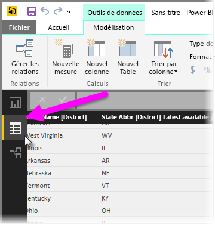
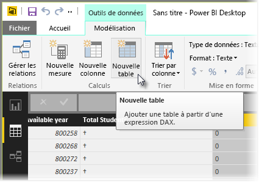
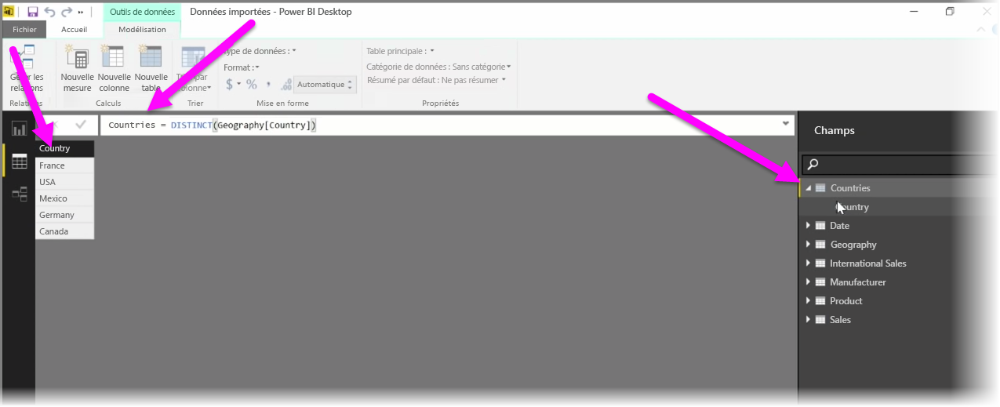

Les tables calculées constituent une fonction dans DAX grâce à laquelle vous pouvez exprimer toute une série de nouvelles fonctionnalités de modélisation. Par exemple, pour effectuer différents types de jointures de fusion ou créer des tables à la volée en fonction des résultats d’une formule fonctionnelle, utilisez des tables calculées.

Pour créer une table calculée, accédez à la vue **Données** dans Power BI Desktop, que vous pouvez activer sur le côté gauche du canevas du rapport.

Sélectionnez **Nouvelle table** sous l’onglet Modélisation pour ouvrir la barre de formule.

Tapez le nom de votre nouvelle table à gauche du signe égal et le calcul à utiliser pour générer cette table à droite. Une fois le calcul terminé, la nouvelle table s’affiche dans le volet Champs dans votre modèle.

Une fois créée, vous pouvez utiliser votre table calculée comme toute autre table dans les relations, formules et rapports.

