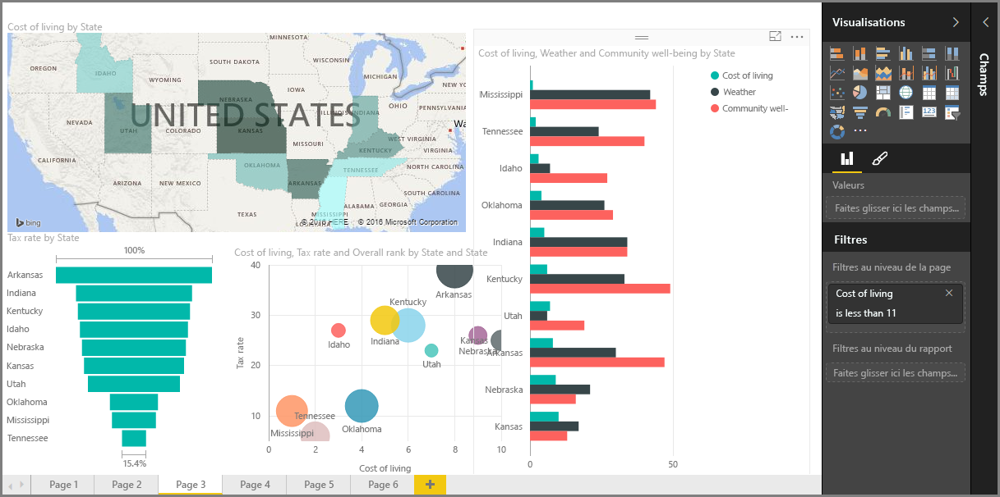

Bienvenue dans la section **Visualisations** du cours **Formation guidée** pour Power BI. Préparez-vous à une visite guidée amusante, intéressante et instructive des nombreuses visualisations que Power BI met à votre disposition. Et ce ne sont là qu’une partie d’entre elles : d’autres visualisations viennent régulièrement les compléter !

Bien sûr, les éléments visuels sont le résultat final de toute démarche décisionnelle ; nous voulons récupérer des données, les présenter de façon intéressante et pertinente et *afficher* l’essentiel. Et comme Power BI a toutes sortes de visualisations attrayantes que vous pouvez généralement personnaliser à votre guise, cette section est importante !

Cette section peut vous sembler comporter de nombreuses rubriques, mais ne vous inquiétez pas : chaque rubrique est courte, illustrée, vous l’aurez deviné, avec des éléments visuels et facile à assimiler. Vous allez probablement parcourir cette section plus vite que vous ne le pensez et imaginer comment présenter vos propres données avec ces éléments visuels.

Nous allons commencer par les éléments principaux des visualisations, à savoir les éléments visuels simples connus de tous, et nous assurer que vous en connaissez tous les détails. Ensuite, nous irons plus loin ou, au moins, sortirons un peu des sentiers battus, pour enrichir votre boîte à outils de création de rapports.

Amusez-vous, il y a beaucoup à apprendre ici !

## Présentation des éléments visuels dans Power BI
La visualisation des données est une des parties principales de Power BI, un bloc de construction de base comme nous l’avons précédemment défini dans ce cours, et la création d’éléments visuels est le moyen le plus simple pour trouver et partager vos idées.

Par défaut, Power BI met à votre disposition toute une série de visualisations, allant des graphiques à barres simples aux cartes, en passant par les graphiques en secteurs, sans oublier les visualisations plus atypiques telles que les cascades, les entonnoirs et les jauges. Power BI Desktop dispose également d’un éventail complet d’outils de mise en forme des pages, tels que les formes et les images, qui aident à donner vie à votre rapport.

