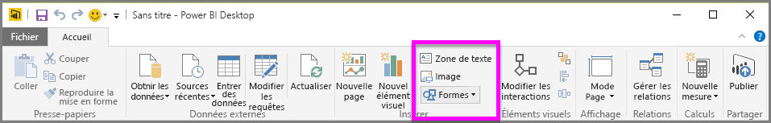
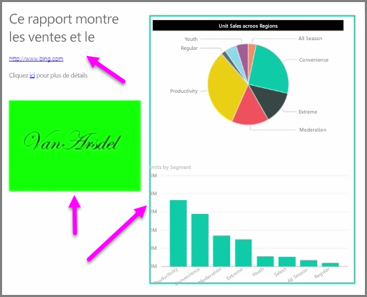

Outre des éléments visuels liés aux données, vous pouvez ajouter des éléments statiques tels que des zones de texte, des images et des formes pour améliorer la conception visuelle de vos rapports. Pour ajouter un élément visuel, sélectionnez **Zone de texte**, **Image** ou **Formes** sous l’onglet **Accueil**.

Les **zones de texte** sont idéales pour afficher des grands titres, des légendes ou des courts paragraphes d’informations avec vos visualisations. Pour inclure un lien dans une zone de texte, vous pouvez écrire une URL ou mettre en surbrillance une phrase d’ancrage et sélectionner le symbole de lien dans la barre d’options de zone de texte. Une fois qu’une URL est incluse dans une zone de texte, Power BI détecte le lien et l’active automatiquement.

Vous pouvez sélectionner **Image** pour ouvrir un explorateur de fichiers afin de sélectionner une image à partir de votre ordinateur ou d’une source connectée au réseau. Par défaut, quand une image est redimensionnée dans votre rapport, elle conserve ses proportions ; toutefois, vous pouvez désactiver ce comportement dans les options de mise en forme des éléments visuels.

Les **formes** se déclinent en cinq options, allant des rectangles aux flèches. Les formes peuvent être opaques ou transparentes avec une bordure colorée. (Les formes transparentes sont utiles pour créer des bordures autour des groupes de visualisations.)

