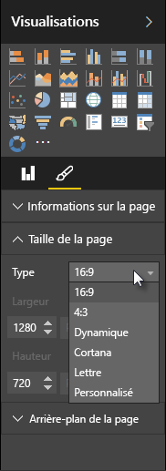

Power BI Desktop vous permet de contrôler la disposition et la mise en forme de vos pages de rapport, telles que la taille et l’orientation.

Utilisez le menu **Mode Page** sous l’onglet Accueil pour modifier la mise à l’échelle des pages de votre rapport. Les options disponibles incluent **Ajuster à la page** (par défaut), **Ajuster à la largeur** et **Taille réelle**.

Vous pouvez également modifier la taille des pages elle-même. Par défaut, les pages de rapport ont pour ratio 16:9. Pour modifier la taille des pages, vérifiez qu’aucun élément visuel n’est sélectionné, puis sélectionnez l’icône en forme de pinceau dans le volet Visualisations et sélectionnez **Taille de la page** pour développer cette section.

Les options de taille de page incluent 4x3 (proportions proches du carré) et Dynamique (la page s’étire pour remplir l’espace disponible). Il existe également une taille standard Lettre pour les rapports. Gardez à l’esprit que vous pouvez être amené à redimensionner vos éléments visuels après avoir modifié la taille de page pour vérifier qu’ils contiennent dans le canevas.

Vous pouvez également spécifier une taille de page personnalisée, en définissant la taille en pixels ou pouces, et modifier la couleur d’arrière-plan de l’intégralité du rapport.

Une autre option consiste à sélectionner Cortana ; vous pouvez ainsi redimensionner le rapport afin qu’il puisse être utilisé comme résultat dans les recherches faisant appel à Cortana.

