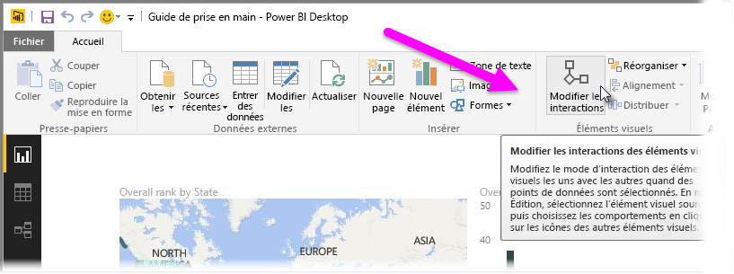
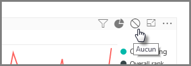
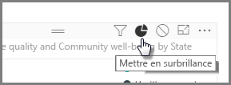
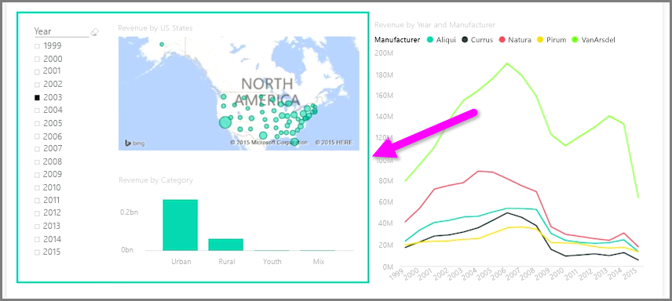

Quand une même page de rapport comporte plusieurs visualisations, cliquer sur un segment ou utiliser un segment affecte tous les éléments visuels de cette page. Dans certains cas, cependant, vous pouvez souhaiter segmenter uniquement certains éléments visuels. Cela est particulièrement vrai quand vous utilisez des éléments tels que des nuages de points, où limiter les données à un segment spécifique peut les vider de leur sens. Heureusement, Power BI Desktop vous permet de contrôler le flux des interactions entre les éléments visuels.

Pour modifier l’interaction entre vos visualisations, sélectionnez **Modifier** à partir de la section Interactions visuelles du ruban **Accueil** pour activer le **mode d’édition**.

>[!NOTE]
>L’icône **Modifier les interactions des éléments visuels** dans Power BI Desktop a changé depuis que la vidéo a été enregistrée.
> 
> 

Maintenant, quand vous sélectionnez un élément visuel sur le canevas de rapport, une petite icône *filtre* opaque apparaît dans le coin supérieur droit de tous les autres éléments visuels concernés par l’opération. Pour exclure un élément visuel de l’interaction, cliquez sur le symbole *Aucun* dans le coin supérieur droit, près de l’icône *filtre*.

Dans certains cas, vous pouvez ajuster le type d’interaction de filtre qui a lieu entre les éléments visuels. Avec le **mode d’édition** activé, sélectionnez l’élément visuel à utiliser pour le filtrage. Si vous pouvez modifier le type d’interaction sur un autre élément visuel, une icône *graphique à secteurs* apparaît à côté de l’icône de filtre en haut à droite.

Cliquez sur l’icône *graphique à secteurs* pour mettre en surbrillance les données segmentées. Dans le cas contraire, les données sont filtrées. Comme précédemment, vous pouvez cliquer sur l’icône *Aucun* pour supprimer toute interaction.

Pensez à dessiner une forme transparente autour des éléments visuels qui interagissent entre eux ; ainsi, l’utilisateur voit clairement qu’une relation interactive les lie.

