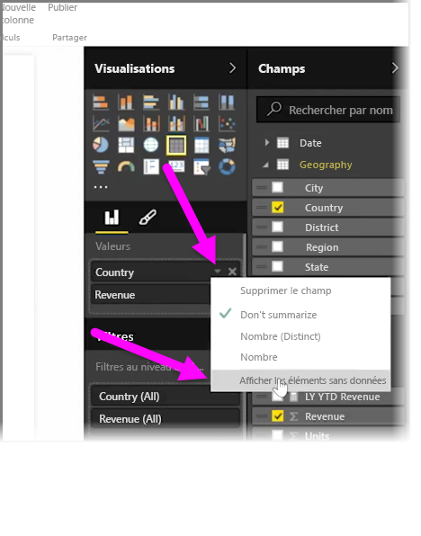
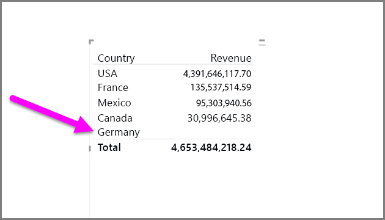
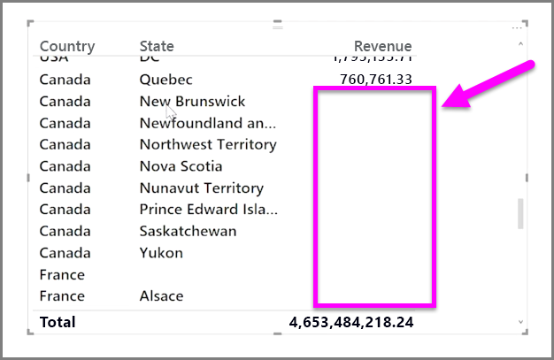

Par défaut, les en-têtes de colonne ne sont affichés dans vos rapports que s’ils contiennent des données. Par exemple, si vous affichez le chiffre d’affaires par pays et qu’il n’y a pas de ventes en Norvège, Norvège n’apparaît nulle part dans la visualisation.

Pour afficher les catégories vides, dans le volet **Visualisations**, cliquez sur la flèche vers le bas du champ à modifier, puis sélectionnez **Afficher les éléments sans données**.

Toutes les colonnes vides apparaissent désormais dans votre élément visuel avec des valeurs vides.

Une fois que vous avez sélectionné **Afficher les éléments sans données** pour un champ dans le volet **Visualisations**, l’opération s’applique à tous les champs affichés dans le volet Visualisations. Ainsi, si vous ajoutez un autre champ, tous les éléments sans données sont également affichés, sans que vous ayez besoin de repasser par le menu déroulant.

