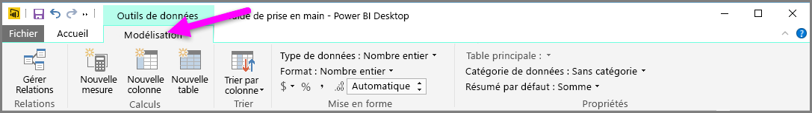
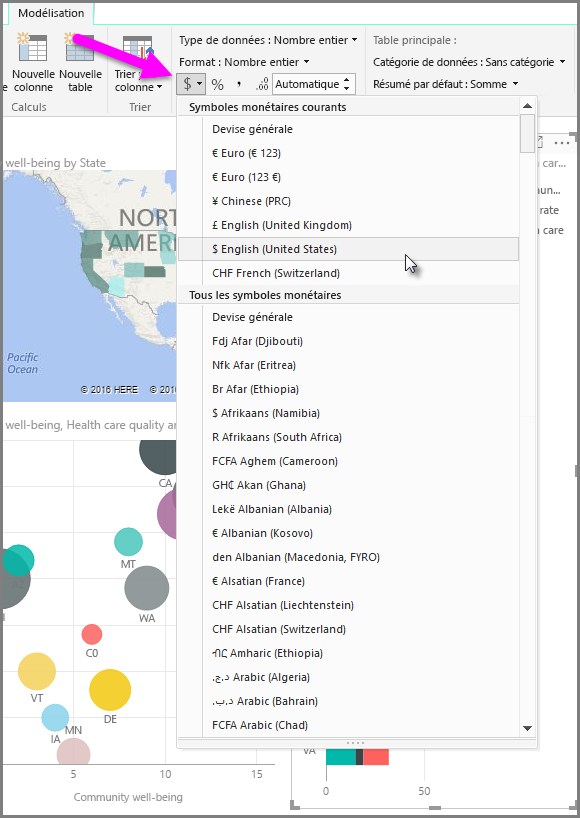
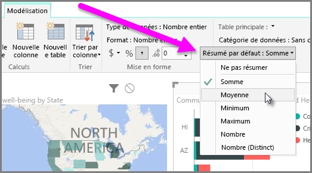
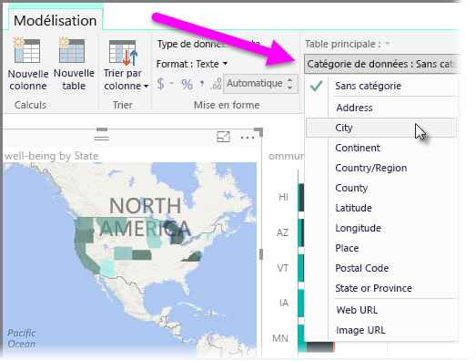

Power BI a des propriétés que vous pouvez affecter aux champs de votre modèle, et obtenir ainsi des rapports, des visualisations et des présentations des données qui gagnent en clarté. Par exemple, vous souhaitez parfois déterminer la moyenne d’une liste de nombres, mais Power BI totalise automatiquement la liste. Avec Power BI, vous pouvez ajuster la manière dont ces listes de nombres sont résumées.

## Contrôle numérique du résumé
Prenons un exemple et montrons comment contrôler la façon dont Power BI résume les champs de données numériques.

Sélectionnez un élément visuel sur le canevas de rapport, puis sélectionnez un champ dans le volet **Champs**. L’onglet **Modélisation** apparaît dans le ruban et affiche des options de mise en forme des données et des propriétés de données.

Vous pouvez sélectionner le type de symbole monétaire utilisé, en sélectionnant le menu déroulant portant un symbole monétaire, comme l’illustre l’image suivante.

Il existe de nombreuses options pour la mise en forme des champs. Par exemple, vous pouvez modifier le format de devise en pourcentage.

Vous pouvez également modifier la façon dont Power BI résume les données. Sélectionnez l’icône **Résumé par défaut** pour modifier la manière dont un champ est résumé, notamment par l’affichage d’une somme, d’une quantité ou d’une moyenne.

## Gérer et clarifier vos données d’emplacement
Vous pouvez apporter des modifications similaires pour le traçage d’emplacements sur une carte. Sélectionnez votre carte, puis sélectionnez dans le volet **Champs** le champ à utiliser pour la valeur *Emplacement*. Sous l’onglet **Modélisation**, sélectionnez **Catégorie des données**, puis, dans le menu déroulant, choisissez la catégorie qui représente vos données d’emplacement. Par exemple, sélectionnez État, Région ou Ville.

