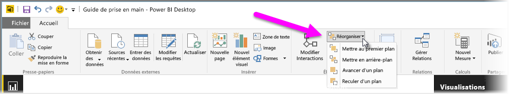
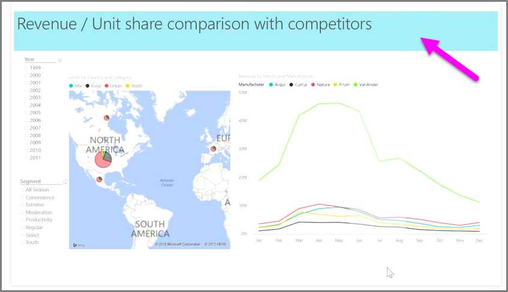

Quand vous avez un grand nombre d’éléments dans un rapport, Power BI vous permet de gérer la façon dont ils se chevauchent. La façon dont les éléments sont disposés les uns au-dessus des autres est souvent appelée l’ordre de plan.

Pour gérer l’ordre de plan d’un élément dans un rapport, sélectionnez cet élément, puis utilisez le bouton **Organiser** sous l’onglet **Accueil** du ruban pour modifier son ordre de plan.

À l’aide des options du menu du bouton **Organiser**, vous pouvez disposer les éléments de votre rapport à votre guise. Vous pouvez déplacer un élément visuel vers l’avant ou l’arrière d’un niveau ou l’envoyer à l’avant ou à l’arrière de l’ordre.

Le bouton Organiser est particulièrement efficace quand vous utilisez des formes en tant que bordures ou arrière-plans décoratifs, ou pour mettre en avant certaines parties d’un graphique. Vous pouvez également y recourir pour créer un arrière-plan, comme le rectangle bleu clair suivant utilisé pour l’arrière-plan d’un titre de rapport.

