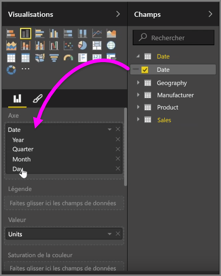
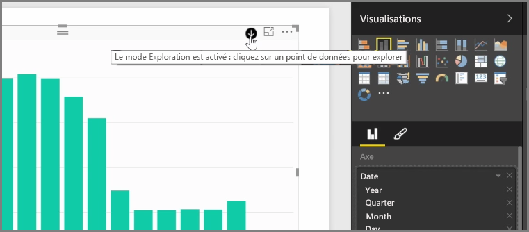
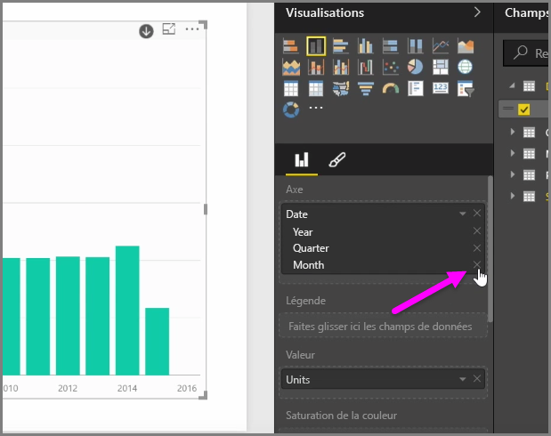
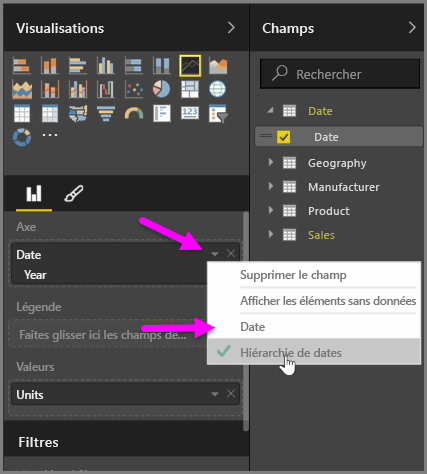
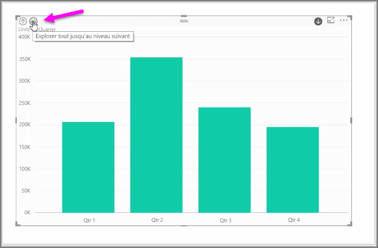

Quand vous ajoutez un champ *date* à un élément visuel dans le compartiment de champ *Axe*, Power BI ajoute automatiquement une hiérarchie de temps qui inclut *Année*, *Trimestre*, *Mois* et *Jour*. Ainsi, grâce à Power BI, les utilisateurs qui affichent vos rapports peuvent interagir avec vos éléments visuels en explorant ces différents niveaux temporels.

Une fois une hiérarchie temporelle mise en place, vous pouvez l’explorer. Par exemple, vous pouvez cliquer sur une année dans le graphique pour explorer le niveau suivant de la hiérarchie, dans ce cas *Trimestres*, et faire apparaître les données correspondantes dans l’élément visuel.

Dans cette hiérarchie automatiquement créée, vous pouvez également gérer jusqu’à quel niveau les utilisateurs peuvent explorer votre rapport partagé. Pour ce faire, dans le volet de Visualisations, cliquez simplement sur le X à côté du niveau de hiérarchie à supprimer. Le niveau supprimé disparaît du rapport et l’exploration n’affiche plus ce niveau.

Pour récupérer ce niveau de hiérarchie, supprimez simplement le champ *date*, puis rajoutez-le à partir du volet **Champs** ; la hiérarchie est ainsi de nouveau automatiquement créée.

Si vous ne souhaitez pas que la hiérarchie soit utilisée pour un élément visuel, sélectionnez le bouton avec une flèche vers le bas à côté du champ *Date* (une fois que vous l’avez ajouté à un élément visuel) et sélectionnez **Date** plutôt que **Hiérarchie de dates**. Ainsi, Power BI affiche les valeurs de date brutes dans l’élément visuel.

Vous pouvez également développer simultanément tous les éléments de données actuellement visibles, au lieu de sélectionner un seul trimestre ou une seule année. Pour ce faire, sélectionnez l’icône *Explorer tout jusqu’au niveau suivant* dans le coin supérieur gauche de l’élément visuel (cette icône porte deux flèches pointant vers le bas).

