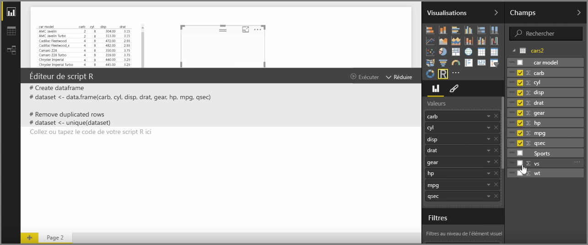
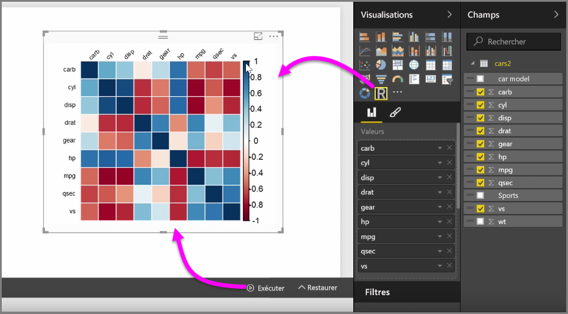
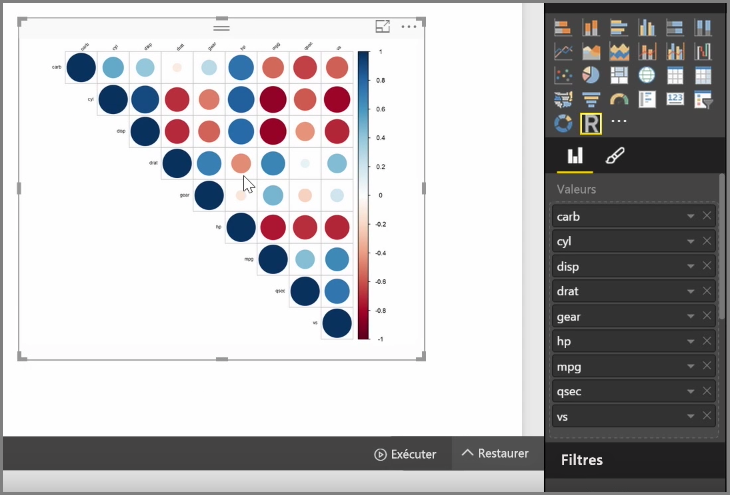
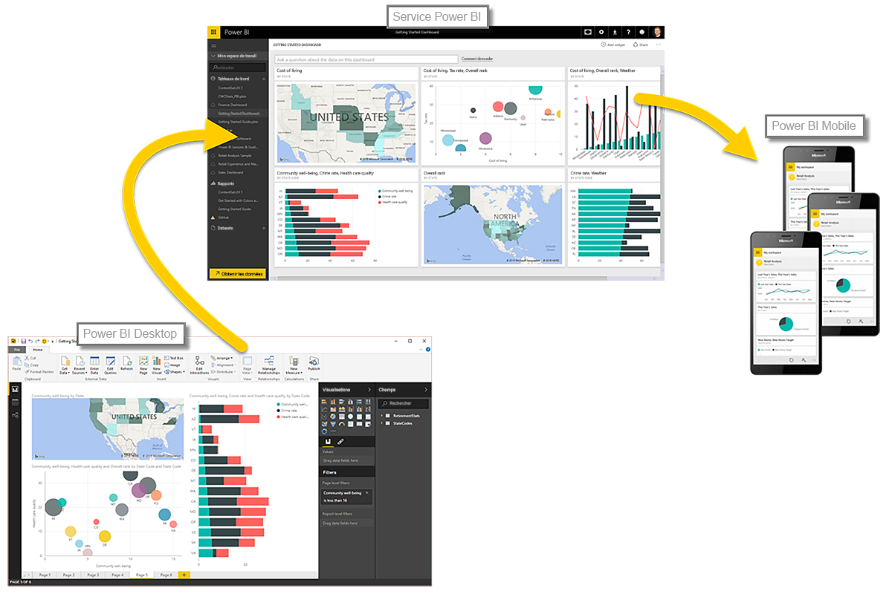

Avec Power BI Desktop, vous pouvez effectuer une analyse analytique et statistique et créer des éléments visuels agréables grâce à l’intégration à R. Vous pouvez héberger ces visualisations R dans le rapport Power BI Desktop.

Quand vous sélectionnez l’icône d’**élément visuel R** à partir du volet **Visualisations**, Power BI crée sur le canevas un espace réservé destiné à héberger votre élément visuel R, puis vous présente un éditeur de script R que vous pouvez utiliser directement sur le canevas. Quand vous ajoutez des champs à l’élément visuel R, Power BI Desktop les ajoute parallèlement au volet de l’éditeur de script R.

Au-dessous de ce que génère Power BI dans l’éditeur de script R, vous pouvez commencer à créer votre script R pour générer l’élément visuel. Une fois votre script terminé, sélectionnez **Exécuter** ; la procédure suivante est initiée :

1. Les données ajoutées à l’élément visuel (à partir du volet **Champs**) sont envoyées à partir de Power BI Desktop à l’installation locale de R.
2. Le script créé dans l’éditeur de script R de Power BI Desktop est exécuté sur cette installation locale de R.
3. Ensuite, Power BI Desktop récupère un élément visuel de l’installation de R et l’affiche sur le canevas.

L’ensemble de cette procédure s’effectue très rapidement, et le résultat s’affiche dans la visualisation de l’**élément visuel R** sur le canevas.

Vous pouvez modifier l’élément visuel R en ajustant le script R, puis en sélectionnant **Exécuter** à nouveau. Dans l’image suivante, nous avons modifié l’élément visuel pour afficher des cercles au lieu de carrés.

Comme avec tout autre élément visuel dans Power BI Desktop, vous pouvez interagir avec l’élément visuel R et établir des connexions avec d’autres éléments visuels sur le canevas. Quand vous interagissez avec d’autres éléments visuels sur le canevas, par le biais d’un filtrage ou d’une mise en surbrillance, l’élément visuel R réagit automatiquement comme tout autre élément visuel Power BI, sans que vous ayez besoin d’ajuster le script R.

Vous pouvez ainsi exploiter la puissance de R, directement dans Power BI Desktop.

## Étapes suivantes
**Félicitations !** Vous avez terminé cette section **Visualisations** du cours **Formation guidée** pour Power BI. Vous pouvez considérer que vous êtes rompu aux nombreuses visualisations proposées dans Power BI et également bien informé sur la façon de les utiliser, modifier et personnaliser. Bonne nouvelle : les visualisations étant essentiellement les mêmes dans Power BI Desktop et le service Power BI, ce que vous avez appris vous sert dans les deux cas.

Vous êtes maintenant prêt à passer au cloud et à vous immerger dans le service Power BI, où vous pouvez **explorer les données**. Comme vous le savez, le flux de travail se présente comme suit :

* Importer des données dans **Power BI Desktop** et créer un rapport.
* Publier sur le service Power BI, où vous créez des **visualisations** et générez des tableaux de bord.
* **Partager** vos tableaux de bord, notamment avec les personnes en déplacement.
* afficher les rapports et les tableaux de bord partagés dans les applications **Power BI Mobile** et interagir.

Que vous créiez des rapports ou simplement affichiez des rapports et interagissiez avec eux, vous savez maintenant comment tous ces éléments visuels intéressants sont créés et connectés aux données. La prochaine étape consiste à voir ces éléments visuels et rapports en action.

Rendez-vous à la section suivante !

